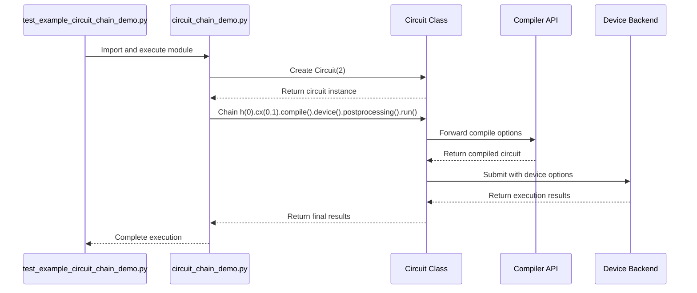
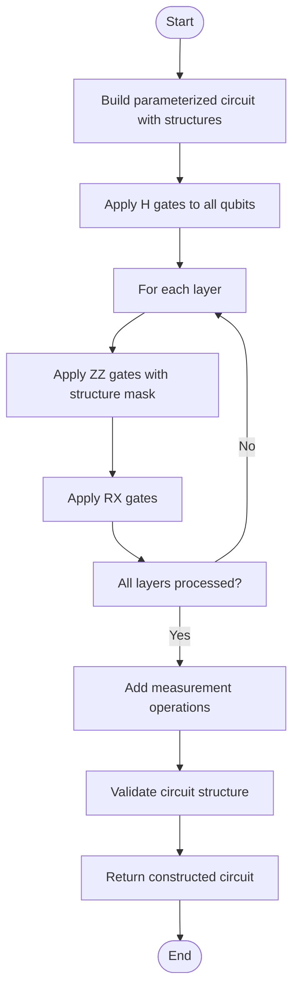
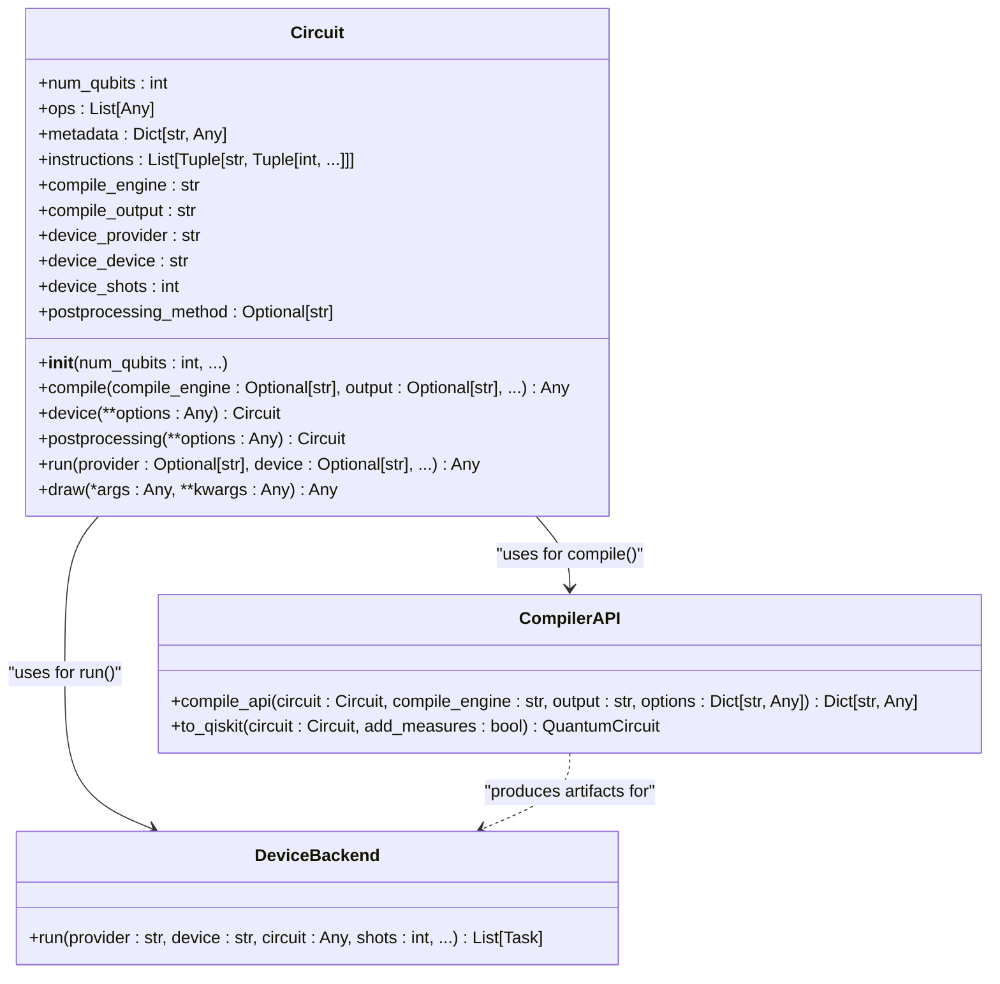

# Basic Circuit Validation

<cite>
**Referenced Files in This Document**   
- [test_example_circuit_chain_demo.py](file://tests_examples/test_example_circuit_chain_demo.py)
- [circuit_chain_demo.py](file://examples/circuit_chain_demo.py)
- [test_example_incremental_twoqubit.py](file://tests_examples/test_example_incremental_twoqubit.py)
- [incremental_twoqubit.py](file://examples/incremental_twoqubit.py)
- [test_example_circuit_compiler.py](file://tests_examples/test_example_circuit_compiler.py)
- [circuit_compiler.py](file://examples/circuit_compiler.py)
- [circuit.py](file://src/tyxonq/core/ir/circuit.py)
</cite>

## Table of Contents
1. [Introduction](#introduction)
2. [Chain API Pattern Validation](#chain-api-pattern-validation)
3. [Incremental Circuit Construction and Assertion](#incremental-circuit-construction-and-assertion)
4. [Circuit Compilation and Backend Validation](#circuit-compilation-and-backend-validation)
5. [Common Issues and Troubleshooting](#common-issues-and-troubleshooting)
6. [Conclusion](#conclusion)

## Introduction
This document provides a comprehensive analysis of basic circuit validation in the TyxonQ framework, focusing on three core aspects: chain API pattern validation, incremental circuit construction, and circuit compilation correctness. The analysis is based on the test files `test_example_circuit_chain_demo.py`, `test_example_incremental_twoqubit.py`, and `test_example_circuit_compiler.py`, which validate fundamental circuit construction, modification, and compilation workflows. These tests ensure the integrity of quantum circuit operations, proper method chaining, and correct compilation artifacts across different backend targets.

**Section sources**
- [test_example_circuit_chain_demo.py](file://tests_examples/test_example_circuit_chain_demo.py#L1-L11)
- [test_example_incremental_twoqubit.py](file://tests_examples/test_example_incremental_twoqubit.py#L1-L14)
- [test_example_circuit_compiler.py](file://tests_examples/test_example_circuit_compiler.py#L1-L11)

## Chain API Pattern Validation

The `test_example_circuit_chain_demo.py` file validates the chain API pattern for circuit building, ensuring correct operation sequencing and IR integrity. This test imports and executes the `circuit_chain_demo.py` example, which demonstrates a comprehensive set of chainable operations including circuit construction, compilation, device configuration, postprocessing, and execution.

The chain API pattern is implemented through the `Circuit` class in `src/tyxonq/core/ir/circuit.py`, which provides fluent interface methods that return the circuit instance, enabling method chaining. Key chainable methods include:
- `compile()`: Configures compilation parameters
- `device()`: Sets device execution options
- `postprocessing()`: Specifies postprocessing methods
- `run()`: Executes the circuit

The validation ensures that the chain API maintains circuit state integrity throughout the operation sequence and properly propagates configuration options to the execution backend.

**Diagram sources**
- [test_example_circuit_chain_demo.py](file://tests_examples/test_example_circuit_chain_demo.py#L1-L11)
- [circuit_chain_demo.py](file://examples/circuit_chain_demo.py#L1-L304)
- [circuit.py](file://src/tyxonq/core/ir/circuit.py#L178-L181)

**Section sources**
- [test_example_circuit_chain_demo.py](file://tests_examples/test_example_circuit_chain_demo.py#L1-L11)
- [circuit_chain_demo.py](file://examples/circuit_chain_demo.py#L1-L304)
- [circuit.py](file://src/tyxonq/core/ir/circuit.py#L48-L727)

## Incremental Circuit Construction and Assertion

The `test_example_incremental_twoqubit.py` file validates incremental circuit construction and modification, focusing on gate application and circuit structure integrity. This test imports and executes the `incremental_twoqubit.py` example, which demonstrates progressive circuit building with parameterized gates and structure-controlled interactions.

The assertion strategy in this test verifies:
1. Correct qubit indexing in multi-qubit operations
2. Proper application of parameterized gates (RX, RZ, CX)
3. Structural integrity of circuit composition
4. Valid measurement operations

The example implements a parameterized circuit with progressively dense two-qubit interactions, using a structure mask to control gate application. The validation ensures that the circuit builder correctly handles:
- Dynamic gate application based on structure masks
- Parameterized rotation gates
- Measurement operations in different bases
- Circuit composition with qubit remapping

**Diagram sources**
- [test_example_incremental_twoqubit.py](file://tests_examples/test_example_incremental_twoqubit.py#L1-L14)
- [incremental_twoqubit.py](file://examples/incremental_twoqubit.py#L1-L167)

**Section sources**
- [test_example_incremental_twoqubit.py](file://tests_examples/test_example_incremental_twoqubit.py#L1-L14)
- [incremental_twoqubit.py](file://examples/incremental_twoqubit.py#L1-L167)
- [circuit.py](file://src/tyxonq/core/ir/circuit.py#L48-L727)

## Circuit Compilation and Backend Validation

The `test_example_circuit_compiler.py` file validates compilation correctness, including backend roundtrip validation and instruction preservation. This test imports and executes the `circuit_compiler.py` example, which demonstrates compilation at different optimization levels and format conversion.

The compilation validation covers:
1. Successful compilation at multiple optimization levels (0-3)
2. Preservation of circuit semantics across compilation
3. Correct generation of target-specific artifacts
4. Roundtrip validation between IR and target formats

The example demonstrates compilation to different output formats, including:
- Native IR representation
- OpenQASM 2.0 format
- Provider-specific artifacts

The validation ensures that the compilation process maintains the integrity of quantum operations, properly handles measurement instructions, and preserves circuit metadata throughout the compilation pipeline.

**Diagram sources**
- [test_example_circuit_compiler.py](file://tests_examples/test_example_circuit_compiler.py#L1-L11)
- [circuit_compiler.py](file://examples/circuit_compiler.py#L1-L52)
- [circuit.py](file://src/tyxonq/core/ir/circuit.py#L48-L727)

**Section sources**
- [test_example_circuit_compiler.py](file://tests_examples/test_example_circuit_compiler.py#L1-L11)
- [circuit_compiler.py](file://examples/circuit_compiler.py#L1-L52)
- [circuit.py](file://src/tyxonq/core/ir/circuit.py#L48-L727)

## Common Issues and Troubleshooting

This section addresses common issues encountered during circuit validation, based on analysis of the test examples and implementation details.

### Incorrect Qubit Indexing
Issue: Operations referencing qubits outside the circuit's qubit range.
Detection: The `__post_init__` method in `Circuit` class validates qubit indices during circuit construction.
Prevention: Always ensure qubit indices are within the range [0, num_qubits-1].

### Broken Method Chaining
Issue: Chain API methods not returning the circuit instance, breaking the fluent interface.
Detection: The chain API pattern relies on each method returning `self`.
Prevention: Verify that all chainable methods return the circuit instance.

### Compilation Artifacts
Issue: Loss of circuit information during compilation to target formats.
Detection: Roundtrip validation ensures semantic equivalence between original and compiled circuits.
Prevention: Use appropriate compilation options and validate output artifacts.

### Measurement Handling
Issue: Inconsistent measurement application across different execution paths.
Detection: The `run()` method checks for measurement operations and handles them appropriately.
Prevention: Explicitly add measurement operations when required for the execution backend.

**Section sources**
- [circuit.py](file://src/tyxonq/core/ir/circuit.py#L48-L727)
- [circuit_chain_demo.py](file://examples/circuit_chain_demo.py#L1-L304)
- [incremental_twoqubit.py](file://examples/incremental_twoqubit.py#L1-L167)
- [circuit_compiler.py](file://examples/circuit_compiler.py#L1-L52)

## Conclusion
The basic circuit validation framework in TyxonQ ensures the correctness and integrity of quantum circuit construction, modification, and compilation workflows. The test suite validates the chain API pattern for circuit building, assertion strategies for gate application and circuit modification, and compilation correctness checks for backend roundtrip validation. These validation mechanisms provide confidence in the reliability of circuit operations and help identify common issues such as incorrect qubit indexing, broken method chaining, and compilation artifacts. The comprehensive validation approach ensures that quantum circuits maintain their intended structure and semantics throughout the development and execution pipeline.