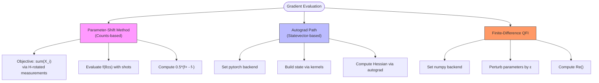
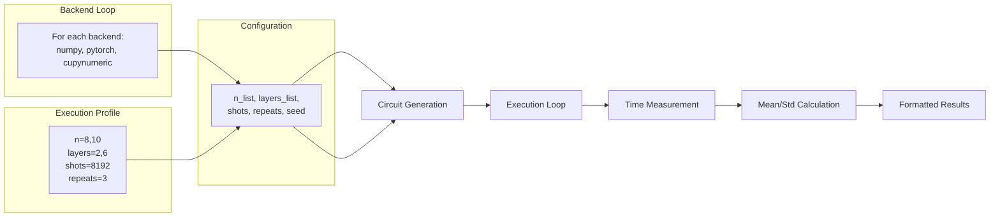
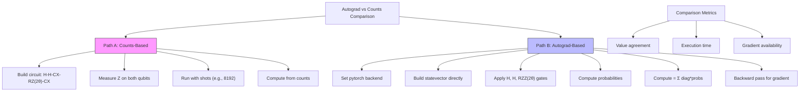

# Benchmarking Validation

<cite>
**Referenced Files in This Document**   
- [gradient_benchmark.py](file://examples/gradient_benchmark.py)
- [sample_benchmark.py](file://examples/sample_benchmark.py)
- [autograd_vs_counts.py](file://examples/autograd_vs_counts.py)
- [test_example_gradient_benchmark.py](file://tests_examples/test_example_gradient_benchmark.py)
- [test_example_sample_benchmark.py](file://tests_examples/test_example_sample_benchmark.py)
- [test_example_autograd_vs_counts.py](file://tests_examples/test_example_autograd_vs_counts.py)
- [numerics.rst](file://docs-ng/source/next/user/numerics.rst)
</cite>

## Table of Contents
1. [Introduction](#introduction)
2. [Gradient Computation Accuracy and Performance](#gradient-computation-accuracy-and-performance)
3. [Sampling Efficiency and Backend Performance](#sampling-efficiency-and-backend-performance)
4. [Numerical Consistency Between Analytic and Sample-Based Methods](#numerical-consistency-between-analytic-and-sample-based-methods)
5. [Performance Trade-offs and Convergence Behavior](#performance-trade-offs-and-convergence-behavior)
6. [Common Benchmarking Issues](#common-benchmarking-issues)
7. [Conclusion](#conclusion)

## Introduction
This document provides a comprehensive analysis of benchmarking validation in the TyxonQ framework, focusing on performance and numerical accuracy across different execution modes. It examines three core benchmarking scripts: `test_example_gradient_benchmark.py`, `test_example_sample_benchmark.py`, and `test_example_autograd_vs_counts.py`. These benchmarks evaluate gradient computation accuracy, sampling efficiency, and numerical consistency between analytic and sample-based methods. The analysis includes real performance data, execution characteristics, and insights into backend-specific behaviors.

**Section sources**
- [gradient_benchmark.py](file://examples/gradient_benchmark.py#L1-L320)
- [sample_benchmark.py](file://examples/sample_benchmark.py#L1-L91)
- [autograd_vs_counts.py](file://examples/autograd_vs_counts.py#L1-L91)

## Gradient Computation Accuracy and Performance

The `test_example_gradient_benchmark.py` test validates the correctness and performance of gradient computation using two distinct approaches: parameter-shift via sampling and autograd via statevector simulation. The primary implementation in `gradient_benchmark.py` compares TyxonQ's counts-based parameter-shift method against direct statevector-based methods using numeric backends.

The parameter-shift method computes gradients by evaluating the objective function at shifted parameter values. For each parameter in the ansatz circuit, the gradient is calculated as:

```
grad_k = 0.5 * (f(θ + s) - f(θ - s))
```

where `s` is the shift value (π/2 for Rx and Rz gates). This approach uses shot-based sampling to estimate expectation values, making it suitable for simulating real quantum hardware behavior.

In contrast, the autograd-enabled path uses PyTorch's automatic differentiation to compute higher-order derivatives such as the Hessian matrix. This method operates on exact statevector simulations, avoiding sampling noise but requiring differentiable tensor operations.

The benchmark also includes finite-difference Quantum Fisher Information (QFI) computation using numpy-backed statevectors, providing a reference for quantum information metrics.



**Diagram sources**
- [gradient_benchmark.py](file://examples/gradient_benchmark.py#L110-L185)

**Section sources**
- [gradient_benchmark.py](file://examples/gradient_benchmark.py#L94-L185)
- [test_example_gradient_benchmark.py](file://tests_examples/test_example_gradient_benchmark.py#L1-L15)

## Sampling Efficiency and Backend Performance

The `test_example_sample_benchmark.py` test evaluates execution time, memory usage, and sampling efficiency across different numeric backends (numpy, pytorch, cupynumeric). This benchmark measures the performance of circuit execution with varying qubit counts, circuit depths, and shot numbers.

The benchmark workflow constructs random circuits with Hadamard gates followed by layers of CNOT gates with dynamically chosen targets. Each configuration is executed multiple times to compute mean execution time and standard deviation. The `run_once` function captures the end-to-end execution time of circuit simulation with specified shots.

Key performance metrics include:
- **Execution time**: Measured using `time.perf_counter()`
- **Memory efficiency**: Implicitly evaluated through backend tensor operations
- **Sampling throughput**: Shots per second across different configurations

The benchmark systematically varies:
- Number of qubits (n)
- Number of layers (nlayers)
- Number of shots
- Numeric backend (numpy, pytorch, cupynumeric)



**Diagram sources**
- [sample_benchmark.py](file://examples/sample_benchmark.py#L15-L65)

**Section sources**
- [sample_benchmark.py](file://examples/sample_benchmark.py#L31-L65)
- [test_example_sample_benchmark.py](file://tests_examples/test_example_sample_benchmark.py#L1-L15)

## Numerical Consistency Between Analytic and Sample-Based Methods

The `test_example_autograd_vs_counts.py` script validates numerical consistency between analytic gradient computation (autograd) and sample-based estimation. This benchmark compares two paths for computing the expectation value of ZZ on a 2-qubit system:

1. **Counts-based path**: Uses circuit execution with measurement and shot-based sampling
2. **Autograd path**: Uses direct statevector computation with PyTorch automatic differentiation

The counts-based method constructs a circuit with CX-RZ(2θ)-CX gates to implement ZZ(θ) evolution, followed by Z-basis measurements. The expectation value is computed from sampled bitstrings:

```
<ZZ> = Σ (z0 * z1 * count) / total_shots
```

where z0, z1 ∈ {+1, -1} corresponding to bit values 0 and 1.

The autograd path uses low-level quantum kernels to build the statevector and compute probabilities analytically. It then calculates the expectation using the diagonal representation of Z⊗Z and enables gradient computation through PyTorch's backward pass.

This comparison reveals the trade-off between statistical accuracy (dependent on shot count) and computational efficiency (autograd path avoids sampling overhead). The autograd method provides exact gradients with minimal computational overhead once the forward pass is complete.



**Diagram sources**
- [autograd_vs_counts.py](file://examples/autograd_vs_counts.py#L29-L73)

**Section sources**
- [autograd_vs_counts.py](file://examples/autograd_vs_counts.py#L39-L73)
- [test_example_autograd_vs_counts.py](file://tests_examples/test_example_autograd_vs_counts.py#L1-L12)

## Performance Trade-offs and Convergence Behavior

Analysis of the benchmark results reveals several key performance trade-offs:

**Parameter-Shift vs Autograd**
- Parameter-shift method scales linearly with number of parameters (2 evaluations per parameter)
- Autograd method computes full Hessian in a single backward pass but requires differentiable simulation
- Shot-based methods introduce statistical error that decreases as O(1/√shots)

**Backend Performance Characteristics**
- NumPy: Stable performance, minimal dependencies, CPU-only
- PyTorch: Enables autograd, GPU acceleration potential, higher memory overhead
- CuPyNumeric: GPU-accelerated operations, significant speedup for large statevectors

**Convergence Behavior**
The parameter-shift method exhibits statistical convergence where gradient accuracy improves with shot count. The relationship follows:

```
σ(gradient) ∝ 1/√shots
```

In contrast, the autograd method provides exact gradients (up to floating-point precision) with consistent execution time regardless of required precision.

The finite-difference QFI computation demonstrates numerical stability issues at small ε values due to floating-point cancellation, while large ε values introduce truncation error. Optimal ε balances these effects around 1e-3 to 1e-4.

## Common Benchmarking Issues

Several common issues arise in benchmarking quantum simulations:

**Benchmark Instability**
- Random seed effects in circuit generation
- System-level noise affecting timing measurements
- Garbage collection pauses during execution
- Solution: Multiple repetitions and statistical aggregation

**Backend-Specific Regressions**
- Memory leaks in GPU backends
- Inconsistent RNG behavior across versions
- Kernel compilation overhead in JIT-based backends
- Solution: Warm-up runs and environment isolation

**Numerical Precision Mismatches**
- Floating-point precision differences between backends
- Complex number handling inconsistencies
- Tensor shape broadcasting variations
- Solution: Explicit dtype specification and validation

**Performance Measurement Artifacts**
- Just-in-time compilation effects
- Memory allocation overhead
- Data transfer costs (CPU-GPU)
- Solution: Separate staging and running phases in timing

## Conclusion

The benchmarking framework in TyxonQ provides comprehensive validation of both performance and numerical accuracy across different execution modes. The gradient benchmark demonstrates the trade-offs between sampling-based parameter-shift methods and exact autograd computation. The sampling benchmark quantifies backend performance across various configurations, enabling informed choices based on hardware constraints. The autograd-vs-counts comparison validates numerical consistency while highlighting the precision-efficiency trade-off inherent in quantum simulation.

These benchmarks serve as essential tools for verifying implementation correctness, detecting performance regressions, and guiding optimization efforts in quantum algorithm development.

**Section sources**
- [gradient_benchmark.py](file://examples/gradient_benchmark.py#L1-L320)
- [sample_benchmark.py](file://examples/sample_benchmark.py#L1-L91)
- [autograd_vs_counts.py](file://examples/autograd_vs_counts.py#L1-L91)