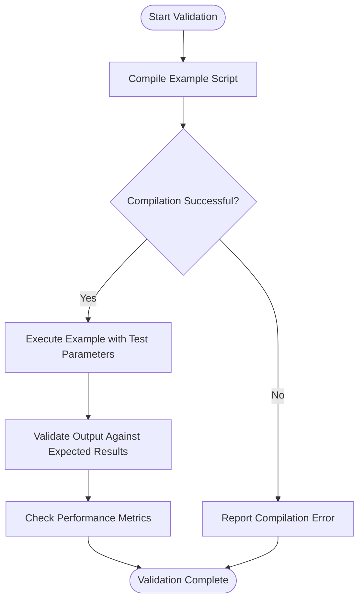
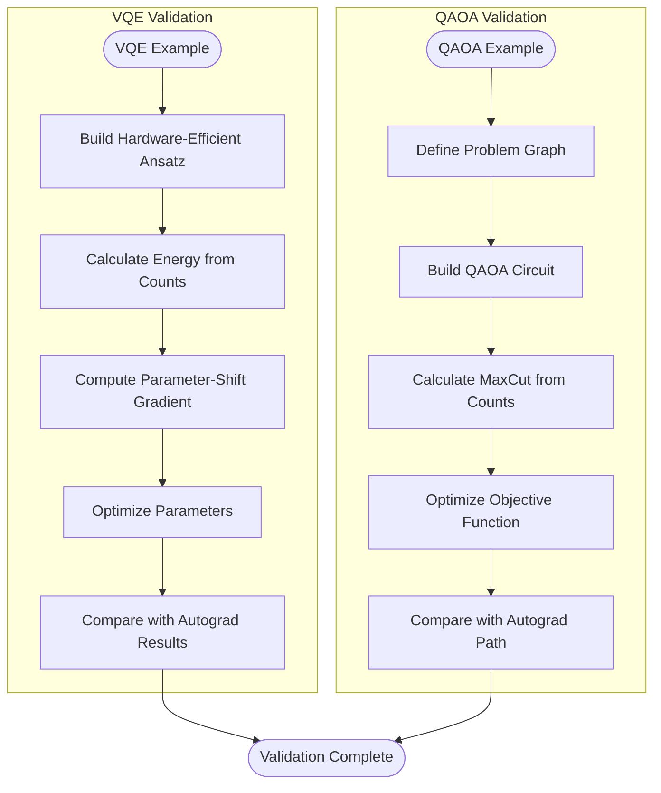
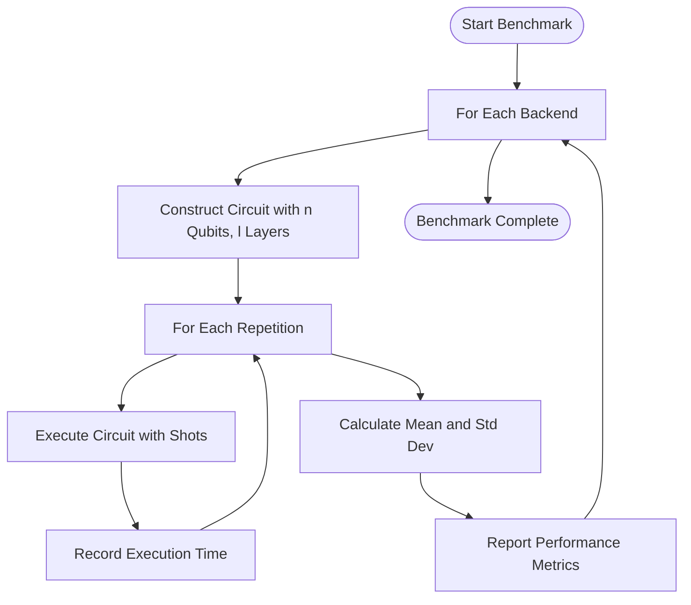
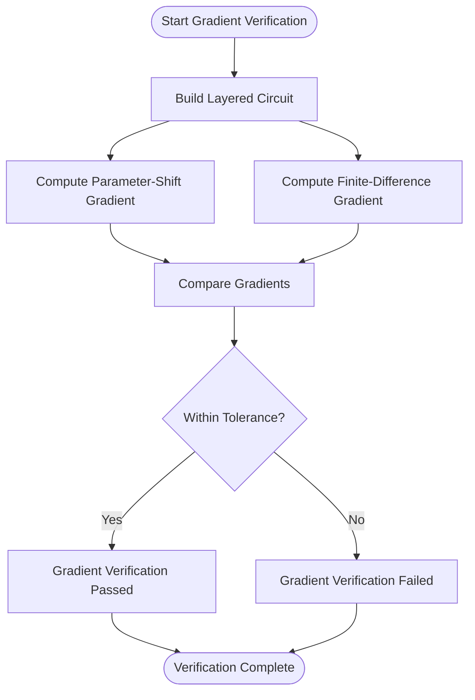
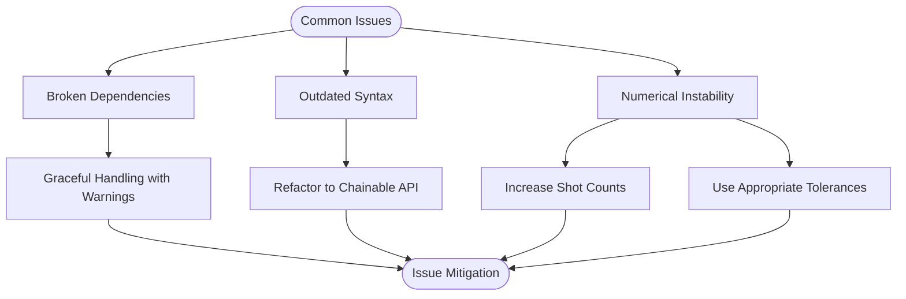

# Example-Based Validation

<cite>
**Referenced Files in This Document**   
- [test_example_vqe_extra.py](file://tests_examples/test_example_vqe_extra.py)
- [test_example_simple_qaoa.py](file://tests_examples/test_example_simple_qaoa.py)
- [autograd_vs_counts.py](file://examples/autograd_vs_counts.py)
- [parameter_shift.py](file://examples/parameter_shift.py)
- [vqe_extra.py](file://examples/vqe_extra.py)
- [simple_qaoa.py](file://examples/simple_qaoa.py)
- [sample_benchmark.py](file://examples/sample_benchmark.py)
- [gradient_benchmark.py](file://examples/gradient_benchmark.py)
- [test_example_vqeh2o_benchmark.py](file://tests_examples/test_example_vqeh2o_benchmark.py)
</cite>

## Table of Contents
1. [Introduction](#introduction)
2. [End-to-End Example Validation](#end-to-end-example-validation)
3. [Quantum Algorithm Implementation Validation](#quantum-algorithm-implementation-validation)
4. [Benchmarking and Performance Testing](#benchmarking-and-performance-testing)
5. [Gradient Computation Verification](#gradient-computation-verification)
6. [Common Issues and Mitigation](#common-issues-and-mitigation)
7. [Conclusion](#conclusion)

## Introduction

This document provides a comprehensive analysis of the example-based validation framework within the TyxonQ quantum computing platform. The validation system ensures end-to-end correctness of framework usage patterns by systematically testing example scripts for execution integrity, output accuracy, and performance consistency. The framework validates implementations of key quantum algorithms including Variational Quantum Eigensolver (VQE), Quantum Approximate Optimization Algorithm (QAOA), and time evolution circuits. It incorporates benchmarking tests that compare performance metrics across different configurations and verifies the accuracy of gradient computations essential for quantum machine learning and variational algorithms. The document examines specific test cases such as `test_example_vqe_extra.py` and `test_example_simple_qaoa.py` to demonstrate assertion logic and result validation methodologies.

**Section sources**
- [test_example_vqe_extra.py](file://tests_examples/test_example_vqe_extra.py#L0-L14)
- [test_example_simple_qaoa.py](file://tests_examples/test_example_simple_qaoa.py#L0-L14)

## End-to-End Example Validation

The example-based validation framework employs a systematic approach to ensure that all example scripts execute correctly and produce expected outputs. The validation process begins with compilation testing, where each example script is imported and compiled without execution of potentially resource-intensive top-level code. This approach allows for rapid detection of syntax errors, import issues, and dependency problems without incurring the computational cost of full execution.

The test framework uses Python's `importlib.util` module to dynamically load and compile example scripts, verifying that they can be successfully parsed and prepared for execution. This compilation check serves as the first line of defense against broken examples, catching issues such as missing dependencies, incorrect import statements, and syntax errors. For example, the `test_example_vqe_extra.py` script validates the `vqe_extra.py` example by attempting to compile it and handling exceptions that may arise from optional dependencies.

**Diagram sources**
- [test_example_vqe_extra.py](file://tests_examples/test_example_vqe_extra.py#L0-L14)
- [test_example_simple_qaoa.py](file://tests_examples/test_example_simple_qaoa.py#L0-L14)

**Section sources**
- [test_example_vqe_extra.py](file://tests_examples/test_example_vqe_extra.py#L0-L14)
- [test_example_simple_qaoa.py](file://tests_examples/test_example_simple_qaoa.py#L0-L14)

## Quantum Algorithm Implementation Validation

The framework validates implementations of key quantum algorithms through comprehensive example scripts that demonstrate correct usage patterns and expected behavior. For VQE implementations, the validation includes testing the construction of hardware-efficient ansatz circuits, energy calculation for transverse field Ising model (TFIM)-like Hamiltonians, and parameter-shift gradient computation. The `vqe_extra.py` example demonstrates a complete VQE workflow using both counts-based measurement and direct numeric backend approaches with PyTorch autograd.

For QAOA implementations, the validation framework tests the construction of QAOA circuits for MaxCut problems on given graphs, expectation value calculation from measurement counts, and objective function optimization. The `simple_qaoa.py` example implements a plain QAOA optimization with a chainable API, replacing legacy expectation calculations with counts-based methods while providing an alternative autograd path for comparison.

**Diagram sources**
- [vqe_extra.py](file://examples/vqe_extra.py#L0-L195)
- [simple_qaoa.py](file://examples/simple_qaoa.py#L0-L192)

**Section sources**
- [vqe_extra.py](file://examples/vqe_extra.py#L0-L195)
- [simple_qaoa.py](file://examples/simple_qaoa.py#L0-L192)

## Benchmarking and Performance Testing

The framework includes comprehensive benchmarking capabilities to evaluate performance metrics across different configurations and backends. The `sample_benchmark.py` script implements a systematic comparison of execution time and memory usage for quantum circuit sampling across multiple numeric backends including NumPy, PyTorch, and CuPyNumeric. The benchmark constructs random quantum circuits with varying numbers of qubits and layers, then measures execution time over multiple repetitions to calculate average performance and standard deviation.

The benchmarking process follows a standardized methodology:
1. Circuit construction with specified parameters (qubit count, layer count, seed)
2. Execution timing for multiple repetitions
3. Calculation of mean execution time and standard deviation
4. Comparison across different backends and configurations

**Diagram sources**
- [sample_benchmark.py](file://examples/sample_benchmark.py#L0-L90)

**Section sources**
- [sample_benchmark.py](file://examples/sample_benchmark.py#L0-L90)

## Gradient Computation Verification

The framework provides rigorous verification of gradient computation accuracy through multiple complementary approaches. The `parameter_shift.py` example demonstrates parameter-shift gradient computation for RX and RZZ parameters, comparing results against finite-difference baselines to ensure accuracy. This validation is critical for variational quantum algorithms where gradient accuracy directly impacts optimization convergence and solution quality.

The gradient verification process implements a dual-path validation strategy:
1. **Parameter-shift method**: Analytical gradients computed using the parameter-shift rule, which is exact for certain gate types
2. **Finite-difference method**: Numerical gradients computed using small parameter perturbations

The framework asserts that these two methods produce results within acceptable tolerance levels, typically using `assert_allclose` with absolute and relative tolerances. For analytic expectations (shots=0), the tolerance is tight (atol=1e-4, rtol=1e-2), while for sampled results, the tolerance accounts for statistical noise.

**Diagram sources**
- [parameter_shift.py](file://examples/parameter_shift.py#L0-L183)

**Section sources**
- [parameter_shift.py](file://examples/parameter_shift.py#L0-L183)

## Common Issues and Mitigation

The example-based validation framework addresses several common issues that can arise in quantum computing examples and benchmarks. These include broken example dependencies, outdated syntax, and numerical instability in benchmarks.

**Broken Dependencies**: The framework handles optional dependencies gracefully by allowing tests to pass with warnings when optional packages (like PyTorch) are unavailable. This prevents the entire test suite from failing due to missing optional components while still alerting developers to potential issues.

**Outdated Syntax**: The validation framework ensures that example scripts use current API patterns and syntax. Examples are refactored to use the chainable API (circuit.device(...).postprocessing(...).run()) rather than legacy patterns, ensuring consistency and compatibility with the latest framework features.

**Numerical Instability**: Benchmarks account for statistical noise in sampled results by using appropriate tolerances and increasing shot counts to reduce variance. The framework also includes smoke tests with high shot counts to verify that gradient computations remain stable under realistic sampling conditions.

**Diagram sources**
- [test_example_vqeh2o_benchmark.py](file://tests_examples/test_example_vqeh2o_benchmark.py#L0-L14)
- [autograd_vs_counts.py](file://examples/autograd_vs_counts.py#L0-L90)

**Section sources**
- [test_example_vqeh2o_benchmark.py](file://tests_examples/test_example_vqeh2o_benchmark.py#L0-L14)
- [autograd_vs_counts.py](file://examples/autograd_vs_counts.py#L0-L90)

## Conclusion

The example-based validation framework in TyxonQ provides a comprehensive system for ensuring the correctness and reliability of quantum algorithm implementations. By validating end-to-end execution of example scripts, verifying quantum algorithm implementations, conducting performance benchmarking, and rigorously testing gradient computations, the framework maintains high standards of code quality and functionality. The use of concrete examples like `test_example_vqe_extra.py` and `test_example_simple_qaoa.py` demonstrates effective assertion logic and result validation methodologies. The framework's approach to handling common issues such as broken dependencies and numerical instability ensures robustness across different environments and configurations. This comprehensive validation system is essential for maintaining trust in the framework's outputs and supporting reliable quantum algorithm development.