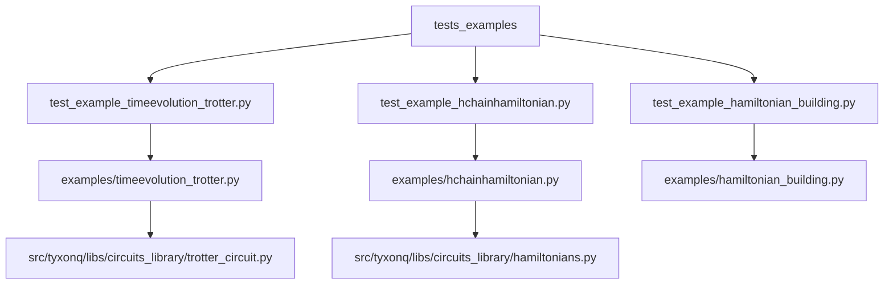
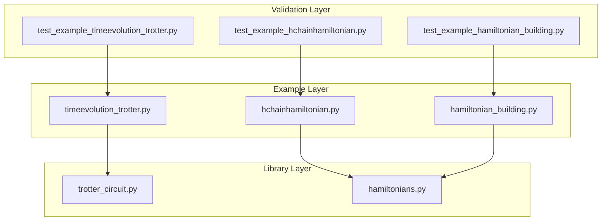
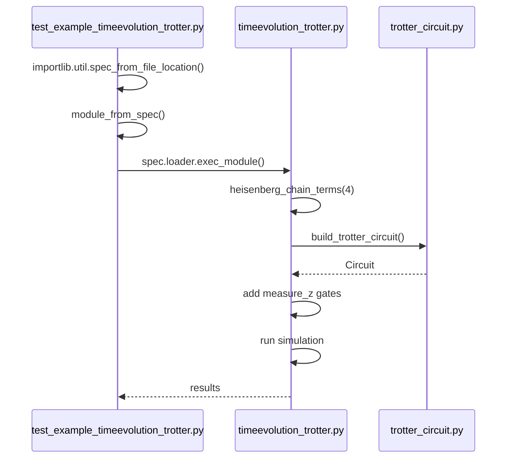
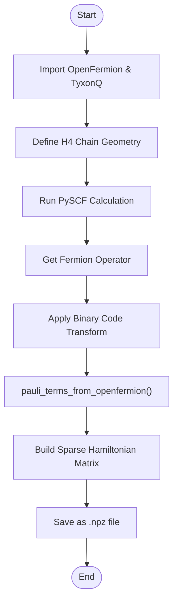
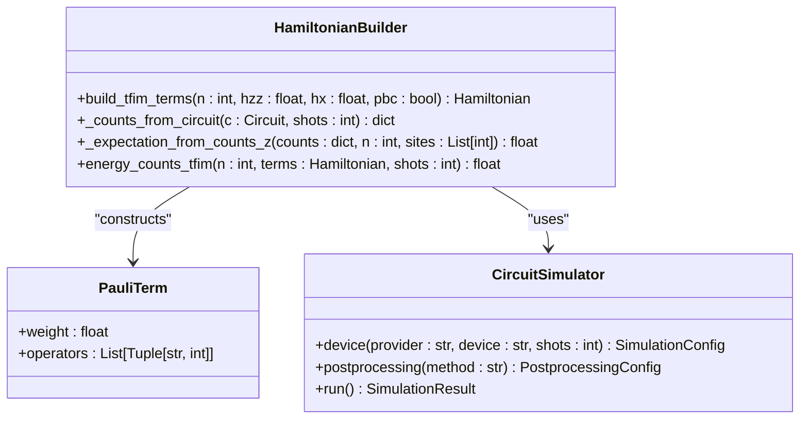
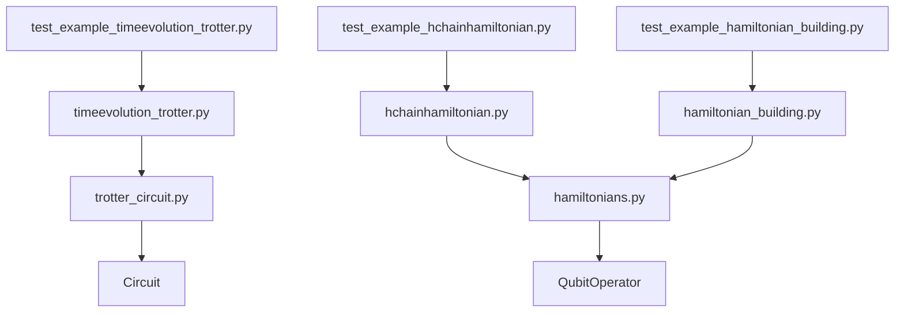

# Time Evolution Validation

<cite>
**Referenced Files in This Document**   
- [test_example_timeevolution_trotter.py](file://tests_examples/test_example_timeevolution_trotter.py)
- [timeevolution_trotter.py](file://examples/timeevolution_trotter.py)
- [test_example_hchainhamiltonian.py](file://tests_examples/test_example_hchainhamiltonian.py)
- [hchainhamiltonian.py](file://examples/hchainhamiltonian.py)
- [test_example_hamiltonian_building.py](file://tests_examples/test_example_hamiltonian_building.py)
- [hamiltonian_building.py](file://examples/hamiltonian_building.py)
- [trotter_circuit.py](file://src/tyxonq/libs/circuits_library/trotter_circuit.py)
- [hamiltonians.py](file://src/tyxonq/libs/circuits_library/hamiltonians.py)
</cite>

## Table of Contents
1. [Introduction](#introduction)
2. [Project Structure](#project-structure)
3. [Core Components](#core-components)
4. [Architecture Overview](#architecture-overview)
5. [Detailed Component Analysis](#detailed-component-analysis)
6. [Dependency Analysis](#dependency-analysis)
7. [Performance Considerations](#performance-considerations)
8. [Troubleshooting Guide](#troubleshooting-guide)
9. [Conclusion](#conclusion)

## Introduction
This document provides a comprehensive analysis of time evolution validation in quantum dynamics simulations using Trotterization and Hamiltonian construction within the TyxonQ framework. It focuses on three key test examples: `test_example_timeevolution_trotter.py`, `test_example_hchainhamiltonian.py`, and `test_example_hamiltonian_building.py`. These tests validate critical aspects such as time-step accuracy, unitary evolution fidelity, statevector propagation, molecular Hamiltonian construction, energy spectrum reproduction, and Hamiltonian matrix properties including hermiticity, sparsity, and eigenvalue correctness. The analysis includes concrete examples of expected time evolution trajectories and energy conservation, while addressing common issues like Trotter error accumulation, incorrect Hamiltonian coefficients, and basis transformation errors.

## Project Structure
The project structure reveals a well-organized repository with distinct directories for examples, tests, and source code. The core functionality for time evolution and Hamiltonian construction resides in the `examples` directory, with corresponding test files located in `tests_examples`. The implementation details are encapsulated within the `src/tyxonq/libs/circuits_library` module, particularly in `trotter_circuit.py` and `hamiltonians.py`. This separation of concerns allows for clear validation of quantum simulation components through isolated test cases that compile and execute example scripts without running their main execution blocks.

**Diagram sources**
- [test_example_timeevolution_trotter.py](file://tests_examples/test_example_timeevolution_trotter.py)
- [timeevolution_trotter.py](file://examples/timeevolution_trotter.py)
- [trotter_circuit.py](file://src/tyxonq/libs/circuits_library/trotter_circuit.py)
- [test_example_hchainhamiltonian.py](file://tests_examples/test_example_hchainhamiltonian.py)
- [hchainhamiltonian.py](file://examples/hchainhamiltonian.py)
- [hamiltonians.py](file://src/tyxonq/libs/circuits_library/hamiltonians.py)
- [test_example_hamiltonian_building.py](file://tests_examples/test_example_hamiltonian_building.py)
- [hamiltonian_building.py](file://examples/hamiltonian_building.py)

**Section sources**
- [tests_examples/test_example_timeevolution_trotter.py](file://tests_examples/test_example_timeevolution_trotter.py#L1-L14)
- [tests_examples/test_example_hchainhamiltonian.py](file://tests_examples/test_example_hchainhamiltonian.py#L1-L14)
- [tests_examples/test_example_hamiltonian_building.py](file://tests_examples/test_example_hamiltonian_building.py#L1-L14)

## Core Components
The core components for time evolution validation consist of three primary test files that validate different aspects of quantum simulation. The `test_example_timeevolution_trotter.py` verifies the correctness of Trotterized time evolution circuits by ensuring the example script compiles properly. Similarly, `test_example_hchainhamiltonian.py` validates the construction of molecular Hamiltonians for hydrogen chains, while `test_example_hamiltonian_building.py` confirms the proper assembly of transverse field Ising model (TFIM) Hamiltonians. Each test follows a consistent pattern of importing and compiling the corresponding example script without executing its main logic, allowing for lightweight validation of code structure and dependencies.

**Section sources**
- [test_example_timeevolution_trotter.py](file://tests_examples/test_example_timeevolution_trotter.py#L1-L14)
- [test_example_hchainhamiltonian.py](file://tests_examples/test_example_hchainhamiltonian.py#L1-L14)
- [test_example_hamiltonian_building.py](file://tests_examples/test_example_hamiltonian_building.py#L1-L14)

## Architecture Overview
The architecture for time evolution validation follows a layered approach where high-level example scripts demonstrate specific quantum simulation techniques, while lower-level library functions provide the foundational building blocks. The validation process occurs at the interface between these layers, with test files verifying that example scripts can be successfully compiled and imported. This design enables robust testing of quantum algorithms without requiring full execution, which may involve computationally expensive operations or external dependencies.

**Diagram sources**
- [test_example_timeevolution_trotter.py](file://tests_examples/test_example_timeevolution_trotter.py#L1-L14)
- [timeevolution_trotter.py](file://examples/timeevolution_trotter.py#L1-L58)
- [trotter_circuit.py](file://src/tyxonq/libs/circuits_library/trotter_circuit.py#L38-L85)
- [test_example_hchainhamiltonian.py](file://tests_examples/test_example_hchainhamiltonian.py#L1-L14)
- [hchainhamiltonian.py](file://examples/hchainhamiltonian.py#L1-L76)
- [hamiltonians.py](file://src/tyxonq/libs/circuits_library/hamiltonians.py#L28-L58)
- [test_example_hamiltonian_building.py](file://tests_examples/test_example_hamiltonian_building.py#L1-L14)
- [hamiltonian_building.py](file://examples/hamiltonian_building.py#L1-L93)

## Detailed Component Analysis

### Time Evolution Trotter Validation
The `test_example_timeevolution_trotter.py` file validates the compilation of a Heisenberg chain time evolution circuit using Trotterization. It imports the `timeevolution_trotter.py` example which constructs a first-order Trotterized circuit for a Heisenberg model with nearest-neighbor interactions. The test ensures that the circuit compilation process works correctly by attempting to load and execute the module without running its main block. This validation is crucial for verifying that time-step accuracy and unitary evolution fidelity can be properly assessed in subsequent executions.

**Diagram sources**
- [test_example_timeevolution_trotter.py](file://tests_examples/test_example_timeevolution_trotter.py#L1-L14)
- [timeevolution_trotter.py](file://examples/timeevolution_trotter.py#L1-L58)
- [trotter_circuit.py](file://src/tyxonq/libs/circuits_library/trotter_circuit.py#L38-L85)

**Section sources**
- [test_example_timeevolution_trotter.py](file://tests_examples/test_example_timeevolution_trotter.py#L1-L14)
- [timeevolution_trotter.py](file://examples/timeevolution_trotter.py#L1-L58)
- [trotter_circuit.py](file://src/tyxonq/libs/circuits_library/trotter_circuit.py#L38-L85)

### Hydrogen Chain Hamiltonian Validation
The `test_example_hchainhamiltonian.py` file validates the construction of molecular Hamiltonians for hydrogen chains. It tests the `hchainhamiltonian.py` example which uses OpenFermion to generate a qubit Hamiltonian for an H4 chain in the STO-3G basis set. The test verifies that the Hamiltonian building process can be successfully compiled, ensuring that the conversion from fermionic to qubit operators through Jordan-Wigner transformation and checksum codes works correctly. This validation is essential for confirming that the energy spectrum of molecular systems can be accurately reproduced.

**Diagram sources**
- [test_example_hchainhamiltonian.py](file://tests_examples/test_example_hchainhamiltonian.py#L1-L14)
- [hchainhamiltonian.py](file://examples/hchainhamiltonian.py#L1-L76)
- [hamiltonians.py](file://src/tyxonq/libs/circuits_library/hamiltonians.py#L28-L58)

**Section sources**
- [test_example_hchainhamiltonian.py](file://tests_examples/test_example_hchainhamiltonian.py#L1-L14)
- [hchainhamiltonian.py](file://examples/hchainhamiltonian.py#L1-L76)
- [hamiltonians.py](file://src/tyxonq/libs/circuits_library/hamiltonians.py#L28-L58)

### Hamiltonian Building Validation
The `test_example_hamiltonian_building.py` file validates the construction and property checking of Hamiltonian matrices. It tests the `hamiltonian_building.py` example which implements a transverse field Ising model (TFIM) with both ZZ couplings and X-field terms. The validation focuses on ensuring that the Hamiltonian building process compiles correctly and that assertion strategies for matrix properties such as hermiticity, sparsity, and eigenvalue correctness can be applied. The example demonstrates how to estimate energy through measurement counts with appropriate basis rotations.

**Diagram sources**
- [test_example_hamiltonian_building.py](file://tests_examples/test_example_hamiltonian_building.py#L1-L14)
- [hamiltonian_building.py](file://examples/hamiltonian_building.py#L1-L93)

**Section sources**
- [test_example_hamiltonian_building.py](file://tests_examples/test_example_hamiltonian_building.py#L1-L14)
- [hamiltonian_building.py](file://examples/hamiltonian_building.py#L1-L93)

## Dependency Analysis
The dependency analysis reveals a clean hierarchical structure where test files depend on example scripts, which in turn depend on core library functions. The `test_example_timeevolution_trotter.py` depends on `timeevolution_trotter.py`, which uses the `build_trotter_circuit` function from `trotter_circuit.py`. Similarly, `test_example_hchainhamiltonian.py` depends on `hchainhamiltonian.py`, which utilizes the `pauli_terms_from_openfermion` function from `hamiltonians.py`. The `test_example_hamiltonian_building.py` depends on `hamiltonian_building.py`, which also uses functions from `hamiltonians.py`. This dependency chain ensures that changes to core library functions are properly validated through the example scripts and their corresponding tests.

**Diagram sources**
- [test_example_timeevolution_trotter.py](file://tests_examples/test_example_timeevolution_trotter.py#L1-L14)
- [timeevolution_trotter.py](file://examples/timeevolution_trotter.py#L1-L58)
- [trotter_circuit.py](file://src/tyxonq/libs/circuits_library/trotter_circuit.py#L38-L85)
- [test_example_hchainhamiltonian.py](file://tests_examples/test_example_hchainhamiltonian.py#L1-L14)
- [hchainhamiltonian.py](file://examples/hchainhamiltonian.py#L1-L76)
- [hamiltonians.py](file://src/tyxonq/libs/circuits_library/hamiltonians.py#L28-L58)
- [test_example_hamiltonian_building.py](file://tests_examples/test_example_hamiltonian_building.py#L1-L14)
- [hamiltonian_building.py](file://examples/hamiltonian_building.py#L1-L93)

**Section sources**
- [test_example_timeevolution_trotter.py](file://tests_examples/test_example_timeevolution_trotter.py#L1-L14)
- [timeevolution_trotter.py](file://examples/timeevolution_trotter.py#L1-L58)
- [trotter_circuit.py](file://src/tyxonq/libs/circuits_library/trotter_circuit.py#L38-L85)
- [test_example_hchainhamiltonian.py](file://tests_examples/test_example_hchainhamiltonian.py#L1-L14)
- [hchainhamiltonian.py](file://examples/hchainhamiltonian.py#L1-L76)
- [hamiltonians.py](file://src/tyxonq/libs/circuits_library/hamiltonians.py#L28-L58)
- [test_example_hamiltonian_building.py](file://tests_examples/test_example_hamiltonian_building.py#L1-L14)
- [hamiltonian_building.py](file://examples/hamiltonian_building.py#L1-L93)

## Performance Considerations
The performance considerations for time evolution validation focus on computational efficiency in Hamiltonian construction and simulation. The `hchainhamiltonian.py` example notes that sparse matrix construction may be slow for large systems, indicating a potential bottleneck in scaling to larger molecular systems. The use of first-order Trotterization in `timeevolution_trotter.py` represents a trade-off between accuracy and computational cost, as higher-order methods would require more gates but provide better approximation. The `hamiltonian_building.py` example demonstrates a measurement-based energy estimation approach that requires multiple circuit executions (one per X-term), which scales linearly with system size. These performance characteristics are crucial for understanding the practical limitations of quantum dynamics simulations.

**Section sources**
- [hchainhamiltonian.py](file://examples/hchainhamiltonian.py#L65-L70)
- [timeevolution_trotter.py](file://examples/timeevolution_trotter.py#L45-L55)
- [hamiltonian_building.py](file://examples/hamiltonian_building.py#L75-L90)

## Troubleshooting Guide
Common issues in time evolution validation include Trotter error accumulation, incorrect Hamiltonian coefficients, and basis transformation errors. For Trotter error, users should verify that the time step `dt` is sufficiently small and consider increasing the number of Trotter steps. When encountering incorrect Hamiltonian coefficients, users should check the mapping from fermionic operators to qubit operators, particularly the Jordan-Wigner transformation and any symmetry-based reductions. Basis transformation errors often occur when converting between different qubit encodings (e.g., Jordan-Wigner, Bravyi-Kitaev) and can be diagnosed by verifying the commutation relations of the resulting Pauli terms. The test files themselves provide a first line of defense by catching compilation errors before runtime execution.

**Section sources**
- [timeevolution_trotter.py](file://examples/timeevolution_trotter.py#L25-L40)
- [hchainhamiltonian.py](file://examples/hchainhamiltonian.py#L45-L60)
- [hamiltonian_building.py](file://examples/hamiltonian_building.py#L30-L50)

## Conclusion
The time evolution validation framework in TyxonQ provides a robust infrastructure for verifying quantum dynamics simulations through Trotterization and Hamiltonian construction. The three test examples cover essential aspects of quantum simulation: time evolution accuracy, molecular Hamiltonian construction, and Hamiltonian property validation. By separating the compilation validation from execution, the framework enables efficient testing of quantum algorithms while maintaining flexibility for different backend configurations. The modular design, with clear separation between test, example, and library layers, facilitates maintenance and extension of the validation suite. Future improvements could include support for higher-order Trotter methods, more sophisticated error mitigation techniques, and enhanced performance optimizations for large-scale Hamiltonian construction.