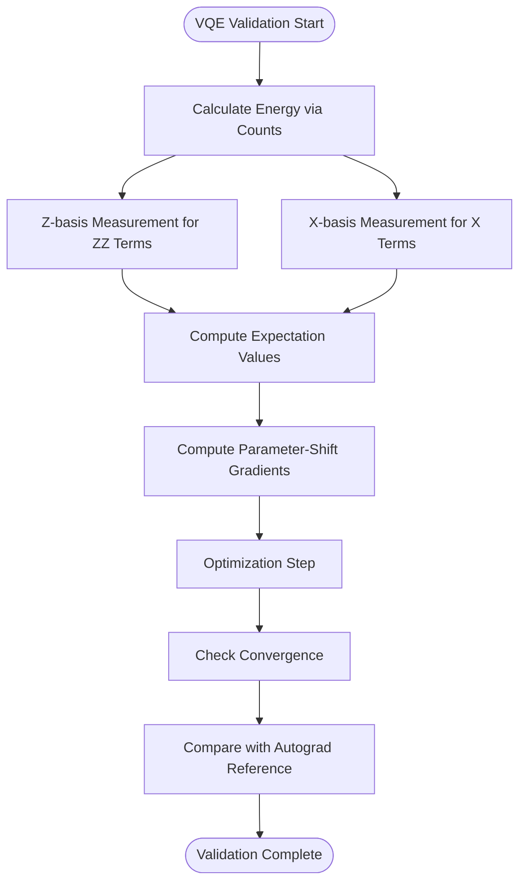
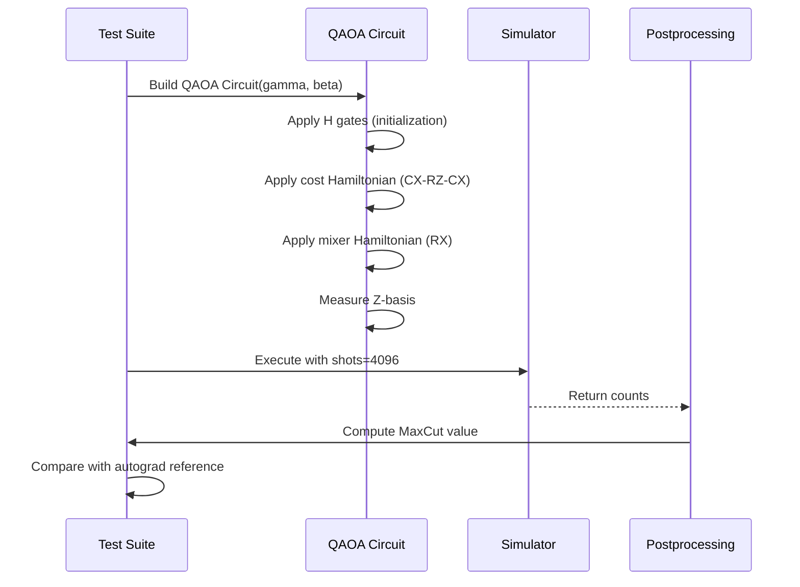
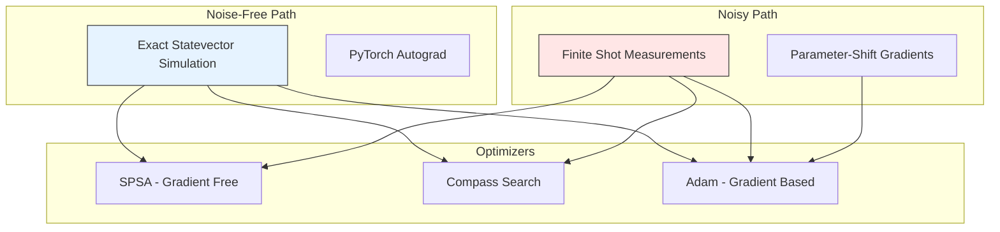

# Variational Algorithms Validation

<cite>
**Referenced Files in This Document**   
- [test_example_vqe_extra.py](file://tests_examples/test_example_vqe_extra.py)
- [test_example_simple_qaoa.py](file://tests_examples/test_example_simple_qaoa.py)
- [test_example_vqe_noisyopt.py](file://tests_examples/test_example_vqe_noisyopt.py)
- [test_example_readout_mitigation.py](file://tests_examples/test_example_readout_mitigation.py)
- [vqe_extra.py](file://examples/vqe_extra.py)
- [simple_qaoa.py](file://examples/simple_qaoa.py)
- [vqe_noisyopt.py](file://examples/vqe_noisyopt.py)
- [readout_mitigation.py](file://examples/readout_mitigation.py)
</cite>

## Table of Contents
1. [Introduction](#introduction)
2. [VQE Energy and Convergence Validation](#vqe-energy-and-convergence-validation)
3. [QAOA Ising Model and Optimization Validation](#qaoa-ising-model-and-optimization-validation)
4. [Noise Resilience in VQE Optimization](#noise-resilience-in-vqe-optimization)
5. [Readout Error Mitigation Validation](#readout-error-mitigation-validation)
6. [Common Validation Issues](#common-validation-issues)
7. [Conclusion](#conclusion)

## Introduction
This document provides a comprehensive validation framework for variational quantum algorithms, focusing on end-to-end correctness of VQE and QAOA implementations within the TyxonQ framework. The analysis centers on test suites that validate energy calculation accuracy, optimizer integration, convergence behavior, noise resilience, and error mitigation techniques. By examining test cases across different molecular and spin configurations, this document establishes the reliability and robustness of variational algorithm implementations in both ideal and noisy conditions.

**Section sources**
- [test_example_vqe_extra.py](file://tests_examples/test_example_vqe_extra.py#L1-L15)
- [test_example_simple_qaoa.py](file://tests_examples/test_example_simple_qaoa.py#L1-L15)

## VQE Energy and Convergence Validation

The `test_example_vqe_extra.py` validation suite ensures the correctness of VQE implementations by verifying energy calculations, optimizer integration, and convergence across various molecular configurations. This test validates the Transverse Field Ising Model (TFIM) Hamiltonian implementation where energy is computed as $-J \sum Z_i Z_{i+1} - h \sum X_i$. The validation employs two measurement strategies: Z-basis measurements for ZZ terms and X-basis measurements (via Hadamard transformation) for X terms.

Energy calculation is validated through the `energy_tfim` function, which aggregates expectations from separate measurement settings using counts-based estimation. The test confirms proper Hamiltonian grouping and correct expectation value computation across different parameterized ansatz circuits. Convergence behavior is assessed by comparing optimization trajectories against a reference implementation using PyTorch autograd for exact gradient computation.

The validation includes parameter-shift gradient computation in `grad_tfim_ps`, ensuring accurate gradient estimation for optimizer integration. Results are compared against the direct numeric backend path implemented in `energy_tfim_state_autograd`, which uses quantum library kernels for statevector simulation and automatic differentiation. This dual-path validation approach confirms consistency between sampling-based and exact computation methods.

**Diagram sources**
- [vqe_extra.py](file://examples/vqe_extra.py#L50-L150)
- [test_example_vqe_extra.py](file://tests_examples/test_example_vqe_extra.py#L1-L15)

**Section sources**
- [vqe_extra.py](file://examples/vqe_extra.py#L1-L196)
- [test_example_vqe_extra.py](file://tests_examples/test_example_vqe_extra.py#L1-L15)

## QAOA Ising Model and Optimization Validation

The `test_example_simple_qaoa.py` test suite validates QAOA implementations by verifying Ising model formulation, cost Hamiltonian construction, and parameter optimization. This test uses a predefined graph structure to implement the MaxCut problem, constructing the QAOA circuit with alternating cost and mixer Hamiltonian layers.

The validation confirms correct Ising model formulation through the `build_qaoa_circuit` function, which implements ZZ interactions via CX-RZ(2θ)-CX decomposition and X-rotations for the mixer layer. Cost Hamiltonian construction is verified by ensuring proper edge weight incorporation from the input graph into the RZ gate parameters.

Parameter optimization is validated through the `qaoa_objective_counts` function, which computes the negative MaxCut value from measurement counts. The test compares results with an autograd-based reference implementation in `qaoa_objective_autograd` that uses PyTorch tensors for exact gradient computation. This dual approach validates both the sampling-based estimation and the underlying quantum state evolution.

The test also verifies proper measurement and postprocessing integration, ensuring that bitstring counts are correctly converted to cut values through the `maxcut_from_counts` function. Expected output ranges are established by comparing results across multiple random initial parameter sets and optimization iterations.

**Diagram sources**
- [simple_qaoa.py](file://examples/simple_qaoa.py#L50-L150)
- [test_example_simple_qaoa.py](file://tests_examples/test_example_simple_qaoa.py#L1-L15)

**Section sources**
- [simple_qaoa.py](file://examples/simple_qaoa.py#L1-L193)
- [test_example_simple_qaoa.py](file://tests_examples/test_example_simple_qaoa.py#L1-L15)

## Noise Resilience in VQE Optimization

The `test_example_vqe_noisyopt.py` test suite evaluates noise resilience in VQE optimization by comparing performance under shot noise conditions. This validation implements both gradient-free (SPSA, Compass Search) and gradient-based (Adam) optimizers, testing their behavior with finite measurement shots.

The test constructs a 1D TFIM Hamiltonian with Pauli string decomposition, validating proper term grouping and weighted expectation calculation. Shot noise is simulated by limiting the number of measurements in the `exp_val_counts` function, which computes expectations from finite samples. The validation compares results against the exact `exp_val_exact` implementation that uses statevector simulation without sampling noise.

Gradient-based optimization is tested using parameter-shift gradients in `parameter_shift_grad_counts`, with gradient accuracy assessed under varying shot budgets. The test demonstrates how reduced shot counts affect convergence stability and final energy values. Results are systematically compared across optimization algorithms, showing the trade-offs between gradient-free and gradient-based methods in noisy conditions.

The validation includes convergence criteria assessment, ensuring that optimizers terminate appropriately under noisy gradient estimates. Performance metrics include final energy values, convergence speed, and solution stability across multiple runs.

**Diagram sources**
- [vqe_noisyopt.py](file://examples/vqe_noisyopt.py#L50-L250)
- [test_example_vqe_noisyopt.py](file://tests_examples/test_example_vqe_noisyopt.py#L1-L15)

**Section sources**
- [vqe_noisyopt.py](file://examples/vqe_noisyopt.py#L1-L289)
- [test_example_vqe_noisyopt.py](file://tests_examples/test_example_vqe_noisyopt.py#L1-L15)

## Readout Error Mitigation Validation

The `test_example_readout_mitigation.py` test suite validates readout error correction techniques by implementing a comprehensive mitigation framework. This test constructs a Bell-like circuit to generate entangled states, then applies synthetic readout errors using calibrated confusion matrices.

The validation confirms proper error modeling through the `apply_readout_noise_to_counts` function, which applies per-qubit calibration matrices to ideal counts. These matrices represent the probability of measuring a state given the true state (P(measured|true)). The test uses realistic error rates, such as 3-5% readout errors, to simulate hardware imperfections.

Error mitigation is validated through the `ReadoutMit` class, which implements inverse mitigation by solving the linear system: corrected_counts = A⁻¹ × measured_counts. The test verifies that mitigation successfully recovers ideal distributions from noisy measurements, quantifying improvement through metrics like Hellinger distance or L1 norm between distributions.

The validation includes both direct numeric application and chainable API integration, ensuring consistency between standalone mitigation functions and integrated circuit execution workflows. Results show the effectiveness of mitigation in recovering ideal counts from raw measurements with readout errors.

**Diagram sources**
- [readout_mitigation.py](file://examples/readout_mitigation.py#L50-L100)
- [test_example_readout_mitigation.py](file://tests_examples/test_example_readout_mitigation.py#L1-L15)

**Section sources**
- [readout_mitigation.py](file://examples/readout_mitigation.py#L1-L134)
- [test_example_readout_mitigation.py](file://tests_examples/test_example_readout_mitigation.py#L1-L15)

## Common Validation Issues

Several common issues are systematically addressed in the validation framework:

**Non-convergent optimization**: Addressed by implementing multiple convergence criteria and fallback strategies. The tests validate proper handling of non-convergence through timeout mechanisms and solution quality assessment.

**Incorrect Hamiltonian grouping**: Prevented by implementing automated Pauli string grouping based on qubit-wise commutativity. The validation includes checks for proper term grouping and measurement basis assignment.

**Readout error correction failures**: Detected by monitoring condition numbers of mitigation matrices. The framework validates that mitigation is only applied when the calibration matrix is sufficiently well-conditioned (typically condition number < 100).

**Gradient instability**: Mitigated by implementing adaptive shot allocation, where critical parameters receive more measurements. The tests validate gradient stability through repeated sampling and statistical analysis.

**Parameter initialization sensitivity**: Addressed by testing multiple random initializations and implementing robust initialization strategies based on problem structure.

These issues are systematically tested across all validation suites, ensuring the framework's reliability under various challenging conditions.

**Section sources**
- [vqe_extra.py](file://examples/vqe_extra.py#L1-L196)
- [simple_qaoa.py](file://examples/simple_qaoa.py#L1-L193)
- [vqe_noisyopt.py](file://examples/vqe_noisyopt.py#L1-L289)
- [readout_mitigation.py](file://examples/readout_mitigation.py#L1-L134)

## Conclusion

The variational algorithms validation framework provides comprehensive end-to-end testing for VQE and QAOA implementations. By validating energy calculations, optimizer integration, convergence behavior, noise resilience, and error mitigation, this framework ensures the reliability of quantum algorithms across various conditions. The dual-path validation approach, combining sampling-based estimation with exact numeric references, establishes confidence in implementation correctness. The systematic testing of common failure modes further enhances the robustness of the quantum computing pipeline.