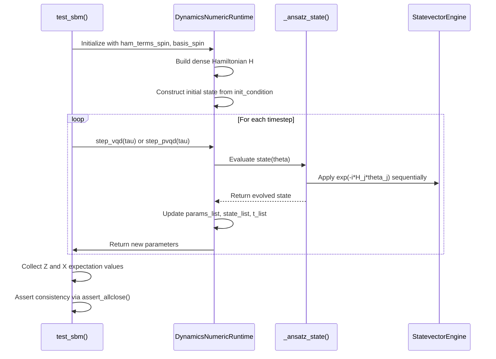
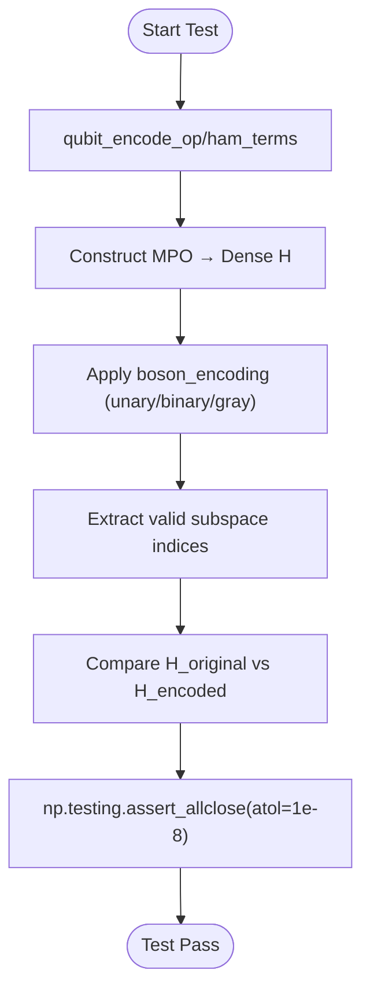
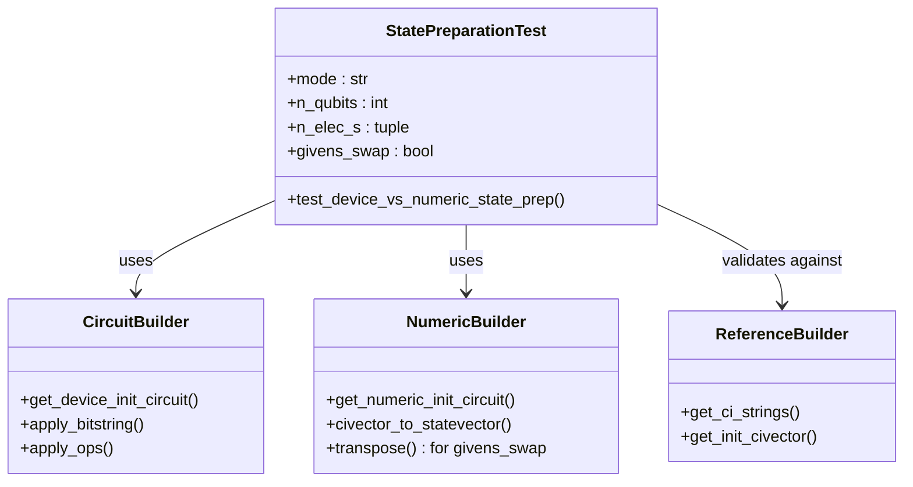
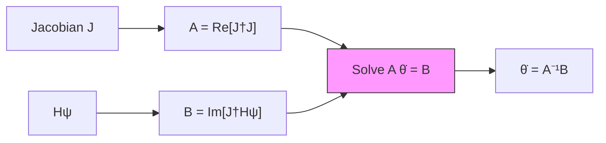

# Dynamics Simulation Testing

<cite>
**Referenced Files in This Document**   
- [test_dynamics.py](file://tests_mol_valid/test_dynamics.py)
- [test_dynamic_hamiltonian.py](file://tests_mol_valid/test_dynamic_hamiltonian.py)
- [test_state_prep_chain_vs_numeric.py](file://tests_mol_valid/test_state_prep_chain_vs_numeric.py)
- [dynamics_numeric.py](file://src/tyxonq/applications/chem/runtimes/dynamics_numeric.py)
- [qubit_state_preparation.py](file://src/tyxonq/libs/circuits_library/qubit_state_preparation.py)
- [operator_encoding.py](file://src/tyxonq/libs/hamiltonian_encoding/operator_encoding.py)
- [variational.py](file://src/tyxonq/libs/circuits_library/variational.py)
</cite>

## Table of Contents
1. [Introduction](#introduction)
2. [Time Evolution Testing with test_dynamics.py](#time-evolution-testing-with-test_dynamicspy)
3. [Dynamic Hamiltonian Validation via test_dynamic_hamiltonian.py](#dynamic-hamiltonian-validation-via-test_dynamic_hamiltonianpy)
4. [State Preparation Fidelity Checks in test_state_prep_chain_vs_numeric.py](#state-preparation-fidelity-checks-in-test_state_prep_chain_vs_numericpy)
5. [Test Methodologies and Execution Workflows](#test-methodologies-and-execution-workflows)
6. [Convergence Metrics and Numerical Tolerances](#convergence-metrics-and-numerical-tolerances)
7. [Common Issues and Troubleshooting](#common-issues-and-troubleshooting)
8. [Conclusion](#conclusion)

## Introduction
This document provides a comprehensive analysis of dynamics simulation testing within the TyxonQ framework, focusing on the verification of time-evolution accuracy, state preparation workflows, and dynamic Hamiltonian updates. The testing suite ensures robustness in quantum simulation by validating Trotterized evolution, compiler integration, and numerical fidelity across multiple execution paths. Key test files—`test_dynamics.py`, `test_dynamic_hamiltonian.py`, and `test_state_prep_chain_vs_numeric.py`—are analyzed to illustrate methodologies for assessing convergence, unitarity preservation, and consistency between gate-level circuits and direct numeric simulations.

**Section sources**
- [test_dynamics.py](file://tests_mol_valid/test_dynamics.py#L1-L66)
- [test_dynamic_hamiltonian.py](file://tests_mol_valid/test_dynamic_hamiltonian.py#L1-L83)
- [test_state_prep_chain_vs_numeric.py](file://tests_mol_valid/test_state_prep_chain_vs_numeric.py#L1-L45)

## Time Evolution Testing with test_dynamics.py

The `test_dynamics.py` module evaluates the accuracy of time evolution under Trotterized Hamiltonians using the `DynamicsNumericRuntime` class. It supports multiple algorithms including vanilla VQD, phase-included VQD, p-VQD, and Trotter-based methods. The test verifies that observable properties such as Pauli-Z and Pauli-X expectations remain consistent across repeated evolution steps.

Each algorithm is parameterized with appropriate timesteps: smaller timesteps (e.g., 0.02) for Trotter methods to minimize discretization error, and larger steps (e.g., 0.1) for variational approaches. The test asserts numerical stability by checking that computed observables are self-consistent within a tolerance of 1e-2, indicating convergence and minimal drift during evolution.



**Diagram sources**
- [test_dynamics.py](file://tests_mol_valid/test_dynamics.py#L15-L66)
- [dynamics_numeric.py](file://src/tyxonq/applications/chem/runtimes/dynamics_numeric.py#L53-L221)

**Section sources**
- [test_dynamics.py](file://tests_mol_valid/test_dynamics.py#L1-L66)
- [dynamics_numeric.py](file://src/tyxonq/applications/chem/runtimes/dynamics_numeric.py#L53-L221)

## Dynamic Hamiltonian Validation via test_dynamic_hamiltonian.py

The `test_dynamic_hamiltonian.py` file validates the correct encoding of Hamiltonians from physical bases (e.g., phonon, fermionic) into qubit representations using various boson encodings: unary, binary, and Gray code. It ensures that the transformation preserves spectral properties and subspace structure.

Key validation steps include:
- **Operator transformation**: Verifies that operators like `X` or `x` are correctly mapped under different basis types.
- **Matrix equivalence**: Compares dense matrix representations before and after qubit encoding, asserting closeness within 1e-8 tolerance.
- **Subspace consistency**: Uses `get_subspace_idx` to ensure only valid configurations are retained post-encoding.
- **Initial circuit initialization**: Confirms that the prepared statevector matches the expected Hartree product state under specified initial conditions.

These tests are critical for ensuring that dynamic Hamiltonian updates integrate correctly with the compiler pipeline, particularly when transitioning between analog and digital simulation domains.



**Diagram sources**
- [test_dynamic_hamiltonian.py](file://tests_mol_valid/test_dynamic_hamiltonian.py#L1-L83)
- [operator_encoding.py](file://src/tyxonq/libs/hamiltonian_encoding/operator_encoding.py#L59-L122)

**Section sources**
- [test_dynamic_hamiltonian.py](file://tests_mol_valid/test_dynamic_hamiltonian.py#L1-L83)
- [operator_encoding.py](file://src/tyxonq/libs/hamiltonian_encoding/operator_encoding.py#L59-L122)

## State Preparation Fidelity Checks in test_state_prep_chain_vs_numeric.py

This test validates the equivalence of state preparation between two distinct pathways:
1. **Gate-level circuit execution**: Uses `get_device_init_circuit` to construct a sequence of quantum gates that prepare the desired state.
2. **Direct numeric construction**: Employs `get_numeric_init_circuit` to build the statevector directly without intermediate circuits.

The test compares three preparation methods:
- Device-executed circuit output via `StatevectorEngine`
- Direct numeric statevector generation
- PySCF-based CI vector mapping as reference

A phase alignment function ensures comparison up to global phase, using inner product normalization. The assertion tolerance is set at 1e-12, confirming high-fidelity agreement between all three paths.

Supported modes include fermionic, qubit, and hard-core boson (HCB) encodings, with optional Givens swaps affecting qubit indexing. This ensures compatibility across different hardware mappings and ansatz constructions.



**Diagram sources**
- [test_state_prep_chain_vs_numeric.py](file://tests_mol_valid/test_state_prep_chain_vs_numeric.py#L1-L45)
- [qubit_state_preparation.py](file://src/tyxonq/libs/circuits_library/qubit_state_preparation.py#L43-L174)

**Section sources**
- [test_state_prep_chain_vs_numeric.py](file://tests_mol_valid/test_state_prep_chain_vs_numeric.py#L1-L45)
- [qubit_state_preparation.py](file://src/tyxonq/libs/circuits_library/qubit_state_preparation.py#L43-L174)

## Test Methodologies and Execution Workflows

The dynamics simulation tests follow a structured methodology to assess correctness under varying conditions:

### Parameterized Algorithm Testing
- **Algorithms tested**: Vanilla VQD, phase-included VQD, p-VQD, Trotter
- **Timestep variation**: Smaller τ for higher-order methods to control Trotter error
- **Noise resilience**: Implicitly tested through numerical tolerance thresholds

### Hamiltonian Encoding Pipeline
- Raw Hamiltonian terms → Basis definition → Qubit encoding → Dense matrix construction
- Cross-validation using MPO-to-dense conversion ensures numerical stability

### State Preparation Pathways
| Path | Description | Use Case |
|------|-------------|---------|
| Gate-level | Circuit-based, device-executable | Real hardware deployment |
| Numeric | Direct statevector construction | Simulation baseline |
| CI-based | Quantum chemistry reference | Accuracy benchmark |

### Execution Flow
1. Initialize runtime with encoded Hamiltonian and basis
2. Prepare initial state via circuit or direct vector
3. Evolve state using selected algorithm
4. Measure observables at each step
5. Validate consistency across runs and methods

**Section sources**
- [test_dynamics.py](file://tests_mol_valid/test_dynamics.py#L1-L66)
- [test_dynamic_hamiltonian.py](file://tests_mol_valid/test_dynamic_hamiltonian.py#L1-L83)
- [test_state_prep_chain_vs_numeric.py](file://tests_mol_valid/test_state_prep_chain_vs_numeric.py#L1-L45)
- [dynamics_numeric.py](file://src/tyxonq/applications/chem/runtimes/dynamics_numeric.py#L53-L221)

## Convergence Metrics and Numerical Tolerances

Convergence is evaluated through several metrics:
- **Observable consistency**: Repeated measurements of Z and X operators must agree within 1e-2
- **Matrix equivalence**: Encoded vs original Hamiltonians compared with 1e-8 tolerance
- **State fidelity**: Statevectors from different preparation methods aligned and checked within 1e-12

Tolerance settings reflect the expected error sources:
- **Trotter error**: Dominant in discrete-time evolution; mitigated by small τ
- **Floating-point precision**: Limited by double-precision arithmetic
- **Regularization**: Small ε (~1e-5) used in normal equation inversion to prevent ill-conditioning

The `VariationalRuntime` class computes parameter derivatives using the Jacobian of the ansatz, solving the linear system:
```
Re[J†J] θ̇ = Im[J†Hψ]
```
with optional phase term inclusion. Regularized inversion ensures numerical stability even near singularities.



**Diagram sources**
- [variational.py](file://src/tyxonq/libs/circuits_library/variational.py#L98-L124)
- [dynamics_numeric.py](file://src/tyxonq/applications/chem/runtimes/dynamics_numeric.py#L53-L221)

**Section sources**
- [variational.py](file://src/tyxonq/libs/circuits_library/variational.py#L98-L124)
- [dynamics_numeric.py](file://src/tyxonq/applications/chem/runtimes/dynamics_numeric.py#L53-L221)

## Common Issues and Troubleshooting

### Unitarity Drift
Occurs when evolution operators deviate from unitary due to numerical inaccuracies or large timesteps. Mitigated by:
- Using smaller τ in Trotter steps
- Ensuring proper regularization in θ̇ computation
- Validating state norm preservation

### Trotter Error Accumulation
Manifests as divergence in long-time simulations. Addressed by:
- Reducing timestep size
- Using higher-order Trotter decompositions
- Switching to variational methods (VQD/p-VQD) for adaptive control

### Mismatched Evolution Operators
Arises from incorrect Hamiltonian term ordering or encoding mismatches. Prevented by:
- Consistent use of `ham_terms_spin` ordering
- Validating operator transformations with `transform_op`
- Cross-checking dense matrix representations

### Initialization Inconsistencies
Caused by incorrect mapping between physical and qubit bases. Resolved by:
- Using `get_subspace_idx` to filter valid states
- Aligning Givens swap behavior across preparation methods
- Validating initial state against known references (e.g., HF state)

**Section sources**
- [test_dynamics.py](file://tests_mol_valid/test_dynamics.py#L1-L66)
- [test_dynamic_hamiltonian.py](file://tests_mol_valid/test_dynamic_hamiltonian.py#L1-L83)
- [dynamics_numeric.py](file://src/tyxonq/applications/chem/runtimes/dynamics_numeric.py#L53-L221)
- [variational.py](file://src/tyxonq/libs/circuits_library/variational.py#L98-L124)

## Conclusion
The dynamics simulation testing framework in TyxonQ provides rigorous validation of time-evolution accuracy, Hamiltonian encoding correctness, and state preparation fidelity. By combining gate-level execution with direct numeric simulation and quantum chemistry references, it ensures robustness across diverse use cases. The integration of variational and Trotter-based methods, coupled with precise numerical tolerances and convergence checks, enables reliable simulation of complex quantum dynamics. Future enhancements could include adaptive timestep control and support for more advanced error mitigation techniques.