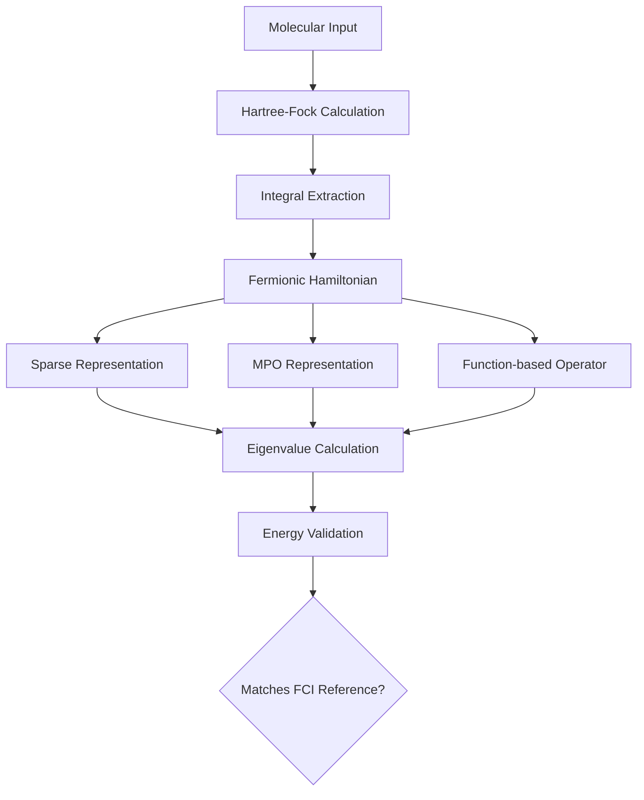
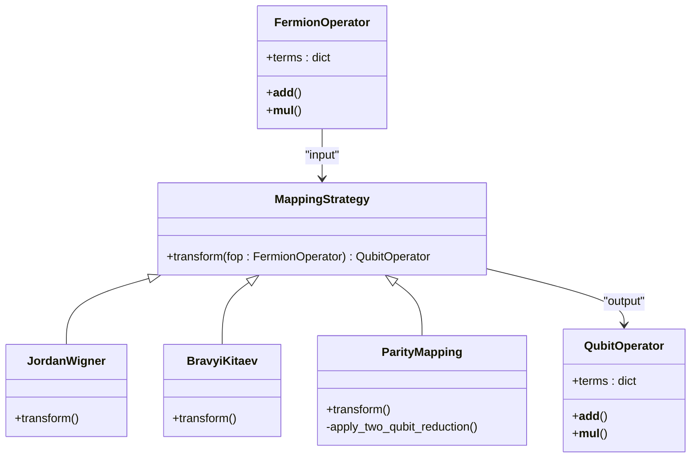
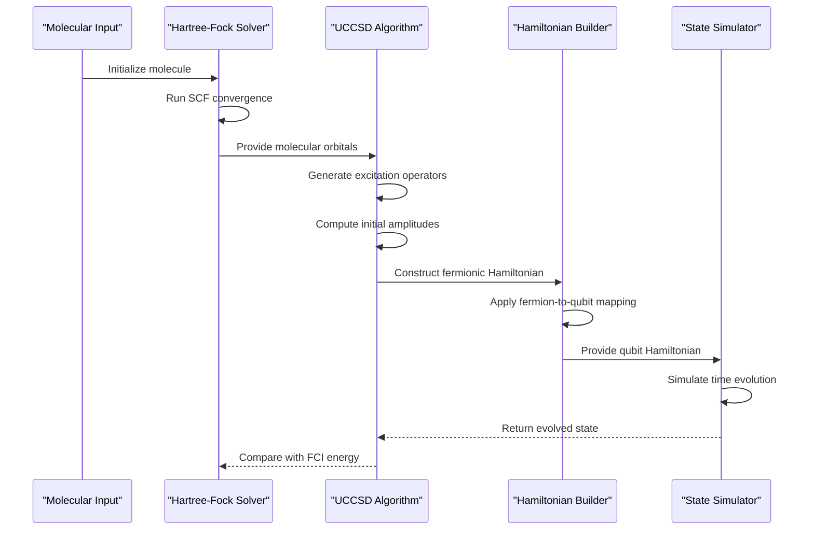

# Molecular Validity and Dynamics Testing

<cite>
**Referenced Files in This Document**   
- [test_molecule.py](file://tests_mol_valid/test_molecule.py)
- [test_hamiltonian.py](file://tests_mol_valid/test_hamiltonian.py)
- [molecule.py](file://src/tyxonq/applications/chem/molecule.py)
- [uccsd.py](file://src/tyxonq/applications/chem/algorithms/uccsd.py)
- [fermion_to_qubit.py](file://src/tyxonq/libs/hamiltonian_encoding/fermion_to_qubit.py)
</cite>

## Table of Contents
1. [Introduction](#introduction)
2. [Molecular Object Validation](#molecular-object-validation)
3. [Hamiltonian Generation Testing](#hamiltonian-generation-testing)
4. [Dynamics Simulation Correctness](#dynamics-simulation-correctness)
5. [Optimizer Integration Verification](#optimizer-integration-verification)
6. [Common Issues and Error Handling](#common-issues-and-error-handling)

## Introduction
This document provides comprehensive testing methodology for molecular validity and dynamics in quantum chemistry simulations. It covers validation of molecular object construction, Hamiltonian generation, dynamics simulation accuracy, and optimizer integration within chemistry workflows. The testing framework ensures accurate quantum model construction through rigorous validation of atomic coordinates, basis sets, charge/spin specifications, and fermion-to-qubit mappings.

## Molecular Object Validation

The molecular object validation process ensures correct construction of quantum chemistry models by verifying atomic coordinates, basis sets, and electronic properties. The `_Molecule` class in `molecule.py` serves as the core implementation for molecular representation, inheriting from PySCF's `Mole` class while providing specialized initialization for testing and benchmarking purposes.

Molecular validation includes checking:
- Atomic coordinate specifications and geometric configurations
- Electron count and spin state consistency
- Nuclear repulsion energy calculations
- Overlap matrix integrity
- One- and two-electron integral correctness

The test suite validates molecular construction through comparison with reference Hartree-Fock (HF) and Full Configuration Interaction (FCI) calculations, ensuring that reconstructed molecular objects produce identical electronic structure results.

**Section sources**
- [test_molecule.py](file://tests_mol_valid/test_molecule.py#L8-L42)
- [molecule.py](file://src/tyxonq/applications/chem/molecule.py#L13-L71)

## Hamiltonian Generation Testing

### Sparse and MPO Representation Validation
Hamiltonian generation is tested across multiple representations including sparse matrix, Matrix Product Operator (MPO), and function-based linear operator formats. The `test_hamiltonian.py` suite validates that Hamiltonians generated from molecular inputs produce consistent ground state energies across different representations.

The testing framework verifies:
- Energy equivalence between sparse and MPO representations
- Consistency with FCI reference energies
- Proper nuclear repulsion energy inclusion
- Correct fermionic operator construction

**Diagram sources**
- [test_hamiltonian.py](file://tests_mol_valid/test_hamiltonian.py#L0-L76)
- [molecule.py](file://src/tyxonq/applications/chem/molecule.py#L13-L71)

### Fermion-to-Qubit Mapping Verification
The fermion-to-qubit mapping process is validated through multiple encoding schemes including Jordan-Wigner, Bravyi-Kitaev, and parity transformations. The `fermion_to_qubit.py` module implements these mappings with special handling for symmetry conservation and qubit reduction.

**Diagram sources**
- [fermion_to_qubit.py](file://src/tyxonq/libs/hamiltonian_encoding/fermion_to_qubit.py#L78-L88)
- [test_hamiltonian.py](file://tests_mol_valid/test_hamiltonian.py#L0-L76)

**Section sources**
- [test_hamiltonian.py](file://tests_mol_valid/test_hamiltonian.py#L0-L76)
- [fermion_to_qubit.py](file://src/tyxonq/libs/hamiltonian_encoding/fermion_to_qubit.py#L78-L88)

## Dynamics Simulation Correctness

### Time Evolution Accuracy
Dynamics simulation correctness is verified through time evolution accuracy tests that compare state evolution under different Hamiltonian representations. The testing framework validates that time-evolved states maintain energy conservation and proper phase accumulation.

The UCCSD algorithm implementation in `uccsd.py` provides the foundation for dynamics testing, with special attention to:
- Ansatz circuit construction accuracy
- Parameterized gate sequence fidelity
- Excitation operator selection and sorting
- Initial amplitude guessing methods

**Diagram sources**
- [uccsd.py](file://src/tyxonq/applications/chem/algorithms/uccsd.py#L17-L229)
- [test_hamiltonian.py](file://tests_mol_valid/test_hamiltonian.py#L0-L76)

### State Preparation Fidelity
State preparation fidelity is tested through comparison of prepared states with exact diagonalization results. The framework verifies that:
- Reference state preparation (Hartree-Fock) is correct
- Excitation operators preserve particle number
- Amplitude parameters produce expected energy lowering
- Converged UCCSD energies match FCI references within tolerance

**Section sources**
- [uccsd.py](file://src/tyxonq/applications/chem/algorithms/uccsd.py#L17-L229)
- [test_hamiltonian.py](file://tests_mol_valid/test_hamiltonian.py#L0-L76)

## Optimizer Integration Verification

Optimizer integration within chemistry workflows is validated through end-to-end energy minimization tests. The UCCSD implementation includes built-in optimization capabilities that are tested for:
- Parameter convergence
- Energy landscape navigation
- Gradient computation accuracy
- Robustness to initial parameter values

The testing framework verifies that different initialization methods ("mp2", "ccsd", "zeros") produce consistent final energies and that the optimization process reliably converges to the correct solution.

**Section sources**
- [uccsd.py](file://src/tyxonq/applications/chem/algorithms/uccsd.py#L17-L229)
- [test_hamiltonian.py](file://tests_mol_valid/test_hamiltonian.py#L0-L76)

## Common Issues and Error Handling

### Invalid Molecular Geometries
The framework handles invalid molecular geometries through comprehensive input validation. The `_Molecule` class constructor performs checks on:
- Coordinate validity and dimensional consistency
- Electron count parity with spin state
- Basis set compatibility
- Overlap matrix positive definiteness

### SCF Convergence Failures
SCF convergence issues are addressed through multiple strategies:
- Alternative initial guess methods
- Damping and level shifting techniques
- Maximum iteration limits with graceful failure
- Diagnostic information output for troubleshooting

### Fermion-to-Qubit Mapping Errors
The fermion-to-qubit mapping process includes safeguards against common errors:
- Validation of electron count for two-qubit reduction
- Proper handling of odd electron systems
- Consistency checks between fermionic and qubit representations
- Error raising for unsupported mapping types

The error handling framework ensures that invalid operations raise descriptive exceptions, enabling users to diagnose and correct issues in their quantum chemistry workflows.

**Section sources**
- [test_molecule.py](file://tests_mol_valid/test_molecule.py#L8-L42)
- [test_hamiltonian.py](file://tests_mol_valid/test_hamiltonian.py#L0-L76)
- [molecule.py](file://src/tyxonq/applications/chem/molecule.py#L13-L71)
- [fermion_to_qubit.py](file://src/tyxonq/libs/hamiltonian_encoding/fermion_to_qubit.py#L78-L88)