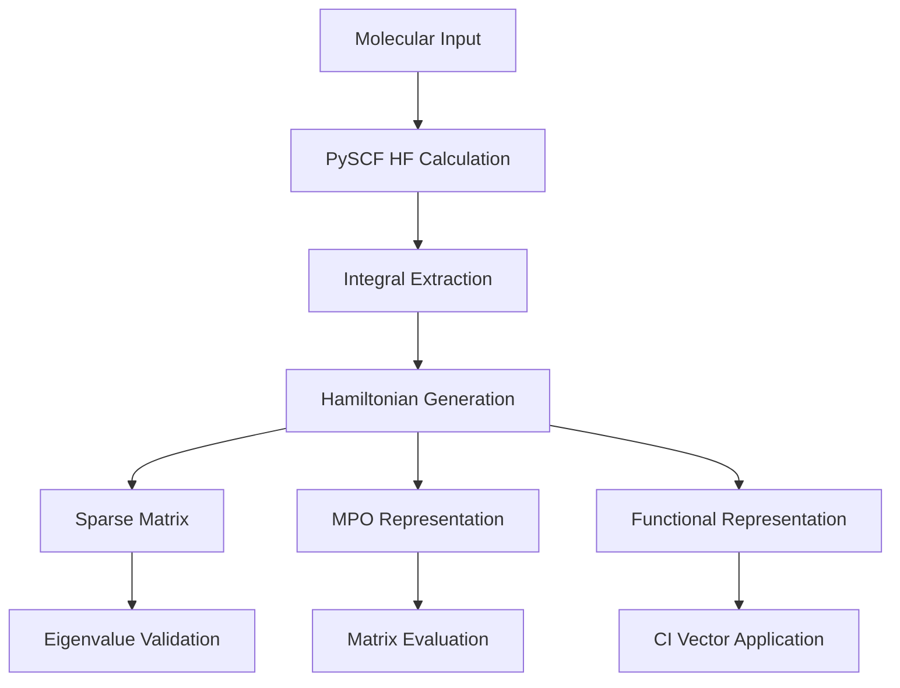
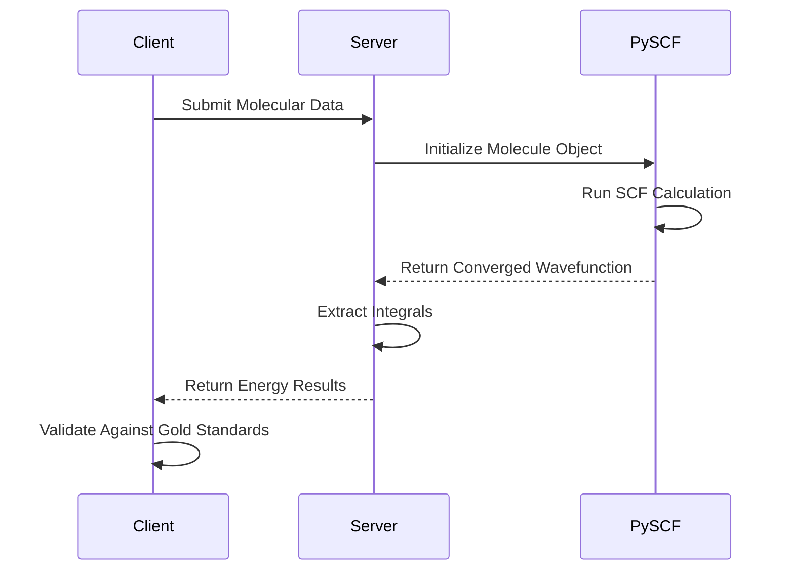

# Molecule and Hamiltonian Validation

<cite>
**Referenced Files in This Document**   
- [molecule.py](file://src/tyxonq/applications/chem/molecule.py)
- [hamiltonian_builders.py](file://src/tyxonq/applications/chem/chem_libs/hamiltonians_chem_library/hamiltonian_builders.py)
- [fermion_to_qubit.py](file://src/tyxonq/libs/hamiltonian_encoding/fermion_to_qubit.py)
- [test_hamiltonian.py](file://tests_mol_valid/test_hamiltonian.py)
- [test_server_chem_compute.py](file://tests_mol_valid/test_server_chem_compute.py)
</cite>

## Table of Contents
1. [Introduction](#introduction)
2. [Molecule Object Construction and Validation](#molecule-object-construction-and-validation)
3. [Hamiltonian Generation and Representation](#hamiltonian-generation-and-representation)
4. [PySCF Integration and SCF Convergence](#pyscf-integration-and-scf-convergence)
5. [Common Validation Issues and Error Handling](#common-validation-issues-and-error-handling)
6. [Code Examples and Input Formatting](#code-examples-and-input-formatting)
7. [Conclusion](#conclusion)

## Introduction
This document provides comprehensive guidance on validating quantum chemistry models within the TyxonQ framework, focusing on the correct construction of molecule objects and Hamiltonian generation. The validation procedures ensure accurate quantum simulations by verifying molecular inputs, Hamiltonian representations, and integration with classical computational chemistry methods. The document covers validation of atomic coordinates, basis sets, charge, and spin specifications, along with testing of Hamiltonian generation in sparse and MPO representations. It also addresses PySCF integration and SCF convergence checks, providing solutions for common issues such as invalid molecular geometries and incorrect fermion-to-qubit mappings.

## Molecule Object Construction and Validation

The molecule object construction in TyxonQ follows a systematic validation process to ensure correct quantum chemistry model initialization. The `_Molecule` class in `molecule.py` serves as a duck-typed wrapper for PySCF's Mole object, providing a consistent interface for quantum chemistry calculations. The validation process begins with the initialization of molecular parameters including one-electron integrals (`int1e`), two-electron integrals (`int2e`), number of electrons (`n_elec`), spin multiplicity (`spin`), nuclear repulsion energy (`e_nuc`), and overlap matrix (`ovlp`).

The system provides multiple utility functions for constructing common molecular configurations with built-in validation. These include `h_chain` for hydrogen chains, `water` for water molecules, `nh3` for ammonia, and `benzene` for aromatic compounds. Each function validates geometric parameters such as bond lengths and angles before constructing the molecular object. For example, the `water` function converts bond angle from degrees to radians and calculates precise hydrogen atom coordinates based on trigonometric relationships.

Charge and spin specifications are validated during molecule creation, with the system supporting both integer total electron counts and tuple-based alpha/beta electron splits. The validation ensures that spin multiplicity is consistent with the total electron count, preventing unphysical configurations. Basis set validation occurs through PySCF integration, where invalid basis set specifications trigger appropriate exceptions.

**Section sources**
- [molecule.py](file://src/tyxonq/applications/chem/molecule.py#L2-L310)

## Hamiltonian Generation and Representation

Hamiltonian generation in TyxonQ supports multiple representations for quantum chemistry simulations, each with specific validation procedures. The system provides three primary Hamiltonian representations: sparse matrix, MPO (Matrix Product Operator), and functional (fcifunc) formats, accessible through the `get_h_from_hf` function in `hamiltonian_builders.py`.

The sparse representation generates a scipy.sparse matrix through fermionic operator conversion using OpenFermion. The validation process verifies that the resulting Hamiltonian eigenvalues match reference FCI (Full Configuration Interaction) energies within numerical tolerance (1e-6). For the MPO representation, the system wraps sparse Hamiltonians with an `_MPOWrapper` class that provides an `eval_matrix()` method for compatibility with tensor network simulations. The functional representation creates a callable that applies the Hamiltonian to CI (Configuration Interaction) vectors, enabling large-scale simulations without explicit matrix storage.

The Hamiltonian generation pipeline follows a two-step process: first extracting molecular integrals through `get_integral_from_hf`, then converting these integrals to the desired representation via `get_h_from_integral`. The system supports three modes: "fermion" for fermionic operators, "qubit" for qubit operators after Jordan-Wigner or Parity mapping, and "hcb" for hard-core boson representations. Each mode undergoes specific validation to ensure correct operator ordering and coefficient accuracy.



**Diagram sources**
- [hamiltonian_builders.py](file://src/tyxonq/applications/chem/chem_libs/hamiltonians_chem_library/hamiltonian_builders.py#L231-L241)
- [test_hamiltonian.py](file://tests_mol_valid/test_hamiltonian.py#L0-L76)

**Section sources**
- [hamiltonian_builders.py](file://src/tyxonq/applications/chem/chem_libs/hamiltonians_chem_library/hamiltonian_builders.py#L0-L298)
- [test_hamiltonian.py](file://tests_mol_valid/test_hamiltonian.py#L0-L76)

## PySCF Integration and SCF Convergence

The integration with PySCF for classical quantum chemistry calculations is validated through comprehensive testing in `test_server_chem_compute.py`. The system verifies SCF (Self-Consistent Field) convergence by comparing computed energies against gold standard results for various quantum chemistry methods including HF (Hartree-Fock), FCI (Full Configuration Interaction), CCSD (Coupled Cluster Singles and Doubles), CCSD(T), MP2 (Møller-Plesset perturbation theory), and DFT (Density Functional Theory).

The validation process involves submitting molecular data to both CPU and GPU classical computation servers, with identical input parameters and expected energy outputs. The test cases use a hydrogen molecule with cc-pVDZ basis set as the benchmark system, comparing computed energies against pre-calculated gold results. The system validates convergence by ensuring energy differences are below 1e-6 Hartree for all methods.

For UCCSD (Unitary Coupled Cluster Singles and Doubles) and HEA (Hardware-Efficient Ansatz) calculations, the system verifies consistency between local and cloud-based computations. This cross-validation ensures that the PySCF integration produces identical results regardless of computational backend, confirming the reliability of the SCF convergence process. The validation also checks that molecular data serialization and deserialization preserve all critical parameters including atomic coordinates, basis sets, charge, and spin specifications.



**Diagram sources**
- [test_server_chem_compute.py](file://tests_mol_valid/test_server_chem_compute.py#L0-L145)

**Section sources**
- [test_server_chem_compute.py](file://tests_mol_valid/test_server_chem_compute.py#L0-L145)

## Common Validation Issues and Error Handling

Several common issues arise during molecule and Hamiltonian validation, each requiring specific error handling strategies. Invalid molecular geometries, such as atoms positioned too close together or impossible bond angles, trigger PySCF's internal validation and result in appropriate exceptions. The system handles these by providing clear error messages that identify the problematic atomic coordinates.

Basis set parsing failures occur when unsupported basis set names are specified or when basis set files are missing. The validation system catches these errors during molecule object initialization and provides suggestions for valid basis set alternatives. For fermion-to-qubit mappings, incorrect parameter combinations (such as odd electron counts with integer spin specifications) raise `ValueError` exceptions with descriptive messages explaining the required parameter formats.

The system implements robust error handling for numerical instabilities during SCF convergence. When SCF calculations fail to converge, the system provides diagnostic information including the final energy, convergence criteria, and orbital coefficients. For Hamiltonian generation, the validation includes checks for integral symmetry and proper normalization, ensuring that generated Hamiltonians maintain the physical properties of the original quantum system.

Memory-related issues during large-scale Hamiltonian construction are mitigated through the use of sparse representations and functional interfaces that avoid explicit matrix storage. The system validates memory usage patterns and provides warnings when calculations exceed recommended resource limits.

**Section sources**
- [molecule.py](file://src/tyxonq/applications/chem/molecule.py#L2-L310)
- [fermion_to_qubit.py](file://src/tyxonq/libs/hamiltonian_encoding/fermion_to_qubit.py#L0-L98)

## Code Examples and Input Formatting

Proper input formatting is essential for successful molecule and Hamiltonian validation. The following examples demonstrate correct usage patterns for common scenarios:

For molecule construction, atomic coordinates should be specified as a list of lists, with each inner list containing the element symbol followed by x, y, and z coordinates in Angstroms. Charge and spin specifications must be integers, while basis sets should use standard nomenclature (e.g., "sto-3g", "cc-pvdz").

```python
# Correct molecule specification
mol_data = {
    "atom": "H 0 0 0; H 0 0 0.74",
    "basis": "sto-3g",
    "charge": 0,
    "spin": 0,
    "unit": "Angstrom"
}
```

For Hamiltonian generation, the mode and htype parameters must be correctly specified to obtain the desired representation. The validation tests demonstrate proper parameter combinations for different use cases.

```python
# Hamiltonian generation examples
hamiltonian_sparse = get_h_from_hf(hf_object, mode="qubit", htype="sparse")
hamiltonian_mpo = get_h_from_hf(hf_object, mode="qubit", htype="mpo")
hamiltonian_fcifunc = get_h_from_hf(hf_object, mode="fermion", htype="fcifunc")
```

The system provides utility functions for common molecular configurations, reducing the risk of input errors. These functions encapsulate validated geometric parameters and provide consistent molecule construction across different applications.

**Section sources**
- [molecule.py](file://src/tyxonq/applications/chem/molecule.py#L2-L310)
- [hamiltonian_builders.py](file://src/tyxonq/applications/chem/chem_libs/hamiltonians_chem_library/hamiltonian_builders.py#L0-L298)
- [test_hamiltonian.py](file://tests_mol_valid/test_hamiltonian.py#L0-L76)

## Conclusion
The molecule and Hamiltonian validation framework in TyxonQ provides comprehensive tools for ensuring the correctness of quantum chemistry models. By systematically validating molecular inputs, Hamiltonian representations, and classical computation integration, the system enables reliable quantum simulations. The validation procedures cover atomic coordinates, basis sets, charge and spin specifications, and multiple Hamiltonian representations, with robust error handling for common issues. The integration with PySCF and comprehensive testing ensure accurate SCF convergence and consistent results across different computational backends. Following the demonstrated input formatting patterns and error handling strategies enables users to construct valid quantum chemistry models for various applications.