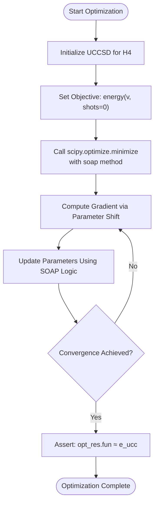
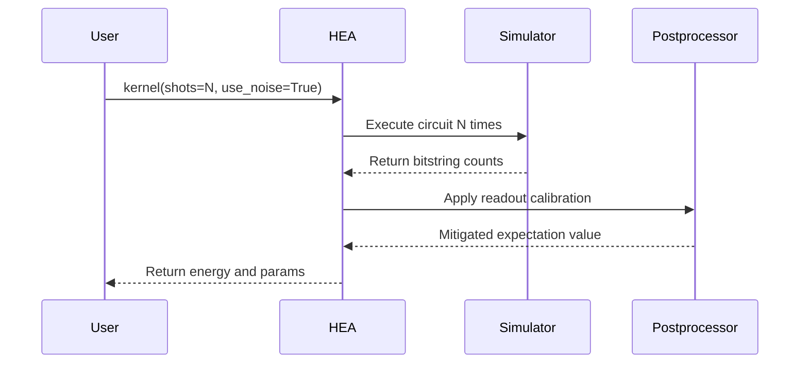
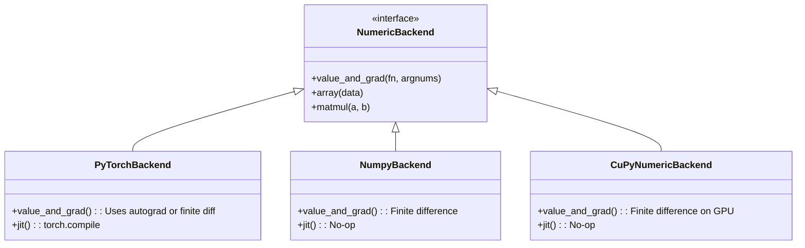

# Optimizer Integration Testing

<cite>
**Referenced Files in This Document**   
- [test_optimizer.py](file://tests_mol_valid/test_optimizer.py)
- [test_ucc_uccsd_runtime.py](file://tests_mol_valid/test_ucc_uccsd_runtime.py)
- [test_hea.py](file://tests_mol_valid/test_hea.py)
- [ucc_numeric_runtime.py](file://src/tyxonq/applications/chem/runtimes/ucc_numeric_runtime.py)
- [hea_numeric_runtime.py](file://src/tyxonq/applications/chem/runtimes/hea_numeric_runtime.py)
- [parameter_shift.py](file://src/tyxonq/compiler/gradients/parameter_shift.py)
- [soap.py](file://src/tyxonq/libs/optimizer/soap.py)
- [cupynumeric_backend.py](file://src/tyxonq/numerics/backends/cupynumeric_backend.py)
- [numpy_backend.py](file://src/tyxonq/numerics/backends/numpy_backend.py)
- [pytorch_backend.py](file://src/tyxonq/numerics/backends/pytorch_backend.py)
</cite>

## Table of Contents
1. [Introduction](#introduction)
2. [Core Test Suites Overview](#core-test-suites-overview)
3. [Optimizer and Gradient Integration](#optimizer-and-gradient-integration)
4. [End-to-End Algorithm Testing](#end-to-end-algorithm-testing)
5. [Numerics Backend and Gradient Computation](#numerics-backend-and-gradient-computation)
6. [Common Issues and Mitigation Strategies](#common-issues-and-mitigation-strategies)
7. [Optimizer Configuration for Hybrid Workflows](#optimizer-configuration-for-hybrid-workflows)
8. [Conclusion](#conclusion)

## Introduction
This document details the integration testing framework for quantum-classical optimization workflows within the TyxonQ platform. It focuses on validating the interaction between quantum chemistry algorithms such as Variational Quantum Eigensolver (VQE), Unitary Coupled Cluster (UCC/UCCSD), and Hardware-Efficient Ansatz (HEA) with classical optimization routines. The test suite ensures correct gradient flow, parameter update mechanics, convergence behavior, and numerical stability across different execution backends and hardware simulation conditions. Special attention is given to shot-noise resilience, parameter shift gradient computation, and cross-backend consistency.

## Core Test Suites Overview
The integration testing framework is structured around three primary test modules that validate optimizer behavior across different quantum algorithmic paradigms:

- **`test_optimizer.py`**: Validates the core optimizer interface using the SOAP (Sequential Optimization with Approximate Parabola) method in conjunction with UCCSD energy evaluation.
- **`test_ucc_uccsd_runtime.py`**: Conducts comprehensive end-to-end testing of UCC and UCCSD algorithms, verifying energy and gradient consistency across numeric and device-based execution paths.
- **`test_hea.py`**: Tests HEA-based variational circuits under various conditions including different fermion-to-qubit mappings, gradient methods, and noise models.

These tests ensure that classical optimizers correctly interact with quantum energy evaluators, maintain numerical consistency, and converge to chemically accurate solutions.

**Section sources**
- [test_optimizer.py](file://tests_mol_valid/test_optimizer.py#L1-L17)
- [test_ucc_uccsd_runtime.py](file://tests_mol_valid/test_ucc_uccsd_runtime.py#L1-L291)
- [test_hea.py](file://tests_mol_valid/test_hea.py#L1-L214)

## Optimizer and Gradient Integration

### Test Case: `test_optimizer` in `test_optimizer.py`
This test verifies the integration of the custom `soap` optimizer with the UCCSD algorithm. It constructs a UCCSD instance for the H4 molecule and performs energy minimization using SciPy's `minimize` function with the `soap` method as the backend optimizer.

The objective function passed to `minimize` computes the electronic energy via `ucc.energy(v, shots=0, provider="simulator", device="statevector")`, ensuring an exact (noise-free) evaluation. The optimization starts from `ucc.init_guess` and aims to reproduce the reference UCC energy (`ucc.e_ucc`). The assertion `np.allclose(opt_res.fun, ucc.e_ucc)` confirms that the optimizer successfully converges to the expected energy value.

This test validates:
- Correct parameter update trajectory
- Gradient flow from quantum circuit to classical optimizer
- Convergence criteria satisfaction
- Consistency between analytic energy evaluation and optimizer output



**Diagram sources**
- [test_optimizer.py](file://tests_mol_valid/test_optimizer.py#L10-L17)
- [soap.py](file://src/tyxonq/libs/optimizer/soap.py#L10-L126)

**Section sources**
- [test_optimizer.py](file://tests_mol_valid/test_optimizer.py#L10-L17)
- [soap.py](file://src/tyxonq/libs/optimizer/soap.py#L10-L126)

## End-to-End Algorithm Testing

### UCC/UCCSD Runtime Validation
The `test_ucc_uccsd_runtime.py` module performs rigorous validation of UCC and UCCSD workflows across multiple dimensions:

- **Gradient Consistency**: The `test_gradient` fixture compares energy and gradient values computed via different numeric engines (`statevector`, `civector`, `pyscf`) against a reference obtained from the `pyscf` backend. This ensures numerical equivalence across implementations.
- **Device-Numeric Path Alignment**: Tests like `test_device_matches_numeric_energy_single` verify that energy evaluations on simulated devices match those from pure numeric computation within tolerance.
- **Sampling Convergence**: `test_device_counts_converges_to_pyscf` checks that as shot count increases, the sampled energy converges toward the exact `pyscf` reference value, with error bounds scaling as $ O(1/\sqrt{\text{shots}}) $.
- **RDM Validation**: `test_ucc_rdm_gold_standard_h2` compares 1-RDM and 2-RDM matrices against TCC gold standards, ensuring that optimized wavefunctions yield chemically meaningful electron correlation data.

These tests collectively ensure that the full VQE loop — from parameterized circuit execution to energy evaluation and gradient computation — behaves consistently across execution modes.

### HEA Algorithm Testing
The `test_hea.py` module evaluates the HEA algorithm under diverse configurations:

- **Convergence Across Shot Levels**: `test_hea` validates that the HEA kernel converges to the FCI energy within tolerance, both in analytic (`shots=0`) and sampled (`shots>0`) regimes.
- **Mapping Invariance**: `test_mapping` confirms that results are consistent across different fermion-to-qubit mappings (Jordan-Wigner, Bravyi-Kitaev, Parity).
- **RDM Consistency**: `test_rdm` verifies that 1-RDM and 2-RDM matrices generated by HEA match those from UCCSD and TCC gold standards, ensuring physical fidelity.
- **Noise Resilience**: The test includes evaluation under readout noise and applies mitigation via postprocessing, printing noisy and corrected energy values for comparison.



**Diagram sources**
- [test_hea.py](file://tests_mol_valid/test_hea.py#L50-L150)
- [test_ucc_uccsd_runtime.py](file://tests_mol_valid/test_ucc_uccsd_runtime.py#L200-L250)

**Section sources**
- [test_ucc_uccsd_runtime.py](file://tests_mol_valid/test_ucc_uccsd_runtime.py#L30-L291)
- [test_hea.py](file://tests_mol_valid/test_hea.py#L1-L214)

## Numerics Backend and Gradient Computation

### Parameter Shift Gradient Implementation
Gradient computation is implemented via the parameter shift rule in `src/tyxonq/compiler/gradients/parameter_shift.py`. The `generate_shifted_circuits` function creates two modified circuit instances by shifting the parameter of a specified gate (e.g., RX, RY, RZ) by $ \pm \pi/2 $. The gradient is then computed as a weighted difference of the expectation values from these shifted circuits.

This method is backend-agnostic and integrates seamlessly with both device-based sampling and exact numeric simulation. It is used when `grad="param-shift"` is specified in the runtime configuration.

### Backend-Agnostic Differentiation
The `value_and_grad` function in each numerics backend (`numpy`, `cupynumeric`, `pytorch`) provides a unified interface for gradient computation:

- **PyTorch Backend**: Uses `torch.autograd.grad` for automatic differentiation when possible; falls back to finite differences if gradients are not available.
- **NumPy/CuPyNumeric Backends**: Implement finite-difference gradients using central differencing with step size $ \epsilon = 10^{-6} $.

This design enables consistent optimizer behavior regardless of the underlying computational engine.



**Diagram sources**
- [parameter_shift.py](file://src/tyxonq/compiler/gradients/parameter_shift.py#L1-L38)
- [pytorch_backend.py](file://src/tyxonq/numerics/backends/pytorch_backend.py#L1-L260)
- [numpy_backend.py](file://src/tyxonq/numerics/backends/numpy_backend.py#L1-L165)
- [cupynumeric_backend.py](file://src/tyxonq/numerics/backends/cupynumeric_backend.py#L1-L255)

**Section sources**
- [parameter_shift.py](file://src/tyxonq/compiler/gradients/parameter_shift.py#L1-L38)
- [pytorch_backend.py](file://src/tyxonq/numerics/backends/pytorch_backend.py#L1-L260)

## Common Issues and Mitigation Strategies

### Vanishing Gradients
Vanishing gradients can occur in deep circuits or poor initial parameter regions. The test suite mitigates this by:
- Using well-conditioned initial guesses (`ucc.init_guess`)
- Validating gradient magnitudes in `test_gradient_opt`
- Employing SOAP’s adaptive step logic that avoids stagnation

### Optimizer Divergence
Divergence is monitored through:
- Energy trajectory logging in `test_hea_convergence`
- Early stopping in `soap` when mean energy change falls below `atol`
- Multiple restarts in commented `test_open_shell` to escape local minima

### Mismatched Parameter Shapes
Shape mismatches are prevented by:
- Explicit parameter vector sizing in `UCCNumericRuntime`
- Input validation in `HEANumericRuntime.energy_and_grad`
- Consistent use of `np.asarray(params)` with dtype enforcement

## Optimizer Configuration for Hybrid Workflows

### Shot-Noise Resilient Optimization
The `test_hea_convergence` test demonstrates shot-noise resilience by:
- Running optimization at multiple shot levels (`0, 2048`)
- Averaging post-optimization evaluations to reduce variance
- Asserting that averaged energy does not degrade compared to single-shot evaluation

### Hybrid Training Loop Configuration
To configure optimizers for hybrid training:
- Set `runtime="device"` and `shots>0` for realistic sampling
- Use `postprocessing={"mitigation": "inverse"}` to enable readout error correction
- Select `grad="param-shift"` for analytic gradient estimation
- Choose `numeric_engine="pyscf"` for high-precision reference during development

Example configuration:
```python
hea = HEA.ry(..., runtime="device")
hea.kernel(shots=2048, use_noise=True, postprocessing={"mitigation": "inverse"})
```

This setup simulates real-device conditions while applying software-level noise mitigation.

**Section sources**
- [test_hea.py](file://tests_mol_valid/test_hea.py#L50-L150)
- [test_ucc_uccsd_runtime.py](file://tests_mol_valid/test_ucc_uccsd_runtime.py#L150-L250)

## Conclusion
The optimizer integration test suite in TyxonQ ensures robust interaction between quantum chemistry algorithms and classical optimizers. By validating gradient flow, parameter updates, and convergence across UCC, UCCSD, and HEA workflows, the framework guarantees numerical accuracy and physical fidelity. The modular design of numeric backends and gradient computation enables seamless switching between exact simulation and noisy device emulation, supporting both algorithm development and production deployment. Future work includes expanding support for second-order optimizers and distributed training loops.