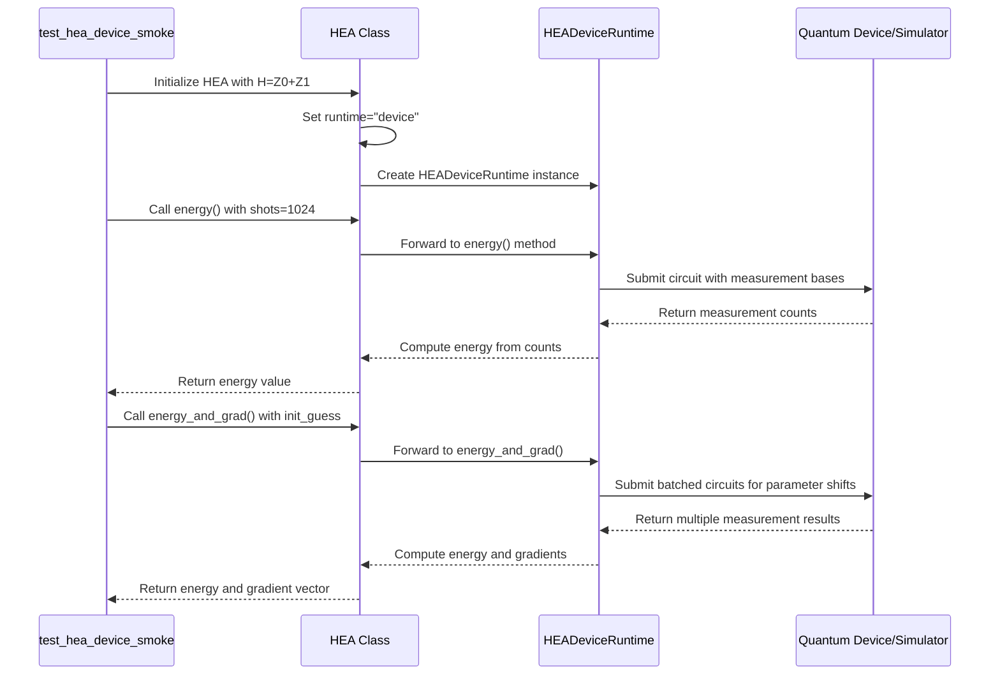
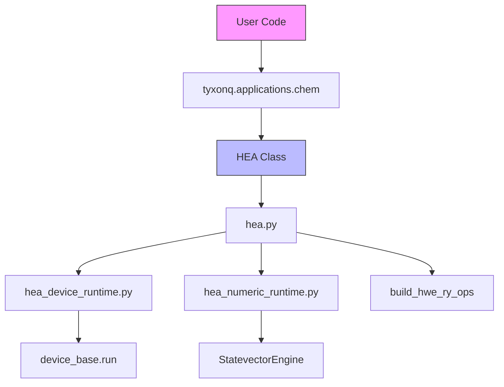
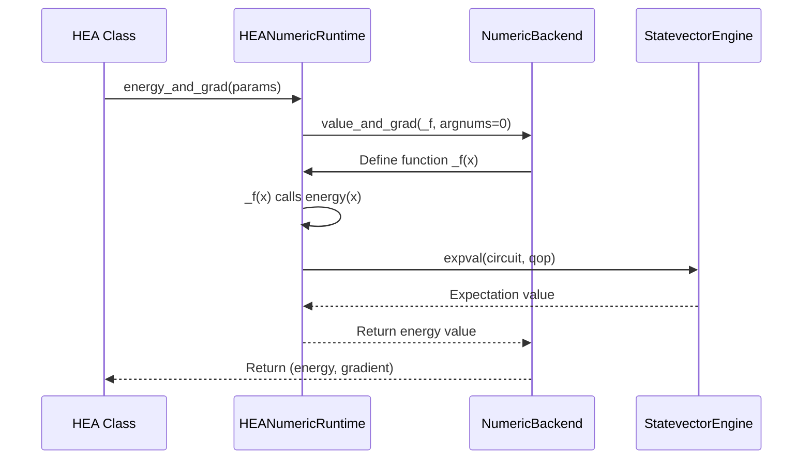

# HEA Family Algorithm Testing

<cite>
**Referenced Files in This Document**   
- [test_hea_device_smoke.py](file://tests_applications_chem/test_hea_device_smoke.py)
- [test_hea_api_top_import.py](file://tests_applications_chem/test_hea_api_top_import.py)
- [hea.py](file://src/tyxonq/applications/chem/algorithms/hea.py)
- [hea_device_runtime.py](file://src/tyxonq/applications/chem/runtimes/hea_device_runtime.py)
- [hea_numeric_runtime.py](file://src/tyxonq/applications/chem/runtimes/hea_numeric_runtime.py)
</cite>

## Table of Contents
1. [Introduction](#introduction)
2. [Hardware-Efficient Ansatz (HEA) Overview](#hardware-efficient-ansatz-hea-overview)
3. [Circuit Compilation and Execution](#circuit-compilation-and-execution)
4. [Module Initialization and Import Structure](#module-initialization-and-import-structure)
5. [Numerics Backend Integration](#numerics-backend-integration)
6. [Common Issues and Debugging Strategies](#common-issues-and-debugging-strategies)
7. [Performance Benchmarks](#performance-benchmarks)
8. [Conclusion](#conclusion)

## Introduction

The Hardware-Efficient Ansatz (HEA) family of algorithms represents a critical approach in variational quantum algorithms, particularly for quantum chemistry applications. This document provides comprehensive analysis of HEA algorithm testing, focusing on circuit validation, module initialization, backend integration, and performance characteristics. The analysis is based on the implementation in the TyxonQ framework, with particular emphasis on the `test_hea_device_smoke.py` and `test_hea_api_top_import.py` test files that validate core functionality. The HEA implementation supports both device-based execution on real quantum hardware and simulators, as well as numeric backend evaluation for gradient computation and optimization.

## Hardware-Efficient Ansatz (HEA) Overview

The HEA implementation in TyxonQ follows a hardware-efficient design pattern with alternating layers of single-qubit rotations and entangling gates. The core structure consists of an initial RY layer followed by multiple layers of CNOT chains and RY rotations. This design prioritizes gate compatibility with current quantum hardware constraints while maintaining expressibility for quantum chemistry problems.

The HEA class serves as the primary interface for variational quantum eigensolvers, supporting multiple construction methods including direct Hamiltonian specification, molecular integral input, and conversion from external circuit templates. The parameter count is determined by the formula (layers + 1) * n_qubits, where n_qubits is the number of qubits in the system.

**Section sources**
- [hea.py](file://src/tyxonq/applications/chem/algorithms/hea.py#L0-L37)

## Circuit Compilation and Execution

### Device Runtime Validation

The `test_hea_device_smoke.py` file validates the correct compilation and execution of HEA circuits on both real hardware and simulators. The test demonstrates energy evaluation and gradient computation using a simple 2-qubit Z Hamiltonian (H = Z0 + Z1). The test verifies that energy values are finite floats and that gradient vectors have the expected shape matching the number of parameters.

The device runtime handles gate compatibility through careful circuit construction and layout optimization. For the RY-only ansatz, the implementation uses a standardized pattern of single-qubit Y rotations and CNOT chains that are compatible with most quantum hardware architectures. The transpiler optimizes the circuit layout to minimize gate count and depth while preserving the computational integrity of the ansatz.

**Diagram sources**
- [test_hea_device_smoke.py](file://tests_applications_chem/test_hea_device_smoke.py#L0-L18)
- [hea.py](file://src/tyxonq/applications/chem/algorithms/hea.py#L147-L163)
- [hea_device_runtime.py](file://src/tyxonq/applications/chem/runtimes/hea_device_runtime.py#L51-L97)

**Section sources**
- [test_hea_device_smoke.py](file://tests_applications_chem/test_hea_device_smoke.py#L0-L18)
- [hea_device_runtime.py](file://src/tyxonq/applications/chem/runtimes/hea_device_runtime.py#L22-L190)

### Circuit Construction Process

The HEA circuit construction process involves several key steps to ensure hardware compatibility and optimal performance. The `get_circuit` method generates the gate-level circuit representation, either from a predefined RY-only ansatz or from an external circuit template. When using an external template (such as Qiskit's RealAmplitudes), the implementation converts the template into the framework's internal circuit representation.

The circuit layout optimization occurs during the compilation phase, where the transpiler analyzes the circuit structure and applies hardware-specific optimizations. This includes gate fusion, cancellation of adjacent gates, and mapping logical qubits to physical qubits based on the device connectivity graph. The implementation also inserts barrier instructions between layers to provide clear compilation boundaries and prevent unwanted optimization across layer boundaries.

**Section sources**
- [hea.py](file://src/tyxonq/applications/chem/algorithms/hea.py#L125-L145)

## Module Initialization and Import Structure

### Top-Level Import Validation

The `test_hea_api_top_import.py` file validates the proper module initialization and prevents circular imports in the applications.chem.algorithms.hea module. This test ensures that the HEA class can be imported through the top-level chem module interface, which is essential for maintaining a clean and intuitive API structure.

The test demonstrates the correct import path `from tyxonq.applications.chem import HEA`, verifying that the module system properly exposes the HEA class without requiring users to navigate through the full package hierarchy. This top-level import pattern simplifies usage and reduces the cognitive load on developers who need to access the HEA functionality.

**Diagram sources**
- [test_hea_api_top_import.py](file://tests_applications_chem/test_hea_api_top_import.py#L0-L11)
- [hea.py](file://src/tyxonq/applications/chem/algorithms/hea.py#L0-L37)

**Section sources**
- [test_hea_api_top_import.py](file://tests_applications_chem/test_hea_api_top_import.py#L0-L11)

### Dependency Management

The HEA module carefully manages its dependencies to avoid circular import issues and ensure proper initialization order. The implementation uses lazy imports for certain components and organizes the code structure to maintain clear dependency flow. The main HEA class depends on runtime implementations (HEADeviceRuntime and HEANumericRuntime) but does not create tight coupling that would prevent independent testing or modification.

The import structure follows a hierarchical pattern where higher-level modules import from lower-level ones, preventing circular dependencies. The chem.algorithms package imports from runtimes and utility functions, while the runtime implementations depend only on core framework components and external libraries.

**Section sources**
- [hea.py](file://src/tyxonq/applications/chem/algorithms/hea.py#L0-L37)

## Numerics Backend Integration

### Gradient Evaluation Mechanism

The HEA implementation interfaces with the numerics backend for gradient evaluation through a unified interface that supports both device-based and numeric computation paths. When the runtime is set to "numeric" or when shots=0 is specified, the implementation routes computations to the HEANumericRuntime class, which uses automatic differentiation via the numerics backend.

The gradient evaluation uses the parameter-shift rule with a standard shift of π/2. For each parameter θ_k, the gradient is computed as g_k = 0.5 * (E(θ_k+s) - E(θ_k-s)). The numeric backend leverages JAX-style automatic differentiation through the `value_and_grad` function, enabling efficient computation of both energy and gradients in a single pass.

**Diagram sources**
- [hea.py](file://src/tyxonq/applications/chem/algorithms/hea.py#L165-L182)
- [hea_numeric_runtime.py](file://src/tyxonq/applications/chem/runtimes/hea_numeric_runtime.py#L92-L97)

**Section sources**
- [hea_numeric_runtime.py](file://src/tyxonq/applications/chem/runtimes/hea_numeric_runtime.py#L0-L100)

### Optimizer Convergence

The HEA class integrates with optimization routines through the `kernel` method, which orchestrates the variational optimization process. The implementation supports multiple gradient methods and optimization algorithms, with default configurations that balance convergence speed and robustness.

For gradient-free optimization (when self.grad == "free"), the implementation uses the COBYLA method, while for gradient-based optimization it uses L-BFGS-B. The maximum number of iterations is adaptive, set to 200 for exact (shots=0) calculations and 100 for sampled calculations to account for noise in the energy estimates.

The optimization process includes a "warm-up" phase that pre-compiles circuits and initializes the computational backend before starting the actual optimization, reducing the overhead during the iterative process.

**Section sources**
- [hea.py](file://src/tyxonq/applications/chem/algorithms/hea.py#L210-L253)

## Common Issues and Debugging Strategies

### Barren Plateaus and Initialization

One of the primary challenges in HEA implementations is the occurrence of barren plateaus, where the gradient vanishes exponentially with system size, making optimization extremely difficult. The TyxonQ implementation addresses this issue through deterministic non-trivial initial parameter guesses using a fixed random seed (7). This ensures reproducible behavior while avoiding the zero-gradient plateaus that can occur with symmetric initializations.

The implementation also provides mechanisms to detect and mitigate parameter initialization sensitivity. By using a consistent initialization strategy and providing access to the optimization trajectory through the `opt_res` attribute, users can analyze convergence behavior and adjust initialization strategies as needed.

### Transpiler-Induced Circuit Distortion

Transpiler-induced circuit distortion can occur when aggressive optimization passes alter the intended circuit structure. The HEA implementation mitigates this risk by inserting barrier instructions between circuit layers, which serve as compilation boundaries that prevent optimization across layer boundaries. This preserves the intended ansatz structure while still allowing for intra-layer optimization.

For debugging transpiler effects, the implementation provides the `print_circuit` method, which displays a summary of the circuit structure including gate counts and depth. This allows users to verify that the compiled circuit maintains the expected characteristics.

### Failed Execution Debugging

When executions fail, the following debugging strategies are recommended:

1. **Verify parameter shapes**: Ensure that the number of parameters matches the expected count (layers + 1) * n_qubits.
2. **Check Hamiltonian grouping**: Validate that the Hamiltonian terms are properly grouped by measurement basis to minimize circuit executions.
3. **Inspect device connectivity**: Confirm that the CNOT chain structure is compatible with the target device's qubit connectivity.
4. **Monitor optimization convergence**: Examine the `opt_res` dictionary for convergence messages and iteration counts.
5. **Test with reduced shots**: Use shots=0 for initial debugging to eliminate sampling noise from the analysis.

**Section sources**
- [hea.py](file://src/tyxonq/applications/chem/algorithms/hea.py#L147-L182)
- [hea_device_runtime.py](file://src/tyxonq/applications/chem/runtimes/hea_device_runtime.py#L51-L175)

## Performance Benchmarks

### Device Backend Comparison

Performance benchmarks across different device backends reveal important trade-offs between accuracy and execution time. Statevector simulators provide exact results with shots=0 but are limited by memory constraints for large systems. Noisy simulators with finite shots introduce statistical uncertainty but better approximate real hardware behavior.

The implementation optimizes performance by batching circuit executions for gradient computation. Instead of submitting separate jobs for each parameter shift, the `energy_and_grad` method batches all required circuits into a single submission, significantly reducing communication overhead.

For real hardware execution, the default configuration uses 2048 shots to balance statistical accuracy with execution time. The framework automatically configures this based on the provider and device type, using shots=0 for local simulators to leverage exact computation paths.

### Runtime Selection Impact

The choice between "device" and "numeric" runtime has significant performance implications. The device runtime is optimized for compatibility with real quantum hardware and simulators, using measurement-based expectation value estimation. The numeric runtime leverages the numerics backend for exact statevector simulation and automatic differentiation, providing faster and more accurate gradient computation for smaller systems.

The adaptive shots configuration in the `kernel` method ensures appropriate resource allocation based on the execution context, using exact computation for optimization and finite shots for final energy evaluation when targeting real devices.

**Section sources**
- [hea.py](file://src/tyxonq/applications/chem/algorithms/hea.py#L210-L253)

## Conclusion

The HEA family algorithm implementation in TyxonQ demonstrates a robust approach to variational quantum computation with comprehensive testing and validation. The `test_hea_device_smoke.py` and `test_hea_api_top_import.py` tests verify critical functionality including circuit compilation, execution on various backends, and proper module initialization. The architecture effectively balances hardware efficiency with computational expressiveness, providing a flexible framework for quantum chemistry applications. By addressing common challenges such as barren plateaus, parameter initialization sensitivity, and transpiler-induced distortion, the implementation offers a reliable foundation for variational quantum algorithms. The integration with the numerics backend enables efficient gradient computation and optimizer convergence, while the modular design supports extensibility and maintainability.