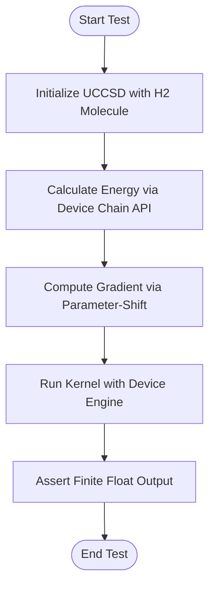
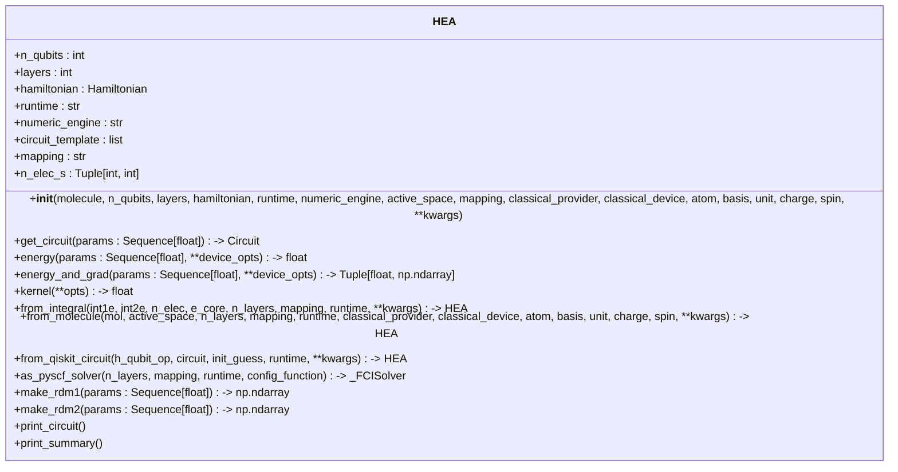
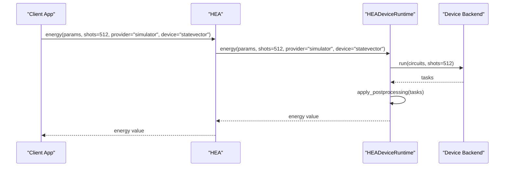
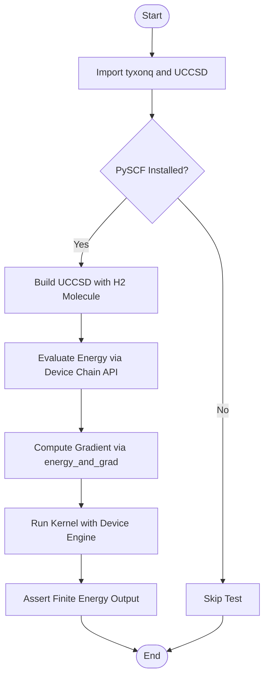

# Quantum Chemistry Application Testing

<cite>
**Referenced Files in This Document**   
- [test_uccsd_device_smoke.py](file://tests_applications_chem/test_uccsd_device_smoke.py)
- [uccsd.py](file://src/tyxonq/applications/chem/algorithms/uccsd.py)
- [ucc_device_runtime.py](file://src/tyxonq/applications/chem/runtimes/ucc_device_runtime.py)
- [hea.py](file://src/tyxonq/applications/chem/algorithms/hea.py)
- [hea_device_runtime.py](file://src/tyxonq/applications/chem/runtimes/hea_device_runtime.py)
- [test_hea_api_top_import.py](file://tests_applications_chem/test_hea_api_top_import.py)
</cite>

## Table of Contents
1. [Introduction](#introduction)
2. [Smoke Testing for UCCSD and HEA Implementations](#smoke-testing-for-uccsd-and-hea-implementations)
3. [API Import Validation and Module Loading](#api-import-validation-and-module-loading)
4. [Device Runtime Testing for UCC and HEA Algorithms](#device-runtime-testing-for-ucc-and-hea-algorithms)
5. [Quantum Chemistry Workflow Validation](#quantum-chemistry-workflow-validation)
6. [Common Issues in Quantum Chemistry Applications](#common-issues-in-quantum-chemistry-applications)
7. [Conclusion](#conclusion)

## Introduction
This document provides a comprehensive overview of testing methodologies for quantum chemistry applications, with a focus on verifying the correctness of domain-specific algorithms such as Unitary Coupled Cluster Singles and Doubles (UCCSD) and Hardware-Efficient Ansatz (HEA). The testing framework ensures proper integration with device runtimes, validates API imports to prevent circular dependencies, and confirms compatibility across hardware and simulator execution paths. Special attention is given to smoke tests that validate end-to-end workflows from molecule definition to energy calculation, using `test_uccsd_device_smoke.py` as a primary example.

**Section sources**
- [test_uccsd_device_smoke.py](file://tests_applications_chem/test_uccsd_device_smoke.py#L1-L40)
- [test_hea_api_top_import.py](file://tests_applications_chem/test_hea_api_top_import.py#L1-L11)

## Smoke Testing for UCCSD and HEA Implementations

Smoke tests are essential for validating the basic functionality of UCCSD and HEA implementations. These tests ensure that the algorithms can be initialized, executed, and produce expected outputs under minimal conditions.

For UCCSD, the smoke test `test_uccsd_energy_device_h2_smoke` verifies the energy calculation for a hydrogen molecule (H2) using a device-based runtime. The test checks that the energy value is a finite float within a chemically reasonable range and that gradients can be computed via parameter-shift methods. It also confirms that the kernel method executes successfully when configured with a device engine.

For HEA, the smoke test `test_hea_top_import_smoke` validates the top-level import of the HEA class and ensures that energy calculations can be performed on a simple Hamiltonian using a simulator backend. This test confirms that the HEA implementation integrates correctly with the device runtime and produces finite energy values.

**Diagram sources**
- [test_uccsd_device_smoke.py](file://tests_applications_chem/test_uccsd_device_smoke.py#L15-L40)

**Section sources**
- [test_uccsd_device_smoke.py](file://tests_applications_chem/test_uccsd_device_smoke.py#L15-L40)
- [test_hea_api_top_import.py](file://tests_applications_chem/test_hea_api_top_import.py#L5-L11)

## API Import Validation and Module Loading

Proper API import validation is critical to prevent circular dependencies and module loading failures. The HEA implementation demonstrates correct import practices by importing necessary components from `tyxonq.applications.chem` and other modules without creating circular references.

The `HEA` class is designed to support both direct initialization from molecular data and construction from external parameterized circuits. It uses conditional imports and lazy initialization to avoid unnecessary dependencies. For example, the `from_qiskit_circuit` method allows integration with Qiskit circuits without requiring Qiskit as a hard dependency.

**Diagram sources**
- [hea.py](file://src/tyxonq/applications/chem/algorithms/hea.py#L1-L658)

**Section sources**
- [hea.py](file://src/tyxonq/applications/chem/algorithms/hea.py#L1-L658)

## Device Runtime Testing for UCC and HEA Algorithms

Device runtime testing ensures that UCC and HEA algorithms can execute on both hardware and simulator backends. The `UCCDeviceRuntime` and `HEADeviceRuntime` classes encapsulate the logic for running energy and gradient calculations on device backends.

The `UCCDeviceRuntime` class supports Hartree-Fock initial states and configurable excitation operators. It uses parameter-shift methods to compute gradients and groups Hamiltonian terms to minimize measurement overhead. The runtime is designed to work with both simulator and hardware providers, allowing for flexible testing across different execution environments.

Similarly, the `HEADeviceRuntime` class supports RY-only ansatz circuits and can consume external circuit templates. It implements parameter-shift gradients and supports both grouped measurements for shot-based execution and analytic expectations for statevector simulations.

**Diagram sources**
- [hea_device_runtime.py](file://src/tyxonq/applications/chem/runtimes/hea_device_runtime.py#L1-L192)
- [ucc_device_runtime.py](file://src/tyxonq/applications/chem/runtimes/ucc_device_runtime.py#L1-L304)

**Section sources**
- [hea_device_runtime.py](file://src/tyxonq/applications/chem/runtimes/hea_device_runtime.py#L1-L192)
- [ucc_device_runtime.py](file://src/tyxonq/applications/chem/runtimes/ucc_device_runtime.py#L1-L304)

## Quantum Chemistry Workflow Validation

The `test_uccsd_device_smoke.py` file illustrates how quantum chemistry workflows are validated from molecule definition to energy calculation. The test begins by importing the necessary modules and checking for the presence of PySCF. If PySCF is available, it proceeds to build a UCCSD instance with a preset H2 molecule.

The energy is then evaluated using the device chain API with a specified number of shots and a simulator backend. The test also verifies that gradients can be computed via the `energy_and_grad` method and that the kernel method executes successfully when configured with a device engine.

This workflow ensures that all components of the quantum chemistry pipeline work together correctly, from molecular input to final energy output. It also validates that the device runtime can handle both energy and gradient calculations, which are essential for variational algorithms.

**Diagram sources**
- [test_uccsd_device_smoke.py](file://tests_applications_chem/test_uccsd_device_smoke.py#L15-L40)

**Section sources**
- [test_uccsd_device_smoke.py](file://tests_applications_chem/test_uccsd_device_smoke.py#L15-L40)

## Common Issues in Quantum Chemistry Applications

Several common issues can arise in quantum chemistry applications, including convergence failures, incorrect Hamiltonian mappings, and runtime configuration mismatches.

Convergence failures may occur when the initial parameter guess is not suitable for the optimization algorithm. The UCCSD implementation addresses this by allowing different initialization methods such as MP2, CCSD, or zero initialization.

Incorrect Hamiltonian mappings can lead to inaccurate energy calculations. The HEA implementation supports multiple mapping schemes (parity, Jordan-Wigner, Bravyi-Kitaev) and ensures that the mapping is consistent with the molecular data.

Runtime configuration mismatches can cause execution failures. The device runtime classes validate input parameters and provide clear error messages when configurations are incompatible. For example, the `UCCDeviceRuntime` checks that the number of parameters matches the number of excitation operators.

**Section sources**
- [uccsd.py](file://src/tyxonq/applications/chem/algorithms/uccsd.py#L1-L337)
- [hea.py](file://src/tyxonq/applications/chem/algorithms/hea.py#L1-L658)

## Conclusion
This document has outlined the key aspects of testing quantum chemistry applications, focusing on UCCSD and HEA implementations. Smoke tests ensure basic functionality, API import validation prevents circular dependencies, and device runtime testing confirms compatibility across execution environments. The `test_uccsd_device_smoke.py` file provides a concrete example of how quantum chemistry workflows are validated from molecule definition to energy calculation. By addressing common issues such as convergence failures, incorrect Hamiltonian mappings, and runtime configuration mismatches, this testing framework ensures the reliability and correctness of quantum chemistry algorithms.