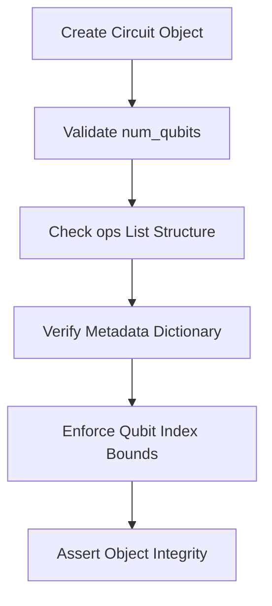
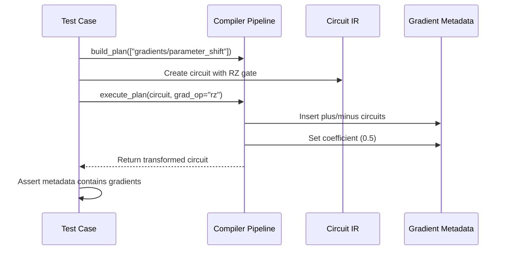
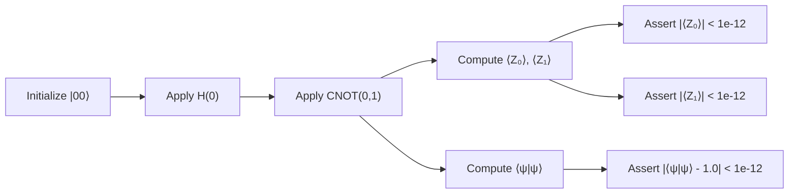
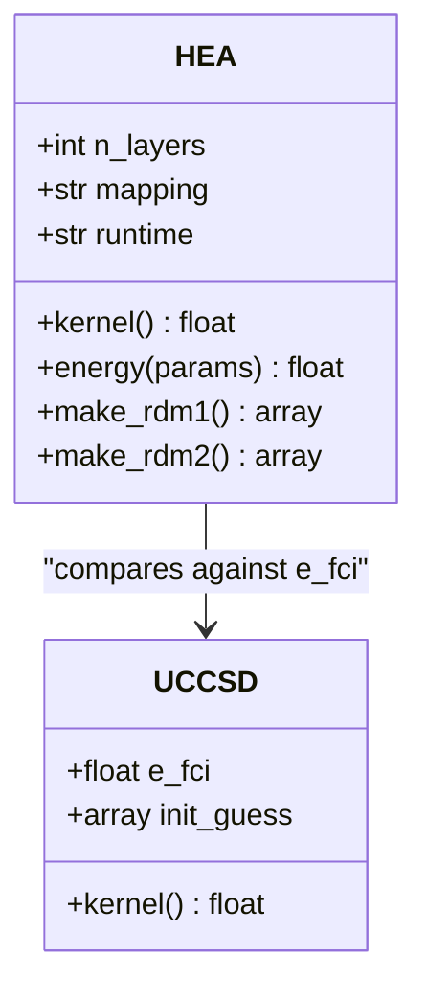
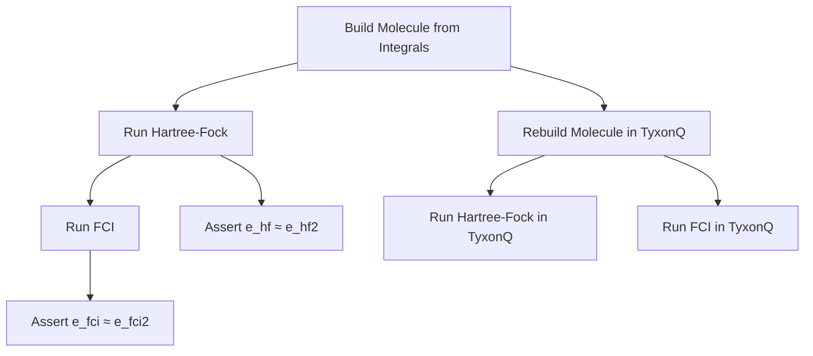
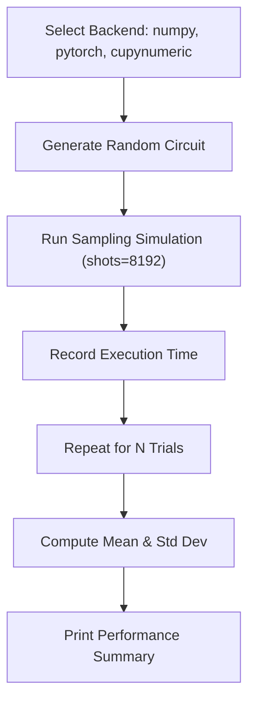

# Testing and Validation

<cite>
**Referenced Files in This Document**   
- [test_core_ir.py](file://tests_core_module/test_core_ir.py)
- [test_compiler_pipeline.py](file://tests_core_module/test_compiler_pipeline.py)
- [test_devices_simulators_gates.py](file://tests_core_module/test_devices_simulators_gates.py)
- [test_uccsd_device_smoke.py](file://tests_applications_chem/test_uccsd_device_smoke.py)
- [test_molecule.py](file://tests_mol_valid/test_molecule.py)
- [test_hamiltonian.py](file://tests_mol_valid/test_hamiltonian.py)
- [test_hea.py](file://tests_mol_valid/test_hea.py)
- [test_ucc_uccsd_runtime.py](file://tests_mol_valid/test_ucc_uccsd_runtime.py)
- [gradient_benchmark.py](file://examples/gradient_benchmark.py)
- [sample_benchmark.py](file://examples/sample_benchmark.py)
- [CONTRIBUTING.md](file://CONTRIBUTING.md)
</cite>

## Table of Contents
1. [Introduction](#introduction)
2. [Test Organization by Component](#test-organization-by-component)
3. [Testing Strategies for Core Functionality](#testing-strategies-for-core-functionality)
4. [Chemistry Application Tests](#chemistry-application-tests)
5. [Molecular Validity Checks](#molecular-validity-checks)
6. [Benchmarking Practices](#benchmarking-practices)
7. [Guidelines for Contributors](#guidelines-for-contributors)
8. [Continuous Integration and Performance Regression Tracking](#continuous-integration-and-performance-regression-tracking)

## Introduction
This document provides a comprehensive overview of the testing and validation framework within the TyxonQ quantum computing platform. It details the structure, strategies, and methodologies used to ensure software quality across core modules, chemistry applications, and device integrations. The testing suite emphasizes correctness, numerical accuracy, and performance consistency through unit tests, smoke tests, and benchmarking tools. Special attention is given to validating quantum chemistry algorithms and their convergence against known physical and computational standards.

## Test Organization by Component

The test suite is organized into modular components that align with the functional architecture of TyxonQ. Each test module targets specific subsystems, enabling focused validation and easier debugging. The primary test categories include core module verification, example-based validation, chemistry-specific application testing, and molecular property correctness checks.

### Core Module Tests
Core functionality is validated through a dedicated test suite located in `tests_core_module/`. These tests ensure the integrity of fundamental components such as the intermediate representation (IR), compiler pipeline, and simulator kernels. For instance, `test_core_ir.py` verifies the correct construction and metadata handling of quantum circuits and Hamiltonians, while `test_compiler_pipeline.py` confirms that compilation stages execute as expected and preserve circuit semantics.

**Section sources**
- [test_core_ir.py](file://tests_core_module/test_core_ir.py#L0-L26)
- [test_compiler_pipeline.py](file://tests_core_module/test_compiler_pipeline.py#L0-L33)

### Example Validations
Example scripts in the `examples/` directory are paired with corresponding test files in `tests_examples/` to ensure that tutorial and demonstration code remains functional and accurate. These tests validate end-to-end execution of example workflows, including gradient computation, circuit compilation, and VQE benchmarks, ensuring that users can reliably reproduce results from documentation and tutorials.

### Chemistry Application Tests
Chemistry-specific functionality is tested in `tests_applications_chem/`, where smoke tests verify the integration of quantum algorithms with external computational chemistry libraries like PySCF. These tests confirm that energy evaluations, gradient computations, and optimization kernels function correctly when interfacing with real molecular data.

**Section sources**
- [test_uccsd_device_smoke.py](file://tests_applications_chem/test_uccsd_device_smoke.py#L0-L40)

### Molecular Validity Checks
The `tests_mol_valid/` directory contains rigorous validation of molecular modeling components, including molecule construction, Hamiltonian generation, and wavefunction ansatz correctness. These tests compare computed energies and reduced density matrices against reference values from established quantum chemistry methods such as Full Configuration Interaction (FCI).

**Section sources**
- [test_molecule.py](file://tests_mol_valid/test_molecule.py#L0-L43)
- [test_hamiltonian.py](file://tests_mol_valid/test_hamiltonian.py#L0-L76)

## Testing Strategies for Core Functionality

### IR Correctness (test_core_ir.py)
The intermediate representation (IR) forms the foundation of quantum program manipulation in TyxonQ. Tests in `test_core_ir.py` validate that `Circuit` and `Hamiltonian` objects are correctly instantiated, maintain proper metadata, and enforce qubit index bounds. These tests ensure structural integrity before circuits proceed to compilation or simulation.

**Diagram sources**
- [test_core_ir.py](file://tests_core_module/test_core_ir.py#L0-L26)

### Compiler Transformations (test_compiler_pipeline.py)
Compiler correctness is verified through pipeline execution tests that simulate multi-stage transformations. The `build_plan` function constructs a sequence of compilation stages (e.g., decomposition, measurement rewriting, scheduling), and tests confirm that these stages can be executed without errors. A key test validates that the parameter-shift gradient stage correctly modifies circuit metadata to include plus/minus perturbed circuits and gradient coefficients.

**Diagram sources**
- [test_compiler_pipeline.py](file://tests_core_module/test_compiler_pipeline.py#L0-L33)

### Device Integration (test_devices_simulators_gates.py)
Low-level quantum gate operations are validated using statevector simulations. The test `test_bell_state_construction_and_expectations` constructs a Bell state using Hadamard and CNOT gates, then verifies that the resulting state has zero expectation value for Pauli-Z on both qubits and unit norm—key properties of the |Φ⁺⟩ state.

**Diagram sources**
- [test_devices_simulators_gates.py](file://tests_core_module/test_devices_simulators_gates.py#L0-L32)

### Application Accuracy (test_uccsd_device_smoke.py)
Quantum chemistry applications are validated through smoke tests that execute UCCSD energy calculations on small molecules like H₂. These tests confirm that the device-based execution path produces finite energies within chemically reasonable ranges and that gradient computations return properly shaped arrays. They also verify that the optimization kernel runs to completion.

**Section sources**
- [test_uccsd_device_smoke.py](file://tests_applications_chem/test_uccsd_device_smoke.py#L0-L40)

## Chemistry Application Tests

Chemistry tests focus on algorithmic correctness and convergence. The `test_hea.py` suite evaluates the HEA (Hardware-Efficient Ansatz) implementation by comparing optimized energies against FCI references across various configurations, including different qubit mappings (Jordan-Wigner, Parity, Bravyi-Kitaev) and runtime backends (device vs numeric).

**Diagram sources**
- [test_hea.py](file://tests_mol_valid/test_hea.py#L0-L214)

These tests also validate reduced density matrices (1-RDM, 2-RDM) against gold-standard values, ensuring that not only energies but also derived molecular properties are accurate.

**Section sources**
- [test_hea.py](file://tests_mol_valid/test_hea.py#L0-L214)
- [test_ucc_uccsd_runtime.py](file://tests_mol_valid/test_ucc_uccsd_runtime.py#L0-L291)

## Molecular Validity Checks

Molecular validity is ensured through rigorous numerical comparisons. The `test_molecule.py` file validates that molecule objects constructed from integrals reproduce Hartree-Fock and FCI energies from PySCF. Similarly, `test_hamiltonian.py` confirms that generated Hamiltonians yield correct ground-state energies under various encodings (fermion, qubit, HCB).

**Diagram sources**
- [test_molecule.py](file://tests_mol_valid/test_molecule.py#L0-L43)

**Section sources**
- [test_molecule.py](file://tests_mol_valid/test_molecule.py#L0-L43)
- [test_hamiltonian.py](file://tests_mol_valid/test_hamiltonian.py#L0-L76)

## Benchmarking Practices

Performance and scalability are evaluated using benchmark scripts in the `examples/` directory.

### Gradient Benchmarking (gradient_benchmark.py)
The `gradient_benchmark.py` script compares gradient computation times across different methods:
- **TyxonQ (counts + parameter-shift)**: Uses shot-based expectation estimation
- **TyxonQ (statevector + finite difference)**: Direct state simulation for QFI
- **TyxonQ (PyTorch autograd)**: Automatic differentiation via PyTorch backend
- **Qiskit (optional)**: Comparison with Qiskit's opflow gradient tools when available

The benchmark measures both staging (circuit construction) and execution time over multiple trials, reporting results in JSON format for analysis.

**Section sources**
- [gradient_benchmark.py](file://examples/gradient_benchmark.py#L0-L319)

### Sampling Benchmarking (sample_benchmark.py)
The `sample_benchmark.py` script evaluates sampling performance across numerical backends (NumPy, PyTorch, CuPyNumeric). It constructs random circuits with variable depth and qubit count, then measures execution time for repeated sampling runs. This helps identify backend-specific performance characteristics and scalability limits.

**Diagram sources**
- [sample_benchmark.py](file://examples/sample_benchmark.py#L0-L90)

**Section sources**
- [sample_benchmark.py](file://examples/sample_benchmark.py#L0-L90)

## Guidelines for Contributors

Contributors are directed to follow best practices for writing effective tests, as outlined in `CONTRIBUTING.md`. Tests should:
- Be self-contained and deterministic
- Use appropriate numerical tolerances (e.g., `atol=1e-6`)
- Cover both nominal and edge cases
- Include assertions on shapes, types, and physical consistency
- Leverage parametrization to test multiple configurations
- Avoid hard-coded values in favor of computed references

When adding new features, contributors must provide corresponding tests that validate correctness and integration with existing components.

**Section sources**
- [CONTRIBUTING.md](file://CONTRIBUTING.md#L0-L4)

## Continuous Integration and Performance Regression Tracking

The test suite is integrated into a CI/CD pipeline that executes on every pull request. Core module tests run quickly to provide fast feedback, while chemistry and benchmarking tests may be scheduled separately due to external dependencies (e.g., PySCF). Performance benchmarks are tracked over time to detect regressions in critical paths such as gradient computation and circuit sampling. Results from `gradient_benchmark.py` and `sample_benchmark.py` are logged and compared across versions to ensure sustained performance.