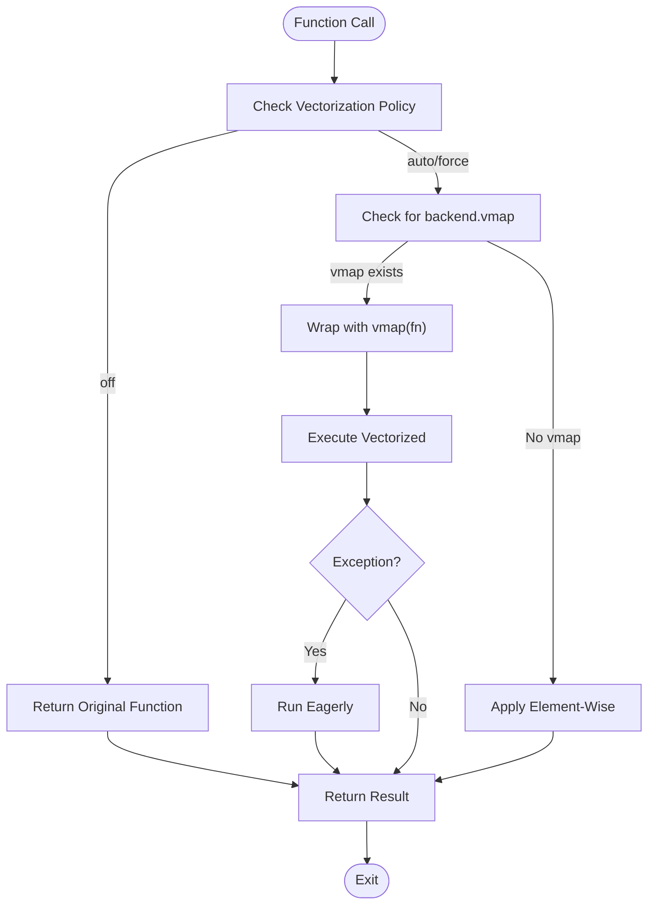

# Vectorization Framework

<cite>
**Referenced Files in This Document**   
- [api.py](file://src/tyxonq/numerics/api.py)
- [config.py](file://src/tyxonq/config.py)
- [vectorization_checks.py](file://src/tyxonq/numerics/vectorization_checks.py)
- [test_numerics_api.py](file://tests_core_module/test_numerics_api.py)
- [numerics.rst](file://docs-ng/source/next/user/numerics.rst)
</cite>

## Table of Contents
1. [Introduction](#introduction)
2. [Core Components](#core-components)
3. [Vectorization Policy Modes](#vectorization-policy-modes)
4. [Backend-Specific Vectorization and Fallback Mechanism](#backend-specific-vectorization-and-fallback-mechanism)
5. [Error Handling and Execution Degradation](#error-handling-and-execution-degradation)
6. [Enable Checks and Safety Validation](#enable-checks-and-safety-validation)
7. [Performance Implications and Use Cases](#performance-implications-and-use-cases)
8. [Best Practices for Policy Selection](#best-practices-for-policy-selection)

## Introduction
The vectorization framework in TyxonQ provides a robust mechanism for executing quantum computations efficiently across different hardware and software backends. Central to this framework is the `vectorize_or_fallback()` function, which enables batched computation by leveraging backend-specific vectorization capabilities when available and gracefully degrading to element-wise processing otherwise. This document details the architecture, behavior, and usage patterns of the vectorization system, focusing on the `VectorizationPolicy` enum, execution strategies, error handling, and performance considerations.

**Section sources**
- [numerics.rst](file://docs-ng/source/next/user/numerics.rst#L1-L3)

## Core Components

The core of the vectorization framework revolves around the `vectorize_or_fallback()` function defined in the numerics API. This higher-order function wraps any callable to enable vectorized execution based on the provided backend and policy settings. It supports three distinct vectorization policies: "auto", "force", and "off", each dictating how vectorization attempts are made.

The framework relies on the `ArrayBackend` protocol, which defines a unified interface for array/tensor operations across different numerical backends such as NumPy, PyTorch, and CuPyNumeric. The presence or absence of a `vmap` method in the backend implementation determines whether native vectorization can be utilized.

**Section sources**
- [api.py](file://src/tyxonq/numerics/api.py#L104-L156)
- [config.py](file://src/tyxonq/config.py#L39-L44)

## Vectorization Policy Modes

The `VectorizationPolicy` enum specifies the strategy used by `vectorize_or_fallback()` to handle vectorization. It accepts three string values: `"auto"`, `"force"`, and `"off"`, each with distinct behavioral implications:

- **"off"**: Disables vectorization entirely. The original function is returned without modification, ensuring eager execution for every call.
- **"auto"**: Attempts to use backend-provided `vmap()` if available. If not present or if vectorization fails, it falls back to generic element-wise processing.
- **"force"**: Requires vectorization through `vmap()`. If the backend does not support `vmap`, the function will still attempt vectorized execution but may fall back only on exception.

These policies allow users to balance performance, compatibility, and debugging needs depending on their environment and requirements.

**Section sources**
- [api.py](file://src/tyxonq/numerics/api.py#L104-L156)
- [config.py](file://src/tyxonq/config.py#L39-L44)

## Backend-Specific Vectorization and Fallback Mechanism

The `vectorize_or_fallback()` function first checks the `policy` parameter. If set to `"off"`, it immediately returns the unmodified function. Otherwise, it inspects the `backend` object for a callable `vmap` attribute. Backends like PyTorch that implement JAX-style vectorization via `vmap` can thus be leveraged for efficient batched operations.

When a backend supports `vmap`, the wrapper attempts to apply it to the input function. If `vmap` is unavailable (e.g., in basic NumPy), the framework employs a generic fallback strategy: it iterates over the leading axis of the first argument (assuming it's a sequence) and applies the function element-wise. This ensures that vectorization semantics are preserved even on backends lacking native support.

**Diagram sources**
- [api.py](file://src/tyxonq/numerics/api.py#L104-L156)

**Section sources**
- [api.py](file://src/tyxonq/numerics/api.py#L104-L156)

## Error Handling and Execution Degradation

The framework implements a resilient error-handling mechanism. When using `"auto"` or `"force"` policies and a backend-provided `vmap` is available, any exception during vectorized execution triggers an automatic fallback to eager (element-wise) mode. This ensures that programs do not fail due to unsupported vectorization patterns while still benefiting from performance gains when possible.

This degradation is silent by default but can be enhanced with logging if the backend provides diagnostic capabilities. The fallback behavior maintains functional correctness at the cost of performance, making it ideal for development and testing scenarios where robustness is prioritized over speed.

**Section sources**
- [api.py](file://src/tyxonq/numerics/api.py#L104-L156)

## Enable Checks and Safety Validation

The `enable_checks` parameter in `vectorize_or_fallback()` is currently a placeholder for future safety validation features. Although not yet fully implemented, its intended purpose is to perform pre-vectorization checks to detect potentially unsafe operations—such as in-place modifications or tensor aliasing—that could lead to incorrect gradients or memory issues under vectorization.

A supporting utility, `safe_for_vectorization()`, already exists in `vectorization_checks.py` and uses warning interception to determine whether a function emits signals of unsafe behavior (e.g., "AliasWarning"). In future versions, this could be integrated directly into the `vectorize_or_fallback()` logic when `enable_checks=True`, allowing proactive rejection or transformation of unsafe functions before vectorization.

**Section sources**
- [api.py](file://src/tyxonq/numerics/api.py#L104-L156)
- [vectorization_checks.py](file://src/tyxonq/numerics/vectorization_checks.py#L1-L55)

## Performance Implications and Use Cases

The vectorization framework delivers significant performance improvements for parameterized quantum circuits evaluated over multiple input configurations. For example, when computing expectation values across a batch of parameters, using a backend with `vmap` (like PyTorch) enables parallelized execution across the batch dimension, reducing overhead from repeated compilation or interpretation.

Examples in the codebase, such as `matprod_vmap.py` and `vmap_randomness.py`, demonstrate how `vmap` can accelerate matrix operations and stochastic simulations. In benchmarks, vectorized execution has shown substantial reductions in per-call latency, especially when combined with JIT compilation.

However, the performance benefit depends heavily on the backend and workload structure. For small batches or non-differentiable workflows, the overhead of vectorization setup may outweigh gains, making `"auto"` or even `"off"` preferable in certain cases.

**Section sources**
- [matprod_vmap.py](file://examples-ng/matprod_vmap.py#L1-L41)
- [vmap_randomness.py](file://examples-ng/vmap_randomness.py#L1-L26)
- [api.py](file://src/tyxonq/numerics/api.py#L104-L156)

## Best Practices for Policy Selection

Choosing the appropriate `VectorizationPolicy` depends on the context:

- **Production Environments**: Use `"auto"` for optimal balance between performance and reliability. It leverages vectorization when beneficial and falls back safely when necessary.
- **Development and Debugging**: Consider `"off"` to disable vectorization and simplify tracing, debugging, and gradient checking.
- **High-Performance Workloads**: Use `"force"` only when you are certain the backend supports `vmap` and the functions are proven safe for vectorization.

Additionally, monitoring execution paths and profiling performance with and without vectorization can guide policy decisions. Future enhancements involving `enable_checks` may further automate safe policy selection based on runtime analysis.

**Section sources**
- [api.py](file://src/tyxonq/numerics/api.py#L104-L156)
- [vectorization_checks.py](file://src/tyxonq/numerics/vectorization_checks.py#L1-L55)