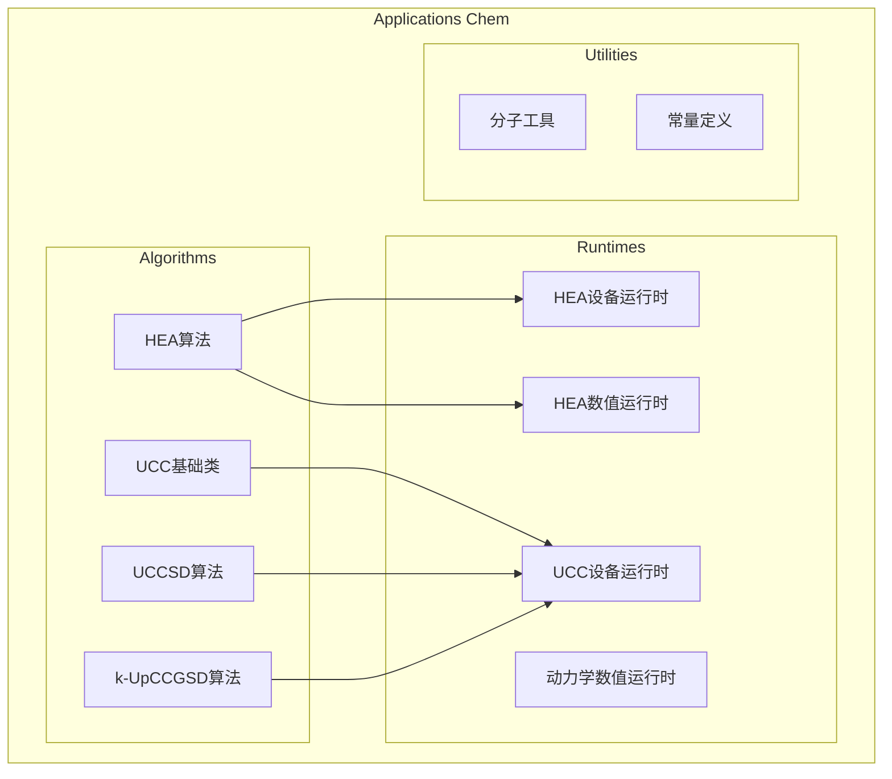
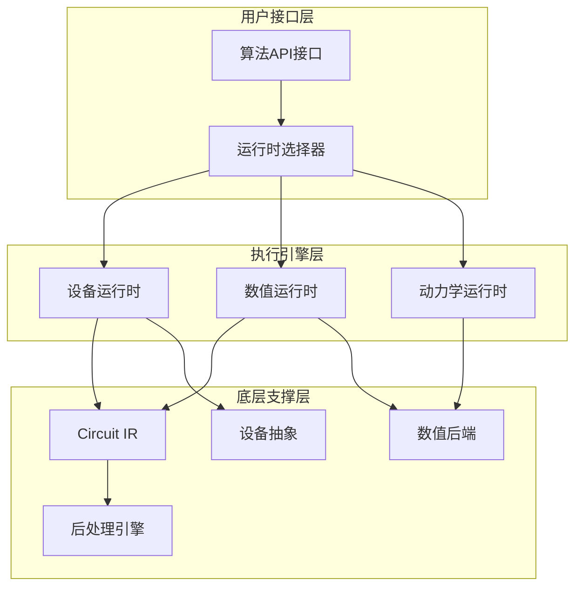
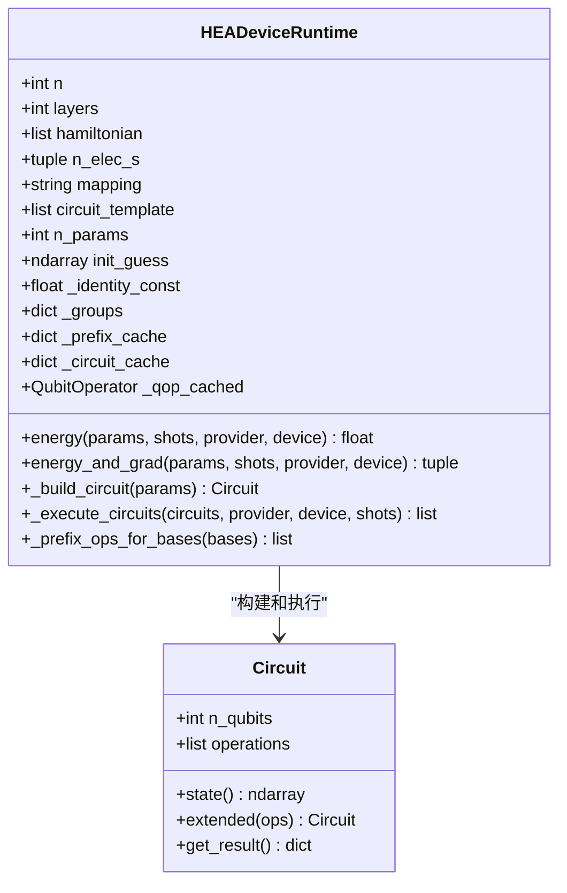
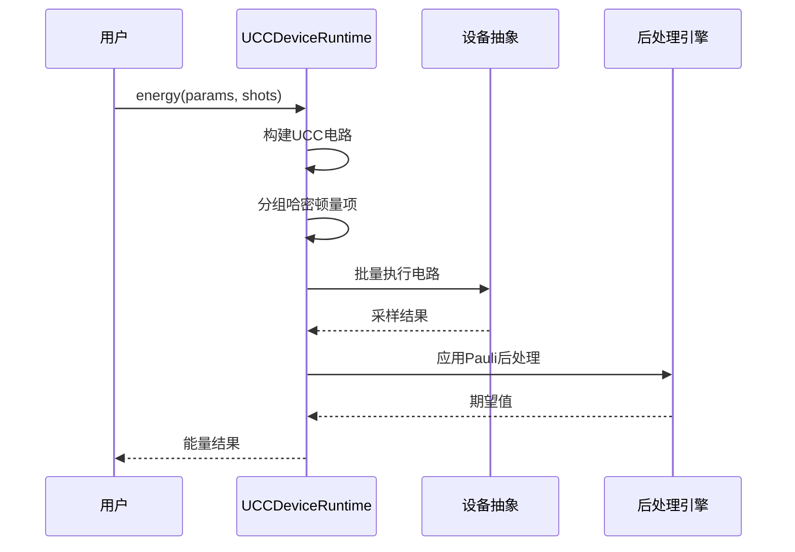
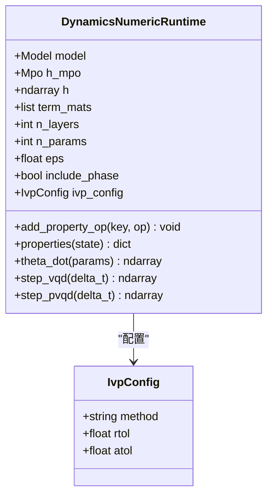
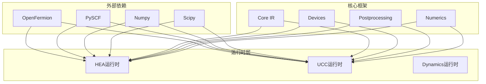

# Applications Chem Runtimes

<cite>
**本文档引用的文件**
- [src/tyxonq/applications/chem/__init__.py](file://src/tyxonq/applications/chem/__init__.py)
- [src/tyxonq/applications/chem/runtimes/__init__.py](file://src/tyxonq/applications/chem/runtimes/__init__.py)
- [src/tyxonq/applications/chem/runtimes/hea_device_runtime.py](file://src/tyxonq/applications/chem/runtimes/hea_device_runtime.py)
- [src/tyxonq/applications/chem/runtimes/ucc_device_runtime.py](file://src/tyxonq/applications/chem/runtimes/ucc_device_runtime.py)
- [src/tyxonq/applications/chem/runtimes/hea_numeric_runtime.py](file://src/tyxonq/applications/chem/runtimes/hea_numeric_runtime.py)
- [src/tyxonq/applications/chem/runtimes/dynamics_numeric.py](file://src/tyxonq/applications/chem/runtimes/dynamics_numeric.py)
- [src/tyxonq/applications/chem/algorithms/hea.py](file://src/tyxonq/applications/chem/algorithms/hea.py)
- [src/tyxonq/applications/chem/algorithms/ucc.py](file://src/tyxonq/applications/chem/algorithms/ucc.py)
- [src/tyxonq/applications/chem/algorithms/uccsd.py](file://src/tyxonq/applications/chem/algorithms/uccsd.py)
- [src/tyxonq/applications/chem/algorithms/kupccgsd.py](file://src/tyxonq/applications/chem/algorithms/kupccgsd.py)
- [src/tyxonq/applications/chem/molecule.py](file://src/tyxonq/applications/chem/molecule.py)
- [src/tyxonq/applications/chem/constants.py](file://src/tyxonq/applications/chem/constants.py)
- [tests_applications_chem/test_hea_device_smoke.py](file://tests_applications_chn/test_hea_device_smoke.py)
- [tests_applications_chem/test_ucc_device_runtime_smoke.py](file://tests_applications_chem/test_ucc_device_runtime_smoke.py)
</cite>

## 目录
1. [简介](#简介)
2. [项目结构](#项目结构)
3. [核心组件](#核心组件)
4. [架构概览](#架构概览)
5. [详细组件分析](#详细组件分析)
6. [依赖关系分析](#依赖关系分析)
7. [性能考虑](#性能考虑)
8. [故障排除指南](#故障排除指南)
9. [结论](#结论)

## 简介

Applications Chem Runtimes 是 TyxonQ 量子化学应用框架的核心执行引擎，负责在不同硬件和数值环境中运行量子化学算法。该模块提供了多种运行时环境，包括设备运行时（支持真实量子硬件和模拟器）、数值运行时（精确状态向量模拟）和动力学运行时（时间演化计算）。

该运行时系统支持多种量子化学算法，包括硬件高效Ansatz（HEA）、通用单激发耦合簇（UCC）及其变体（UCCSD、k-UpCCGSD、PUCCD），并提供了灵活的执行策略选择机制。

## 项目结构

Applications Chem Runtimes 模块采用清晰的层次化组织结构：

**图表来源**
- [src/tyxonq/applications/chem/__init__.py](file://src/tyxonq/applications/chem/__init__.py#L29-L102)
- [src/tyxonq/applications/chem/runtimes/__init__.py](file://src/tyxonq/applications/chem/runtimes/__init__.py#L1-L9)

**章节来源**
- [src/tyxonq/applications/chem/__init__.py](file://src/tyxonq/applications/chem/__init__.py#L1-L103)
- [src/tyxonq/applications/chem/runtimes/__init__.py](file://src/tyxonq/applications/chem/runtimes/__init__.py#L1-L9)

## 核心组件

Applications Chem Runtimes 包含以下核心组件：

### 1. 设备运行时（Device Runtimes）

设备运行时负责在真实量子硬件或模拟器上执行量子电路，支持采样计数和统计分析：

- **HEADeviceRuntime**: 硬件高效Ansatz的设备运行时
- **UCCDeviceRuntime**: UCC算法的设备运行时

### 2. 数值运行时（Numeric Runtimes）

数值运行时提供精确的状态向量模拟，适用于小规模系统和理论研究：

- **HEANumericRuntime**: HEA算法的数值运行时
- **UCCNumericRuntime**: UCC算法的数值运行时
- **DynamicsNumericRuntime**: 动力学系统的数值运行时

### 3. 算法接口类

- **HEA**: 硬件高效Ansatz算法的完整实现
- **UCC**: 通用单激发耦合簇算法的基础类
- **UCCSD**: UCCSD算法的具体实现
- **KUPCCGSD**: k-UpCCGSD算法的实现

**章节来源**
- [src/tyxonq/applications/chem/runtimes/hea_device_runtime.py](file://src/tyxonq/applications/chem/runtimes/hea_device_runtime.py#L21-L296)
- [src/tyxonq/applications/chem/runtimes/ucc_device_runtime.py](file://src/tyxonq/applications/chem/runtimes/ucc_device_runtime.py#L26-L398)
- [src/tyxonq/applications/chem/algorithms/hea.py](file://src/tyxonq/applications/chem/algorithms/hea.py#L28-L800)

## 架构概览

Applications Chem Runtimes 采用了分层架构设计，确保了良好的模块化和可扩展性：

**图表来源**
- [src/tyxonq/applications/chem/algorithms/hea.py](file://src/tyxonq/applications/chem/algorithms/hea.py#L231-L266)
- [src/tyxonq/applications/chem/algorithms/ucc.py](file://src/tyxonq/applications/chem/algorithms/ucc.py#L416-L510)

## 详细组件分析

### HEADeviceRuntime 组件分析

HEADeviceRuntime 是硬件高效Ansatz的核心执行引擎，专门设计用于在NISQ设备上运行：

**图表来源**
- [src/tyxonq/applications/chem/runtimes/hea_device_runtime.py](file://src/tyxonq/applications/chem/runtimes/hea_device_runtime.py#L21-L296)

#### 核心功能特性

1. **参数化电路构建**: 支持从外部模板或内置RY门构建电路
2. **哈密顿量分组**: 自动将哈密顿量按Pauli基分组以优化测量
3. **批量执行**: 支持批量电路执行以提高效率
4. **后处理集成**: 内置Pauli基期望值计算

**章节来源**
- [src/tyxonq/applications/chem/runtimes/hea_device_runtime.py](file://src/tyxonq/applications/chem/runtimes/hea_device_runtime.py#L46-L175)

### UCCDeviceRuntime 组件分析

UCCDeviceRuntime 提供了通用UCC算法的设备执行能力：

**图表来源**
- [src/tyxonq/applications/chem/runtimes/ucc_device_runtime.py](file://src/tyxonq/applications/chem/runtimes/ucc_device_runtime.py#L100-L152)

#### 关键优化特性

1. **多控制门分解**: 支持多控制量子门的分解
2. ** Trotter近似**: 可选的Trotter时间演化
3. **参数化梯度**: 支持参数移位规则计算梯度
4. **灵活初始化**: 支持不同的初态构建方法

**章节来源**
- [src/tyxonq/applications/chem/runtimes/ucc_device_runtime.py](file://src/tyxonq/applications/chem/runtimes/ucc_device_runtime.py#L167-L280)

### HEANumericRuntime 组件分析

HEANumericRuntime 提供了精确的状态向量模拟能力：

**图表来源**
- [src/tyxonq/applications/chem/runtimes/hea_numeric_runtime.py](file://src/tyxonq/applications/chem/runtimes/hea_numeric_runtime.py#L71-L85)

#### 数值后端支持

1. **状态向量后端**: 完整的状态向量模拟
2. **PyTorch后端**: 自动微分支持
3. **NumPy后端**: 传统数值计算
4. **缓存机制**: 避免重复矩阵构建

**章节来源**
- [src/tyxonq/applications/chem/runtimes/hea_numeric_runtime.py](file://src/tyxonq/applications/chem/runtimes/hea_numeric_runtime.py#L15-L106)

### DynamicsNumericRuntime 组件分析

DynamicsNumericRuntime 专注于时间演化和动力学系统的数值计算：

**图表来源**
- [src/tyxonq/applications/chem/runtimes/dynamics_numeric.py](file://src/tyxonq/applications/chem/runtimes/dynamics_numeric.py#L47-L225)

#### 性能优化特性

1. **矩阵懒加载**: 首次使用时构建并缓存矩阵
2. **初态鲁棒性**: 支持多种初态构建路径
3. **IVP求解**: 支持不同数值积分方法
4. **属性计算**: 支持可观测量的动态计算

**章节来源**
- [src/tyxonq/applications/chem/runtimes/dynamics_numeric.py](file://src/tyxonq/applications/chem/runtimes/dynamics_numeric.py#L54-L173)

## 依赖关系分析

Applications Chem Runtimes 的依赖关系展现了清晰的分层架构：

**图表来源**
- [src/tyxonq/applications/chem/runtimes/hea_device_runtime.py](file://src/tyxonq/applications/chem/runtimes/hea_device_runtime.py#L15-L15)
- [src/tyxonq/applications/chem/runtimes/ucc_device_runtime.py](file://src/tyxonq/applications/chem/runtimes/ucc_device_runtime.py#L7-L7)

**章节来源**
- [src/tyxonq/applications/chem/runtimes/hea_device_runtime.py](file://src/tyxonq/applications/chem/runtimes/hea_device_runtime.py#L1-L16)
- [src/tyxonq/applications/chem/runtimes/ucc_device_runtime.py](file://src/tyxonq/applications/chem/runtimes/ucc_device_runtime.py#L1-L17)

## 性能考虑

Applications Chem Runtimes 在多个层面实现了性能优化：

### 1. 缓存策略

- **哈密顿量矩阵缓存**: 避免重复构建稀疏矩阵
- **电路模板缓存**: 复用已构建的电路模板
- **前缀操作缓存**: 缓存基变换操作序列

### 2. 批量执行优化

- **批量电路提交**: 减少设备往返通信开销
- **并行参数移位**: 同时计算正负移位的电路
- **分组测量**: 将相关测量合并执行

### 3. 内存管理

- **懒加载机制**: 按需构建大型数据结构
- **矩阵复用**: 避免不必要的内存分配
- **状态向量优化**: 高效的状态向量操作

### 4. 数值稳定性

- **数值精度控制**: 支持不同精度要求
- **收敛性保证**: 提供收敛性检测和报告
- **错误处理**: 完善的异常处理机制

## 故障排除指南

### 常见问题及解决方案

#### 1. 设备连接问题

**症状**: 设备运行时无法连接到硬件
**解决方案**:
- 检查设备提供商配置
- 验证网络连接状态
- 确认设备可用性和权限

#### 2. 参数长度不匹配

**症状**: 运行时抛出参数长度错误
**解决方案**:
- 验证电路模板的参数数量
- 检查初始化猜测值的长度
- 确认算法参数设置正确

#### 3. 内存不足问题

**症状**: 数值运行时出现内存溢出
**解决方案**:
- 减少系统规模或qubit数量
- 使用更高效的数值后端
- 实施适当的缓存清理策略

#### 4. 收敛性问题

**症状**: 优化过程不收敛或收敛缓慢
**解决方案**:
- 调整优化参数（学习率、迭代次数）
- 改变初始猜测值
- 检查哈密顿量的数值稳定性

**章节来源**
- [tests_applications_chem/test_hea_device_smoke.py](file://tests_applications_chem/test_hea_device_smoke.py#L1-L19)
- [tests_applications_chem/test_ucc_device_runtime_smoke.py](file://tests_applications_chem/test_ucc_device_runtime_smoke.py#L1-L14)

## 结论

Applications Chem Runtimes 为 TyxonQ 提供了强大而灵活的量子化学计算执行框架。通过精心设计的分层架构和多种运行时选择，该系统能够适应从理论研究到实际应用的各种需求。

### 主要优势

1. **模块化设计**: 清晰的组件分离和职责划分
2. **多运行时支持**: 设备、数值和动力学运行时的统一接口
3. **性能优化**: 多层次的性能优化策略
4. **可扩展性**: 易于添加新的算法和运行时实现
5. **稳定性**: 完善的错误处理和调试支持

### 未来发展方向

1. **更多算法支持**: 扩展到更多量子化学算法
2. **云服务集成**: 更深入的云端计算支持
3. **自动优化**: 智能的参数和电路优化
4. **可视化增强**: 更丰富的结果可视化功能
5. **性能监控**: 实时性能分析和优化建议

Applications Chem Runtimes 代表了量子化学计算领域的一个重要进展，为推动量子计算在化学领域的应用奠定了坚实的基础。