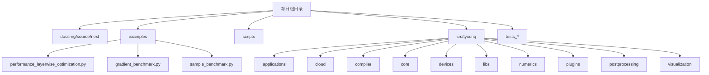
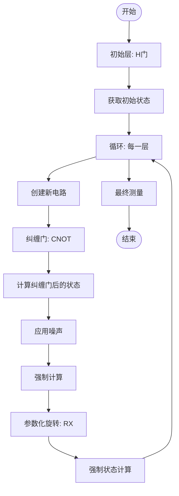
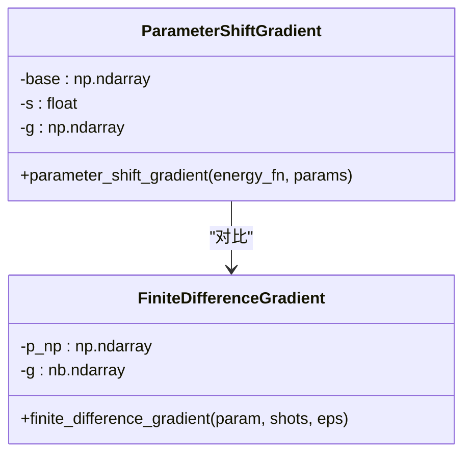
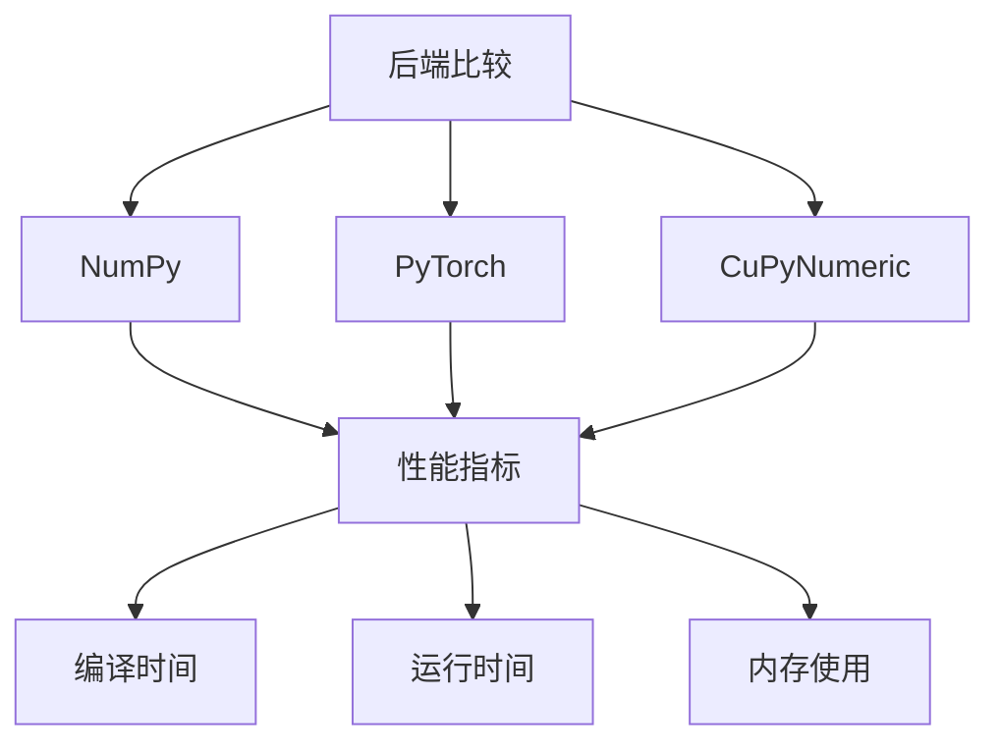
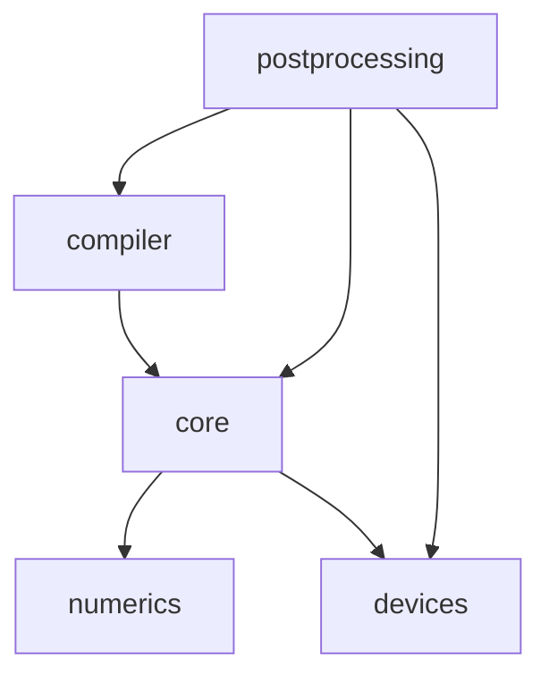

# Defcal性能分析

<cite>
**本文档引用的文件**   
- [performance_layerwise_optimization.py](file://examples/performance_layerwise_optimization.py)
- [gradient_benchmark.py](file://examples/gradient_benchmark.py)
- [sample_benchmark.py](file://examples/sample_benchmark.py)
- [circuit.py](file://src/tyxonq/core/ir/circuit.py)
- [api.py](file://src/tyxonq/numerics/api.py)
- [base.py](file://src/tyxonq/devices/base.py)
- [compile.py](file://src/tyxonq/compiler/api.py)
- [lightcone.py](file://src/tyxonq/compiler/stages/simplify/lightcone.py)
- [parameter_shift_pass.py](file://src/tyxonq/compiler/stages/gradients/parameter_shift_pass.py)
- [common.py](file://src/tyxonq/libs/quantum_library/kernels/common.py)
</cite>

## 目录
1. [引言](#引言)
2. [项目结构](#项目结构)
3. [核心组件](#核心组件)
4. [架构概述](#架构概述)
5. [详细组件分析](#详细组件分析)
6. [依赖分析](#依赖分析)
7. [性能考量](#性能考量)
8. [故障排除指南](#故障排除指南)
9. [结论](#结论)

## 引言
TyxonQ是一个模块化的全栈量子软件框架，专为在真实量子硬件上运行而设计。该框架具有稳定的中间表示（IR）、可插拔的编译器、统一的设备抽象（模拟器和硬件）、单一的数值后端接口（NumPy/PyTorch/CuPyNumeric）以及设备运行时友好的后处理层。本性能分析文档重点研究了TyxonQ在不同场景下的性能特征，包括分层优化、梯度计算、采样基准测试以及编译器优化技术。

## 项目结构
TyxonQ项目具有清晰的模块化结构，主要分为文档、示例、脚本和源代码四个部分。源代码位于`src/tyxonq`目录下，包含核心功能模块如编译器、设备、数值计算、库和后处理等。示例代码位于`examples`目录，提供了丰富的性能测试和基准测试用例。



**Diagram sources**
- [performance_layerwise_optimization.py](file://examples/performance_layerwise_optimization.py)
- [gradient_benchmark.py](file://examples/gradient_benchmark.py)
- [sample_benchmark.py](file://examples/sample_benchmark.py)

**Section sources**
- [performance_layerwise_optimization.py](file://examples/performance_layerwise_optimization.py)
- [gradient_benchmark.py](file://examples/gradient_benchmark.py)
- [sample_benchmark.py](file://examples/sample_benchmark.py)

## 核心组件
TyxonQ的核心组件包括电路表示、编译器、设备抽象、数值后端和后处理模块。电路表示采用稳定的中间表示（IR），编译器支持多种编译阶段和优化技术，设备抽象统一了模拟器和真实硬件的访问接口，数值后端提供了NumPy、PyTorch和CuPyNumeric的统一接口，后处理模块则负责结果的解析和优化。

**Section sources**
- [circuit.py](file://src/tyxonq/core/ir/circuit.py)
- [api.py](file://src/tyxonq/numerics/api.py)
- [base.py](file://src/tyxonq/devices/base.py)

## 架构概述
TyxonQ采用链式API设计模式，通过`Circuit.compile().device(...).postprocessing(...).run()`的链式调用实现量子电路的编译、执行和后处理。这种设计模式使得代码简洁易读，同时保持了高度的灵活性和可扩展性。

```mermaid
graph TD
Circuit[Circuit]
Circuit --> Compile[compile()]
Compile --> Device[device()]
Device --> Postprocessing[postprocessing()]
Postprocessing --> Run[run()]
Compile --> Compiler[编译器]
Device --> Devices[设备]
Postprocessing --> PostprocessingModule[后处理模块]
Compiler --> Native[Native编译器]
Compiler --> Qiskit[Qiskit编译器]
Devices --> Simulator[模拟器]
Devices --> Hardware[硬件]
PostprocessingModule --> Measurement[测量重写]
PostprocessingModule --> Grouping[测量分组]
PostprocessingModule --> Mitigation[误差缓解]
```

**Diagram sources**
- [circuit.py](file://src/tyxonq/core/ir/circuit.py)
- [compile.py](file://src/tyxonq/compiler/api.py)
- [base.py](file://src/tyxonq/devices/base.py)

## 详细组件分析

### 分层优化分析
分层优化技术通过在每层强制计算中间状态来减少深度噪声电路的JIT编译时间。这种方法将计算图分解为更小的片段，从而显著提高编译速度。



**Diagram sources**
- [performance_layerwise_optimization.py](file://examples/performance_layerwise_optimization.py)

**Section sources**
- [performance_layerwise_optimization.py](file://examples/performance_layerwise_optimization.py)

### 梯度计算分析
Tyxonq支持多种梯度计算方法，包括参数移位法和有限差分法。参数移位法通过在参数上添加固定偏移量来计算梯度，具有较高的数值稳定性。



**Diagram sources**
- [common.py](file://src/tyxonq/libs/quantum_library/kernels/common.py)
- [parameter_shift_pass.py](file://src/tyxonq/compiler/stages/gradients/parameter_shift_pass.py)

**Section sources**
- [gradient_benchmark.py](file://examples/gradient_benchmark.py)
- [common.py](file://src/tyxonq/libs/quantum_library/kernels/common.py)

### 采样性能分析
TyxonQ提供了多种数值后端的采样性能基准测试，包括NumPy、PyTorch和CuPyNumeric。这些测试帮助用户选择最适合其硬件配置的后端。



**Diagram sources**
- [sample_benchmark.py](file://examples/sample_benchmark.py)
- [api.py](file://src/tyxonq/numerics/api.py)

**Section sources**
- [sample_benchmark.py](file://examples/sample_benchmark.py)
- [api.py](file://src/tyxonq/numerics/api.py)

## 依赖分析
TyxonQ的组件之间存在明确的依赖关系，核心组件依赖于数值后端和设备抽象，编译器依赖于核心IR，后处理模块依赖于设备和编译器。



**Diagram sources**
- [circuit.py](file://src/tyxonq/core/ir/circuit.py)
- [api.py](file://src/tyxonq/numerics/api.py)
- [base.py](file://src/tyxonq/devices/base.py)
- [compile.py](file://src/tyxonq/compiler/api.py)

**Section sources**
- [circuit.py](file://src/tyxonq/core/ir/circuit.py)
- [api.py](file://src/tyxonq/numerics/api.py)
- [base.py](file://src/tyxonq/devices/base.py)

## 性能考量
TyxonQ在性能方面表现出色，特别是在梯度计算和深度电路优化方面。分层优化技术可以将编译时间加速10-30倍，虽然运行时间会增加约1.2-1.5倍，但这是可接受的权衡。参数移位法在梯度计算中表现出比有限差分法更好的数值稳定性。

**Section sources**
- [performance_layerwise_optimization.py](file://examples/performance_layerwise_optimization.py)
- [gradient_benchmark.py](file://examples/gradient_benchmark.py)
- [sample_benchmark.py](file://examples/sample_benchmark.py)

## 故障排除指南
在使用TyxonQ进行性能分析时，可能会遇到一些常见问题，如编译时间过长、内存不足或结果不一致等。建议使用分层优化技术来解决编译时间问题，使用适当的数值后端来优化内存使用，并通过参数移位法来确保梯度计算的数值稳定性。

**Section sources**
- [performance_layerwise_optimization.py](file://examples/performance_layerwise_optimization.py)
- [gradient_benchmark.py](file://examples/gradient_benchmark.py)

## 结论
TyxonQ作为一个模块化的全栈量子软件框架，在性能方面表现出色。通过分层优化、参数移位法和多种数值后端的支持，TyxonQ能够高效地处理深度噪声电路和复杂的梯度计算任务。未来的工作可以进一步优化编译器和后处理模块，以提高整体性能和用户体验。