# QASM3 完整工作流

<cite>
**本文档中引用的文件**
- [README.md](file://README.md)
- [src/tyxonq/__init__.py](file://src/tyxonq/__init__.py)
- [src/tyxonq/compiler/api.py](file://src/tyxonq/compiler/api.py)
- [src/tyxonq/core/ir/circuit.py](file://src/tyxonq/core/ir/circuit.py)
- [src/tyxonq/devices/base.py](file://src/tyxonq/devices/base.py)
- [src/tyxonq/compiler/compile_engine/native/native_compiler.py](file://src/tyxonq/compiler/compile_engine/native/native_compiler.py)
- [src/tyxonq/compiler/compile_engine/qiskit/qiskit_compiler.py](file://src/tyxonq/compiler/compile_engine/qiskit/qiskit_compiler.py)
- [src/tyxonq/devices/simulators/driver.py](file://src/tyxonq/devices/simulators/driver.py)
- [src/tyxonq/compiler/pulse_compile_engine/native/qasm3_importer.py](file://src/tyxonq/compiler/pulse_compile_engine/native/qasm3_importer.py)
- [src/tyxonq/waveforms.py](file://src/tyxonq/waveforms.py)
- [examples/qasm3_complete_workflow.py](file://examples/qasm3_complete_workflow.py)
</cite>

## 目录
1. [简介](#简介)
2. [项目架构概览](#项目架构概览)
3. [QASM3 工作流程核心组件](#qasm3-工作流程核心组件)
4. [完整工作流程详解](#完整工作流程详解)
5. [编译引擎与输出格式](#编译引擎与输出格式)
6. [脉冲编程与 TQASM 导出](#脉冲编程与-tqasm-导出)
7. [QASM3 解析与导入](#qasm3-解析与导入)
8. [驱动层执行](#驱动层执行)
9. [最佳实践与优化](#最佳实践与优化)
10. [故障排除指南](#故障排除指南)

## 简介

TyxonQ 是一个模块化的全栈量子软件框架，提供了完整的 QASM3 工作流程支持。该框架实现了 OpenQASM 3.0 标准的全面兼容性，包括相位 2（门级）、相位 3（帧定义）和相位 4（defcal 校准）的所有功能。

### 核心特性

- **完整的 QASM3 支持**：Phase 2、Phase 3、Phase 4 功能全覆盖
- **双向互操作性**：Circuit IR ↔ QASM3 Round-trip 完美一致性
- **脉冲级控制**：支持 OpenPulse 语法和自定义波形
- **多编译器后端**：Native、Qiskit、Pulse 编译器
- **硬件就绪**：直接导出到 TQASM 0.2 格式用于硬件执行

## 项目架构概览

TyxonQ 的 QASM3 工作流程基于分层架构设计，确保了从电路构建到硬件执行的完整链路。

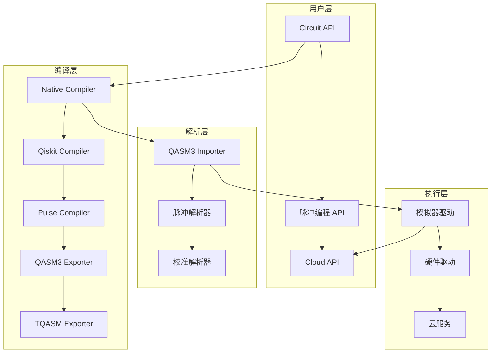

**图表来源**
- [src/tyxonq/compiler/api.py](file://src/tyxonq/compiler/api.py#L1-L50)
- [src/tyxonq/devices/base.py](file://src/tyxonq/devices/base.py#L1-L50)

## QASM3 工作流程核心组件

### 1. 编译器 API

编译器 API 提供统一的入口点，支持多种输出格式和编译策略。

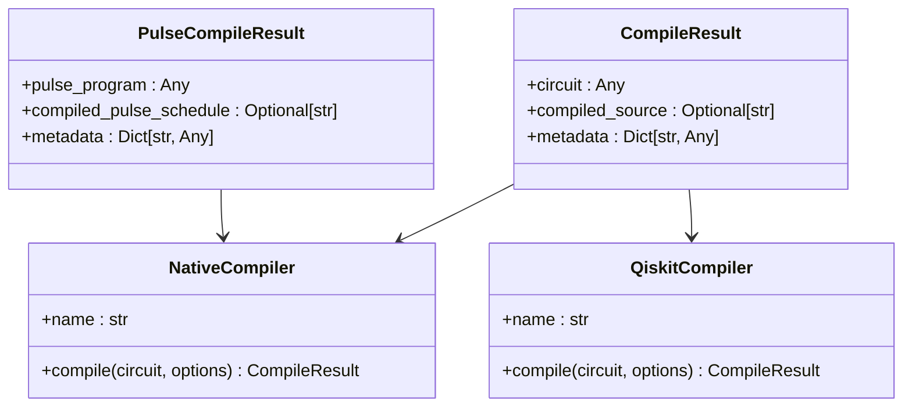

**图表来源**
- [src/tyxonq/compiler/api.py](file://src/tyxonq/compiler/api.py#L15-L35)
- [src/tyxonq/compiler/compile_engine/native/native_compiler.py](file://src/tyxonq/compiler/compile_engine/native/native_compiler.py#L15-L25)

### 2. 电路 IR 层

电路中间表示（IR）是整个工作流程的核心数据结构。

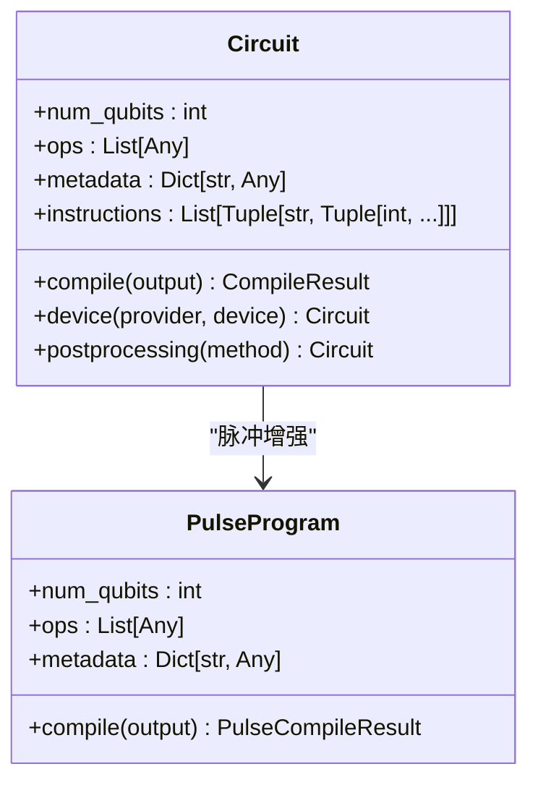

**图表来源**
- [src/tyxonq/core/ir/circuit.py](file://src/tyxonq/core/ir/circuit.py#L50-L100)

**章节来源**
- [src/tyxonq/compiler/api.py](file://src/tyxonq/compiler/api.py#L1-L100)
- [src/tyxonq/core/ir/circuit.py](file://src/tyxonq/core/ir/circuit.py#L50-L150)

## 完整工作流程详解

### Phase 2: 门级 QASM3 导入导出

这是最基础的功能，支持标准的量子门操作在 TyxonQ IR 和 QASM3 之间的转换。

#### 工作流程图

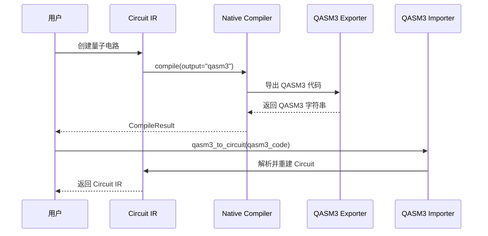

**图表来源**
- [examples/qasm3_complete_workflow.py](file://examples/qasm3_complete_workflow.py#L20-L80)
- [src/tyxonq/compiler/compile_engine/native/gate_qasm3_exporter.py](file://src/tyxonq/compiler/compile_engine/native/gate_qasm3_exporter.py#L17-L66)

#### 示例代码路径

1. **电路创建**：[`Circuit(2).h(0).cx(0, 1)`](file://examples/qasm3_complete_workflow.py#L30-L35)
2. **QASM3 导出**：[`compile(circuit, output="qasm3")`](file://examples/qasm3_complete_workflow.py#L40-L45)
3. **QASM3 解析**：[`qasm3_to_circuit(qasm3_code)`](file://examples/qasm3_complete_workflow.py#L50-L55)

### Phase 3: OpenPulse 帧定义

支持 OpenPulse 的 cal 块语法，包含端口和帧声明。

#### 帧定义语法

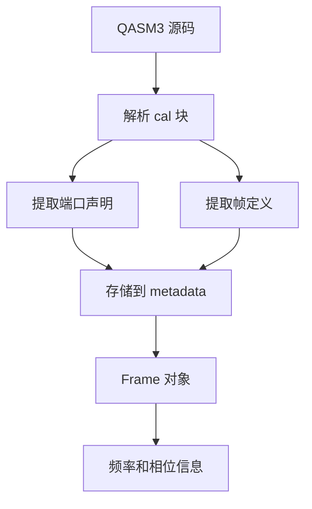

**图表来源**
- [src/tyxonq/compiler/pulse_compile_engine/native/qasm3_importer.py](file://src/tyxonq/compiler/pulse_compile_engine/native/qasm3_importer.py#L150-L200)

### Phase 4: defcal 校准定义

支持复杂的门校准定义，包含波形和脉冲指令序列。

#### defcal 定义结构

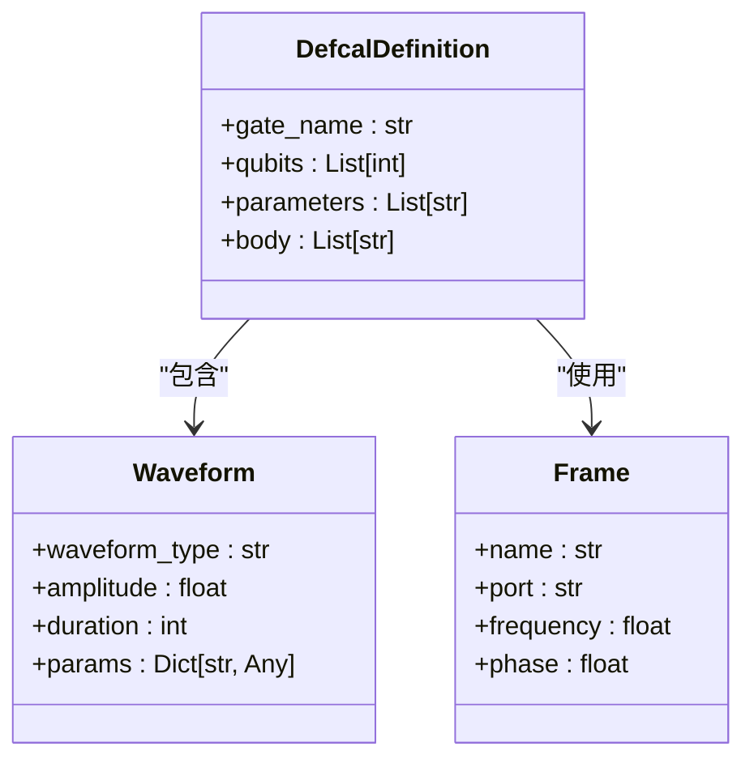

**图表来源**
- [src/tyxonq/compiler/pulse_compile_engine/native/qasm3_importer.py](file://src/tyxonq/compiler/pulse_compile_engine/native/qasm3_importer.py#L50-L80)

**章节来源**
- [examples/qasm3_complete_workflow.py](file://examples/qasm3_complete_workflow.py#L80-L150)
- [src/tyxonq/compiler/pulse_compile_engine/native/qasm3_importer.py](file://src/tyxonq/compiler/pulse_compile_engine/native/qasm3_importer.py#L1-L100)

## 编译引擎与输出格式

### 支持的输出格式

TyxonQ 编译器支持多种输出格式，满足不同的使用场景：

| 输出格式 | 描述 | 使用场景 |
|---------|------|----------|
| `ir` | TyxonQ 内部 IR | 开发和调试 |
| `qasm3` | OpenQASM 3.0 | 标准互操作性 |
| `qasm2` | OpenQASM 2.0 | 向后兼容 |
| `qiskit` | Qiskit QuantumCircuit | Qiskit 生态系统 |
| `tyxonq_homebrew_tqasm` | TyxonQ 特定 TQASM | 硬件就绪 |

### 编译流程

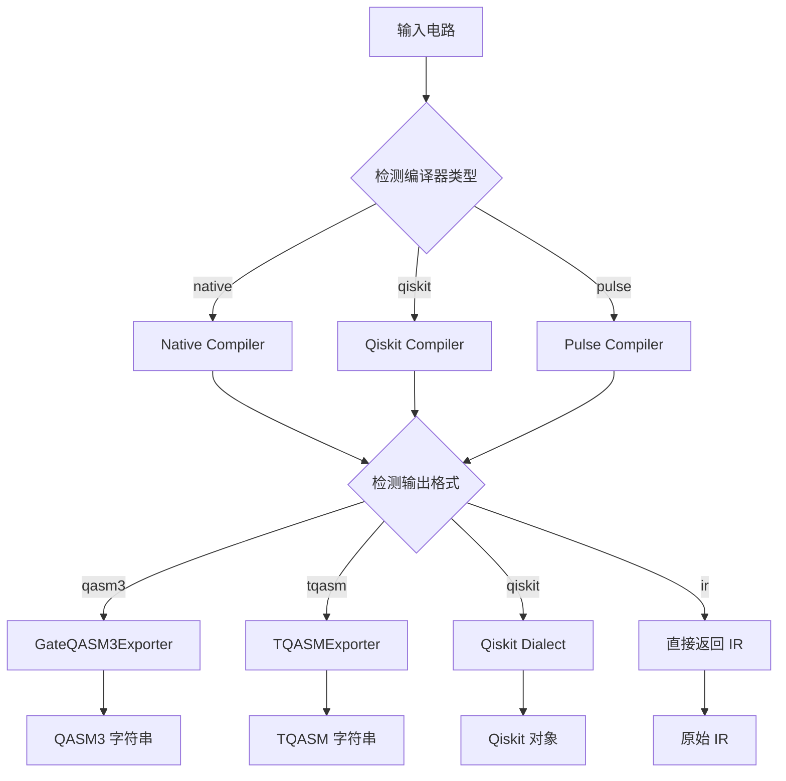

**图表来源**
- [src/tyxonq/compiler/compile_engine/native/native_compiler.py](file://src/tyxonq/compiler/compile_engine/native/native_compiler.py#L60-L110)

**章节来源**
- [src/tyxonq/compiler/compile_engine/native/native_compiler.py](file://src/tyxonq/compiler/compile_engine/native/native_compiler.py#L1-L112)
- [src/tyxonq/compiler/compile_engine/qiskit/qiskit_compiler.py](file://src/tyxonq/compiler/compile_engine/qiskit/qiskit_compiler.py#L1-L85)

## 脉冲编程与 TQASM 导出

### 波形类型支持

TyxonQ 支持多种脉冲波形类型，用于精确的量子控制：

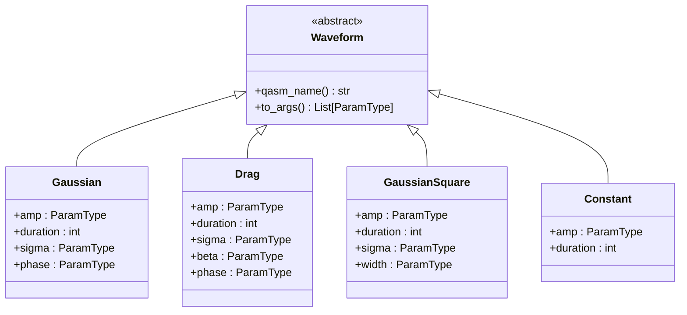

**图表来源**
- [src/tyxonq/waveforms.py](file://src/tyxonq/waveforms.py#L10-L100)

### TQASM 导出流程

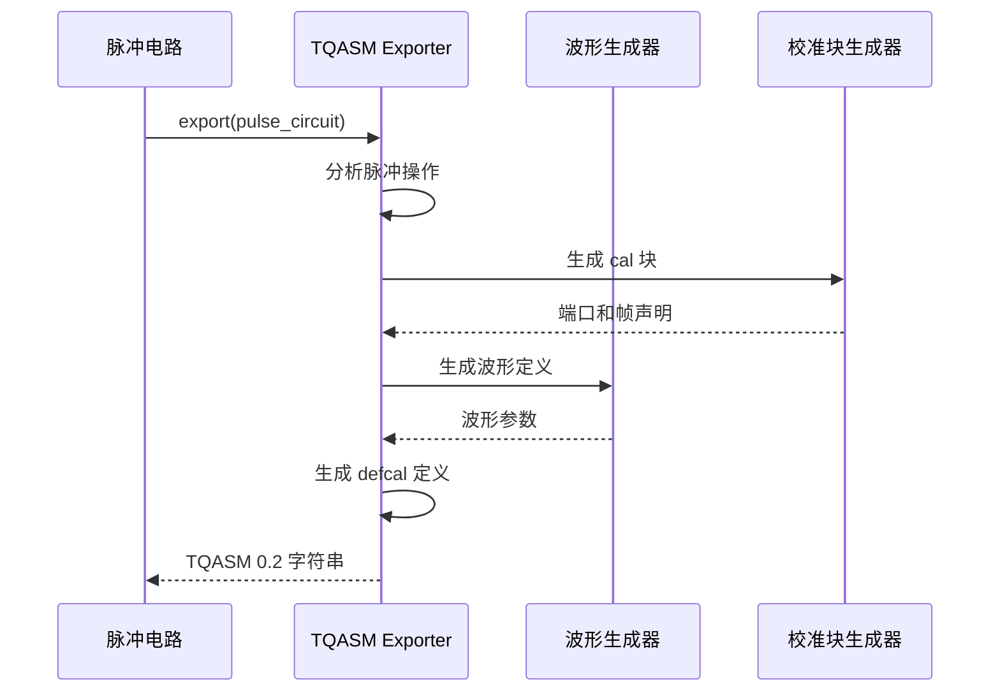

**图表来源**
- [src/tyxonq/compiler/pulse_compile_engine/native/tqasm_exporter.py](file://src/tyxonq/compiler/pulse_compile_engine/native/tqasm_exporter.py#L100-L200)

**章节来源**
- [src/tyxonq/waveforms.py](file://src/tyxonq/waveforms.py#L1-L157)
- [src/tyxonq/compiler/pulse_compile_engine/native/tqasm_exporter.py](file://src/tyxonq/compiler/pulse_compile_engine/native/tqasm_exporter.py#L1-L200)

## QASM3 解析与导入

### 解析器架构

QASM3 解析器采用分层解析策略，逐步提取不同层次的语法结构：

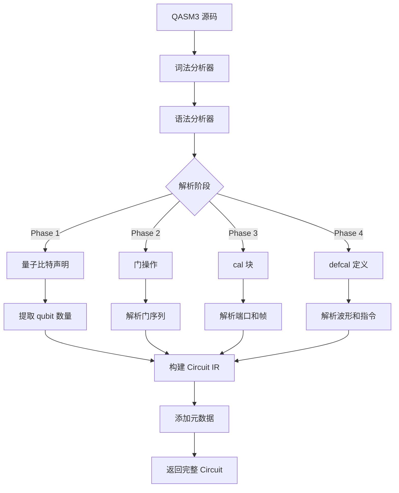

**图表来源**
- [src/tyxonq/compiler/pulse_compile_engine/native/qasm3_importer.py](file://src/tyxonq/compiler/pulse_compile_engine/native/qasm3_importer.py#L100-L200)

### 支持的语法结构

| 语法类别 | 支持程度 | 描述 |
|---------|---------|------|
| 量子比特声明 | ✅ 完全支持 | `qubit[n] q;` 和 `qreg q[n];` |
| 单量子门 | ✅ 完全支持 | `h`, `x`, `y`, `z`, `s`, `t`, `rx`, `ry`, `rz` |
| 双量子门 | ✅ 完全支持 | `cx`, `cy`, `cz`, `swap` |
| 测量操作 | ✅ 完全支持 | `measure q[i];` |
| cal 块 | ✅ Phase 3 | 端口和帧定义 |
| defcal 定义 | ✅ Phase 4 | 波形和脉冲指令 |

**章节来源**
- [src/tyxonq/compiler/pulse_compile_engine/native/qasm3_importer.py](file://src/tyxonq/compiler/pulse_compile_engine/native/qasm3_importer.py#L1-L396)

## 驱动层执行

### 自动检测机制

驱动层具备智能的 QASM3 版本检测能力，能够自动识别和处理不同格式的量子程序：

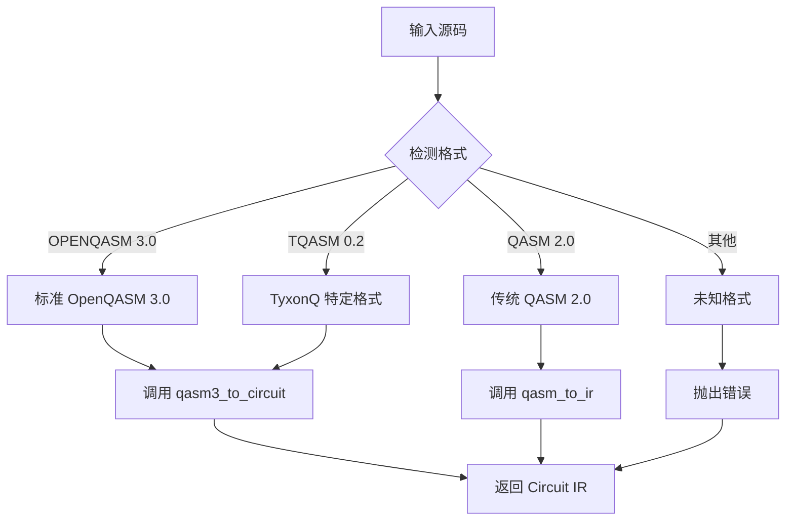

**图表来源**
- [src/tyxonq/devices/simulators/driver.py](file://src/tyxonq/devices/simulators/driver.py#L50-L100)

### 执行流程

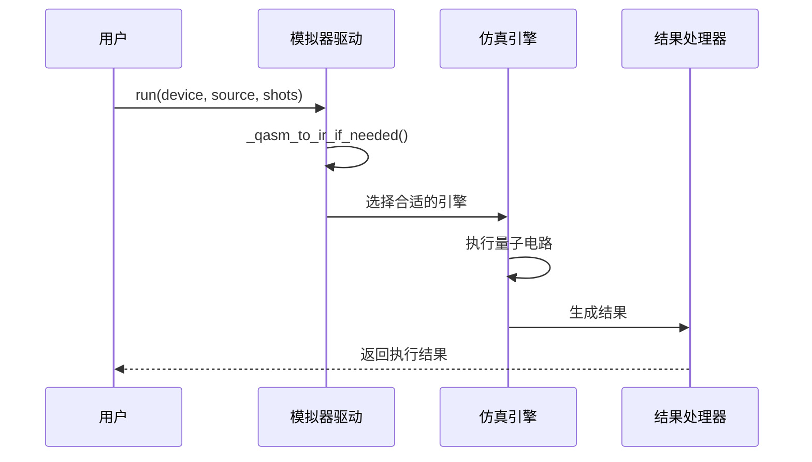

**图表来源**
- [src/tyxonq/devices/simulators/driver.py](file://src/tyxonq/devices/simulators/driver.py#L100-L167)

**章节来源**
- [src/tyxonq/devices/simulators/driver.py](file://src/tyxonq/devices/simulators/driver.py#L1-L168)

## 最佳实践与优化

### 1. 编译器选择策略

根据具体需求选择合适的编译器：

- **开发调试**：使用 `output="ir"` 获取原始 IR
- **标准互操作**：使用 `output="qasm3"` 保证兼容性
- **硬件就绪**：使用 `output="tyxonq_homebrew_tqasm"` 准备硬件执行
- **Qiskit 生态**：使用 `output="qiskit"` 集成现有工具链

### 2. 性能优化建议

- **批量处理**：对多个电路使用批量执行
- **缓存机制**：利用编译结果缓存避免重复编译
- **内存管理**：合理设置模拟器参数优化内存使用

### 3. 错误处理策略

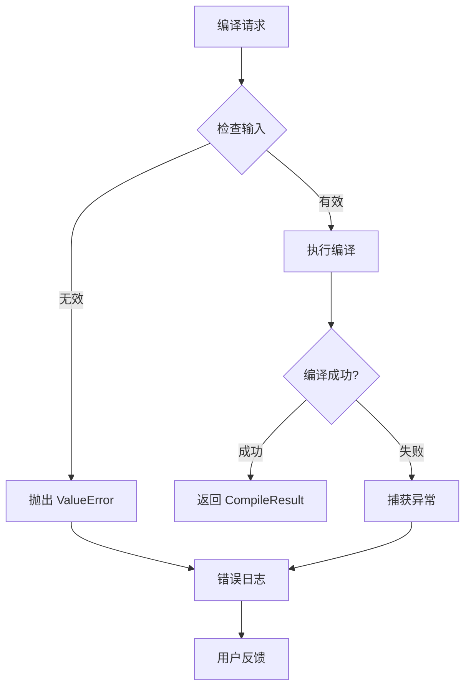

## 故障排除指南

### 常见问题及解决方案

| 问题类型 | 症状 | 解决方案 |
|---------|------|----------|
| 编译失败 | `RuntimeError: qiskit not available` | 安装 qiskit 库或使用 native 编译器 |
| 格式不匹配 | `ValueError: Cannot parse angle parameter` | 检查 QASM3 语法兼容性 |
| 硬件不支持 | `Unsupported provider` | 确认硬件提供商可用性 |
| 内存不足 | `MemoryError` | 减少量子比特数或优化电路 |

### 调试技巧

1. **分步验证**：逐个检查编译、解析、执行各环节
2. **格式检查**：验证 QASM3 语法的正确性
3. **元数据检查**：确认 Circuit.metadata 包含预期信息
4. **版本兼容**：确保使用的 QASM3 版本与硬件兼容

### 性能监控

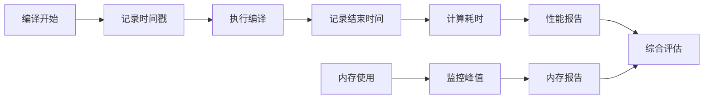

通过遵循这些最佳实践和故障排除指南，用户可以充分利用 TyxonQ 的 QASM3 工作流程，实现高效的量子电路开发和硬件执行。