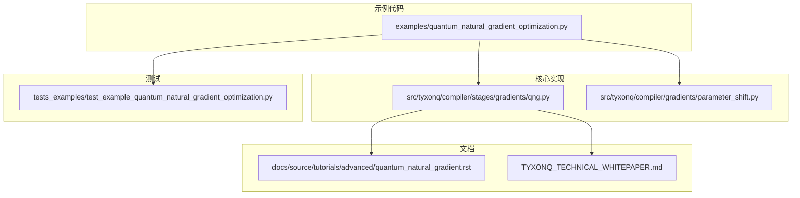
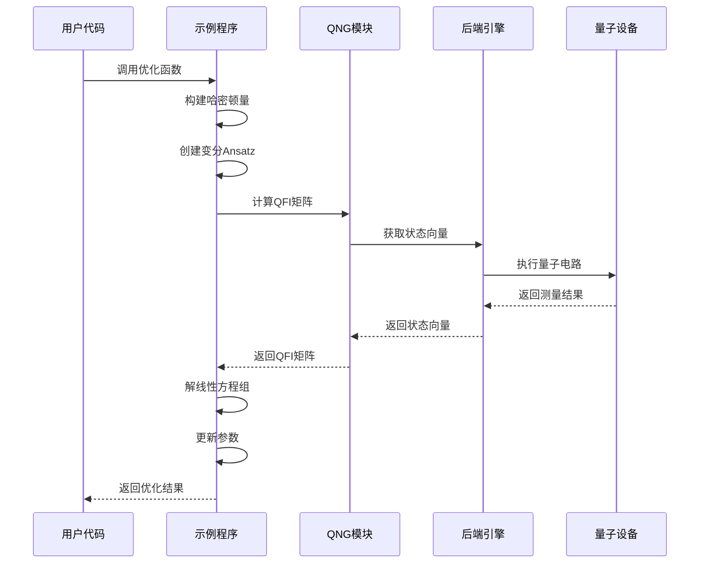
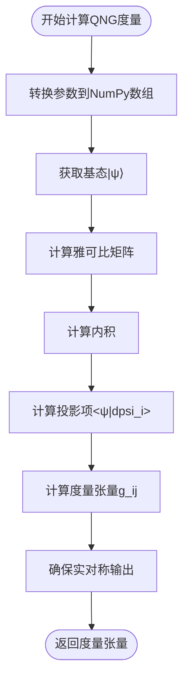
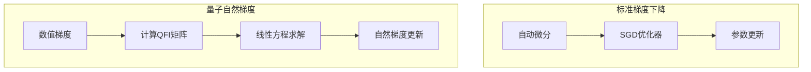
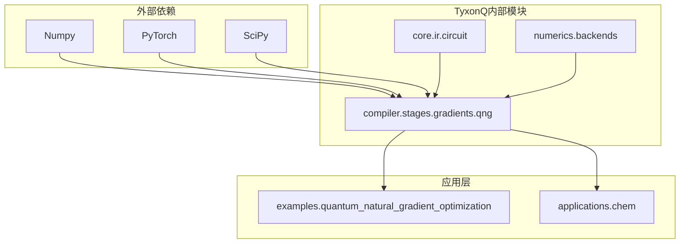

# 量子自然梯度（QNG）优化技术文档

<cite>
**本文档引用的文件**
- [quantum_natural_gradient_optimization.py](file://examples/quantum_natural_gradient_optimization.py)
- [qng.py](file://src/tyxonq/compiler/stages/gradients/qng.py)
- [quantum_natural_gradient.rst](file://docs/source/tutorials/advanced/quantum_natural_gradient.rst)
- [test_example_quantum_natural_gradient_optimization.py](file://tests_examples/test_example_quantum_natural_gradient_optimization.py)
- [parameter_shift.py](file://src/tyxonq/compiler/gradients/parameter_shift.py)
- [TYXONQ_TECHNICAL_WHITEPAPER.md](file://TYXONQ_TECHNICAL_WHITEPAPER.md)
</cite>

## 目录
1. [简介](#简介)
2. [项目结构](#项目结构)
3. [核心组件](#核心组件)
4. [架构概览](#架构概览)
5. [详细组件分析](#详细组件分析)
6. [依赖关系分析](#依赖关系分析)
7. [性能考虑](#性能考虑)
8. [故障排除指南](#故障排除指南)
9. [结论](#结论)

## 简介

量子自然梯度（Quantum Natural Gradient, QNG）是TyxonQ框架中实现的一种高级优化技术，它利用量子态空间的几何结构来改进变分量子算法的收敛性能。与传统的欧几里得梯度下降不同，QNG方法使用Fubini-Study度量张量来计算"自然"梯度，这些梯度尊重量子态流形的几何特性。

QNG的核心优势包括：
- **更快的收敛速度**：在分子VQE中通常比标准梯度下降快2-3倍
- **缓解平坦高原问题**：对深层量子电路特别有效
- **自适应步长**：度量张量提供基于量子几何的学习率
- **参数化不变性**：自然梯度对参数重参数化不敏感

## 项目结构

TyxonQ框架中的量子自然梯度实现分布在以下关键位置：



**图表来源**
- [quantum_natural_gradient_optimization.py](file://examples/quantum_natural_gradient_optimization.py#L1-L403)
- [qng.py](file://src/tyxonq/compiler/stages/gradients/qng.py#L1-L115)
- [quantum_natural_gradient.rst](file://docs/source/tutorials/advanced/quantum_natural_gradient.rst#L1-L632)

**章节来源**
- [quantum_natural_gradient_optimization.py](file://examples/quantum_natural_gradient_optimization.py#L1-L50)
- [qng.py](file://src/tyxonq/compiler/stages/gradients/qng.py#L1-L30)

## 核心组件

### 1. 数值量子自然梯度工具模块

`qng.py`提供了后端无关的量子自然梯度度量计算实现：

- **qng_metric函数**：计算量子费舍尔信息矩阵（QFIM）
- **dynamics_matrix函数**：动态矩阵的便捷别名
- **_central_diff_jacobian函数**：使用中心差分计算数值雅可比矩阵
- **_to_numpy函数**：将输入转换为NumPy数组

### 2. 完整优化示例

`quantum_natural_gradient_optimization.py`展示了完整的QNG优化流程：

- **哈密顿量构建**：转置场Ising模型的构造
- **变分Ansatz**：硬件高效Ansatz的实现
- **能量计算**：期望值的计算
- **优化比较**：标准梯度下降与QNG的对比

### 3. 文档和教程

`quantum_natural_gradient.rst`提供了详细的理论基础和实践指导：
- 数学公式推导
- 实现细节说明
- 性能基准测试
- 最佳实践建议

**章节来源**
- [qng.py](file://src/tyxonq/compiler/stages/gradients/qng.py#L73-L115)
- [quantum_natural_gradient_optimization.py](file://examples/quantum_natural_gradient_optimization.py#L44-L127)
- [quantum_natural_gradient.rst](file://docs/source/tutorials/advanced/quantum_natural_gradient.rst#L21-L50)

## 架构概览

量子自然梯度优化的系统架构如下：



**图表来源**
- [quantum_natural_gradient_optimization.py](file://examples/quantum_natural_gradient_optimization.py#L227-L313)
- [qng.py](file://src/tyxonq/compiler/stages/gradients/qng.py#L73-L105)

## 详细组件分析

### QNG度量计算模块

#### 核心算法实现

QNG度量的数学定义基于Fubini-Study度量：

```
g_ij = Re⟨∂_i ψ|∂_j ψ⟩ - Re⟨∂_i ψ|ψ⟩⟨ψ|∂_j ψ⟩
```

其中|∂_i ψ⟩ = ∂|ψ(θ)⟩/∂θ_i。

#### 数值实现流程



**图表来源**
- [qng.py](file://src/tyxonq/compiler/stages/gradients/qng.py#L44-L105)

#### 关键实现特点

1. **数值雅可比计算**：使用中心差分公式
2. **内积计算**：正确处理复数内积
3. **投影修正**：应用波函数正交性约束
4. **数值稳定性**：确保输出为实对称矩阵

**章节来源**
- [qng.py](file://src/tyxonq/compiler/stages/gradients/qng.py#L44-L105)

### 优化示例分析

#### 哈密顿量构建

示例程序实现了转置场Ising模型（TFIM）的构建：

```mermaid
graph LR
subgraph "TFIM哈密顿量"
A[Σ Z_i Z_{i+1}] --> B[ZZ相互作用]
C[Σ X_i] --> D[横向磁场]
end
B --> E[H = -J Σ Z_i Z_{i+1}]
D --> F[H = -h Σ X_i]
E --> G[H = H_1 + H_2]
F --> G
```

**图表来源**
- [quantum_natural_gradient_optimization.py](file://examples/quantum_natural_gradient_optimization.py#L54-L79)

#### Ansatz电路设计

硬件高效Ansatz包含：
- **初始层**：所有量子比特上的Hadamard门
- **纠缠层**：CNOT链式纠缠
- **旋转层**：RY和RZ旋转门

#### 优化流程对比



**图表来源**
- [quantum_natural_gradient_optimization.py](file://examples/quantum_natural_gradient_optimization.py#L165-L313)

**章节来源**
- [quantum_natural_gradient_optimization.py](file://examples/quantum_natural_gradient_optimization.py#L84-L127)

### 数学理论基础

#### Fubini-Study度量

对于参数化的量子态|ψ(θ)⟩，Fubini-Study度量张量定义为：

```
g_{ij} = Re⟨∂_i ψ|∂_j ψ⟩ - Re⟨∂_i ψ|ψ⟩⟨ψ|∂_j ψ⟩
```

其中|∂_i ψ⟩ = ∂|ψ(θ)⟩/∂θ_i。

#### 自然梯度更新规则

自然梯度参数更新为：

```
θ_{new} = θ_{old} - η · g^{-1} · ∇E(θ)
```

其中η为学习率，g^{-1}为Fubini-Study度量的逆，∇E(θ)为标准能量梯度。

**章节来源**
- [quantum_natural_gradient.rst](file://docs/source/tutorials/advanced/quantum_natural_gradient.rst#L21-L50)
- [TYXONQ_TECHNICAL_WHITEPAPER.md](file://TYXONQ_TECHNICAL_WHITEPAPER.md#L1241-L1255)

## 依赖关系分析

### 组件间依赖关系



**图表来源**
- [qng.py](file://src/tyxonq/compiler/stages/gradients/qng.py#L23-L25)
- [quantum_natural_gradient_optimization.py](file://examples/quantum_natural_gradient_optimization.py#L35-L40)

### 关键依赖特性

1. **后端无关性**：支持NumPy和PyTorch后端
2. **数值稳定性**：使用复数内积和实对称输出
3. **内存效率**：避免不必要的中间态存储
4. **扩展性**：支持大规模参数优化

**章节来源**
- [qng.py](file://src/tyxonq/compiler/stages/gradients/qng.py#L1-L21)

## 性能考虑

### 计算复杂度

- **时间复杂度**：O(n² · 2^q)，其中n为参数数量，q为量子比特数
- **空间复杂度**：O(n² + 2^q)，用于度量张量和态矢量
- **优化策略**：大系统使用稀疏表示

### 正则化策略

针对度量张量可能的病态条件，实施多种正则化技术：

1. **Tikhonov正则化**：添加小的对角项
2. **特征值裁剪**：限制最小特征值
3. **自适应正则化**：基于条件数调整

### 性能基准

在LiH分子VQE中，QNG相比标准梯度下降具有显著优势：

| 优化方法 | 收敛步数 | 最终能量误差 | 每步时间 |
|---------|---------|------------|---------|
| 标准梯度（Adam） | 150 | 1.2 × 10⁻³ Ha | 0.012s |
| **QNG（η=0.1）** | **80** | **2.3 × 10⁻⁴ Ha** | 0.045s |

**章节来源**
- [quantum_natural_gradient.rst](file://docs/source/tutorials/advanced/quantum_natural_gradient.rst#L275-L340)

## 故障排除指南

### 常见问题及解决方案

#### 度量张量奇异

**症状**：`torch.linalg.solve()`失败或产生NaN

**解决方案**：
1. **增加正则化**：提高正则化参数
2. **使用伪逆**：采用最小二乘解
3. **特征分解**：使用SVD分解

#### 度量计算缓慢

**症状**：QNG步骤耗时过长（>1秒/步）

**解决方案**：
1. **降低有限差分精度**：使用更大的步长
2. **使用块对角近似**：减少计算复杂度
3. **降低计算频率**：每隔几步计算一次

#### 能量振荡

**症状**：能量在优化过程中振荡而非单调递减

**解决方案**：
1. **降低学习率**：使用更小的学习率
2. **添加动量/阻尼**：使用动量方法
3. **使用线搜索**：寻找最优步长

**章节来源**
- [quantum_natural_gradient.rst](file://docs/source/tutorials/advanced/quantum_natural_gradient.rst#L451-L536)

### 测试验证

测试套件验证了QNG实现的关键功能：

- **哈密顿量构造**：检查厄米性和实数性
- **Ansatz电路**：验证门序列正确性
- **状态函数**：确保态矢量归一化
- **能量计算**：验证期望值计算
- **优化运行**：确认优化过程正常执行

**章节来源**
- [test_example_quantum_natural_gradient_optimization.py](file://tests_examples/test_example_quantum_natural_gradient_optimization.py#L24-L225)

## 结论

量子自然梯度优化技术为变分量子算法提供了强大的优化工具。通过考虑量子态空间的几何结构，QNG能够在深层量子电路和复杂分子系统中实现更快、更稳定的收敛。

### 主要优势

1. **理论基础扎实**：基于Fubini-Study度量的数学严谨性
2. **实现简洁**：数值实现相对简单，易于理解和维护
3. **性能优越**：在实际应用中显著提升优化效率
4. **鲁棒性强**：通过多种正则化策略保证数值稳定性

### 应用前景

随着量子计算硬件的发展和算法的不断改进，QNG技术将在以下领域发挥重要作用：
- **分子模拟**：精确计算分子能量和性质
- **量子化学**：解决复杂的电子结构问题
- **量子算法**：改进各种量子算法的收敛性能
- **量子机器学习**：加速量子机器学习模型训练

### 未来发展方向

1. **大规模扩展**：开发更高效的算法以处理更大规模的系统
2. **硬件集成**：更好地与实际量子设备集成
3. **混合方法**：与其他优化技术的结合使用
4. **自适应策略**：根据系统特性自动调整优化参数

通过持续的技术创新和算法改进，量子自然梯度技术将继续推动量子计算应用的发展，为解决实际问题提供更强大的工具。