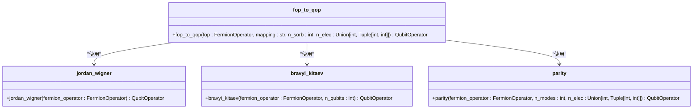
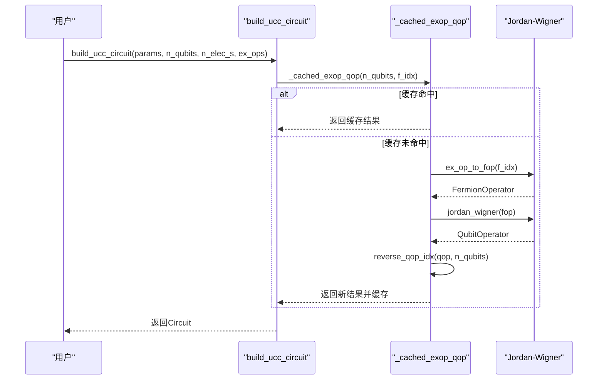
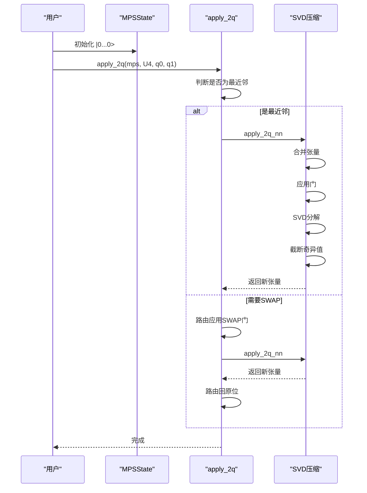
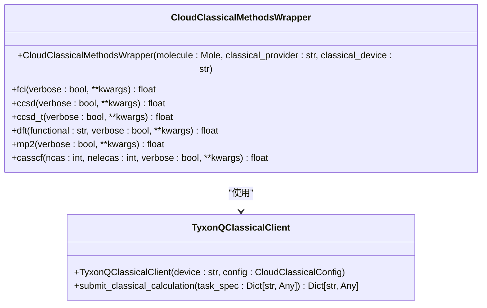

# libs

<cite>
**本文档中引用的文件**
- [vqe.py](file://src/tyxonq/libs/circuits_library/vqe.py)
- [qaoa_ising.py](file://src/tyxonq/libs/circuits_library/qaoa_ising.py)
- [trotter_circuit.py](file://src/tyxonq/libs/circuits_library/trotter_circuit.py)
- [fermion_to_qubit.py](file://src/tyxonq/libs/hamiltonian_encoding/fermion_to_qubit.py)
- [operator_encoding.py](file://src/tyxonq/libs/hamiltonian_encoding/operator_encoding.py)
- [statevector.py](file://src/tyxonq/libs/quantum_library/kernels/statevector.py)
- [density_matrix.py](file://src/tyxonq/libs/quantum_library/kernels/density_matrix.py)
- [matrix_product_state.py](file://src/tyxonq/libs/quantum_library/kernels/matrix_product_state.py)
- [interop.py](file://src/tyxonq/libs/optimizer/interop.py)
- [soap.py](file://src/tyxonq/libs/optimizer/soap.py)
- [classical_methods.py](file://src/tyxonq/applications/chem/classical_chem_cloud/classical_methods.py) - *新增于最近提交*
- [app.py](file://src/tyxonq/applications/chem/classical_chem_cloud/server/app.py) - *更新于最近提交*
- [cpu_chem.py](file://src/tyxonq/applications/chem/classical_chem_cloud/server/cpu_chem.py) - *更新于最近提交*
- [gpu_chem.py](file://src/tyxonq/applications/chem/classical_chem_cloud/server/gpu_chem.py) - *更新于最近提交*
- [ucc.py](file://src/tyxonq/libs/circuits_library/ucc.py) - *性能优化于最近提交*
- [pauli_io.py](file://src/tyxonq/libs/hamiltonian_encoding/pauli_io.py) - *缓存优化于最近提交*
</cite>

## 更新摘要
**变更内容**
- 新增“UCC电路模板”章节，介绍`ucc.py`模块中的`build_ucc_circuit`函数
- 更新“哈密顿量编码库”章节，说明`pauli_io.py`文件中`_cached_exop_qop`函数的缓存机制
- 更新“电路库”章节的引用文件列表，新增`ucc.py`和`pauli_io.py`
- 修正UCC电路构建和费米子算符转换的性能优化描述

## 目录
1. [简介](#简介)
2. [电路库](#电路库)
3. [哈密顿量编码库](#哈密顿量编码库)
4. [量子库](#量子库)
5. [优化器库](#优化器库)
6. [云经典计算方法](#云经典计算方法)
7. [总结](#总结)

## 简介
本文件旨在全面介绍 TyxonQ 项目中的功能库模块，涵盖其提供的各类工具和模板。重点阐述电路库（circuits_library）中预构建的 VQE、QAOA、UCC和 Trotter 演化等电路模板的使用方法。详细说明哈密顿量编码库（hamiltonian_encoding）如何实现费米子到量子比特的转换（如 Jordan-Wigner、Bravyi-Kitaev 映射）以及与 OpenFermion 的互操作性。描述量子库（quantum_library）中核心计算内核（kernels）的实现，包括态矢量、密度矩阵和矩阵乘积态（MPS）的运算。介绍优化器库（optimizer）如何与外部优化框架（如 SciPy）进行互操作。此外，新增对云经典计算方法的支持，通过`classical_methods.py`模块提供云加速的经典量子化学计算方法（如FCI、CCSD、DFT等），利用TyxonQ云基础设施实现大规模系统的快速计算。为用户提供快速构建复杂量子算法的实用工具集。

## 电路库

电路库（circuits_library）提供了多种预构建的量子电路模板，用于快速实现常见的量子算法，如变分量子本征求解（VQE）、量子近似优化算法（QAOA）、UCC和 Trotter 时间演化。

### VQE 电路模板
VQE 电路模板提供了一套用于构建硬件高效变分电路（Hardware-Efficient Ansatz）的工具。`build_hwe_ansatz_ops` 函数用于构建包含 CX 链、RX 和 RZ 门的多层变分电路结构。`evaluate_energy` 函数提供了一种便捷方式，用于评估给定参数下变分电路的哈密顿量期望值。该函数内部会自动构建电路、应用哈达玛门进行基变换、执行测量并从计数结果中计算能量。

**Section sources**
- [vqe.py](file://src/tyxonq/libs/circuits_library/vqe.py#L40-L152)

### QAOA 电路模板
QAOA 电路模板用于构建量子近似优化算法的变分电路。`qaoa_ising` 函数可以生成一个 QAOA 电路，该电路包含成本层（由 Z 和 ZZ 旋转门构成）和混合层（由 X、XY 或 ZZ 旋转门构成）。用户需要提供量子比特数、层数、Z 项、权重和变分参数。

**Section sources**
- [qaoa_ising.py](file://src/tyxonq/libs/circuits_library/qaoa_ising.py#L10-L68)

### UCC电路模板
UCC（Unitary Coupled Cluster）电路模板用于构建量子化学中的幺正耦合簇变分电路。`build_ucc_circuit` 函数是主要接口，用于根据给定的参数、量子比特数、电子数和激发算符序列构建UCC电路。该函数支持两种模式：门级实现和Trotter化实现。在门级模式下，使用`_evolve_excitation_ops`函数直接构建激发算符对应的量子门序列；在Trotter模式下，将激发算符转换为泡利算符并进行时间演化。函数还支持自定义初始态和多控制门分解。

**Section sources**
- [ucc.py](file://src/tyxonq/libs/circuits_library/ucc.py#L82-L122)

### Trotter 演化电路模板
Trotter 演化电路模板用于近似实现哈密顿量的时间演化。`build_trotter_circuit` 函数根据给定的泡利项、权重、演化时间和 Trotter 步数，构建一个一阶 Trotter 化的量子电路。该函数支持单量子比特 Z/X 旋转和双量子比特 ZZ 旋转的原生门实现。

**Section sources**
- [trotter_circuit.py](file://src/tyxonq/libs/circuits_library/trotter_circuit.py#L90-L91)

## 哈密顿量编码库

哈密顿量编码库（hamiltonian_encoding）负责将物理问题（特别是化学问题）中的费米子算符映射到量子计算机可以处理的泡利算符。

### 费米子到量子比特的转换
该库实现了多种从费米子算符到量子比特算符的转换方法。`fop_to_qop` 函数是主要的接口，支持 Jordan-Wigner、Bravyi-Kitaev 和 Parity 映射。`jordan_wigner` 和 `bravyi_kitaev` 函数直接调用 OpenFermion 库来执行转换。`parity` 函数实现了带有两量子比特约简的 Parity 映射，可以在满足电子数守恒的条件下减少一个量子比特。

**Diagram sources**
- [fermion_to_qubit.py](file://src/tyxonq/libs/hamiltonian_encoding/fermion_to_qubit.py#L50-L98)

**Section sources**
- [fermion_to_qubit.py](file://src/tyxonq/libs/hamiltonian_encoding/fermion_to_qubit.py#L1-L98)

### 与 OpenFermion 的互操作性
该库通过直接导入 OpenFermion 的 `jordan_wigner` 和 `bravyi_kitaev` 等函数，实现了与 OpenFermion 的无缝互操作。用户可以使用 OpenFermion 构建分子哈密顿量，然后通过 `fop_to_qop` 函数将其转换为 TyxonQ 可用的量子比特算符。

**Section sources**
- [fermion_to_qubit.py](file://src/tyxonq/libs/hamiltonian_encoding/fermion_to_qubit.py#L1-L98)

### 缓存优化的算符转换
为了提升UCC电路构建的性能，系统引入了缓存机制。`_cached_exop_qop` 函数使用`@lru_cache`装饰器对激发算符到泡利算符的转换结果进行缓存。该函数首先调用`ex_op_to_fop`将激发算符转换为费米子算符，然后使用Jordan-Wigner变换将其转换为泡利算符，最后通过`reverse_qop_idx`调整量子比特索引顺序。缓存机制避免了重复计算，显著提升了`build_ucc_circuit`函数的执行效率。

**Diagram sources**
- [pauli_io.py](file://src/tyxonq/libs/hamiltonian_encoding/pauli_io.py#L111-L119) - *ex_op_to_fop实现*
- [pauli_io.py](file://src/tyxonq/libs/hamiltonian_encoding/pauli_io.py#L86-L92) - *reverse_qop_idx实现*
- [ucc.py](file://src/tyxonq/libs/circuits_library/ucc.py#L75-L78) - *_cached_exop_qop实现*

**Section sources**
- [pauli_io.py](file://src/tyxonq/libs/hamiltonian_encoding/pauli_io.py#L75-L119) - *算符转换与缓存*
- [ucc.py](file://src/tyxonq/libs/circuits_library/ucc.py#L75-L78) - *缓存机制*

## 量子库

量子库（quantum_library）包含了核心的量子态运算内核，支持多种量子态表示形式。

### 态矢量运算
`statevector.py` 模块提供了对态矢量（Statevector）进行操作的核心函数。`init_statevector` 用于初始化全零态。`apply_1q_statevector` 和 `apply_2q_statevector` 分别用于在指定量子比特上应用单量子比特和双量子比特门，其核心是通过爱因斯坦求和约定（`einsum`）来实现高效的张量运算。`expect_z_statevector` 用于计算在 Z 基下的期望值。

**Section sources**
- [statevector.py](file://src/tyxonq/libs/quantum_library/kernels/statevector.py#L1-L54)

### 密度矩阵运算
`density_matrix.py` 模块提供了对密度矩阵（Density Matrix）进行操作的函数。`init_density` 用于初始化纯态密度矩阵。`apply_1q_density` 和 `apply_2q_density` 通过 `rho -> U * rho * U^dagger` 的公式来实现量子门对密度矩阵的作用。`exp_z_density` 提供了一个快速路径来计算 Z 基下的期望值。

**Section sources**
- [density_matrix.py](file://src/tyxonq/libs/quantum_library/kernels/density_matrix.py#L1-L83)

### 矩阵乘积态（MPS）运算
`matrix_product_state.py` 模块实现了矩阵乘积态（MPS）的最小化工具集，用于压缩态模拟。`MPSState` 类用于存储 MPS 的张量。`init_product_state` 用于初始化乘积态。`apply_1q` 和 `apply_2q` 用于在 MPS 上应用量子门，其中双量子比特门通过 `apply_2q_nn` 实现，并使用 SVD 进行压缩以控制最大纠缠维度（`max_bond`）。`to_statevector` 函数可以将 MPS 重构为完整的态矢量，主要用于小规模系统的测试。

**Diagram sources**
- [matrix_product_state.py](file://src/tyxonq/libs/quantum_library/kernels/matrix_product_state.py#L1-L234)

**Section sources**
- [matrix_product_state.py](file://src/tyxonq/libs/quantum_library/kernels/matrix_product_state.py#L1-L234)

## 优化器库

优化器库（optimizer）提供了与外部优化框架进行互操作的工具。

### 与外部优化框架的互操作
`interop.py` 模块中的 `scipy_opt_wrap` 函数是一个装饰器，用于将 TyxonQ 的目标函数包装成 SciPy 优化器可以接受的格式。它确保输入和输出是 `numpy.float64` 数组，并能正确处理梯度。

**Section sources**
- [interop.py](file://src/tyxonq/libs/optimizer/interop.py#L1-L35)

### SOAP 优化器
`soap.py` 模块实现了一个名为 Sequential Optimization with Approximate Parabola (SOAP) 的轻量级优化器。`soap` 函数是一个与 SciPy 兼容的优化器，它通过拟合抛物线来近似最优步长，适用于变分量子算法中的参数优化。

**Section sources**
- [soap.py](file://src/tyxonq/libs/optimizer/soap.py#L1-L126)

## 云经典计算方法

云经典计算方法模块提供了对传统量子化学方法的云加速支持，通过`classical_methods.py`模块实现。

### 云加速经典方法
`CloudClassicalMethodsWrapper` 类为云加速的经典量子化学方法提供了统一的封装。它通过`TyxonQClassicalClient`与云服务器进行通信，将计算任务（如FCI、CCSD、DFT等）提交到远程服务器执行。`cloud_classical_methods` 工厂函数用于创建该包装器的实例。

**Diagram sources**
- [classical_methods.py](file://src/tyxonq/applications/chem/classical_chem_cloud/classical_methods.py#L16-L131) - *新增类*
- [clients.py](file://src/tyxonq/applications/chem/classical_chem_cloud/clients.py#L15-L72) - *客户端实现*

**Section sources**
- [classical_methods.py](file://src/tyxonq/applications/chem/classical_chem_cloud/classical_methods.py#L1-L167) - *新增模块*
- [app.py](file://src/tyxonq/applications/chem/classical_chem_cloud/server/app.py#L1-L42) - *服务器路由*
- [cpu_chem.py](file://src/tyxonq/applications/chem/classical_chem_cloud/server/cpu_chem.py#L1-L189) - *CPU计算后端*
- [gpu_chem.py](file://src/tyxonq/applications/chem/classical_chem_cloud/server/gpu_chem.py#L1-L169) - *GPU计算后端*

### 服务器架构
云API的服务器架构由`app.py`中的FastAPI应用驱动。`_route_backend`函数根据请求中的`classical_device`参数（"auto", "gpu", "cpu"）决定使用`gpu_chem`还是`cpu_chem`后端进行计算。`gpu_chem`模块利用`gpu4pyscf`库在GPU上执行计算，而`cpu_chem`模块使用标准的`pyscf`库在CPU上执行计算。

**Section sources**
- [app.py](file://src/tyxonq/applications/chem/classical_chem_cloud/server/app.py#L1-L42) - *服务器应用*
- [gpu_chem.py](file://src/tyxonq/applications/chem/classical_chem_cloud/server/gpu_chem.py#L1-L169) - *GPU后端*
- [cpu_chem.py](file://src/tyxonq/applications/chem/classical_chem_cloud/server/cpu_chem.py#L1-L189) - *CPU后端*

## 总结
TyxonQ 的功能库模块为用户提供了构建复杂量子算法所需的一系列强大工具。从预构建的 VQE、QAOA、UCC和 Trotter 电路，到与 OpenFermion 互操作的哈密顿量编码，再到支持态矢量、密度矩阵和 MPS 的高效计算内核，以及与 SciPy 等外部框架兼容的优化器，这些组件共同构成了一个功能完备的量子算法开发环境。此外，通过新增的云经典计算方法模块，用户现在可以利用TyxonQ云基础设施，对FCI、CCSD、DFT等经典量子化学方法进行云加速，显著提升大规模系统的计算效率。用户可以利用这些工具快速搭建和测试各种量子算法。