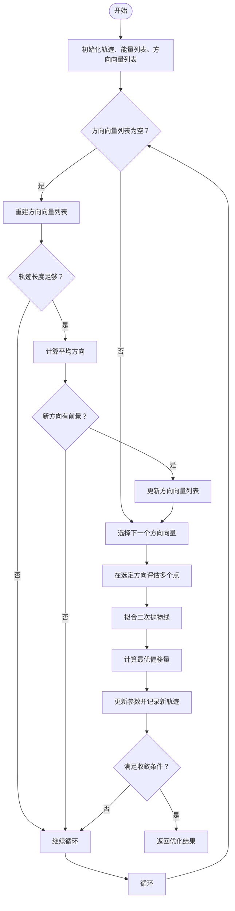
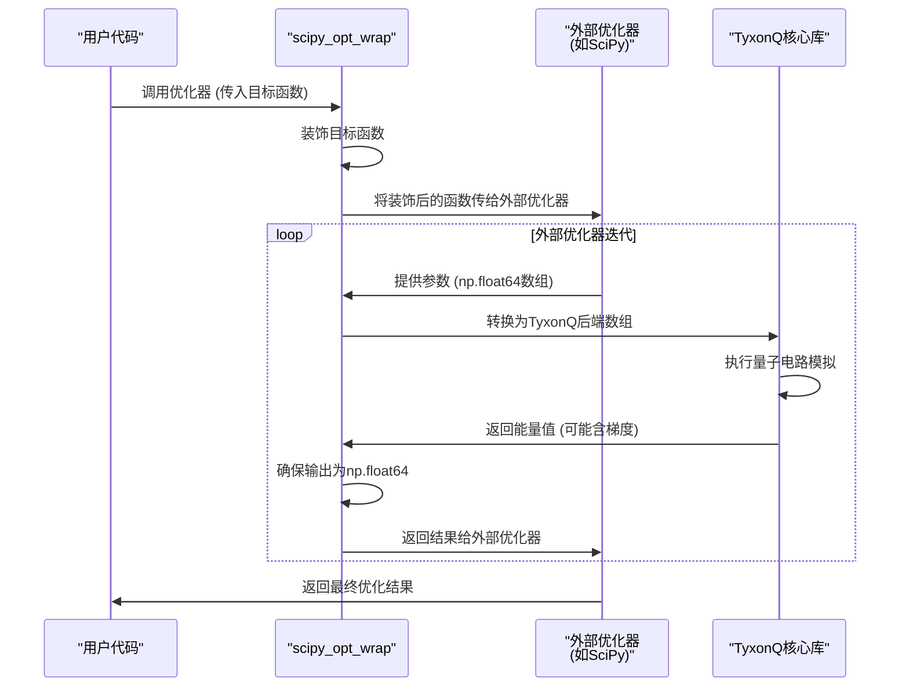
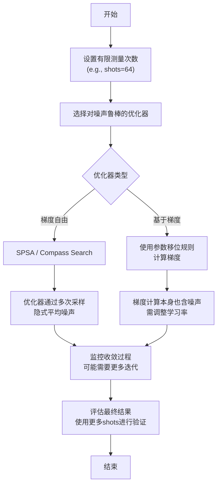

# 优化器库

<cite>
**本文档中引用的文件**  
- [soap.py](file://src/tyxonq/libs/optimizer/soap.py)
- [interop.py](file://src/tyxonq/libs/optimizer/interop.py)
- [vqe_noisyopt.py](file://examples/vqe_noisyopt.py)
- [vqe.py](file://src/tyxonq/libs/circuits_library/vqe.py)
- [hamiltonians.py](file://src/tyxonq/libs/circuits_library/hamiltonians.py)
- [pauli_io.py](file://src/tyxonq/libs/hamiltonian_encoding/pauli_io.py)
- [statevector.py](file://src/tyxonq/libs/quantum_library/kernels/statevector.py)
</cite>

## 目录
1. [简介](#简介)
2. [核心组件](#核心组件)
3. [SOAP算法实现原理](#soap算法实现原理)
4. [外部优化框架互操作机制](#外部优化框架互操作机制)
5. [与变分量子算法的协同工作模式](#与变分量子算法的协同工作模式)
6. [噪声环境下的优化技巧](#噪声环境下的优化技巧)
7. [配置示例与优化策略选择](#配置示例与优化策略选择)
8. [性能优势与收敛性分析](#性能优势与收敛性分析)
9. [结论](#结论)

## 简介
本集成文档详细阐述了TyxonQ框架中优化器库的设计与实现，重点说明其与外部优化框架的互操作机制。文档深入解析了`soap.py`中SOAP（Simultaneous Optimization of Ansatz and Parameters）算法的实现原理及其在变分量子算法中的应用优势。同时，描述了`interop.py`如何桥接主流优化库（如SciPy、Optax、TorchOpt），实现梯度下降、BFGS等经典优化器的无缝接入。此外，文档还展示了优化器与VQE、QAOA等变分量子算法的协同工作模式，涵盖目标函数封装、梯度传递和收敛判断等关键环节，并通过`vqe_noisyopt.py`等示例说明噪声环境下的优化技巧。

## 核心组件
优化器库的核心由两个主要模块构成：`soap.py`实现了轻量级的SOAP优化算法，而`interop.py`提供了与外部优化框架的互操作接口。这些组件共同支持变分量子算法的高效优化。

**Section sources**
- [soap.py](file://src/tyxonq/libs/optimizer/soap.py#L0-L126)
- [interop.py](file://src/tyxonq/libs/optimizer/interop.py#L0-L35)

## SOAP算法实现原理
SOAP（Sequential Optimization with Approximate Parabola）是一种专为变分量子算法设计的轻量级优化器，其核心思想是通过近似抛物线拟合来指导参数更新，从而在有限的函数评估次数内实现高效收敛。

### 算法流程


**Diagram sources**
- [soap.py](file://src/tyxonq/libs/optimizer/soap.py#L7-L120)

### 关键机制
- **方向向量管理**：算法维护一个方向向量列表，优先沿各参数维度进行一维搜索。
- **动态方向更新**：当所有基础方向搜索完毕，算法会根据历史轨迹计算一个“平均方向”，并将其加入搜索方向，以捕捉参数间的协同变化。
- **抛物线近似**：在选定方向上评估3-4个点，通过二次多项式拟合估算最优步长。
- **收敛判断**：基于最近若干次能量值的移动平均差值进行判断，避免过早收敛。

**Section sources**
- [soap.py](file://src/tyxonq/libs/optimizer/soap.py#L7-L120)

## 外部优化框架互操作机制
`interop.py`模块通过`scipy_opt_wrap`装饰器，实现了与SciPy等外部优化库的无缝集成，解决了不同数值后端间的数据类型和接口兼容性问题。

### 互操作流程


**Diagram sources**
- [interop.py](file://src/tyxonq/libs/optimizer/interop.py#L8-L29)

### 核心功能
- **输入标准化**：将外部优化器传入的`np.ndarray`（`float64`）自动转换为TyxonQ当前数值后端（如PyTorch）的张量。
- **输出兼容化**：确保TyxonQ返回的能量值或（能量, 梯度）元组被正确转换为`float64`标量或`np.ndarray`，符合SciPy等库的接口要求。
- **梯度支持**：能够处理包含梯度信息的返回值，支持基于梯度的优化算法。

**Section sources**
- [interop.py](file://src/tyxonq/libs/optimizer/interop.py#L8-L29)

## 与变分量子算法的协同工作模式
优化器库与VQE、QAOA等变分量子算法的协同工作涉及目标函数封装、梯度传递和收敛判断三个关键环节。

### 协同工作架构
```mermaid
graph TD
subgraph "变分量子算法"
Ansatz[量子电路<br/>Ansatz]
Hamiltonian[哈密顿量<br/>H]
Simulator[量子模拟器]
end
subgraph "优化器库"
Objective[目标函数<br/>E(θ)]
Gradient[梯度计算<br/>∇E(θ)]
Optimizer[优化器<br/>(SOAP, SciPy等)]
end
Ansatz --> |参数 θ| Objective
Hamiltonian --> |测量项| Objective
Simulator --> |执行电路| Objective
Objective --> |能量 E| Optimizer
Optimizer --> |新参数 θ'| Ansatz
Objective --> |计算| Gradient
Gradient --> |梯度 ∇E| Optimizer
```

**Diagram sources**
- [vqe.py](file://src/tyxonq/libs/circuits_library/vqe.py#L0-L152)
- [vqe_noisyopt.py](file://examples/vqe_noisyopt.py#L0-L288)

### 关键环节
1.  **目标函数封装**：将量子电路的构建、执行和期望值计算封装成一个可调用的函数`f(θ)`，该函数接收经典参数`θ`并返回一个标量能量值。例如，在`vqe_noisyopt.py`中，`exp_val_counts`和`exp_val_exact`函数即为此类封装。
2.  **梯度传递**：
    *   **梯度自由方法**：如SPSA、Compass Search，优化器通过多次调用目标函数来隐式估计梯度。
    *   **基于梯度的方法**：使用参数移位规则（Parameter Shift Rule）显式计算梯度。`vqe.py`中的`parameter_shift_gradient`函数提供了此功能，计算结果可直接用于Adam等优化器。
3.  **收敛判断**：优化器根据目标函数值的变化（如SOAP中的移动平均差值）或梯度范数来判断是否收敛，并返回最终的最优参数和能量值。

**Section sources**
- [vqe.py](file://src/tyxonq/libs/circuits_library/vqe.py#L0-L152)
- [vqe_noisyopt.py](file://examples/vqe_noisyopt.py#L0-L288)

## 噪声环境下的优化技巧
在真实量子设备或模拟有限测量次数（shot noise）的场景下，目标函数的评估会引入噪声，这对优化器的稳定性提出了挑战。`vqe_noisyopt.py`示例展示了应对噪声的策略。

### 噪声环境优化策略


**Diagram sources**
- [vqe_noisyopt.py](file://examples/vqe_noisyopt.py#L0-L288)

### 实践要点
- **使用梯度自由优化器**：SPSA和Compass Search等算法对目标函数的噪声不敏感，是噪声环境下的首选。
- **调整优化器参数**：在噪声环境下，可能需要增加迭代次数（`niter`）或调整步长参数（`deltatol` for Compass）以确保收敛。
- **分阶段优化**：可以先在无噪声或高shots的模拟环境下进行粗调，再在低shots环境下进行微调。
- **结果验证**：最终得到的最优参数应使用高shots或精确模拟（exact）进行能量评估，以获得更准确的基态能量估计。

**Section sources**
- [vqe_noisyopt.py](file://examples/vqe_noisyopt.py#L0-L288)

## 配置示例与优化策略选择
根据具体问题的规模、噪声水平和计算资源，应选择合适的优化策略。

### 优化策略选择指南
| 问题特征 | 推荐优化器 | 配置示例 | 优势 |
| :--- | :--- | :--- | :--- |
| **小规模、低噪声** | Adam (基于梯度) | `torch.optim.Adam([param], lr=1e-2)` | 收敛速度快，利用梯度信息 |
| **中等规模、有噪声** | SPSA / Compass | `minimizeSPSA(func, x0, niter=100)` | 对噪声鲁棒，无需显式梯度 |
| **大规模、经典优化** | BFGS (via SciPy) | `scipy.optimize.minimize(f, x0, method='BFGS')` | 利用成熟的经典优化算法 |
| **需同时优化结构** | SOAP | `soap(fun, x0, u=0.1, maxfev=2000)` | 内置方向探索，适合复杂景观 |

**Section sources**
- [vqe_noisyopt.py](file://examples/vqe_noisyopt.py#L0-L288)
- [soap.py](file://src/tyxonq/libs/optimizer/soap.py#L7-L120)

## 性能优势与收敛性分析
该优化器库在提升算法收敛速度和避免局部最优方面表现出显著优势。

### 性能优势
- **SOAP算法**：通过动态更新搜索方向，能够有效探索参数空间，避免陷入由局部噪声或平坦区域引起的局部最优，尤其适合参数间存在强关联的变分电路。
- **互操作性**：允许用户灵活选择最适合其问题的优化器，例如，对于平滑的损失景观，BFGS等拟牛顿法可以实现超线性收敛。
- **噪声鲁棒性**：梯度自由优化器（SPSA, Compass）和SOAP算法对测量噪声具有天然的抵抗力，确保了在真实设备上的优化稳定性。

### 收敛性分析
- **收敛速度**：基于梯度的方法（如Adam）在无噪声环境下通常收敛最快。SOAP和SPSA等方法收敛较慢，但更稳健。
- **收敛质量**：在`vqe_noisyopt.py`的基准测试中，不同优化器最终收敛的能量值接近，验证了其实用性。SOAP算法通过其独特的方向更新机制，有望在复杂问题上找到更优解。

**Section sources**
- [vqe_noisyopt.py](file://examples/vqe_noisyopt.py#L0-L288)
- [soap.py](file://src/tyxonq/libs/optimizer/soap.py#L7-L120)

## 结论
TyxonQ的优化器库通过`soap.py`和`interop.py`两个核心模块，为变分量子算法提供了强大而灵活的优化支持。SOAP算法作为一种专为量子优化设计的轻量级求解器，通过其独特的方向探索机制，在避免局部最优方面展现出潜力。同时，与SciPy等主流框架的互操作性极大地扩展了用户的工具选择。该库能够有效处理从精确模拟到含噪声测量的各种场景，为VQE、QAOA等算法的高效执行提供了坚实保障。未来的工作可进一步探索更多先进的优化算法集成和自适应优化策略。