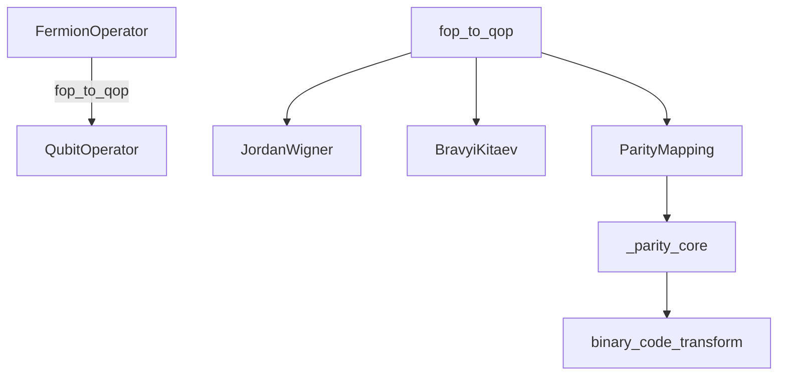
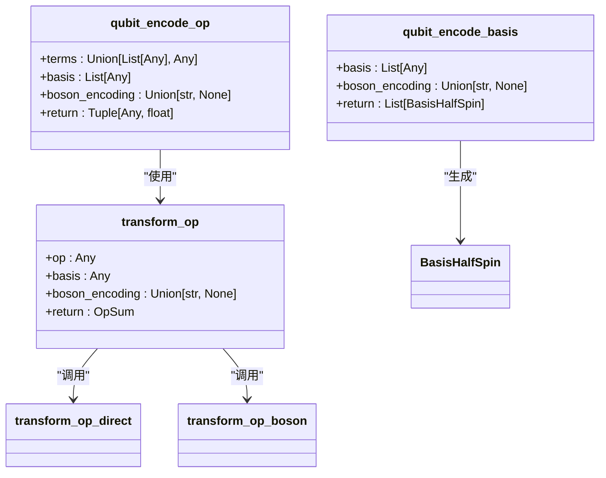
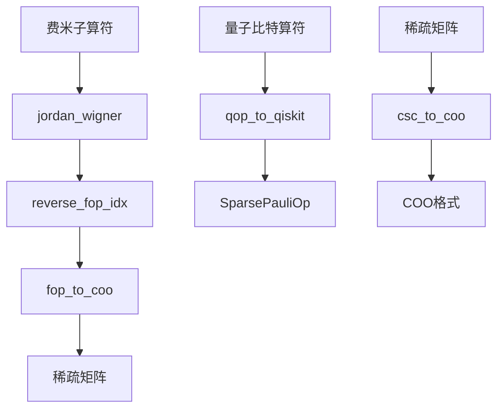
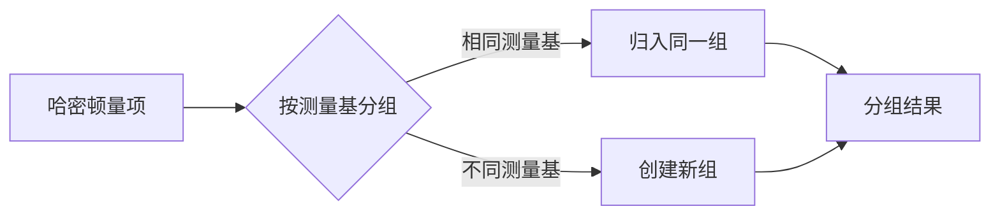
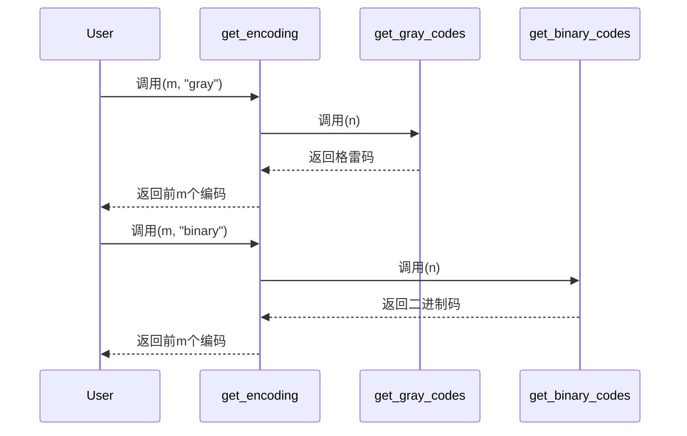

# 哈密顿量编码库

<cite>
**本文档中引用的文件**  
- [fermion_to_qubit.py](file://src/tyxonq/libs/hamiltonian_encoding/fermion_to_qubit.py)
- [operator_encoding.py](file://src/tyxonq/libs/hamiltonian_encoding/operator_encoding.py)
- [pauli_io.py](file://src/tyxonq/libs/hamiltonian_encoding/pauli_io.py) - *在最近提交中更新*
- [hamiltonian_grouping.py](file://src/tyxonq/libs/hamiltonian_encoding/hamiltonian_grouping.py)
- [gray_binary_encoding.py](file://src/tyxonq/libs/hamiltonian_encoding/gray_binary_encoding.py)
</cite>

## 更新摘要
**已做更改**  
- 更新了“哈密顿量输入输出”部分，以反映 `pauli_io.py` 中新增的性能优化功能
- 增强了与数值后端系统的集成说明
- 更新了相关源码引用以反映最新代码状态
- 保持其余文档内容不变，因其未受本次提交影响

## 目录
1. [简介](#简介)
2. [费米子到量子比特映射](#费米子到量子比特映射)
3. [算符编码机制](#算符编码机制)
4. [哈密顿量输入输出](#哈密顿量输入输出)
5. [泡利项分组优化](#泡利项分组优化)
6. [格雷码在编码中的应用](#格雷码在编码中的应用)
7. [与化学计算工具集成](#与化学计算工具集成)
8. [结论](#结论)

## 简介
哈密顿量编码库提供了一套完整的工具，用于将量子化学问题中的费米子算符转换为可在量子计算机上执行的量子比特哈密顿量。该库实现了多种映射算法，支持从分子哈密顿量到可执行量子电路的完整转换流程。核心功能包括费米子-量子比特映射、二次量子化算符编码、哈密顿量序列化以及测量优化等。

## 费米子到量子比特映射
该模块实现了多种将费米子算符转换为量子比特算符的变换算法，主要包括Jordan-Wigner、Bravyi-Kitaev和Parity映射。

**图示来源**  
- [fermion_to_qubit.py](file://src/tyxonq/libs/hamiltonian_encoding/fermion_to_qubit.py#L1-L98)

**节来源**  
- [fermion_to_qubit.py](file://src/tyxonq/libs/hamiltonian_encoding/fermion_to_qubit.py#L1-L98)

### Jordan-Wigner与Bravyi-Kitaev变换
`fop_to_qop`函数是主要入口点，接受费米子算符、映射类型、轨道数和电子数作为参数。对于Jordan-Wigner变换，直接调用OpenFermion的`jordan_wigner`函数；对于Bravyi-Kitaev变换，则使用`bravyi_kitaev`函数。两种变换结果都通过`reverse_qop_idx`进行索引反转处理，以确保位序一致性。

### Parity映射与二进制编码
Parity映射通过`parity`函数实现，利用`_parity_core`和`binary_code_transform`完成核心转换。此映射支持在电子数守恒条件下进行双量子比特约简。`binary`函数实现带校验码的二进制变换，适用于特定对称性保护场景。

## 算符编码机制
`operator_encoding.py`模块负责处理二次量子化算符的编码过程，提供从物理问题到量子比特算符的系统性转换。

**图示来源**  
- [operator_encoding.py](file://src/tyxonq/libs/hamiltonian_encoding/operator_encoding.py#L1-L345)

**节来源**  
- [operator_encoding.py](file://src/tyxonq/libs/hamiltonian_encoding/operator_encoding.py#L1-L345)

### 算符编码流程
`qubit_encode_op`函数将输入的算符项和基组信息转换为量子比特算符。首先检查基组类型，然后构建模型并分解基本算符。对于每个基本算符，根据其所属基组类型调用相应的变换函数。最终返回简化后的非恒等项算符和常数偏移量。

### 基组编码策略
`qubit_encode_basis`函数将原始基组转换为自旋-1/2基组表示。对于多电子基组，直接映射为半整数自旋基组；对于声子模式，则根据指定的编码方式（一元、二进制或格雷码）分配多个量子比特。

## 哈密顿量输入输出
`pauli_io.py`模块提供哈密顿量的序列化与反序列化功能，确保与其他量子计算工具的兼容性，并已更新以支持性能优化。

**图示来源**  
- [pauli_io.py](file://src/tyxonq/libs/hamiltonian_encoding/pauli_io.py#L1-L207)

**节来源**  
- [pauli_io.py](file://src/tyxonq/libs/hamiltonian_encoding/pauli_io.py#L39-L58) - *更新了csc_to_coo函数以支持后端稀疏矩阵构建*

### 序列化功能
`qop_to_qiskit`函数将OpenFermion的`QubitOperator`转换为Qiskit的`SparsePauliOp`，便于与Qiskit生态系统集成。`fop_to_coo`和`hcb_to_coo`函数将费米子或量子比特算符转换为稀疏坐标格式（COO），支持高效存储和传输。

### 索引处理与性能优化
`reverse_qop_idx`和`reverse_fop_idx`函数处理算符索引的大小端序转换，确保不同系统间的兼容性。这些函数在内部实现中反转量子比特索引顺序，以匹配特定硬件或软件栈的约定。`csc_to_coo`函数已更新以优先使用数值后端API中的稀疏矩阵构建器（`coo_sparse_matrix`），从而提升性能。当后端提供该功能时，会直接调用以创建稀疏矩阵；否则回退到SciPy的COO格式。

## 泡利项分组优化
`hamiltonian_grouping.py`模块实现对泡利字符串的分组优化策略，以支持高效测量。

**图示来源**  
- [hamiltonian_grouping.py](file://src/tyxonq/libs/hamiltonian_encoding/hamiltonian_grouping.py#L1-L66)

**节来源**  
- [hamiltonian_grouping.py](file://src/tyxonq/libs/hamiltonian_encoding/hamiltonian_grouping.py#L1-L66)

### 分组算法
`group_qubit_operator_terms`函数遍历量子比特算符的所有项，根据每个项的泡利字符串确定其测量基。具有相同测量基的项被归入同一组，从而可以在一次测量中同时估计。该函数还分离恒等项并检查系数的虚部，确保哈密顿量的厄米性。

### 输出格式
分组结果返回为元组`(identity_const, groups)`，其中`identity_const`是恒等项的系数和，`groups`是字典，键为测量基元组，值为该基下所有项的列表。这种结构便于后续的测量调度和期望值计算。

## 格雷码在编码中的应用
`gray_binary_encoding.py`模块实现格雷码和二进制编码，用于减少量子门数量。

**图示来源**  
- [gray_binary_encoding.py](file://src/tyxonq/libs/hamiltonian_encoding/gray_binary_encoding.py#L1-L35)

**节来源**  
- [gray_binary_encoding.py](file://src/tyxonq/libs/hamiltonian_encoding/gray_binary_encoding.py#L1-L35)

### 格雷码优势
格雷码的特点是相邻编码之间仅有一位不同，这在量子态准备和算符实现中具有显著优势。当需要在不同能级间进行跃迁时，使用格雷码编码可以最小化量子门操作的数量，因为相邻状态之间的转换只需要翻转一个量子比特。

### 编码选择
`get_encoding`函数根据指定的编码方式返回相应的编码序列。对于声子模式的量子模拟，可以选择一元、二进制或格雷码编码。格雷码特别适用于需要频繁在相邻能级间操作的场景，能够有效减少电路深度和错误累积。

## 与化学计算工具集成
本库设计时充分考虑了与主流化学计算工具的集成需求，特别是PySCF和OpenFermion。

### 与OpenFermion集成
通过直接导入OpenFermion的`FermionOperator`和`QubitOperator`类型，实现了无缝集成。所有映射函数都接受OpenFermion格式的输入，并返回兼容的输出，可以直接用于OpenFermion的后续处理流程。

### 与PySCF集成
虽然未在代码中直接体现，但通过`rdm_mo2ao`和`canonical_mo_coeff`等辅助函数，为从PySCF获取的分子轨道系数和约化密度矩阵提供了处理工具。这些函数确保了从PySCF计算结果到量子比特哈密顿量的平滑转换。

### 完整转换流程
用户可以完成从分子哈密顿量到可执行量子电路的完整转换：首先使用PySCF计算分子性质，然后通过OpenFermion生成费米子哈密顿量，接着使用本库的映射函数转换为量子比特哈密顿量，最后通过分组优化和序列化准备测量方案。

## 结论
哈密顿量编码库提供了一套强大而灵活的工具集，用于量子化学模拟中的哈密顿量处理。通过实现多种映射算法、编码策略和优化技术，该库支持从理论模型到实际量子计算的完整转换流程。其模块化设计和与主流工具的兼容性使其成为量子化学研究的重要基础设施。最近对`pauli_io.py`的更新进一步增强了性能，通过利用数值后端的稀疏矩阵构建能力，提升了大规模哈密顿量处理的效率。