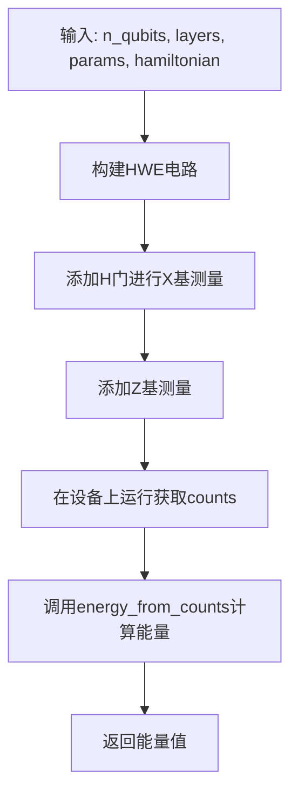
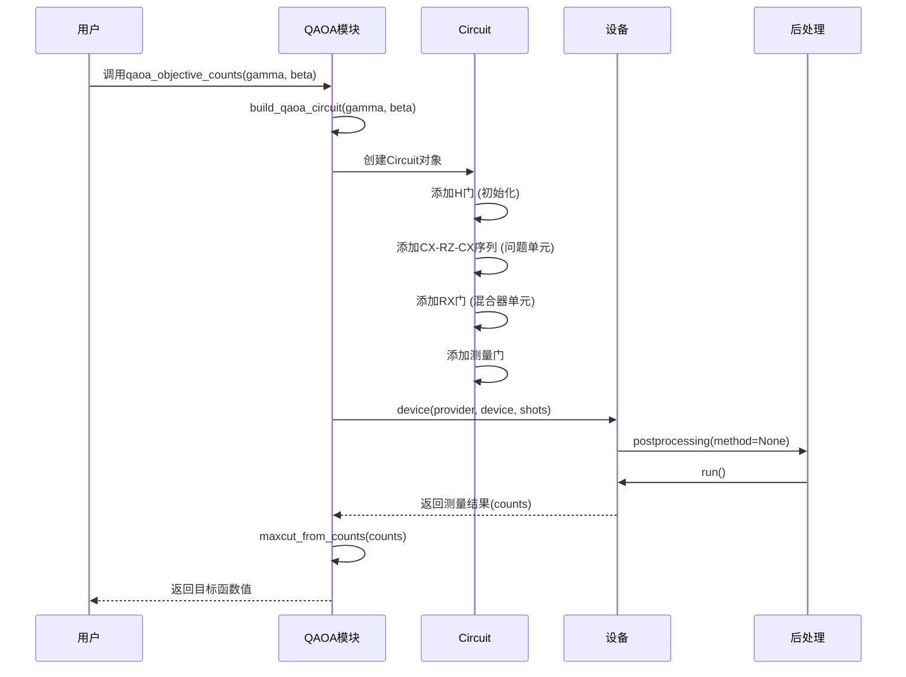

# 电路库

<cite>
**本文档中引用的文件**  
- [__init__.py](file://src/tyxonq/libs/circuits_library/__init__.py)
- [vqe.py](file://src/tyxonq/libs/circuits_library/vqe.py)
- [variational.py](file://src/tyxonq/libs/circuits_library/variational.py)
- [ucc.py](file://src/tyxonq/libs/circuits_library/ucc.py) - *在最近提交中进行了性能优化*
- [trotter_circuit.py](file://src/tyxonq/libs/circuits_library/trotter_circuit.py)
- [qubit_state_preparation.py](file://src/tyxonq/libs/circuits_library/qubit_state_preparation.py)
- [qiskit_real_amplitudes.py](file://src/tyxonq/libs/circuits_library/qiskit_real_amplitudes.py)
- [blocks.py](file://src/tyxonq/libs/circuits_library/blocks.py)
- [hamiltonians.py](file://src/tyxonq/libs/circuits_library/hamiltonians.py)
- [utils.py](file://src/tyxonq/libs/circuits_library/utils.py)
- [simple_qaoa.py](file://examples/simple_qaoa.py)
- [vqe_extra.py](file://examples/vqe_extra.py)
</cite>

## 更新摘要
**已更改内容**  
- 更新了UCC（酉耦合簇）电路部分，反映了`build_ucc_circuit`函数的性能优化和参数化结构改进
- 修正了关于初始态制备的描述，明确指出`init_state`参数仅支持`None`或`Circuit`对象
- 更新了双激发算符演化的实现细节，包括多控制RY门的分解逻辑
- 优化了与Trotter演化相关的代码路径描述

## 目录
1. [引言](#引言)
2. [核心电路模板概览](#核心电路模板概览)
3. [变分量子本征求解器（VQE）电路](#变分量子本征求解器vqe电路)
4. [量子近似优化算法（QAOA）电路](#量子近似优化算法qaoa电路)
5. [UCC（酉耦合簇）电路](#ucc酉耦合簇电路)
6. [Trotter演化电路](#trotter演化电路)
7. [量子态制备模块](#量子态制备模块)
8. [Qiskit Real Amplitudes兼容电路](#qiskit-real-amplitudes兼容电路)
9. [基础电路模块与哈密顿量生成](#基础电路模块与哈密顿量生成)
10. [实际应用示例](#实际应用示例)
11. [结论](#结论)

## 引言
本技术文档旨在全面介绍TyxonQ框架中的电路库，重点阐述其预构建的量子电路模板及其在变分量子算法中的实际应用。文档详细解析了VQE、QAOA、UCC等核心变分电路的构造方式和参数化结构，阐明了Trotter演化电路如何实现哈密顿量的时间演化。同时，文档深入探讨了`qubit_state_preparation`模块如何高效初始化量子态，以及`qiskit_real_amplitudes`兼容电路的设计原理。通过结合`vqe_extra.py`和`simple_qaoa.py`等实例，为用户提供了一条快速构建复杂变分算法的标准化路径。

## 核心电路模板概览
TyxonQ的电路库位于`src/tyxonq/libs/circuits_library`目录下，提供了一系列可复用的、后端无关的量子电路构建模块。这些模板设计目标明确：仅依赖`tyxonq.core.ir.circuit.Circuit`的构造和链式API执行，与具体数值后端解耦，从而确保了在不同硬件和模拟器上的通用性。主要模块包括：
- **VQE相关**：`vqe.py` 提供硬件高效型（HWE）变分电路、能量计算和参数移位梯度。
- **QAOA专用**：`qaoa_ising.py` 实现了针对伊辛模型的QAOA电路。
- **化学应用**：`ucc.py` 构建了用于量子化学的UCC（酉耦合簇）电路。
- **时间演化**：`trotter_circuit.py` 实现了基于Trotter公式的哈密顿量时间演化。
- **态制备**：`qubit_state_preparation.py` 提供了从经典态到量子态的高效初始化方法。
- **兼容性**：`qiskit_real_amplitudes.py` 实现了与Qiskit `RealAmplitudes`电路的互操作。
- **基础模块**：`blocks.py` 和 `hamiltonians.py` 提供了可复用的电路块和哈密顿量生成器。

**Section sources**
- [__init__.py](file://src/tyxonq/libs/circuits_library/__init__.py)

## 变分量子本征求解器（VQE）电路
VQE电路是变分量子算法的核心，用于求解哈密顿量的基态能量。`vqe.py`模块提供了构建此类电路的完整工具链。

### 电路构造与参数化
`build_hwe_ansatz_ops`函数构建了一个典型的硬件高效型（HWE）变分电路。其结构为多层重复的`CX`链、`RX`、`RZ`和`RX`门序列。该函数接受量子比特数`n`、层数`layers`和参数列表`params`，返回一个操作列表，该列表可直接用于创建`Circuit`对象。这种结构设计旨在平衡表达能力和硬件可行性。

### 能量与梯度计算
`energy_from_counts`函数根据测量结果（counts）和哈密顿量的Pauli项列表，计算期望能量。它假设电路中已包含必要的基变换（如`H`门用于`X`测量），并仅支持`Z`基测量结果的处理。

`parameter_shift_gradient`函数实现了参数移位规则，用于计算变分电路的梯度。它通过在每个参数上施加`±π/2`的偏移，分别运行电路并计算能量差来估计梯度。这是VQE优化循环中的关键步骤。

`evaluate_energy`函数提供了一个便捷的接口，将电路构建、基变换、测量和能量计算封装为一个原子操作。



**Section sources**
- [vqe.py](file://src/tyxonq/libs/circuits_library/vqe.py)

## 量子近似优化算法（QAOA）电路
QAOA是一种用于解决组合优化问题的变分量子算法。`qaoa_ising.py`模块（在`__init__.py`中导出）提供了针对伊辛模型的QAOA实现。

### 电路结构
QAOA电路由两个交替的单元组成：**混合器单元（Mixer）** 和 **问题单元（Problem）**。
- **初始态**：所有量子比特通过`H`门制备成`|+>`态。
- **问题单元**：对应于哈密顿量中的`ZZ`项，通过`CX-RZ(2θ)-CX`的分解实现`exp(-iγ ZZ)`。
- **混合器单元**：对应于哈密顿量中的`X`项，通过`RX(2β)`门实现`exp(-iβ X)`。

### 目标函数与优化
`simple_qaoa.py`示例展示了如何使用电路库构建QAOA电路。`maxcut_from_counts`函数根据测量结果计算MaxCut问题的切割值。`qaoa_objective_counts`函数则将切割值取负作为优化目标（最小化），并使用`vqe`模块中的`parameter_shift_gradient`或直接数值方法进行优化。



**Section sources**
- [simple_qaoa.py](file://examples/simple_qaoa.py)

## UCC（酉耦合簇）电路
UCC电路是量子化学中用于精确求解分子基态的核心方法。`ucc.py`模块实现了`build_ucc_circuit`函数，用于构建UCCSD（单双激发酉耦合簇）电路。

### 初始态制备
电路通常从哈特里-福克（Hartree-Fock）态开始。`_hf_init_ops`函数通过在特定量子比特上应用`X`门来制备该初始态。根据`mode`参数的不同，支持`fermion`、`qubit`和`hcb`（硬核玻色子）三种模式。

### 激发算符演化
UCC电路的核心是将化学激发算符（如`a†_i a†_j a_k a_l`）映射为量子门序列。`_evolve_excitation_ops`函数处理了单激发（2量子比特）和双激发（4量子比特）的情况。
- **单激发**：使用`CX`门和`CRY`门的组合。
- **双激发**：使用更复杂的多控制`RY`门分解，通过`build_multicontrol_ry_ops`函数实现。

### 参数化结构与性能优化
`build_ucc_circuit`函数经过性能优化，采用了`@lru_cache`装饰器对`_cached_exop_qop`函数进行缓存，显著提升了JW变换和索引反转的计算效率。该函数支持两种实现模式：
- **门级实现**（默认）：直接构建门序列，使用`2*theta`作为旋转角度。
- **Trotter化实现**：当`troter=True`时，将激发算符分解为Pauli字符串的演化。

### 参数说明
函数接受以下关键参数：
- `params`: 变分参数列表
- `n_qubits`: 量子比特数
- `n_elec_s`: 电子数元组
- `ex_ops`: 激发算符列表
- `mode`: 模式选择（"fermion", "qubit", "hcb"）
- `init_state`: 初始态，仅支持`None`或`Circuit`对象
- `decompose_multicontrol`: 是否分解多控制门
- `trotter`: 是否使用Trotter化实现

```python
def build_ucc_circuit(
    params: Sequence[float],
    n_qubits: int,
    n_elec_s: Tuple[int, int],
    ex_ops: Sequence[Tuple],
    param_ids: Sequence[int] | None = None,
    *,
    mode: str = "fermion",
    init_state=None,
    decompose_multicontrol: bool = False,
    trotter: bool = False,
):
    # ... 实现细节
    return Circuit(n_qubits, ops=ops)
```

**Section sources**
- [ucc.py](file://src/tyxonq/libs/circuits_library/ucc.py) - *更新了性能优化和参数化结构*

## Trotter演化电路
Trotter演化电路用于模拟量子系统的动力学，即实现`exp(-iHt)`。`trotter_circuit.py`模块提供了`build_trotter_circuit`函数。

### 实现原理
该函数实现了**一阶Trotter公式**：`exp(-iHt) ≈ ∏_j exp(-i w_j P_j dt)`，其中`H = Σ w_j P_j`。它将哈密顿量分解为多个Pauli项，然后在每个Trotter步长内依次应用每个项的演化。

### 支持的Pauli项
`_apply_single_term`函数处理了常见的Pauli项：
- **单`Z`**：直接使用`RZ(2θ)`门。
- **单`X`**：使用`H-RZ(2θ)-H`序列。
- **双`ZZ`**：使用`CX-RZ(2θ)-CX`序列。

对于不支持的模式（如`Y`门），会抛出`NotImplementedError`。

**Section sources**
- [trotter_circuit.py](file://src/tyxonq/libs/circuits_library/trotter_circuit.py)

## 量子态制备模块
`qubit_state_preparation.py`模块提供了灵活的量子态初始化功能，支持设备级和数值级两种路径。

### 路由函数
`get_init_circuit`是一个路由函数，根据`runtime`参数选择返回`Circuit`对象（用于设备执行）或`numpy`数组（用于数值模拟）。

### 设备级制备
`get_device_init_circuit`函数构建了门级电路。它支持三种初始化方式：
1.  **直接电路**：通过`init_circuit`参数传入一个已有的`Circuit`对象。
2.  **比特串**：通过`state_recipe["bitstring"]`指定一个比特串。
3.  **操作列表**：通过`state_recipe["ops"]`指定一个门操作列表。

### 数值级制备
`get_numeric_init_circuit`函数直接返回一个`numpy`状态向量。它支持从CI（组态相互作用）向量映射到全希尔伯特空间的状态向量。

### Givens旋转
`get_circuit_givens_swap`函数使用Givens旋转来实现特定的态制备，这在处理费米子-玻色子映射时非常有用。

**Section sources**
- [qubit_state_preparation.py](file://src/tyxonq/libs/circuits_library/qubit_state_preparation.py)

## Qiskit Real Amplitudes兼容电路
为了促进与Qiskit生态的互操作性，`qiskit_real_amplitudes.py`模块提供了与Qiskit `RealAmplitudes`电路的转换功能。

### 电路转换
`real_amplitudes_circuit_template_converter`函数接受一个Qiskit的`QuantumCircuit`对象，并将其转换为TyxonQ内部的参数化模板。该模板是一个操作列表，其中参数化旋转门的参数被替换为`("p", param_index)`的占位符。

### 电路实例化
`build_circuit_from_template`函数接收一个参数化模板和一个参数向量，将其实例化为一个TyxonQ的`Circuit`对象。它会将占位符`("p", idx)`替换为参数向量中对应索引的实际值。

**Section sources**
- [qiskit_real_amplitudes.py](file://src/tyxonq/libs/circuits_library/qiskit_real_amplitudes.py)

## 基础电路模块与哈密顿量生成
`blocks.py`和`hamiltonians.py`模块提供了可复用的底层构建块。

### 基础电路模块
`blocks.py`中的`example_block`和`build_hwe_ry_ops`函数提供了硬件高效型电路的另一种实现，特别是`RY`层的变体。这些函数是构建更复杂变分电路的基础。

### 哈密顿量生成
`hamiltonians.py`模块提供了哈密顿量的生成和转换工具。
- `build_tfim_terms`：构建横向场伊辛模型（TFIM）的哈密顿量项。
- `pauli_terms_from_openfermion`：将OpenFermion的`QubitOperator`对象转换为TyxonQ内部的Pauli项列表（`lsb`）、权重列表（`wb`）和量子比特数。

**Section sources**
- [blocks.py](file://src/tyxonq/libs/circuits_library/blocks.py)
- [hamiltonians.py](file://src/tyxonq/libs/circuits_library/hamiltonians.py)

## 实际应用示例
`examples`目录下的`vqe_extra.py`和`simple_qaoa.py`文件是电路库功能的综合演示。

### VQE示例 (`vqe_extra.py`)
该示例展示了如何使用`vqe`模块构建一个针对TFIM哈密顿量的VQE求解器。它演示了：
- 使用`build_hwe_ansatz_ops`构建变分电路。
- 通过`_counts_z_run`和`_counts_x_run`分别测量`ZZ`和`X`项。
- 使用`energy_from_counts`计算总能量。
- 实现参数移位梯度`grad_tfim_ps`。
- 提供了一个使用PyTorch自动微分的对比路径，展示了数值后端的灵活性。

### QAOA示例 (`simple_qaoa.py`)
该示例展示了如何使用网络图（`networkx`）定义一个MaxCut问题，并使用QAOA求解。
- 使用`build_qaoa_circuit`构建QAOA电路。
- 使用`maxcut_from_counts`从测量结果中计算切割值。
- 提供了一个使用PyTorch自动微分的无采样路径，用于性能对比。

**Section sources**
- [vqe_extra.py](file://examples/vqe_extra.py)
- [simple_qaoa.py](file://examples/simple_qaoa.py)

## 结论
TyxonQ的电路库提供了一套强大、灵活且模块化的工具，用于构建和执行各种变分量子算法。通过清晰的接口设计和后端解耦，它极大地简化了从VQE、QAOA到UCC等复杂算法的开发流程。用户可以基于预构建的模板快速搭建实验，或通过组合`blocks.py`中的基础模块来设计全新的电路。与Qiskit的兼容性设计也确保了其在更广泛量子计算生态中的可用性。结合`examples`中的实际用例，开发者可以迅速上手并构建自己的量子应用。