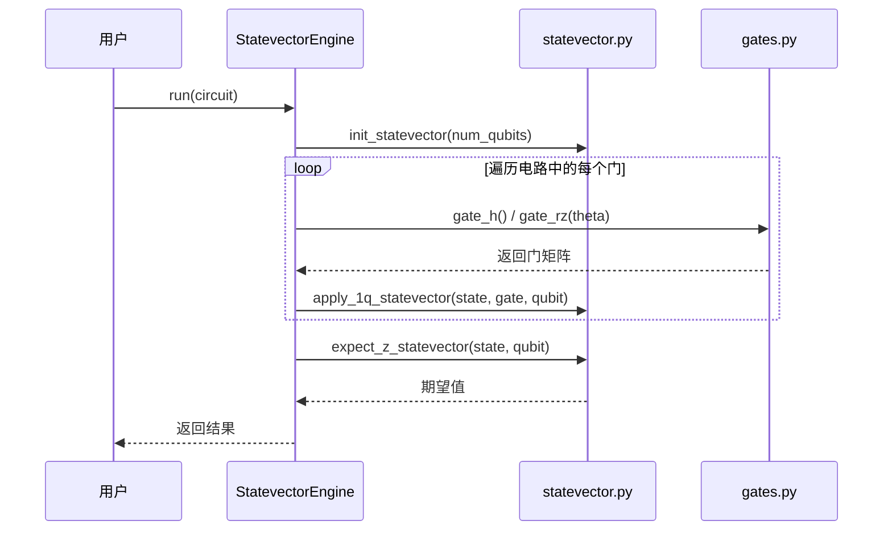
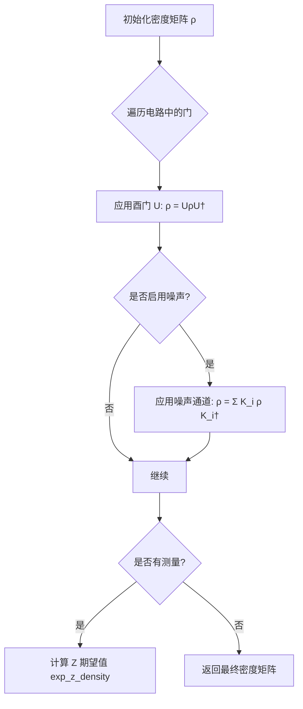
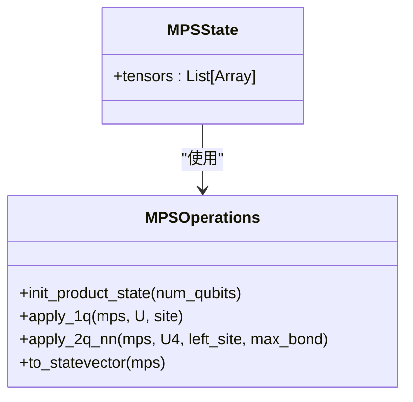
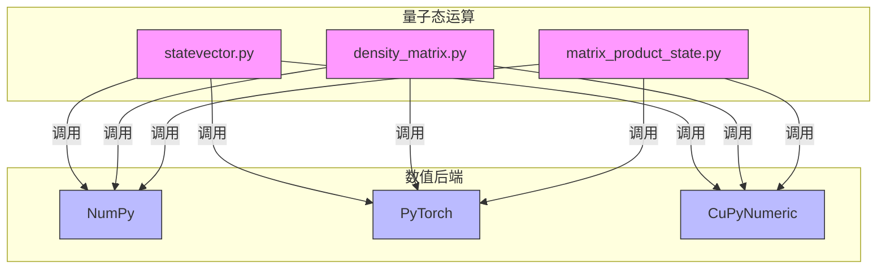

# 量子计算内核

<cite>
**本文档引用的文件**
- [statevector.py](file://src/tyxonq/libs/quantum_library/kernels/statevector.py)
- [density_matrix.py](file://src/tyxonq/libs/quantum_library/kernels/density_matrix.py)
- [matrix_product_state.py](file://src/tyxonq/libs/quantum_library/kernels/matrix_product_state.py)
- [gates.py](file://src/tyxonq/libs/quantum_library/kernels/gates.py)
- [pauli.py](file://src/tyxonq/libs/quantum_library/kernels/pauli.py)
- [unitary.py](file://src/tyxonq/libs/quantum_library/kernels/unitary.py)
- [numpy_backend.py](file://src/tyxonq/numerics/backends/numpy_backend.py)
- [pytorch_backend.py](file://src/tyxonq/numerics/backends/pytorch_backend.py)
- [cupynumeric_backend.py](file://src/tyxonq/numerics/backends/cupynumeric_backend.py)
- [api.py](file://src/tyxonq/numerics/api.py)
- [statevector/engine.py](file://src/tyxonq/devices/simulators/statevector/engine.py)
- [density_matrix/engine.py](file://src/tyxonq/devices/simulators/density_matrix/engine.py)
- [matrix_product_state/engine.py](file://src/tyxonq/devices/simulators/matrix_product_state/engine.py)
</cite>

## 目录
1. [引言](#引言)
2. [核心组件](#核心组件)
3. [态矢量模拟器](#态矢量模拟器)
4. [密度矩阵模拟器](#密度矩阵模拟器)
5. [矩阵乘积态模拟器](#矩阵乘积态模拟器)
6. [量子门与算符](#量子门与算符)
7. [数值后端与计算适配](#数值后端与计算适配)
8. [性能优化与内存管理](#性能优化与内存管理)
9. [结论](#结论)

## 引言
本文档深入探讨了TyxonQ量子计算框架的核心内核，重点分析其底层量子态运算的高效实现。文档详细阐述了三种主要的量子态表示方法：全振幅的态矢量（Statevector）、处理混合态的密度矩阵（Density Matrix）以及适用于大规模系统的矩阵乘积态（Matrix Product State, MPS）。同时，文档解析了基本量子门、泡利算符和酉算符的实现逻辑，并解释了内核如何通过统一的数值后端接口（Numerics Backend）适配NumPy、PyTorch和CuPyNumeric等不同的计算框架，以实现性能与功能的平衡。

## 核心组件
量子计算内核的核心由多个模块构成，它们协同工作以实现高效的量子电路模拟。`statevector.py`、`density_matrix.py`和`matrix_product_state.py`分别提供了三种量子态的数学运算核心。`gates.py`和`pauli.py`模块负责生成和操作量子门及泡利算符的矩阵表示。`unitary.py`则为编译器和测试提供静态的酉算符定义。这些核心运算通过`numerics`模块的后端接口与具体的计算引擎（如CPU或GPU）解耦，实现了计算逻辑与硬件执行的分离。

**本节来源**
- [statevector.py](file://src/tyxonq/libs/quantum_library/kernels/statevector.py)
- [density_matrix.py](file://src/tyxonq/libs/quantum_library/kernels/density_matrix.py)
- [matrix_product_state.py](file://src/tyxonq/libs/quantum_library/kernels/matrix_product_state.py)
- [gates.py](file://src/tyxonq/libs/quantum_library/kernels/gates.py)
- [pauli.py](file://src/tyxonq/libs/quantum_library/kernels/pauli.py)
- [unitary.py](file://src/tyxonq/libs/quantum_library/kernels/unitary.py)

## 态矢量模拟器
态矢量模拟器使用一个大小为2^n的复数向量来精确表示n个量子比特的纯量子态|ψ⟩。其核心操作包括态的初始化、单/双量子比特门的应用以及测量期望值的计算。

### 态的初始化与门应用
`init_statevector`函数创建一个初始态|0...0⟩，其第一个元素为1，其余为0。门操作通过爱因斯坦求和约定（`einsum`）高效实现。`apply_1q_statevector`函数将单量子比特门U（2x2矩阵）作用于指定量子比特。它通过重塑态矢量并使用`einsum`（如`ab, ...b... -> ...a...`）来完成张量缩并，避免了显式的循环和索引操作，从而提升了性能。双量子比特门（如CNOT）的实现类似，但需要处理四个索引（`abcd, ...cd... -> ...ab...`）。

### 测量概率计算
`expect_z_statevector`函数计算在Z基下对指定量子比特进行测量的期望值。它通过`moveaxis`将目标量子比特的轴移动到最前面，然后重塑并计算其概率分布，最终返回|0⟩的概率减去|1⟩的概率。

**图示来源**
- [statevector.py](file://src/tyxonq/libs/quantum_library/kernels/statevector.py#L1-L54)
- [gates.py](file://src/tyxonq/libs/quantum_library/kernels/gates.py#L1-L205)
- [statevector/engine.py](file://src/tyxonq/devices/simulators/statevector/engine.py)

**本节来源**
- [statevector.py](file://src/tyxonq/libs/quantum_library/kernels/statevector.py)
- [statevector/engine.py](file://src/tyxonq/devices/simulators/statevector/engine.py)

## 密度矩阵模拟器
密度矩阵模拟器使用一个大小为2^n x 2^n的厄米矩阵ρ来表示量子系统的混合态，能够原生地模拟噪声过程。

### 混合态的演化
`init_density`函数初始化一个纯态|0...0⟩⟨0...0|的密度矩阵。对于酉演化，`apply_1q_density`和`apply_2q_density`函数实现了ρ -> UρU†的变换。这通过`einsum`操作完成，例如单量子比特门的变换为`xa, ...ab... ,yb -> ...xy...`，其中`U`和`U†`（共轭转置）被同时作用于密度矩阵的左右两侧。

### 噪声通道支持
该模拟器的核心优势在于支持多种噪声通道，如去极化（depolarizing）、振幅阻尼（amplitude_damping）和相位阻尼（phase_damping）。这些噪声通过Kraus算符作用于密度矩阵来实现，使其成为研究噪声对量子算法影响的理想工具。

**图示来源**
- [density_matrix.py](file://src/tyxonq/libs/quantum_library/kernels/density_matrix.py#L1-L83)
- [density_matrix/engine.py](file://src/tyxonq/devices/simulators/density_matrix/engine.py)

**本节来源**
- [density_matrix.py](file://src/tyxonq/libs/quantum_library/kernels/density_matrix.py)
- [density_matrix/engine.py](file://src/tyxonq/devices/simulators/density_matrix/engine.py)

## 矩阵乘积态模拟器
矩阵乘积态（MPS）模拟器通过将高维态矢量分解为一系列低维张量的乘积，实现了对大规模量子系统的高效模拟，尤其适用于纠缠度较低的系统。

### 压缩存储与简化算法
MPS的核心数据结构是`MPSState`类，它包含一个张量列表，每个张量的形状为(Dl, 2, Dr)，其中Dl和Dr是左右键维度。`init_product_state`函数初始化一个无纠缠的直积态。`apply_1q`函数直接在对应站点的张量上进行矩阵乘法。`apply_2q_nn`函数是关键，它将两个相邻站点的张量合并，应用双量子比特门，然后通过SVD（奇异值分解）进行重组和压缩，可选地通过`max_bond`参数限制最大键维度，从而控制计算复杂度和精度。

### 大规模系统模拟优势
MPS的内存和计算复杂度与键维度χ而非量子比特数n的指数2^n成正比。对于一维链状结构且纠缠增长缓慢的电路（如时间演化），MPS可以模拟远超全振幅模拟器能力范围的系统（例如数十个量子比特），是处理大规模问题的强大工具。

**图示来源**
- [matrix_product_state.py](file://src/tyxonq/libs/quantum_library/kernels/matrix_product_state.py#L1-L234)
- [matrix_product_state/engine.py](file://src/tyxonq/devices/simulators/matrix_product_state/engine.py)

**本节来源**
- [matrix_product_state.py](file://src/tyxonq/libs/quantum_library/kernels/matrix_product_state.py)
- [matrix_product_state/engine.py](file://src/tyxonq/devices/simulators/matrix_product_state/engine.py)

## 量子门与算符
内核提供了对基本量子门和算符的全面支持，确保了模拟的准确性和灵活性。

### 量子门的矩阵表示
`gates.py`模块定义了所有基本量子门的矩阵形式。例如，`gate_h()`返回哈达玛门的矩阵，`gate_rz(theta)`返回绕Z轴旋转的参数化门。这些函数返回与后端兼容的数组（如NumPy数组或PyTorch张量），并通过`einsum`等操作与态矢量或密度矩阵进行交互。

### 泡利算符的高效处理
`pauli.py`模块提供了在泡利字符串（如"XXY"）和其矩阵表示之间转换的工具。`pauli_string_to_matrix`函数通过克罗内克积（`kron`）将单个泡利矩阵（I, X, Y, Z）组合成多量子比特算符。`pauli_string_sum_dense`函数可以将多个泡利项的线性组合构建成一个完整的哈密顿量矩阵，这对于变分量子算法（VQE）至关重要。

### 酉算符的通用操作
`unitary.py`模块提供了一个`get_unitary`函数，它根据门的名称（如"h", "rz"）和参数返回对应的酉矩阵。这个模块的设计初衷是为编译器和测试提供一个与数值后端无关的、静态的酉算符定义，确保了核心逻辑的清晰和可测试性。

**本节来源**
- [gates.py](file://src/tyxonq/libs/quantum_library/kernels/gates.py)
- [pauli.py](file://src/tyxonq/libs/quantum_library/kernels/pauli.py)
- [unitary.py](file://src/tyxonq/libs/quantum_library/kernels/unitary.py)

## 数值后端与计算适配
内核通过`numerics`模块实现了与不同计算后端的无缝集成，允许用户根据需求选择最适合的计算资源。

### 后端抽象接口
`api.py`文件定义了`ArrayBackend`协议，它规定了所有后端必须实现的一组方法，如`array`, `einsum`, `matmul`, `svd`等。这为上层的量子态运算提供了一个统一的接口。

### 多后端支持
目前支持三种后端：
- **NumPy后端** (`numpy_backend.py`): 基于CPU的标准实现，依赖稳定。
- **PyTorch后端** (`pytorch_backend.py`): 支持GPU加速和自动微分，适合需要梯度计算的变分算法。
- **CuPyNumeric后端** (`cupynumeric_backend.py`): 为GPU和加速器优化，提供高性能计算。

`get_backend`函数根据用户指定的名称返回相应的后端实例。量子态运算函数（如`apply_1q_statevector`）接收一个`backend`参数，从而调用该后端的具体实现，实现了计算逻辑与硬件的完全解耦。

**图示来源**
- [api.py](file://src/tyxonq/numerics/api.py)
- [numpy_backend.py](file://src/tyxonq/numerics/backends/numpy_backend.py)
- [pytorch_backend.py](file://src/tyxonq/numerics/backends/pytorch_backend.py)
- [cupynumeric_backend.py](file://src/tyxonq/numerics/backends/cupynumeric_backend.py)

**本节来源**
- [api.py](file://src/tyxonq/numerics/api.py)
- [numpy_backend.py](file://src/tyxonq/numerics/backends/numpy_backend.py)
- [pytorch_backend.py](file://src/tyxonq/numerics/backends/pytorch_backend.py)
- [cupynumeric_backend.py](file://src/tyxonq/numerics/backends/cupynumeric_backend.py)

## 性能优化与内存管理
为了在精度与效率之间取得平衡，用户可以采取以下策略：

### 精确度与效率的权衡
- **小规模系统 (n < 20)**: 使用`statevector`模拟器，它提供最精确的结果和完整的态信息。
- **含噪声的系统**: 使用`density_matrix`模拟器，它能精确模拟噪声，但内存消耗为O(4^n)，仅适用于极小的系统。
- **大规模系统 (n > 20)**: 使用`matrix_product_state`模拟器，并设置合理的`max_bond`参数。这可以将复杂度从指数级降低到多项式级，但会引入截断误差。

### 内存管理策略
- **选择合适的后端**: 对于大型计算，使用`pytorch`或`cupynumeric`后端利用GPU内存。
- **监控键维度**: 在MPS模拟中，定期调用`bond_dims`函数检查键维度的增长，避免内存爆炸。
- **避免不必要的态重构**: MPS的`to_statevector`函数会指数级地消耗内存，仅在必要时用于小系统或调试。

## 结论
TyxonQ的量子计算内核通过精心设计的分层架构，实现了高效、灵活且可扩展的量子电路模拟。其核心在于将量子态的数学运算（`kernels`）与具体的数值计算（`numerics`）分离，使得同一套算法可以无缝运行在CPU、GPU等多种硬件上。用户可以根据具体需求，在精确的全振幅模拟、含噪声的密度矩阵模拟和可扩展的MPS模拟之间进行选择，从而在精度、速度和内存消耗之间找到最佳平衡点。这种模块化和可扩展的设计为未来集成更多先进的量子模拟算法奠定了坚实的基础。