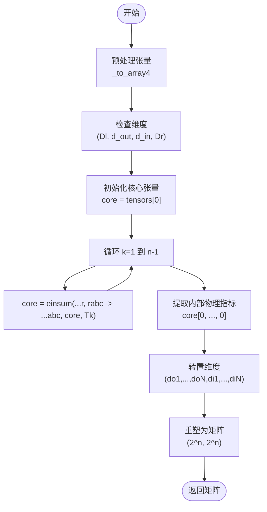

# 中间表示转换

<cite>
**本文档中引用的文件**  
- [mpo_converters.py](file://src/tyxonq/compiler/translation/mpo_converters.py)
- [vqe_extra_mpo.py](file://examples-ng/vqe_extra_mpo.py)
- [mera_extra_mpo.py](file://examples-ng/mera_extra_mpo.py)
- [vqe_extra_mpo_spopt.py](file://examples-ng/vqe_extra_mpo_spopt.py)
- [test_compiler_translation_mpo.py](file://tests_core_module/test_compiler_translation_mpo.py)
</cite>

## 目录
1. [引言](#引言)
2. [MPO转换器功能概述](#mpo转换器功能概述)
3. [核心算法实现](#核心算法实现)
4. [数学原理与张量分解](#数学原理与张量分解)
5. [MPO格式的计算优势](#mpo格式的计算优势)
6. [化学哈密顿量转换示例](#化学哈密顿量转换示例)
7. [时间演化模拟应用](#时间演化模拟应用)
8. [结论](#结论)

## 引言
矩阵乘积算子（Matrix Product Operator, MPO）是量子多体系统中用于高效表示哈密顿量和其他算子的关键工具。在TyxonQ框架中，`mpo_converters.py`模块提供了将外部MPO表示（如来自tensornetwork或quimb库）转换为TyxonQ原生格式的核心功能，支持基于矩阵乘积态（MPS）的高效时间演化和基态求解。本文档详细说明该转换器的设计、实现及其在量子化学模拟中的关键作用。

## MPO转换器功能概述
`mpo_converters.py`模块的核心功能是将不同库生成的MPO对象统一转换为稠密矩阵形式，以便在TyxonQ中进行后续处理。该模块采用鸭子类型（duck-typing）设计，避免引入对`tensornetwork`或`quimb`等重型依赖的硬依赖，仅通过接口兼容性实现跨库互操作。

模块支持两种主要输入格式：
- **Tensornetwork风格**：对象具有`.tensors`属性，每个张量为4D数组，形状为(Dl, d_out, d_in, Dr)
- **Quimb风格**：对象的每个张量具有`.data`属性，提供相同结构的4D数组

输出为通过张量缩并得到的稠密复数矩阵，适用于标准量子线路模拟器或作为MPS模拟器的输入。

**本节来源**  
- [mpo_converters.py](file://src/tyxonq/compiler/translation/mpo_converters.py#L1-L20)

## 核心算法实现
MPO到矩阵的转换由`contract_mpo_to_matrix`函数实现，其核心流程如下：

1. **张量预处理**：通过`_to_array4`函数统一处理输入张量，确保其为4D numpy数组，并转换为`complex128`类型。
2. **链式缩并**：从左到右依次缩并相邻张量，利用`np.einsum`实现高效张量收缩。
3. **维度重组**：提取物理指标并重新排列，将高阶张量重塑为标准矩阵形式。

该算法假设最左侧张量的左边界维度Dl=1，最右侧张量的右边界维度Dr=1，符合标准MPO边界条件。



**图示来源**  
- [mpo_converters.py](file://src/tyxonq/compiler/translation/mpo_converters.py#L39-L77)

**本节来源**  
- [mpo_converters.py](file://src/tyxonq/compiler/translation/mpo_converters.py#L39-L77)

## 数学原理与张量分解
MPO表示法将全局算子分解为局域张量的乘积：
$$
\hat{O} = \sum_{\{s_i,s'_i\}} \text{Tr}(A^{s_1}_{s'_1} A^{s_2}_{s'_2} \cdots A^{s_N}_{s'_N}) |s_1 s_2 \cdots s_N\rangle\langle s'_1 s'_2 \cdots s'_N|
$$
其中每个$A^{s_i}_{s'_i}$是一个矩阵，索引$s_i, s'_i$对应物理指标，矩阵乘法对应虚拟指标的缩并。

在转换过程中，算法通过迭代缩并虚拟指标，最终将MPO还原为全连接的算子矩阵。对于n量子比特系统，结果矩阵维度为$2^n \times 2^n$。该过程保留了算子的完整信息，但牺牲了MPO的压缩优势以换取通用性。

**本节来源**  
- [mpo_converters.py](file://src/tyxonq/compiler/translation/mpo_converters.py#L39-L77)

## MPO格式的计算优势
尽管`contract_mpo_to_matrix`输出稠密矩阵，但MPO表示本身在原始形式下具有显著优势：

- **内存效率**：对于局域相互作用哈密顿量，MPO的虚拟维度D通常很小（如D=3 for Ising model），存储复杂度为$O(nD^2d^2)$而非$O(2^{2n})$。
- **长程相互作用处理**：通过适当构造，MPO可精确表示长程相互作用（如Coulomb势），而无需完全展开。
- **大规模系统适用性**：结合MPS态，MPO允许在虚拟维度截断下模拟数百量子比特系统，远超全振幅模拟的极限。

这些优势使得MPO成为大规模量子化学模拟的首选中间表示。

**本节来源**  
- [vqe_extra_mpo.py](file://examples-ng/vqe_extra_mpo.py#L1-L141)
- [mera_extra_mpo.py](file://examples-ng/mera_extra_mpo.py#L1-L127)

## 化学哈密顿量转换示例
以下代码展示了如何将横向场伊辛模型（TFIM）哈密顿量转换为MPO并用于VQE模拟：

```python
import tensornetwork as tn
import tyxonq as tq

# 构建TFIM哈密顿量的MPO表示
Jx = np.array([1.0 for _ in range(nwires - 1)])
Bz = np.array([-1.0 for _ in range(nwires)])
hamiltonian_mpo = tn.matrixproductstates.mpo.FiniteTFI(Jx, Bz, dtype=np.complex64)
hamiltonian_mpo = tq.quantum.tn2qop(hamiltonian_mpo)  # 转换为TyxonQ格式

# 在VQE中计算MPO期望值
def vqe_forward(param):
    c = tq.Circuit(nwires)
    # 构建变分电路...
    return tq.templates.measurements.mpo_expectation(c, hamiltonian_mpo)
```

此模式可推广至量子化学哈密顿量，通过将分子哈密顿量分解为MPO形式，实现高效基态能量计算。

**本节来源**  
- [vqe_extra_mpo.py](file://examples-ng/vqe_extra_mpo.py#L1-L141)
- [vqe_extra_mpo_spopt.py](file://examples-ng/vqe_extra_mpo_spopt.py#L1-L135)

## 时间演化模拟应用
MPO转换器在时间演化中同样关键。对于哈密顿量$\hat{H}$，时间演化算子$e^{-i\hat{H}t}$可表示为MPO，通过Trotter分解或全息方法实现。转换后的MPO可用于：
- **MPS时间演化**：结合TEBD或时间步进法，模拟量子动力学。
- **虚时演化**：求解基态，等价于VQE中的优化过程。
- **非平衡模拟**：研究淬火、热化等非平衡现象。

示例中`mera_extra_mpo.py`展示了MERA（多尺度纠缠重整化拟设）结合MPO哈密顿量的变分优化，体现了MPO在复杂量子态模拟中的灵活性。

**本节来源**  
- [mera_extra_mpo.py](file://examples-ng/mera_extra_mpo.py#L1-L127)
- [vqe_extra_mpo.py](file://examples-ng/vqe_extra_mpo.py#L1-L141)

## 结论
`mpo_converters.py`模块通过简洁高效的张量缩并算法，实现了跨库MPO格式的统一转换，为TyxonQ中的大规模量子模拟提供了关键基础设施。尽管当前实现侧重于稠密矩阵输出，其设计保留了与稀疏MPO操作的兼容性，未来可扩展支持原生MPO-MPS运算，进一步提升大规模系统的模拟效率。该转换器在量子化学、凝聚态物理等领域的应用前景广阔。