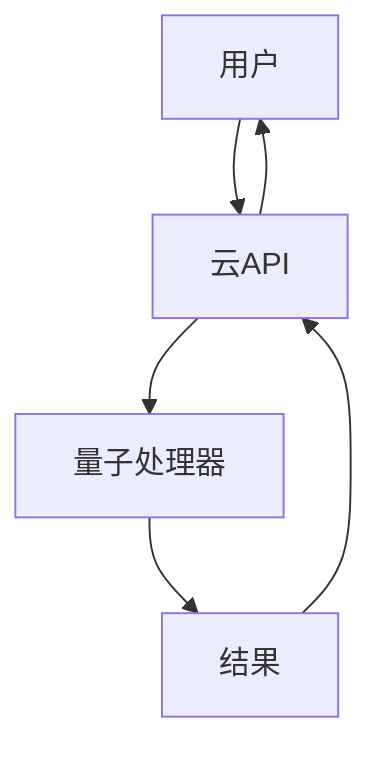
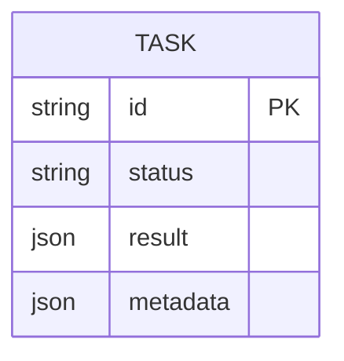
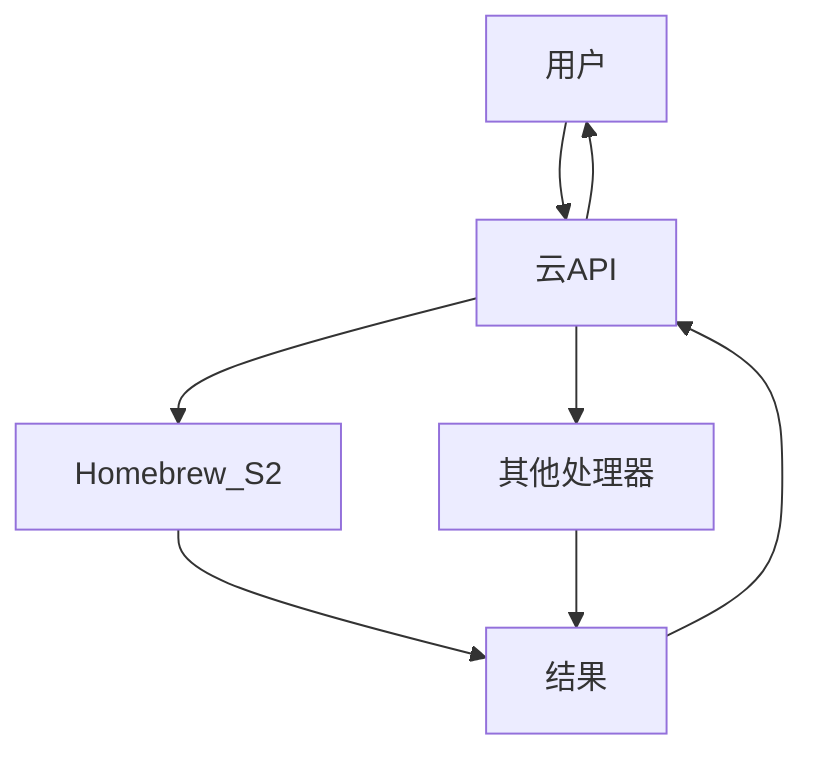

# 云API集成

<cite>
**Referenced Files in This Document**   
- [src/tyxonq/cloud/api.py](file://src/tyxonq/cloud/api.py)
- [src/tyxonq/devices/hardware/tyxonq/driver.py](file://src/tyxonq/devices/hardware/tyxonq/driver.py)
- [src/tyxonq/devices/base.py](file://src/tyxonq/devices/base.py)
- [src/tyxonq/devices/hardware/config.py](file://src/tyxonq/devices/hardware/config.py)
- [src/tyxonq/core/ir/circuit.py](file://src/tyxonq/core/ir/circuit.py)
- [examples/cloud_api_task.py](file://examples/cloud_api_task.py)
- [examples/cloud_api_devices.py](file://examples/cloud_api_devices.py)
- [examples/cloud_api_task_qaoa.py](file://examples/cloud_api_task_qaoa.py)
</cite>

## 目录
1. [简介](#简介)
2. [API端点](#api端点)
3. [认证机制](#认证机制)
4. [请求与响应格式](#请求与响应格式)
5. [代码示例](#代码示例)
6. [速率限制与错误处理](#速率限制与错误处理)
7. [最佳实践](#最佳实践)
8. [量子API网关](#量子api网关)

## 简介

TyxonQ量子云服务提供了一套RESTful接口，允许用户通过云API与量子处理器进行交互。该API作为量子API网关，将用户请求路由到后端的真实量子处理器，如Homebrew_S2。本文档详细说明了如何使用`cloud/api.py`中提供的API端点，包括任务提交、状态查询、结果获取和设备列表查询等功能。

**Section sources**
- [src/tyxonq/cloud/api.py](file://src/tyxonq/cloud/api.py#L1-L124)

## API端点

云API提供了多个端点，用于与TyxonQ量子云服务进行交互。主要端点包括：

- `submit_task`: 提交量子任务
- `get_task_details`: 查询任务状态
- `result`: 获取任务结果
- `list_devices`: 查询设备列表

这些端点通过`cloud/api.py`文件中的函数实现，提供了统一的接口来与不同的量子处理器进行交互。



**Diagram sources**
- [src/tyxonq/cloud/api.py](file://src/tyxonq/cloud/api.py#L1-L124)

**Section sources**
- [src/tyxonq/cloud/api.py](file://src/tyxonq/cloud/api.py#L1-L124)

## 认证机制

云API使用API密钥进行认证。用户需要通过`set_token`函数设置API密钥，该密钥将用于后续的所有API调用。API密钥可以通过环境变量`TYXONQ_API_KEY`或直接在代码中设置。

```python
tq.set_token(token, provider="tyxonq", device="homebrew_s2")
```

**Section sources**
- [src/tyxonq/devices/hardware/config.py](file://src/tyxonq/devices/hardware/config.py#L8-L67)

## 请求与响应格式

云API的请求和响应格式遵循RESTful规范。请求通常包含任务的量子电路、测量次数等信息，响应则包含任务的状态、结果等。

### 请求格式

请求通常包含以下字段：

- `device`: 目标设备
- `shots`: 测量次数
- `source`: 量子电路的QASM源码
- `version`: API版本
- `lang`: 量子语言

### 响应格式

响应通常包含以下字段：

- `id`: 任务ID
- `status`: 任务状态
- `result`: 任务结果
- `metadata`: 任务元数据



**Diagram sources**
- [src/tyxonq/devices/hardware/tyxonq/driver.py](file://src/tyxonq/devices/hardware/tyxonq/driver.py#L1-L193)

**Section sources**
- [src/tyxonq/devices/hardware/tyxonq/driver.py](file://src/tyxonq/devices/hardware/tyxonq/driver.py#L1-L193)

## 代码示例

以下代码示例展示了如何使用云API执行量子任务，从任务构建、提交到结果解析的全过程。

### 任务提交

```python
res_legacy = tq.api.submit_task(provider="tyxonq", device="homebrew_s2", source=bell_qasm(), shots=100)
```

### 状态查询

```python
details = tq.api.get_task_details(t)
```

### 结果获取

```python
result = tq.api.result(task)
```

### 设备列表查询

```python
devs = tq.api.list_devices(provider="tyxonq")
```

**Section sources**
- [examples/cloud_api_task.py](file://examples/cloud_api_task.py#L1-L65)
- [examples/cloud_api_devices.py](file://examples/cloud_api_devices.py#L1-L29)

## 速率限制与错误处理

云API对请求频率进行了限制，以防止滥用。当请求频率超过限制时，API将返回错误。用户应实现适当的错误处理机制，以应对这些情况。

### 错误处理

```python
try:
    details = tq.api.get_task_details(t)
except Exception as e:
    print("legacy detail error:", e)
```

**Section sources**
- [src/tyxonq/devices/hardware/tyxonq/driver.py](file://src/tyxonq/devices/hardware/tyxonq/driver.py#L1-L193)

## 最佳实践

使用云API时，应遵循以下最佳实践：

- 始终设置API密钥
- 使用适当的测量次数
- 处理可能的错误
- 遵守速率限制

**Section sources**
- [src/tyxonq/cloud/api.py](file://src/tyxonq/cloud/api.py#L1-L124)

## 量子API网关

云API作为量子API网关，将用户请求路由到后端的真实量子处理器。这种设计使得用户可以透明地与不同的量子处理器进行交互，而无需关心底层的实现细节。



**Diagram sources**
- [src/tyxonq/cloud/api.py](file://src/tyxonq/cloud/api.py#L1-L124)
- [src/tyxonq/devices/hardware/tyxonq/driver.py](file://src/tyxonq/devices/hardware/tyxonq/driver.py#L1-L193)

**Section sources**
- [src/tyxonq/cloud/api.py](file://src/tyxonq/cloud/api.py#L1-L124)
- [src/tyxonq/devices/hardware/tyxonq/driver.py](file://src/tyxonq/devices/hardware/tyxonq/driver.py#L1-L193)