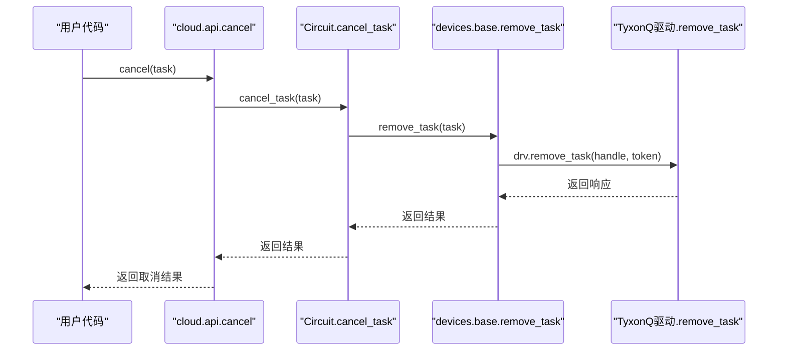
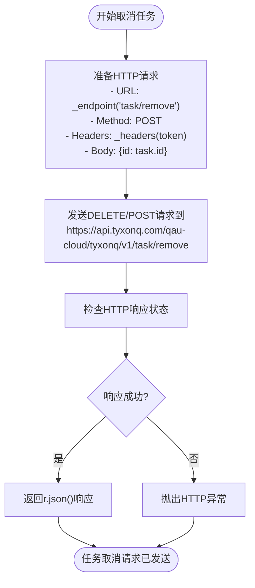

# 任务取消

<cite>
**Referenced Files in This Document**   
- [TyxonQTask](file://src/tyxonq/devices/hardware/tyxonq/driver.py#L12-L41)
- [cloud/api.py](file://src/tyxonq/cloud/api.py#L103-L107)
- [circuit.py](file://src/tyxonq/core/ir/circuit.py#L524-L537)
- [base.py](file://src/tyxonq/devices/base.py#L372-L383)
- [driver.py](file://src/tyxonq/devices/hardware/tyxonq/driver.py#L185-L189)
- [simulators/driver.py](file://src/tyxonq/devices/simulators/driver.py#L139-L140)
</cite>

## 目录
1. [简介](#简介)
2. [调用链路分析](#调用链路分析)
3. [TyxonQ驱动中的取消实现](#tyxonq驱动中的取消实现)
4. [异常处理机制](#异常处理机制)
5. [调用示例与使用模式](#调用示例与使用模式)
6. [未来扩展建议](#未来扩展建议)

## 简介
本文档详细说明了TyxonQ量子计算框架中任务取消功能的实现机制。该功能允许用户通过传递`TyxonQTask`对象来取消正在执行或排队中的量子计算任务。文档将追踪从高层`cloud.api.cancel`接口到底层驱动`remove_task`的完整委托流程，分析当前代码的实现状态，并解释其异常处理机制。

**Section sources**
- [cloud/api.py](file://src/tyxonq/cloud/api.py#L1-L124)

## 调用链路分析

任务取消功能的调用链路遵循一个清晰的委托模式，从云API层逐步向下传递到具体的硬件驱动层。



**Diagram sources**
- [cloud/api.py](file://src/tyxonq/cloud/api.py#L103-L107)
- [circuit.py](file://src/tyxonq/core/ir/circuit.py#L524-L537)
- [base.py](file://src/tyxonq/devices/base.py#L372-L383)
- [driver.py](file://src/tyxonq/devices/hardware/tyxonq/driver.py#L185-L189)

### 云API层 (cloud.api.cancel)
用户首先调用`cloud.api.cancel`函数，该函数作为统一的云API门面，负责将取消请求委托给核心电路模块。

**Section sources**
- [cloud/api.py](file://src/tyxonq/cloud/api.py#L103-L107)

### 核心电路层 (Circuit.cancel_task)
`cloud.api.cancel`函数内部调用`core.ir.circuit`模块中的`cancel_task`函数。该函数负责解析任务的设备信息，确定正确的驱动程序，并检查驱动是否支持`remove_task`操作。

**Section sources**
- [circuit.py](file://src/tyxonq/core/ir/circuit.py#L524-L537)

### 设备基础层 (devices.base.remove_task)
`cancel_task`函数进一步委托给`devices.base`模块中的`remove_task`函数。该函数作为设备层的统一入口，负责将`DeviceTask`包装器解包，并调用相应驱动的实际`remove_task`方法。

**Section sources**
- [base.py](file://src/tyxonq/devices/base.py#L372-L383)

## TyxonQ驱动中的取消实现

在`TyxonQ`驱动中，`remove_task`函数的实现是通过向特定的API端点发送HTTP请求来完成的。



**Diagram sources**
- [driver.py](file://src/tyxonq/devices/hardware/tyxonq/driver.py#L185-L189)
- [config.py](file://src/tyxonq/devices/hardware/config.py#L10-L13)

### 实现细节
- **端点构造**: 使用`_endpoint("task/remove")`函数构造完整的API URL。
- **认证**: 通过`_headers(token)`函数在请求头中包含Bearer Token进行身份验证。
- **请求体**: 发送包含任务ID的JSON对象`{"id": task.id}`。
- **超时**: 设置15秒的请求超时时间。

值得注意的是，尽管代码结构已经完整，但当前的取消逻辑可能尚未在后端服务中完全实现，此函数仅负责发送取消请求。

**Section sources**
- [driver.py](file://src/tyxonq/devices/hardware/tyxonq/driver.py#L185-L189)

## 异常处理机制

当目标驱动不支持`remove_task`操作时，系统会抛出`NotImplementedError`异常，这是一种明确的、可预测的错误处理方式。

```mermaid
flowchart TD
A[调用cancel] --> B{驱动有remove_task?}
B --> |是| C[调用drv.remove_task()]
B --> |否| D[抛出NotImplementedError]
C --> E[返回结果]
D --> F[捕获异常]
F --> G[处理不支持取消的情况]
```

**Diagram sources**
- [circuit.py](file://src/tyxonq/core/ir/circuit.py#L524-L537)
- [base.py](file://src/tyxonq/devices/base.py#L372-L383)

### 机制说明
1. 在`Circuit.cancel`和`base.remove_task`函数中，都会使用`hasattr(drv, "remove_task")`来检查驱动对象是否实现了`remove_task`方法。
2. 如果方法不存在，则直接抛出`NotImplementedError`异常，并附带描述性信息"cancel not supported for this provider/task type"。
3. 这种设计使得API的行为是明确的：要么成功取消，要么明确告知用户该操作不被支持，避免了静默失败。

**Section sources**
- [circuit.py](file://src/tyxonq/core/ir/circuit.py#L524-L537)
- [base.py](file://src/tyxonq/devices/base.py#L372-L383)

## 调用示例与使用模式

### 基本调用示例
```python
# 假设 task 是一个已提交的 TyxonQTask 对象
from tyxonq.cloud import api

try:
    result = api.cancel(task)
    print("任务取消请求已发送:", result)
except NotImplementedError as e:
    print("该设备不支持取消操作:", str(e))
except Exception as e:
    print("取消任务时发生错误:", str(e))
```

### 预期异常处理模式
开发者应使用try-except块来处理取消操作，主要捕获`NotImplementedError`以应对不支持的场景。

**Section sources**
- [api.py](file://src/tyxonq/cloud/api.py#L103-L107)
- [circuit.py](file://src/tyxonq/core/ir/circuit.py#L524-L537)

## 未来扩展建议
1. **增强状态检查**: 在调用`remove_task`前，可以先通过`get_task_details`检查任务状态，避免对已完成的任务发送取消请求。
2. **异步确认**: 当前实现只发送取消请求，未来可增加轮询机制以确认任务确实已被取消。
3. **模拟器支持**: 目前模拟器驱动也实现了`remove_task`，返回`{"state": "cancelled"}`，这为统一的测试和开发体验提供了良好基础。
4. **更丰富的响应**: 后端API可以返回更详细的取消状态，如"cancelled", "cancelling", "not_found"等。

**Section sources**
- [simulators/driver.py](file://src/tyxonq/devices/simulators/driver.py#L139-L140)