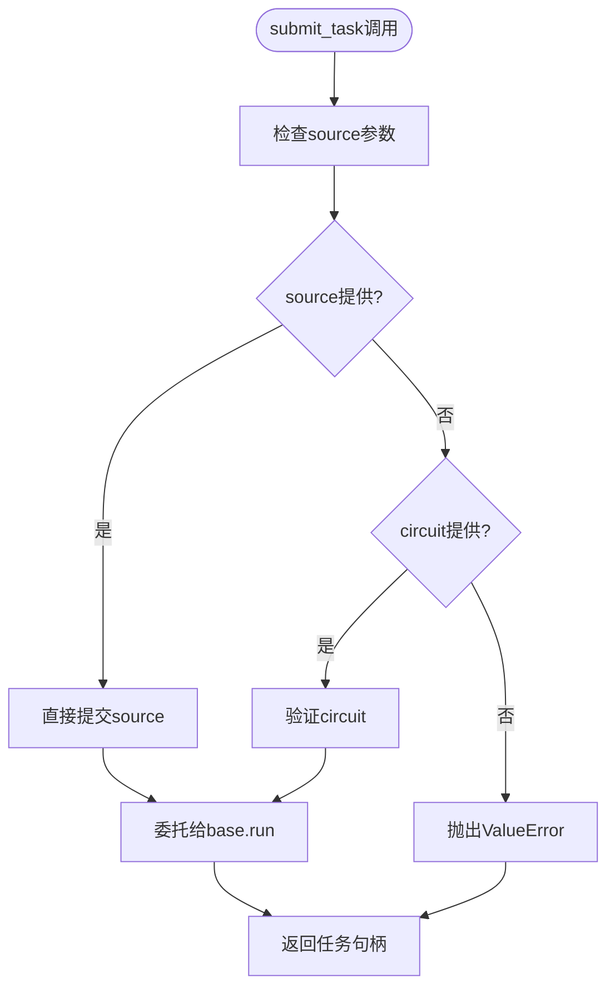
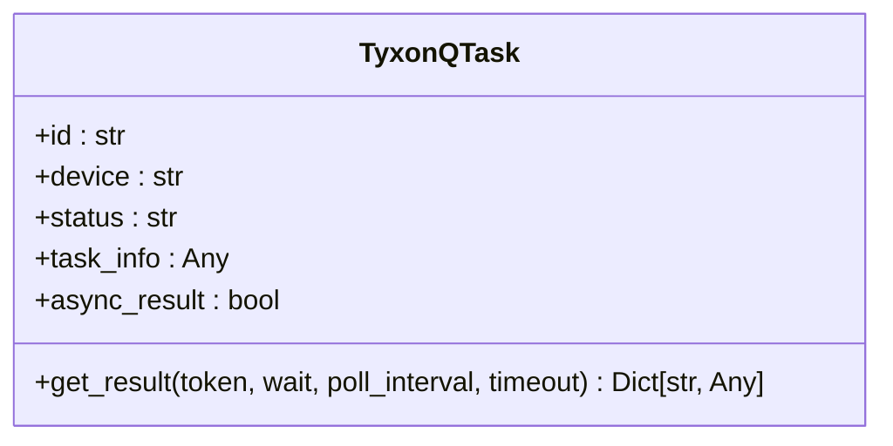
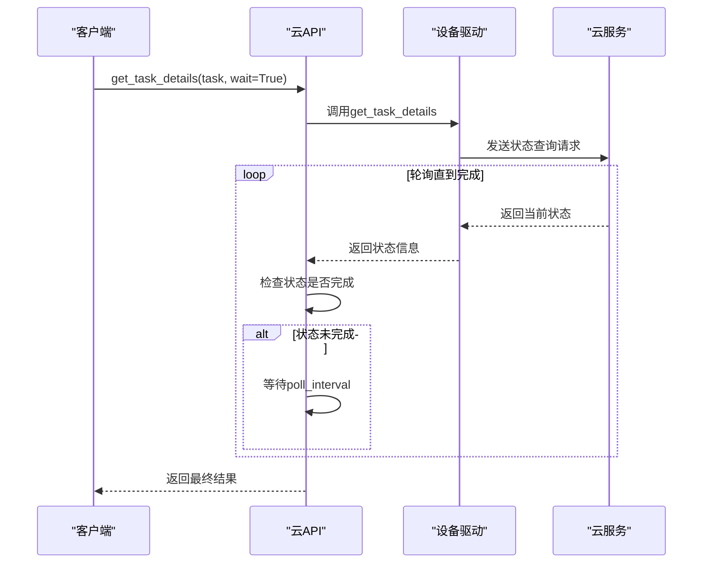
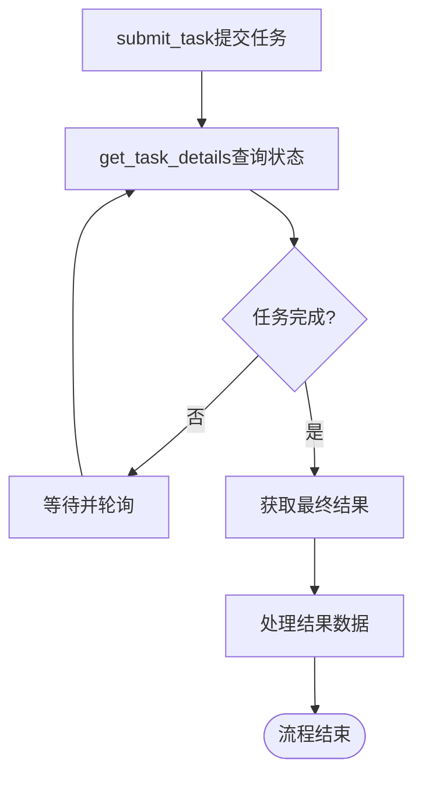

# 任务管理

<cite>
**本文档引用的文件**
- [api.py](file://src/tyxonq/cloud/api.py)
- [base.py](file://src/tyxonq/devices/base.py)
- [driver.py](file://src/tyxonq/devices/hardware/tyxonq/driver.py)
- [cloud_api_task.py](file://examples/cloud_api_task.py)
- [cloud_api_task_qaoa.py](file://examples/cloud_api_task_qaoa.py)
</cite>

## 目录
1. [简介](#简介)
2. [核心任务管理函数](#核心任务管理函数)
3. [submit_task函数详解](#submit_task函数详解)
4. [TyxonQTask对象结构](#tyxonqtask对象结构)
5. [任务状态查询与轮询](#任务状态查询与轮询)
6. [任务取消机制](#任务取消机制)
7. [任务生命周期管理示例](#任务生命周期管理示例)
8. [总结](#总结)

## 简介
本文档详细介绍了TyxonQ云API中的任务管理功能，重点涵盖`submit_task`、`get_task_details`、`result`和`cancel`等核心函数的使用方法和内部实现机制。文档将深入分析任务提交、状态查询、结果获取和取消操作的完整流程，为开发者提供全面的使用指导。

## 核心任务管理函数
TyxonQ云API提供了一组核心函数用于管理量子计算任务，这些函数构成了任务生命周期管理的基础。

**Section sources**
- [api.py](file://src/tyxonq/cloud/api.py#L41-L107)

## submit_task函数详解
`submit_task`函数是提交量子计算任务的核心接口，负责将电路或源代码提交到指定的量子设备进行执行。

### 参数配置
`submit_task`函数支持以下关键参数：

- **provider**: 指定服务提供商，如"tyxonq"
- **device**: 指定目标设备，如"homebrew_s2"
- **circuit**: 可选的电路对象
- **source**: 可选的源代码字符串或字符串序列
- **shots**: 采样次数，可为整数或整数序列
- **token**: 认证令牌
- **auto_compile**: 是否自动编译标志

### 内部处理机制
`submit_task`函数通过委托模式将任务处理统一到`devices.base.run`函数中，实现了行为的一致性。当提供`source`参数时，函数会直接将源代码提交给目标设备；当提供`circuit`参数时，需要在调用前完成编译。

**Diagram sources**
- [api.py](file://src/tyxonq/cloud/api.py#L41-L62)
- [base.py](file://src/tyxonq/devices/base.py#L200-L320)

**Section sources**
- [api.py](file://src/tyxonq/cloud/api.py#L41-L62)
- [base.py](file://src/tyxonq/devices/base.py#L200-L320)

## TyxonQTask对象结构
`TyxonQTask`对象是任务提交后返回的核心数据结构，封装了任务的所有相关信息。

### 属性说明
- **id**: 任务唯一标识符
- **device**: 目标设备信息
- **status**: 当前任务状态
- **task_info**: 任务详细信息
- **async_result**: 异步执行标志

### 异步执行特性
`TyxonQTask`对象支持异步执行模式，通过`get_result`方法可以实现阻塞或非阻塞的结果获取。当`async_result`为`True`时，任务在云端异步执行，需要通过轮询机制获取最终结果。

**Diagram sources**
- [driver.py](file://src/tyxonq/devices/hardware/tyxonq/driver.py#L12-L41)

**Section sources**
- [driver.py](file://src/tyxonq/devices/hardware/tyxonq/driver.py#L12-L41)

## 任务状态查询与轮询
`get_task_details`函数用于查询任务的当前状态和执行结果。

### 查询机制
该函数通过调用底层驱动的`get_task_details`方法获取任务详情，并对结果进行标准化处理，确保返回格式的一致性。

### 轮询支持
通过设置`wait`参数为`True`，可以启用轮询机制，函数将定期检查任务状态直到完成或超时。`poll_interval`参数控制轮询间隔，`timeout`参数设置最大等待时间。

**Diagram sources**
- [api.py](file://src/tyxonq/cloud/api.py#L65-L70)
- [base.py](file://src/tyxonq/devices/base.py#L332-L366)
- [driver.py](file://src/tyxonq/devices/hardware/tyxonq/driver.py#L128-L182)

**Section sources**
- [api.py](file://src/tyxonq/cloud/api.py#L65-L70)
- [base.py](file://src/tyxonq/devices/base.py#L332-L366)
- [driver.py](file://src/tyxonq/devices/hardware/tyxonq/driver.py#L128-L182)

## 任务取消机制
`cancel`函数提供了终止正在运行任务的能力。

### 实现原理
该函数通过委托模式调用`core.ir.circuit`模块的`cancel_task`函数，最终由设备驱动的`remove_task`方法执行实际的取消操作。

### 使用限制
并非所有提供商都支持任务取消功能。如果驱动不支持`remove_task`方法，将抛出`NotImplementedError`异常。

**Section sources**
- [api.py](file://src/tyxonq/cloud/api.py#L103-L107)
- [base.py](file://src/tyxonq/devices/base.py#L369-L388)

## 任务生命周期管理示例
以下示例展示了从任务提交到结果获取的完整生命周期管理过程。

### 基本流程

### 代码示例
通过`examples/cloud_api_task.py`中的示例代码，可以学习如何使用链式调用方式构建、编译和提交量子电路任务。示例展示了两种任务提交方式：直接提交OPENQASM源码和通过电路对象链式调用。

**Diagram sources**
- [cloud_api_task.py](file://examples/cloud_api_task.py#L30-L60)

**Section sources**
- [cloud_api_task.py](file://examples/cloud_api_task.py#L30-L60)
- [cloud_api_task_qaoa.py](file://examples/cloud_api_task_qaoa.py#L1-L80)

## 总结
TyxonQ云API的任务管理功能提供了一套完整且灵活的接口，支持从任务提交、状态监控到结果获取和取消的全生命周期管理。通过统一的委托模式和标准化的数据结构，确保了不同设备和提供商之间的一致性体验，为量子计算应用开发提供了坚实的基础。