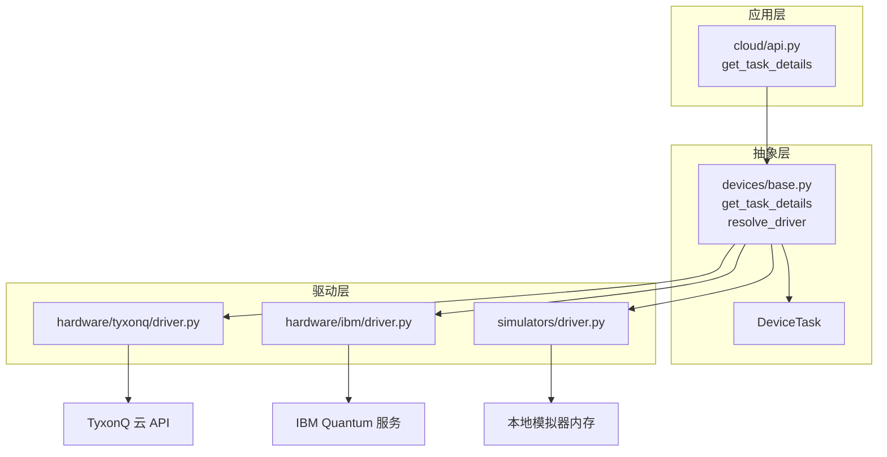
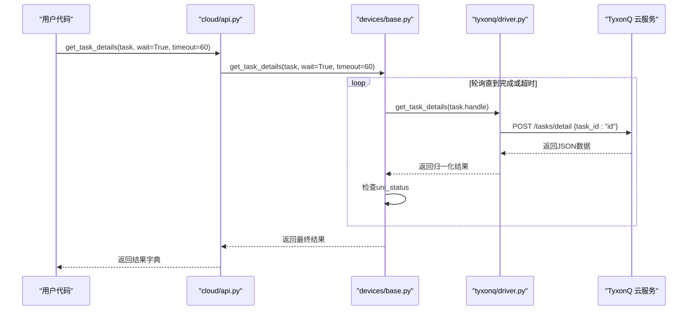
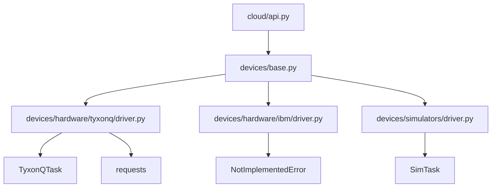

# 状态查询

<cite>
**本文档中引用的文件**  
- [api.py](file://src/tyxonq/cloud/api.py)
- [base.py](file://src/tyxonq/devices/base.py)
- [driver.py](file://src/tyxonq/devices/hardware/tyxonq/driver.py)
- [driver.py](file://src/tyxonq/devices/hardware/ibm/driver.py)
- [circuit.py](file://src/tyxonq/core/ir/circuit.py)
- [driver.py](file://src/tyxonq/devices/simulators/driver.py)
</cite>

## 目录
1. [简介](#简介)
2. [核心组件](#核心组件)
3. [架构概览](#架构概览)
4. [详细组件分析](#详细组件分析)
5. [依赖分析](#依赖分析)
6. [性能考量](#性能考量)
7. [故障排除指南](#故障排除指南)
8. [结论](#结论)

## 简介
本文档详细说明了 TyxonQ 量子计算框架中任务状态查询功能的设计与实现，重点聚焦于 `get_task_details` 函数的行为与设计。该功能支持对远程量子任务的异步轮询与结果获取，通过统一的接口抽象不同硬件驱动（如 TyxonQ 云平台、IBM 等）的差异。文档将解析其如何接收 `TyxonQTask` 对象并支持 `wait`、`poll_interval`、`timeout` 等轮询控制参数，描述其内部通过 `resolve_driver` 动态加载硬件驱动并调用底层方法获取原始响应的过程。特别地，将重点解析 TyxonQ 驱动如何与 `/tasks/detail` 端点交互，解析返回 JSON 中的 `uni_status`、`result`、`ts` 时间戳等关键字段，并将其归一化为统一的输出结构。同时，文档将说明该接口在 IBM 驱动中的实现限制以及模拟器任务的本地结果获取机制。

## 核心组件
`get_task_details` 是一个核心的跨平台查询函数，其设计遵循分层委托模式。顶层入口位于 `cloud/api.py`，它将请求委托给 `devices/base.py` 中的统一处理函数。该函数首先验证任务对象类型，然后通过 `resolve_driver` 根据任务的 `provider` 和 `device` 信息动态加载对应的硬件驱动模块。对于非阻塞查询，它直接调用驱动的 `get_task_details` 方法；对于阻塞查询（`wait=True`），它会在循环中持续轮询，直到任务状态变为完成或超时。最终，所有驱动的原始响应都会被归一化为包含 `result`（标准化计数）和 `result_meta`（原始元数据）的统一字典结构，确保上层应用逻辑的一致性。

**核心组件来源**
- [api.py](file://src/tyxonq/cloud/api.py#L65-L70)
- [base.py](file://src/tyxonq/devices/base.py#L332-L366)

## 架构概览
整个任务状态查询功能的架构体现了清晰的分层与抽象。应用层通过 `cloud/api.py` 提供的统一接口发起查询。该接口不直接处理任何硬件细节，而是将任务委托给 `devices/base.py` 模块。`base.py` 模块扮演着“统一抽象层”的角色，它定义了 `DeviceTask` 数据结构和 `resolve_driver` 路由机制。根据任务的提供者（provider），`resolve_driver` 会动态导入并实例化具体的硬件驱动，如 `tyxonq/driver.py` 或 `ibm/driver.py`。具体的驱动实现则负责与底层硬件或云服务的 API 进行直接通信。这种设计实现了高内聚、低耦合，使得添加新的硬件支持变得简单，只需实现对应的驱动接口即可。

**图表来源**
- [api.py](file://src/tyxonq/cloud/api.py#L65-L70)
- [base.py](file://src/tyxonq/devices/base.py#L116-L129)
- [driver.py](file://src/tyxonq/devices/hardware/tyxonq/driver.py#L128-L182)
- [driver.py](file://src/tyxonq/devices/hardware/ibm/driver.py#L35-L36)
- [driver.py](file://src/tyxonq/devices/simulators/driver.py#L116-L117)

## 详细组件分析

### get_task_details 函数分析
`get_task_details` 函数是整个查询功能的核心，其行为在不同层级有不同的实现，共同构成了完整的功能。

#### 顶层接口与参数处理
位于 `cloud/api.py` 的 `get_task_details` 函数是用户调用的主要入口。它接收一个任务对象和一系列关键字参数，包括 `wait`（是否阻塞等待）、`poll_interval`（轮询间隔）和 `timeout`（超时时间）。此函数的主要职责是进行参数预处理和委托，它将请求直接转发给 `devices/base.py` 中的同名函数，并传递所有轮询控制参数。值得注意的是，`token` 参数在此层被接收但暂未使用，为未来扩展预留了空间。

**来源**
- [api.py](file://src/tyxonq/cloud/api.py#L65-L70)

#### 统一抽象层与轮询逻辑
`devices/base.py` 中的 `get_task_details` 函数是真正的逻辑中心。它首先进行类型检查，确保传入的是 `DeviceTask` 对象。然后，它使用 `resolve_driver` 根据任务的 `provider` 和 `device` 动态获取正确的驱动实例。该函数内部定义了两个关键的辅助函数：`_fetch` 用于调用底层驱动获取原始信息，`_wrap` 用于将原始信息归一化为统一的输出结构。当 `wait=False` 时，函数执行一次 `_fetch` 并立即返回。当 `wait=True` 时，函数进入一个循环，持续调用 `_fetch`，并检查返回数据中的 `uni_status` 字段。如果状态为完成或超时，则循环结束，返回结果。这实现了对异步任务的智能轮询。

**来源**
- [base.py](file://src/tyxonq/devices/base.py#L332-L366)

#### TyxonQ 驱动实现
`hardware/tyxonq/driver.py` 模块实现了与 TyxonQ 云平台的直接交互。其 `get_task_details` 函数接收一个 `TyxonQTask` 对象，构造一个指向 `/tasks/detail` 端点的 POST 请求，将任务 ID 作为 JSON 负载发送。请求成功后，它解析返回的 JSON 数据。为了兼容性，函数会检查返回数据中是否包含 `uni_status` 字段，若不存在则从 `task.state` 字段推断。最终，它提取计数结果（`result`）和 shots 数，并将原始响应数据封装在 `result_meta` 中，构建并返回归一化的输出字典。

**图表来源**
- [driver.py](file://src/tyxonq/devices/hardware/tyxonq/driver.py#L128-L182)

#### IBM 驱动限制
`hardware/ibm/driver.py` 模块目前仅作为骨架存在。其 `get_task_details` 函数直接抛出 `NotImplementedError` 异常，明确指出“IBM 驱动是骨架；查询尚未连接”。这表明当前版本的 TyxonQ 框架尚未实现对 IBM Quantum 服务的任务状态查询功能。此设计允许框架在接口层面保持完整，而具体的实现将在未来通过 Qiskit 适配器等方式添加。

**来源**
- [driver.py](file://src/tyxonq/devices/hardware/ibm/driver.py#L35-L36)

#### 模拟器任务处理
对于在本地运行的模拟器任务，其处理机制更为直接。`devices/simulators/driver.py` 中的 `get_task_details` 函数接收一个 `SimTask` 对象，该对象通常内联存储了计算结果。因此，该函数的实现非常简单，直接调用 `task.get_result()` 方法即可获取结果，无需任何网络通信或轮询。这保证了本地模拟任务的高效性。

**来源**
- [driver.py](file://src/tyxonq/devices/simulators/driver.py#L116-L117)

## 依赖分析
`get_task_details` 功能的实现依赖于一个精心设计的依赖链。`cloud/api.py` 依赖于 `devices/base.py` 提供的统一接口。`devices/base.py` 是核心依赖枢纽，它依赖于 `resolve_driver` 函数来动态加载具体的硬件驱动（`tyxonq/driver.py` 或 `ibm/driver.py`），并依赖于 `DeviceTask` 数据结构来封装任务信息。各个硬件驱动模块则依赖于外部库（如 `requests`）进行网络通信，或依赖于内部数据结构（如 `TyxonQTask`）来访问任务属性。这种依赖关系确保了功能的模块化和可扩展性。

**图表来源**
- [api.py](file://src/tyxonq/cloud/api.py#L65-L70)
- [base.py](file://src/tyxonq/devices/base.py#L116-L129)
- [driver.py](file://src/tyxonq/devices/hardware/tyxonq/driver.py#L12-L41)
- [driver.py](file://src/tyxonq/devices/hardware/ibm/driver.py#L35-L36)
- [driver.py](file://src/tyxonq/devices/simulators/driver.py#L116-L117)

## 性能考量
该功能的性能主要受网络延迟和轮询策略的影响。对于远程硬件任务，`poll_interval` 的设置至关重要。过短的间隔会增加对云服务的请求压力，可能导致被限流；过长的间隔则会增加任务完成后的响应延迟。默认的 2.0 秒间隔是一个合理的折衷。`timeout` 参数防止了无限等待，保证了程序的健壮性。对于本地模拟器任务，由于没有网络开销，性能极高。未来对 IBM 驱动的实现也应考虑引入指数退避等更智能的轮询策略以优化性能。

## 故障排除指南
在使用 `get_task_details` 时可能遇到的常见问题包括：
- **TypeError: Task handle should be a DeviceTask type**：传入的 `task` 对象不是 `DeviceTask` 类型。请确保任务是通过 `submit_task` 或 `run` 等框架函数创建的。
- **NotImplementedError: IBM driver is a skeleton...**：尝试查询 IBM 任务的状态。当前版本不支持此功能，应避免对 IBM 任务调用此函数。
- **requests.exceptions.RequestException**：网络请求失败。检查网络连接、API 端点 URL 和认证 token 是否正确。
- **超时但任务仍在运行**：`timeout` 参数设置过短。可以适当增加 `timeout` 值，或在应用逻辑中处理超时情况，稍后再次查询。

**来源**
- [base.py](file://src/tyxonq/devices/base.py#L332-L366)
- [driver.py](file://src/tyxonq/devices/hardware/ibm/driver.py#L35-L36)

## 结论
`get_task_details` 函数通过分层设计和驱动抽象，成功地为 TyxonQ 框架提供了一个强大且统一的任务状态查询接口。它支持灵活的轮询控制，能够处理来自 TyxonQ 云平台和本地模拟器的异步任务，并将结果归一化以便于后续处理。尽管目前对 IBM 等第三方平台的支持尚不完整，但其模块化的设计为未来的功能扩展奠定了坚实的基础。开发者在使用时应理解其工作原理和限制，以确保高效、可靠地获取量子计算任务的结果。