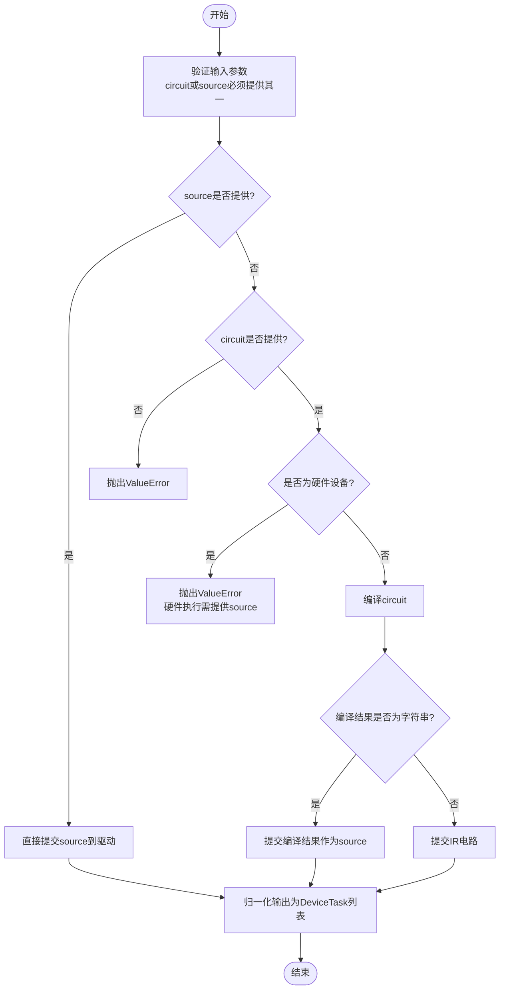
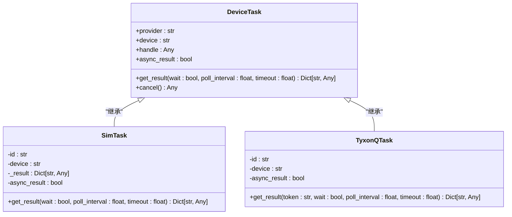

# 执行接口

<cite>
**本文档引用的文件**
- [api.py](file://src/tyxonq/cloud/api.py) - *更新了GPU后端支持*
- [base.py](file://src/tyxonq/devices/base.py) - *核心执行逻辑与任务模型*
- [circuit.py](file://src/tyxonq/core/ir/circuit.py) - *电路类执行接口*
- [driver.py](file://src/tyxonq/devices/simulators/driver.py) - *模拟器驱动实现*
- [tyxonq/driver.py](file://src/tyxonq/devices/hardware/tyxonq/driver.py) - *TyxonQ硬件驱动*
- [ibm/driver.py](file://src/tyxonq/devices/hardware/ibm/driver.py) - *IBM硬件驱动骨架*
- [native_compiler.py](file://src/tyxonq/compiler/compile_engine/native/native_compiler.py) - *本地编译器实现*
- [qiskit_compiler.py](file://src/tyxonq/compiler/compile_engine/qiskit/qiskit_compiler.py) - *Qiskit编译器适配*
- [gpu_backend.py](file://src/tyxonq/applications/chem/classical_chem_cloud/server/gpu_backend.py) - *新增GPU后端实现*
- [gpu_chem.py](file://src/tyxonq/applications/chem/classical_chem_cloud/server/gpu_chem.py) - *GPU化学计算服务*
- [app.py](file://src/tyxonq/applications/chem/classical_chem_cloud/server/app.py) - *服务器主应用*
</cite>

## 更新摘要
**变更内容**
- 更新了GPU后端支持，增强了云服务的计算能力
- 新增了GPU化学计算服务模块，优化了高性能计算场景
- 重构了服务器架构，提升了服务稳定性和可维护性
- 保持原有执行接口设计不变，确保API兼容性

## 目录
1. [引言](#引言)
2. [核心设计与实现](#核心设计与实现)
3. [参数规范与处理](#参数规范与处理)
4. [内部委托模式](#内部委托模式)
5. [返回值标准化](#返回值标准化)
6. [与Circuit类的协同关系](#与circuit类的协同关系)
7. [执行流程图解](#执行流程图解)
8. [任务对象模型](#任务对象模型)

## 引言
`run`函数是TyxonQ框架中的统一执行接口，作为高层抽象，为本地模拟器和远程硬件设备提供一致的执行入口。该接口通过统一的调用签名，屏蔽了底层设备差异，实现了对量子电路执行请求的标准化处理。其设计目标是为用户提供简洁、一致的API，同时保持对底层执行细节的灵活控制。

## 核心设计与实现
`run`函数的设计核心在于其作为统一入口的抽象能力。它通过`src.tyxonq.cloud.api.run`函数暴露给用户，该函数直接委托给`src.tyxonq.devices.base.run`进行实际处理。这种分层设计实现了关注点分离：`cloud.api`层提供用户友好的顶层接口，而`devices.base`层负责设备选择、参数归一化和任务分发等核心逻辑。

该函数支持两种输入模式：`circuit`（高级IR表示）和`source`（已编译的底层源码，如QASM）。这种设计允许用户在需要时绕过编译阶段，直接提交预编译的程序，从而实现更精细的控制。函数的返回值被标准化为`DeviceTask`对象列表，无论输入是单个任务还是批处理任务，都提供统一的处理接口。

**Section sources**
- [api.py](file://src/tyxonq/cloud/api.py#L73-L93)
- [base.py](file://src/tyxonq/devices/base.py#L162-L280)

## 参数规范与处理
### circuit与source的互斥性
`circuit`和`source`参数是互斥的，必须且只能提供其中之一。`circuit`参数接受`Circuit`对象或其序列，代表高级量子电路IR。`source`参数接受字符串或字符串序列，代表已编译的底层源码（如QASM2）。如果同时提供两者，函数的行为取决于设备类型：对于本地模拟器，`circuit`参数优先；对于远程硬件，`source`参数是必需的。

### shots参数的归一化处理
`shots`参数用于指定执行的采样次数，默认值为1024。该参数支持整数或整数序列（用于批处理）。在处理过程中，系统会进行归一化：
- 如果`shots`不是序列类型，则尝试转换为整数，失败则使用默认值。
- 对于远程硬件设备，`shots`值为0会被强制转换为1，因为硬件执行必须进行实际采样。
- 对于本地模拟器，`shots=0`具有特殊语义，表示使用解析方法计算期望值，而非采样。

### 选项传递机制
通过`**opts`参数，用户可以传递任意的设备特定选项。这些选项会被直接传递给底层驱动。此外，系统还支持一些预定义的选项，如`use_noise`和`noise`，用于控制噪声模拟。如果用户未显式设置`use_noise`，则使用全局噪声配置。如果启用了噪声但未提供噪声配置，则使用默认的去极化噪声模型。

**Section sources**
- [base.py](file://src/tyxonq/devices/base.py#L200-L215)
- [base.py](file://src/tyxonq/devices/base.py#L220-L240)

## 内部委托模式
`run`函数的核心是其委托模式。`cloud.api.run`函数不包含任何业务逻辑，仅作为入口点，将所有工作委托给`devices.base.run`。这种设计确保了所有执行逻辑的集中化，避免了代码重复。

`devices.base.run`函数根据`provider`和`device`参数选择合适的驱动：
- 对于`simulator`或`local`提供者，使用`devices.simulators.driver`。
- 对于`tyxonq`提供者，使用`devices.hardware.tyxonq.driver`。
- 对于`ibm`提供者，使用`devices.hardware.ibm.driver`。

选定驱动后，函数根据输入类型（`circuit`或`source`）和设备类型（模拟器或硬件）决定执行路径。对于硬件设备，如果提供了`circuit`而非`source`，函数会抛出错误，强制用户在电路层完成编译。

**Section sources**
- [api.py](file://src/tyxonq/cloud/api.py#L73-L93)
- [base.py](file://src/tyxonq/devices/base.py#L116-L129)
- [base.py](file://src/tyxonq/devices/base.py#L245-L270)

## 返回值标准化
`run`函数始终返回一个`DeviceTask`对象列表，实现了返回值的完全标准化。`DeviceTask`是一个数据类，包含以下字段：
- `provider`: 执行任务的提供者名称。
- `device`: 执行任务的设备名称。
- `handle`: 指向底层任务句柄的引用。
- `async_result`: 布尔值，指示任务是否为异步。

对于本地模拟器，`async_result`为`False`，`get_result(wait=False)`会立即返回结果。对于远程硬件，`async_result`为`True`，`get_result(wait=True)`会轮询直到任务完成。`get_result`方法还负责统一结果格式，确保`result`、`metadata`、`expectations`等字段始终存在，即使值为空。

**Section sources**
- [base.py](file://src/tyxonq/devices/base.py#L13-L38)
- [base.py](file://src/tyxonq/devices/base.py#L275-L280)

## 与Circuit类的协同关系
`Circuit`类的`run`方法是`run`函数的主要调用者之一，两者形成了紧密的协同关系。`Circuit.run`方法首先检查是否在构造时提供了`source`。如果提供了，则直接调用`device_base.run`提交`source`。否则，它会先调用`self.compile`进行编译，然后根据编译结果决定是提交`source`还是`circuit`。

这种设计支持链式调用。用户可以创建一个`Circuit`对象，然后通过链式方法配置编译、设备和后处理选项，最后调用`run`执行。例如：`circuit.device(provider="tyxonq", device="homebrew_s2").postprocessing(method="readout_mitigation", cals=cal_data).run(shots=1000)`。`Circuit.run`在返回最终结果前，还会应用后处理（如读出校正），这通过`postprocessing.apply_postprocessing`函数实现。

**Section sources**
- [circuit.py](file://src/tyxonq/core/ir/circuit.py#L404-L515)
- [__init__.py](file://src/tyxonq/postprocessing/__init__.py#L15-L132)

## 执行流程图解

**Diagram sources**
- [base.py](file://src/tyxonq/devices/base.py#L245-L270)

## 任务对象模型

**Diagram sources**
- [base.py](file://src/tyxonq/devices/base.py#L13-L38)
- [driver.py](file://src/tyxonq/devices/simulators/driver.py#L6-L16)
- [tyxonq/driver.py](file://src/tyxonq/devices/hardware/tyxonq/driver.py#L12-L41)