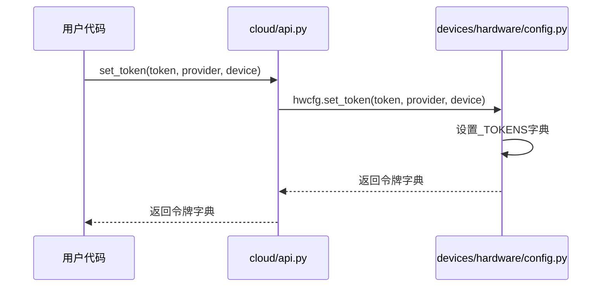

# 认证与配置

<cite>
**Referenced Files in This Document**   
- [api.py](file://src/tyxonq/cloud/api.py)
- [config.py](file://src/tyxonq/devices/hardware/config.py)
</cite>

## 目录
1. [简介](#简介)
2. [核心认证机制](#核心认证机制)
3. [令牌存储与作用域](#令牌存储与作用域)
4. [默认配置管理](#默认配置管理)
5. [安全最佳实践](#安全最佳实践)

## 简介

本文档详细说明了TyxonQ云API的认证与配置机制，重点介绍`set_token`和`set_default`函数的实现与使用方式。文档涵盖了API密钥身份验证的实现细节、令牌存储机制、作用域规则以及安全最佳实践，为开发者提供完整的认证配置指导。

## 核心认证机制

云API认证机制通过`set_token`函数实现，支持设备级和提供商级的令牌配置。该函数作为统一的云API门面，允许用户通过API密钥进行身份验证。

`set_token`函数接受令牌字符串以及可选的提供商和设备参数，通过硬件配置模块进行令牌设置。当未指定提供商或设备时，函数会使用默认值，确保认证配置的灵活性。该机制不仅支持直接的API密钥认证，还兼容环境变量`TYXONQ_API_KEY`作为备用认证方式。



**Diagram sources**
- [api.py](file://src/tyxonq/cloud/api.py#L21-L22)
- [config.py](file://src/tyxonq/devices/hardware/config.py#L20-L27)

**Section sources**
- [api.py](file://src/tyxonq/cloud/api.py#L21-L22)
- [config.py](file://src/tyxonq/devices/hardware/config.py#L20-L27)

## 令牌存储与作用域

认证系统使用`_TOKENS`字典作为核心令牌存储机制，该字典在`devices/hardware/config.py`中定义，用于存储所有配置的认证令牌。

### 作用域规则

系统实现了灵活的作用域规则，支持两种层级的令牌配置：
- **provider::device**：设备级作用域，针对特定提供商的特定设备
- **provider::**：提供商级作用域，针对特定提供商的所有设备

当调用`set_token`函数时，系统会同时存储设备级和提供商级的令牌条目，为后续的API调用提供灵活性。这种双重存储机制确保了在不同作用域下的认证需求都能得到满足。

```mermaid
classDiagram
class TokenManager {
+_TOKENS : Dict[str, str]
+_DEFAULTS : Dict[str, str]
+set_token(token, provider, device) : Dict[str, str]
+get_token(provider, device) : Optional[str]
+ENDPOINTS : Dict[str, Dict[str, str]]
}
TokenManager : 存储设备级令牌 key_device = provider : : device
TokenManager : 存储提供商级令牌 key_provider = provider : :
TokenManager : 支持环境变量回退 TYXONQ_API_KEY
```

**Diagram sources**
- [config.py](file://src/tyxonq/devices/hardware/config.py#L6-L6)
- [config.py](file://src/tyxonq/devices/hardware/config.py#L20-L27)

**Section sources**
- [config.py](file://src/tyxonq/devices/hardware/config.py#L6-L6)
- [config.py](file://src/tyxonq/devices/hardware/config.py#L20-L27)

## 默认配置管理

系统通过`set_default`函数管理默认的提供商和设备配置，这些设置直接影响后续的API调用行为。

### 函数实现

`set_default`函数允许用户设置默认的提供商和设备，这些值存储在`_DEFAULTS`字典中。当API调用未明确指定提供商或设备时，系统会自动使用这些默认值，简化了常规操作的配置流程。

```python
# 设置默认提供商和设备
[SPEC SYMBOL](file://src/tyxonq/devices/hardware/config.py#L42-L46)
```

### 配置优先级

系统遵循明确的配置优先级规则：
1. 函数调用参数（最高优先级）
2. `set_default`设置的默认值
3. 环境变量`TYXONQ_API_KEY`
4. 系统内置默认值（最低优先级）

这种分层的配置机制确保了系统的灵活性和易用性，同时保持了配置的一致性。

**Section sources**
- [config.py](file://src/tyxonq/devices/hardware/config.py#L42-L46)
- [config.py](file://src/tyxonq/devices/hardware/config.py#L7-L7)

## 安全最佳实践

### 令牌保密性

为确保认证令牌的安全性，建议遵循以下最佳实践：
- **环境变量优先**：将敏感的API密钥存储在环境变量`TYXONQ_API_KEY`中，而非硬编码在代码中
- **最小权限原则**：为不同应用场景创建具有最小必要权限的令牌
- **定期轮换**：定期更新认证令牌，降低泄露风险

### 作用域最小化

遵循作用域最小化原则，根据实际需求选择适当的令牌作用域：
- 对于特定设备的操作，使用设备级作用域`provider::device`
- 对于跨设备的操作，使用提供商级作用域`provider::`
- 避免使用过于宽泛的作用域，以限制潜在的安全影响范围

### 错误处理策略

虽然当前实现中未包含复杂的错误处理逻辑，但系统设计考虑了基本的容错机制：
- 当内存中未找到令牌时，自动回退到环境变量`TYXONQ_API_KEY`
- 提供清晰的函数返回值，便于调用方进行后续处理
- 通过类型注解确保参数的正确性，减少运行时错误

**Section sources**
- [config.py](file://src/tyxonq/devices/hardware/config.py#L39-L39)
- [examples/cloud_api_devices.py](file://examples/cloud_api_devices.py#L3-L3)