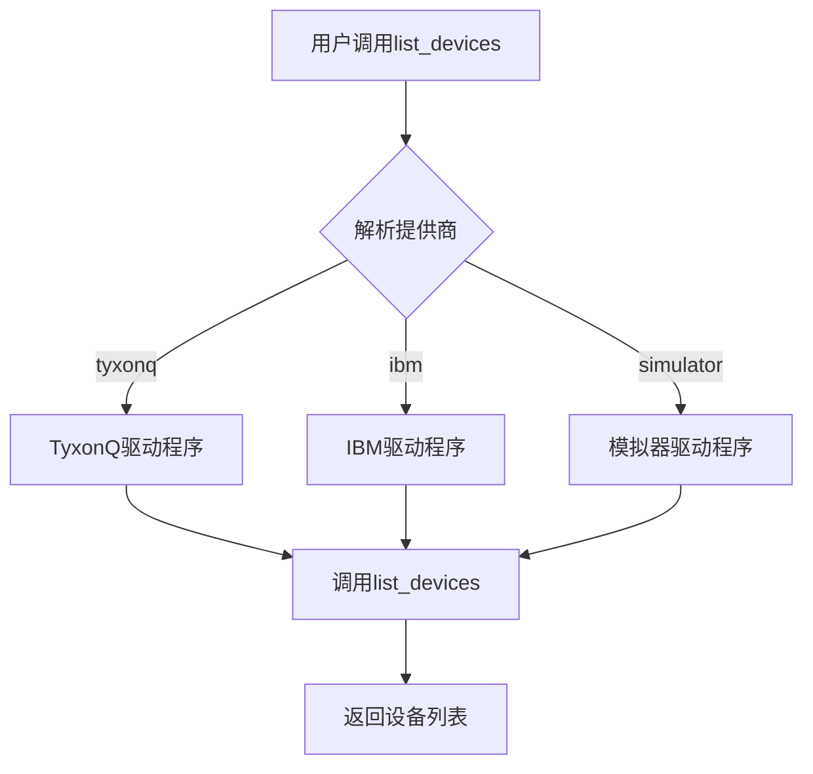
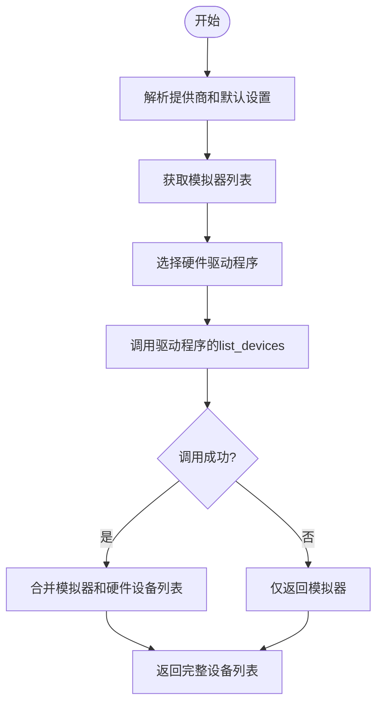
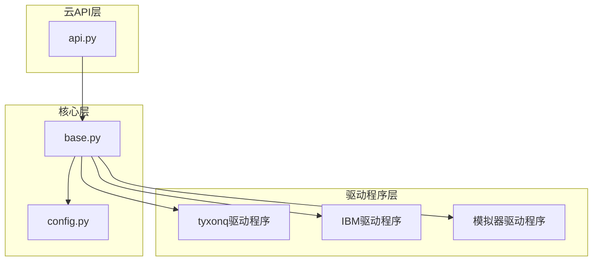

# 设备交互

<cite>
**Referenced Files in This Document**   
- [api.py](file://src/tyxonq/cloud/api.py)
- [driver.py](file://src/tyxonq/devices/hardware/tyxonq/driver.py)
- [driver.py](file://src/tyxonq/devices/simulators/driver.py)
- [base.py](file://src/tyxonq/devices/base.py)
- [config.py](file://src/tyxonq/devices/hardware/config.py)
- [cloud_api_devices.py](file://examples/cloud_api_devices.py)
</cite>

## 目录
1. [简介](#简介)
2. [设备发现机制](#设备发现机制)
3. [设备枚举功能](#设备枚举功能)
4. [设备信息查询](#设备信息查询)
5. [硬件驱动集成](#硬件驱动集成)
6. [代码示例](#代码示例)
7. [结论](#结论)

## 简介
本文档详细介绍了TyxonQ平台中的设备交互功能，重点阐述了`list_devices`和`device`函数的使用方法。文档说明了如何通过统一的云API接口枚举可用的量子设备，支持按提供商过滤，并获取特定设备的详细描述符。同时，文档还解释了设备发现机制如何与硬件驱动程序集成，以及如何处理来自不同提供商（如IBM、TyxonQ）的设备查询请求。

**Section sources**
- [api.py](file://src/tyxonq/cloud/api.py#L1-L124)

## 设备发现机制

TyxonQ平台的设备发现机制通过分层架构实现，将设备枚举请求路由到相应的硬件驱动程序。该机制的核心是`resolve_driver`函数，它根据指定的提供商名称选择正确的驱动程序实现。



**Diagram sources**
- [base.py](file://src/tyxonq/devices/base.py#L116-L129)
- [api.py](file://src/tyxonq/cloud/api.py#L37-L38)

**Section sources**
- [base.py](file://src/tyxonq/devices/base.py#L116-L129)
- [api.py](file://src/tyxonq/cloud/api.py#L37-L38)

## 设备枚举功能

`list_devices`函数提供了统一的接口来枚举系统中可用的量子设备。该函数支持按提供商过滤设备列表，并聚合来自不同来源的设备信息。

### 功能特性
- 支持多种提供商：TyxonQ、IBM、本地模拟器
- 自动聚合模拟器和硬件设备列表
- 支持通过令牌进行身份验证
- 提供灵活的过滤选项

### 实现流程


**Diagram sources**
- [base.py](file://src/tyxonq/devices/base.py#L310-L328)
- [driver.py](file://src/tyxonq/devices/simulators/driver.py#L32-L37)

**Section sources**
- [base.py](file://src/tyxonq/devices/base.py#L310-L328)
- [driver.py](file://src/tyxonq/devices/hardware/tyxonq/driver.py#L55-L61)
- [driver.py](file://src/tyxonq/devices/simulators/driver.py#L32-L37)

## 设备信息查询

`device`函数用于获取特定量子设备的详细描述符，包括设备名称、ID和配置参数等关键信息。

### 函数签名
```python
def device(name: Union[str, None] = None, *, provider: Optional[str] = None, id: Optional[str] = None, shots: Optional[int] = None) -> Dict[str, Any]:
```

### 参数说明
- `name`: 设备名称（可选）
- `provider`: 服务提供商（可选）
- `id`: 设备ID（可选）
- `shots`: 测量次数（可选）

### 返回值结构
返回字典包含以下关键字段：
- `provider`: 设备所属的提供商
- `device`: 完整的设备标识符
- `shots`: 默认测量次数配置

```mermaid
classDiagram
class DeviceDescriptor {
+str provider
+str device
+int shots
}
DeviceDescriptor : +provider : str
DeviceDescriptor : +device : str
DeviceDescriptor : +shots : int
```

**Diagram sources**
- [api.py](file://src/tyxonq/cloud/api.py#L29-L30)
- [base.py](file://src/tyxonq/devices/base.py#L330-L345)

**Section sources**
- [api.py](file://src/tyxonq/cloud/api.py#L29-L30)
- [base.py](file://src/tyxonq/devices/base.py#L330-L345)

## 硬件驱动集成

设备发现机制与硬件驱动程序的集成通过标准化的驱动接口实现。每个提供商都有独立的驱动程序实现，但遵循统一的API规范。

### 驱动程序架构


### TyxonQ驱动程序实现
TyxonQ驱动程序通过HTTP API与远程服务通信，获取设备列表和详细信息。

```python
def list_devices(token: Optional[str] = None, **kws: Any) -> List[str]:
    url = _endpoint("devices/list")
    r = requests.post(url, json=kws, headers=_headers(token), timeout=15)
    r.raise_for_status()
    data = r.json()
    devs = [d["id"] for d in data.get("devices", [])]
    return [f"tyxonq::{d}" for d in devs]
```

**Diagram sources**
- [driver.py](file://src/tyxonq/devices/hardware/tyxonq/driver.py#L55-L61)
- [config.py](file://src/tyxonq/devices/hardware/config.py#L1-L68)

**Section sources**
- [driver.py](file://src/tyxonq/devices/hardware/tyxonq/driver.py#L55-L61)
- [config.py](file://src/tyxonq/devices/hardware/config.py#L1-L68)

## 代码示例

以下示例展示了如何使用`list_devices`和`device`函数进行设备枚举和信息查询。

### 基本用法
```python
import tyxonq as tq
from getpass import getpass

# 设置认证令牌
token = getpass("Enter your token: ")
tq.set_token(token, provider="tyxonq")

# 枚举TyxonQ提供商的所有设备
devs = tq.api.list_devices(provider="tyxonq")
print(devs)

# 获取特定设备的描述符
desc = tq.api.device(name="tyxonq::processor_001")
print(desc)
```

### 高级用法
```python
# 获取默认设备信息
default_device = tq.api.device()

# 指定测量次数
device_with_shots = tq.api.device(name="simulator::statevector", shots=1000)

# 通过ID查询设备
device_by_id = tq.api.device(id="processor_001", provider="tyxonq")
```

**Section sources**
- [cloud_api_devices.py](file://examples/cloud_api_devices.py#L1-L29)

## 结论

TyxonQ平台的设备交互功能提供了一套完整且灵活的API，用于管理和查询量子计算资源。通过`list_devices`和`device`函数，用户可以方便地发现可用设备、获取设备详细信息，并为后续的量子任务执行做好准备。该机制的设计充分考虑了可扩展性，能够轻松集成新的硬件提供商，同时保持API的一致性和易用性。