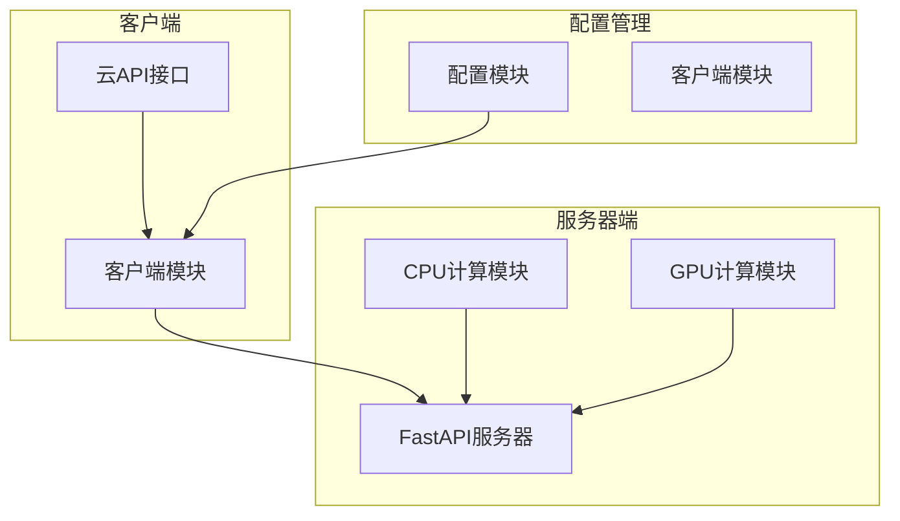
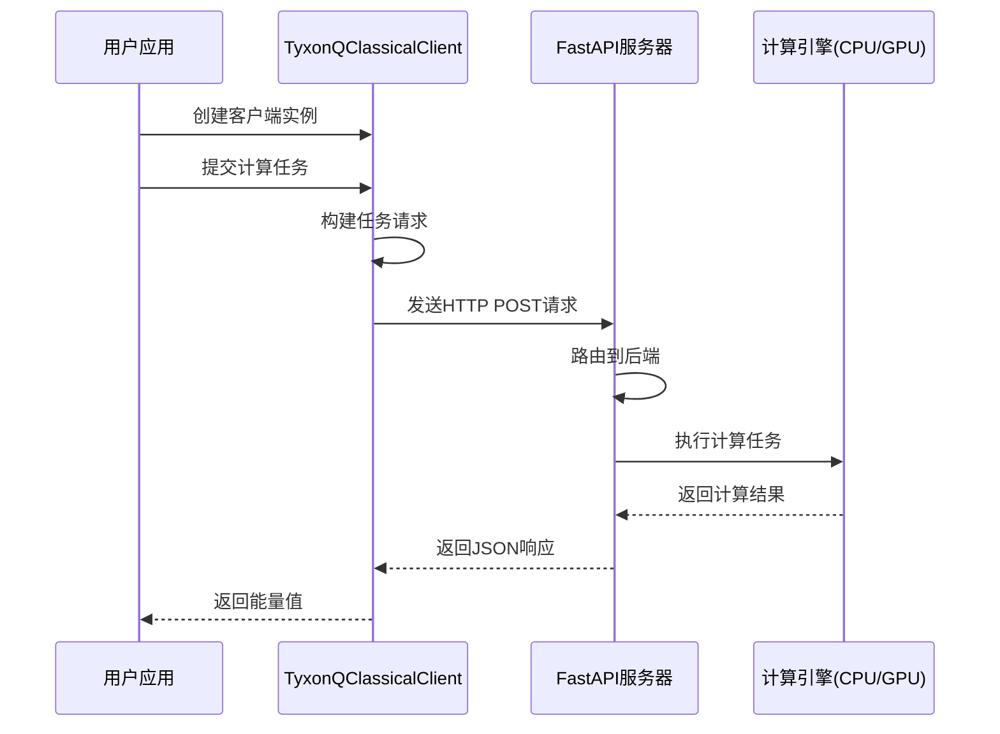
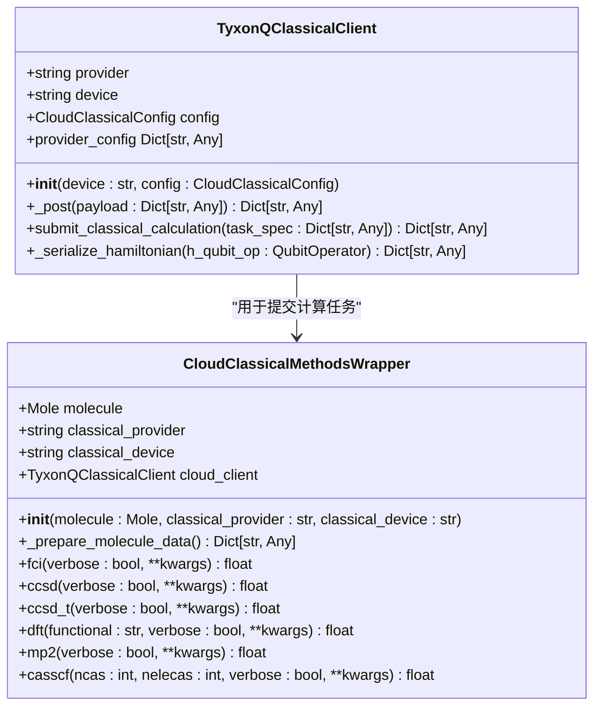
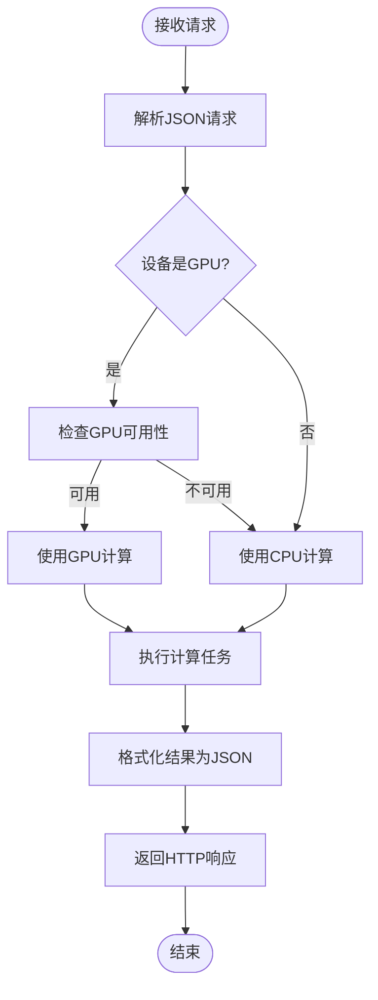
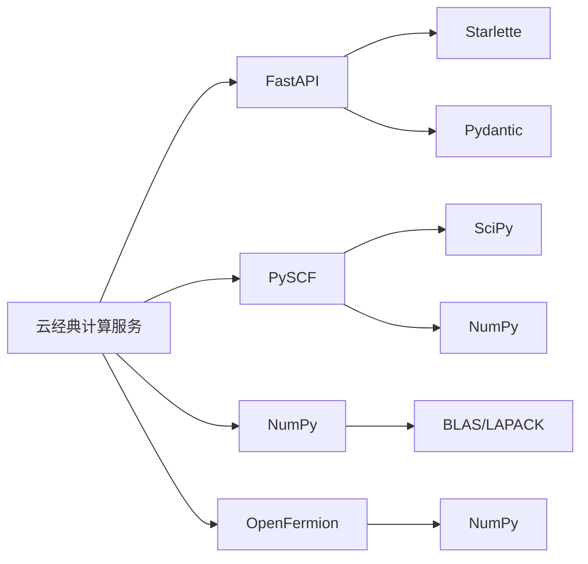

# 云经典计算服务

<cite>
**本文档引用的文件**
- [cloud_classical_design_summary.md](file://docs-ng/source/next/cloud_classical_design_summary.md)
- [api.py](file://src/tyxonq/cloud/api.py)
- [app.py](file://src/tyxonq/applications/chem/classical_chem_cloud/server/app.py)
- [clients.py](file://src/tyxonq/applications/chem/classical_chem_cloud/clients.py)
- [classical_methods.py](file://src/tyxonq/applications/chem/classical_chem_cloud/classical_methods.py)
- [cpu_chem.py](file://src/tyxonq/applications/chem/classical_chem_cloud/server/cpu_chem.py)
- [gpu_chem.py](file://src/tyxonq/applications/chem/classical_chem_cloud/server/gpu_chem.py)
- [config.py](file://src/tyxonq/applications/chem/classical_chem_cloud/config.py)
- [tyxonq_cloud_api.md](file://docs/tyxonq_cloud_api.md)
</cite>

## 目录
1. [简介](#简介)
2. [项目结构](#项目结构)
3. [核心组件](#核心组件)
4. [架构概述](#架构概述)
5. [详细组件分析](#详细组件分析)
6. [依赖分析](#依赖分析)
7. [性能考虑](#性能考虑)
8. [故障排除指南](#故障排除指南)
9. [结论](#结论)

## 简介
云经典计算服务为量子化学计算提供高性能的云端经典计算支持。该服务旨在将繁重的经典计算任务（如Hartree-Fock计算、分子轨道积分等）卸载到云端，同时保持量子-经典混合算法的确定性和可调试性。通过统一的客户端接口，用户可以轻松地在本地和云端之间切换计算资源，实现计算效率的最大化。

## 项目结构
云经典计算服务的项目结构清晰地划分了客户端、服务器端和配置管理三个主要部分。客户端负责与用户交互和任务提交，服务器端负责执行具体的计算任务，配置管理则确保了服务的灵活性和可扩展性。

**图示来源**
- [app.py](file://src/tyxonq/applications/chem/classical_chem_cloud/server/app.py)
- [clients.py](file://src/tyxonq/applications/chem/classical_chem_cloud/clients.py)
- [config.py](file://src/tyxonq/applications/chem/classical_chem_cloud/config.py)

**节来源**
- [app.py](file://src/tyxonq/applications/chem/classical_chem_cloud/server/app.py)
- [clients.py](file://src/tyxonq/applications/chem/classical_chem_cloud/clients.py)

## 核心组件
云经典计算服务的核心组件包括统一的客户端接口、服务器端计算引擎和配置管理系统。这些组件协同工作，为用户提供无缝的云端计算体验。

**节来源**
- [clients.py](file://src/tyxonq/applications/chem/classical_chem_cloud/clients.py)
- [classical_methods.py](file://src/tyxonq/applications/chem/classical_chem_cloud/classical_methods.py)
- [config.py](file://src/tyxonq/applications/chem/classical_chem_cloud/config.py)

## 架构概述
云经典计算服务采用客户端-服务器架构，通过HTTP协议进行通信。客户端负责构建计算请求并提交到服务器，服务器根据请求中的设备参数选择合适的计算资源执行任务，并将结果返回给客户端。

**图示来源**
- [app.py](file://src/tyxonq/applications/chem/classical_chem_cloud/server/app.py)
- [clients.py](file://src/tyxonq/applications/chem/classical_chem_cloud/clients.py)

## 详细组件分析

### 客户端分析
客户端组件提供了统一的接口，使用户能够轻松地与云经典计算服务进行交互。通过`TyxonQClassicalClient`类，用户可以指定计算设备（CPU、GPU或自动选择）并提交各种量子化学计算任务。

**图示来源**
- [clients.py](file://src/tyxonq/applications/chem/classical_chem_cloud/clients.py)
- [classical_methods.py](file://src/tyxonq/applications/chem/classical_chem_cloud/classical_methods.py)

**节来源**
- [clients.py](file://src/tyxonq/applications/chem/classical_chem_cloud/clients.py)
- [classical_methods.py](file://src/tyxonq/applications/chem/classical_chem_cloud/classical_methods.py)

### 服务器端分析
服务器端组件负责接收客户端的计算请求，并根据请求中的设备参数选择合适的计算引擎执行任务。服务器采用FastAPI框架构建，支持异步处理和高并发。

**图示来源**
- [app.py](file://src/tyxonq/applications/chem/classical_chem_cloud/server/app.py)
- [cpu_chem.py](file://src/tyxonq/applications/chem/classical_chem_cloud/server/cpu_chem.py)
- [gpu_chem.py](file://src/tyxonq/applications/chem/classical_chem_cloud/server/gpu_chem.py)

**节来源**
- [app.py](file://src/tyxonq/applications/chem/classical_chem_cloud/server/app.py)
- [cpu_chem.py](file://src/tyxonq/applications/chem/classical_chem_cloud/server/cpu_chem.py)

## 依赖分析
云经典计算服务依赖于多个外部库和框架，包括FastAPI用于构建Web服务器，PySCF用于量子化学计算，以及各种数值计算库。

**图示来源**
- [app.py](file://src/tyxonq/applications/chem/classical_chem_cloud/server/app.py)
- [cpu_chem.py](file://src/tyxonq/applications/chem/classical_chem_cloud/server/cpu_chem.py)
- [gpu_chem.py](file://src/tyxonq/applications/chem/classical_chem_cloud/server/gpu_chem.py)

**节来源**
- [app.py](file://src/tyxonq/applications/chem/classical_chem_cloud/server/app.py)
- [cpu_chem.py](file://src/tyxonq/applications/chem/classical_chem_cloud/server/cpu_chem.py)

## 性能考虑
云经典计算服务在设计时充分考虑了性能因素。通过将计算密集型任务卸载到云端，特别是利用GPU加速，可以显著提高大型分子系统的计算效率。服务器端的资源管理机制确保了计算资源的最优利用，而客户端的异步调用支持则提高了应用程序的响应性。

## 故障排除指南
当使用云经典计算服务时，可能会遇到一些常见问题。以下是一些故障排除建议：

1. **连接问题**：确保客户端能够访问服务器端点。检查网络连接和防火墙设置。
2. **认证失败**：验证提供的认证令牌是否正确有效。
3. **计算超时**：对于大型计算任务，可能需要增加超时设置。
4. **资源不足**：如果请求的计算资源超出服务器能力，考虑优化计算参数或使用更强大的计算实例。

**节来源**
- [clients.py](file://src/tyxonq/applications/chem/classical_chem_cloud/clients.py)
- [app.py](file://src/tyxonq/applications/chem/classical_chem_cloud/server/app.py)

## 结论
云经典计算服务为量子化学计算提供了一个强大而灵活的云端解决方案。通过将经典计算任务卸载到云端，研究人员可以专注于科学问题本身，而不必担心计算资源的限制。该服务的设计考虑了易用性、性能和可扩展性，为未来的量子-经典混合计算奠定了坚实的基础。