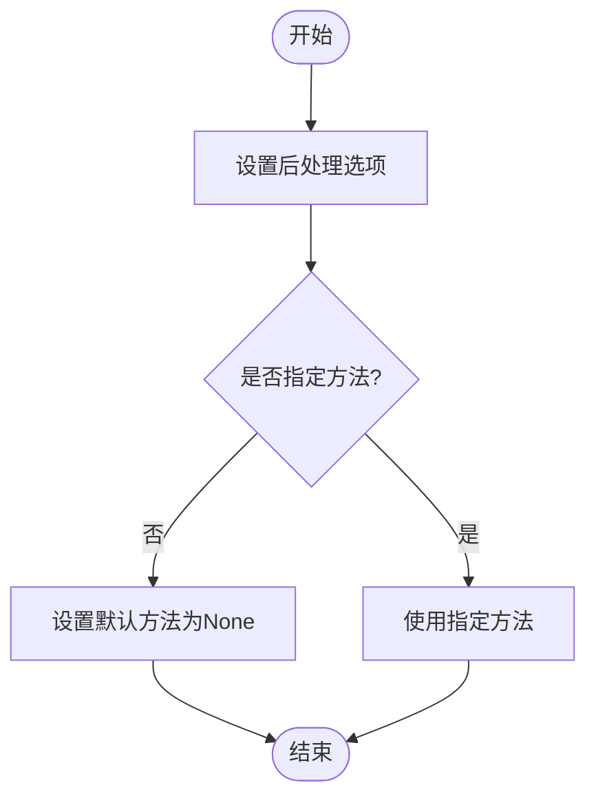

<cite>
**Referenced Files in This Document**   
- [error_mitigation.py](file://src/tyxonq/postprocessing/error_mitigation.py)
- [classical_shadows.py](file://src/tyxonq/postprocessing/classical_shadows.py)
- [readout.py](file://src/tyxonq/postprocessing/readout.py)
- [metrics.py](file://src/tyxonq/postprocessing/metrics.py)
- [io.py](file://src/tyxonq/postprocessing/io.py)
- [noise_analysis.py](file://src/tyxonq/postprocessing/noise_analysis.py)
- [counts_expval.py](file://src/tyxonq/postprocessing/counts_expval.py)
- [circuit.py](file://src/tyxonq/core/ir/circuit.py)
</cite>

# 后处理模块

## 目录
1. [简介](#简介)
2. [核心组件](#核心组件)
3. [误差缓解技术](#误差缓解技术)
4. [经典阴影方法](#经典阴影方法)
5. [读出校正](#读出校正)
6. [度量计算](#度量计算)
7. [输入输出处理](#输入输出处理)
8. [噪声分析](#噪声分析)
9. [后处理流程配置](#后处理流程配置)
10. [后处理策略建议](#后处理策略建议)

## 简介

后处理模块是量子计算结果分析的关键组成部分，负责将原始测量结果转换为可靠、高质量的物理量。该模块提供了一系列核心技术，包括误差缓解、经典阴影和读出校正，旨在提高量子计算结果的准确性和可靠性。通过这些技术，用户可以获得更精确的期望值、保真度等物理量，从而更好地理解和利用量子计算的结果。

**Section sources**
- [circuit.py](file://src/tyxonq/core/ir/circuit.py#L183-L188)

## 核心组件

后处理模块包含多个核心组件，每个组件负责不同的任务。主要组件包括误差缓解、经典阴影、读出校正、度量计算、输入输出处理和噪声分析。这些组件协同工作，确保量子计算结果的准确性和可靠性。

**Section sources**
- [error_mitigation.py](file://src/tyxonq/postprocessing/error_mitigation.py#L0-L81)
- [classical_shadows.py](file://src/tyxonq/postprocessing/classical_shadows.py#L0-L114)
- [readout.py](file://src/tyxonq/postprocessing/readout.py#L0-L142)
- [metrics.py](file://src/tyxonq/postprocessing/metrics.py#L0-L304)
- [io.py](file://src/tyxonq/postprocessing/io.py#L0-L221)
- [noise_analysis.py](file://src/tyxonq/postprocessing/noise_analysis.py#L0-L105)
- [counts_expval.py](file://src/tyxonq/postprocessing/counts_expval.py#L0-L114)

## 误差缓解技术

误差缓解技术是后处理模块的重要组成部分，旨在减少量子计算中的噪声影响。主要技术包括零噪声外推（ZNE）、动态解耦（DD）和随机编译（RC）。

### 零噪声外推（ZNE）

零噪声外推是一种通过在不同噪声水平下运行电路并外推到零噪声极限来估计无噪声结果的技术。`apply_zne`函数实现了这一技术的基本框架，通过多次执行电路并取平均值来减少噪声影响。

**Section sources**
- [error_mitigation.py](file://src/tyxonq/postprocessing/error_mitigation.py#L0-L81)

### 动态解耦（DD）

动态解耦通过在电路中插入额外的脉冲序列来抑制环境噪声。`apply_dd`函数实现了这一技术的基本框架，通过多次执行电路并取平均值来减少噪声影响。

**Section sources**
- [error_mitigation.py](file://src/tyxonq/postprocessing/error_mitigation.py#L0-L81)

### 随机编译（RC）

随机编译通过随机化电路的实现方式来平均化噪声影响。`apply_rc`函数实现了这一技术的基本框架，通过多次执行电路并取平均值来减少噪声影响。

**Section sources**
- [error_mitigation.py](file://src/tyxonq/postprocessing/error_mitigation.py#L0-L81)

## 经典阴影方法

经典阴影方法是一种高效的量子态估计技术，通过少量测量即可获得量子态的有用信息。该方法的核心是生成随机的Pauli基并从经典计数中估计Z期望值。

### 随机Pauli基生成

`random_pauli_basis`和`random_pauli_bases`函数用于生成随机的单量子比特Pauli基或多个随机基。这些基用于测量量子态，从而获得经典阴影。

**Section sources**
- [classical_shadows.py](file://src/tyxonq/postprocessing/classical_shadows.py#L0-L114)

### 期望值估计

`estimate_expectation_pauli_product`函数用于估计Pauli乘积的期望值。该函数通过经典阴影方法，利用测量结果和随机基来计算期望值。

**Section sources**
- [classical_shadows.py](file://src/tyxonq/postprocessing/classical_shadows.py#L0-L114)

## 读出校正

读出校正是针对测量过程中读出误差的校正技术。`ReadoutMit`类提供了读出误差校正的功能，支持局部单量子比特校准矩阵，并应用矩阵逆或约束最小二乘法来校正测量计数。

### 校准矩阵设置

`set_single_qubit_cals`方法用于设置每个量子比特的2x2校准矩阵。这些矩阵描述了真实概率到测量概率的映射关系。

**Section sources**
- [readout.py](file://src/tyxonq/postprocessing/readout.py#L0-L142)

### 读出误差校正

`apply_readout_mitigation`方法用于应用读出误差校正。该方法通过将测量计数转换为概率向量，应用校正算法，再转换回计数，从而获得校正后的结果。

**Section sources**
- [readout.py](file://src/tyxonq/postprocessing/readout.py#L0-L142)

## 度量计算

度量计算模块提供了多种物理量的计算方法，包括期望值、保真度、熵等。这些度量对于评估量子计算结果的质量至关重要。

### 期望值计算

`expectation`函数用于计算对角可观测量的期望值。该函数支持通过Z测量或对角算子来计算期望值。

**Section sources**
- [metrics.py](file://src/tyxonq/postprocessing/metrics.py#L0-L304)

### 保真度计算

`fidelity`函数用于计算两个密度矩阵之间的保真度。保真度是衡量两个量子态相似程度的重要指标。

**Section sources**
- [metrics.py](file://src/tyxonq/postprocessing/metrics.py#L0-L304)

### 互信息计算

`mutual_information`函数用于计算两个子系统的互信息。互信息是衡量两个子系统之间关联程度的重要指标。

**Section sources**
- [metrics.py](file://src/tyxonq/postprocessing/metrics.py#L0-L304)

## 输入输出处理

输入输出处理模块提供了处理结果数据的输入输出功能。该模块支持将计数转换为CSV格式、从CSV格式读取计数、排序计数等多种操作。

### 计数与CSV转换

`counts_to_csv`和`csv_to_counts`函数用于在计数和CSV格式之间进行转换。这使得结果数据可以方便地存储和共享。

**Section sources**
- [io.py](file://src/tyxonq/postprocessing/io.py#L0-L221)

### 计数变换

`count2vec`和`vec2count`函数用于在计数和向量表示之间进行转换。这些变换对于进一步的数学处理非常有用。

**Section sources**
- [io.py](file://src/tyxonq/postprocessing/io.py#L0-L221)

## 噪声分析

噪声分析模块提供了对经典计数进行噪声模拟的功能。这些功能可以用于快速分析不同噪声环境下的结果。

### 比特翻转噪声

`apply_bitflip_counts`函数用于在计数上应用独立的比特翻转噪声。该函数可以模拟每个量子比特以一定概率发生翻转的情况。

**Section sources**
- [noise_analysis.py](file://src/tyxonq/postprocessing/noise_analysis.py#L0-L105)

### 去极化噪声

`apply_depolarizing_counts`函数用于在计数上应用n量子比特去极化通道。该函数通过凸组合测量结果和均匀分布来近似去极化噪声。

**Section sources**
- [noise_analysis.py](file://src/tyxonq/postprocessing/noise_analysis.py#L0-L105)

## 后处理流程配置

后处理流程可以通过`postprocessing`方法进行配置。该方法允许用户设置后处理选项，如选择特定的误差缓解技术或读出校正方法。

**Diagram sources**
- [circuit.py](file://src/tyxonq/core/ir/circuit.py#L183-L188)

**Section sources**
- [circuit.py](file://src/tyxonq/core/ir/circuit.py#L183-L188)

## 后处理策略建议

针对不同的噪声环境，建议采用不同的后处理策略：

1. **高读出误差环境**：优先使用读出校正技术，特别是当有可靠的单量子比特校准数据时。
2. **相干噪声环境**：考虑使用动态解耦技术来抑制环境噪声。
3. **非马尔可夫噪声环境**：使用零噪声外推技术，通过在不同噪声水平下运行电路来估计无噪声结果。
4. **资源受限环境**：使用经典阴影方法，通过少量测量即可获得有用的量子态信息。

选择合适的后处理策略可以显著提高量子计算结果的准确性和可靠性。