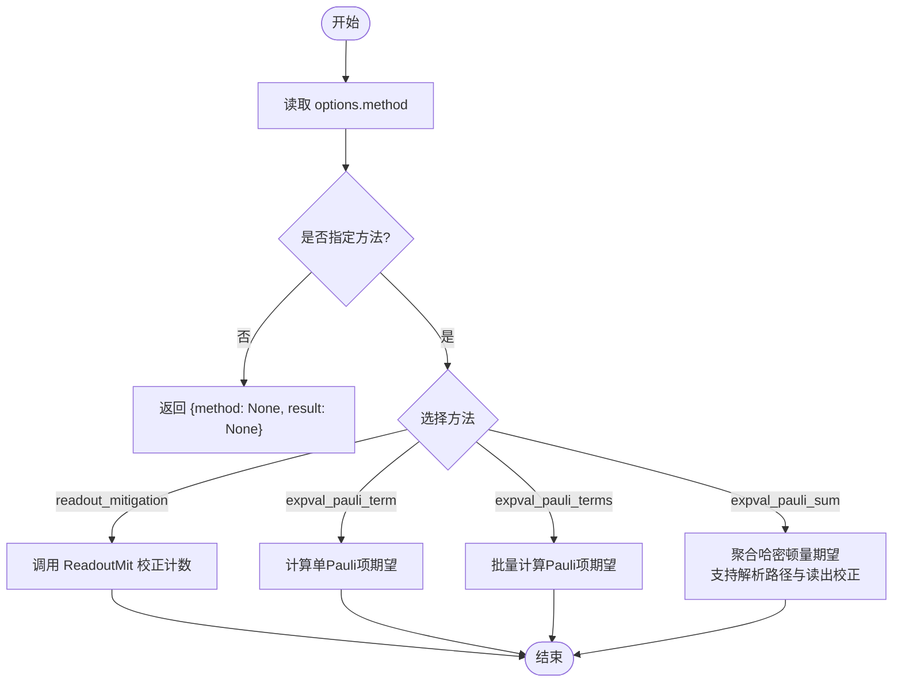
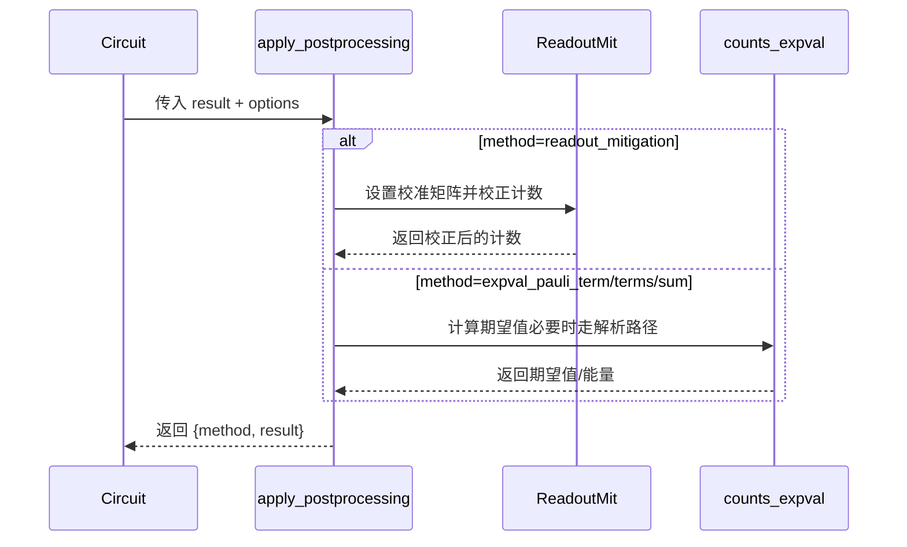

# 后处理模块

<cite>
**本文引用的文件**
- [postprocessing/__init__.py](file://src/tyxonq/postprocessing/__init__.py)
- [error_mitigation.py](file://src/tyxonq/postprocessing/error_mitigation.py)
- [classical_shadows.py](file://src/tyxonq/postprocessing/classical_shadows.py)
- [readout.py](file://src/tyxonq/postprocessing/readout.py)
- [metrics.py](file://src/tyxonq/postprocessing/metrics.py)
- [io.py](file://src/tyxonq/postprocessing/io.py)
- [noise_analysis.py](file://src/tyxonq/postprocessing/noise_analysis.py)
- [counts_expval.py](file://src/tyxonq/postprocessing/counts_expval.py)
- [circuit.py](file://src/tyxonq/core/ir/circuit.py)
</cite>

## 更新摘要
**变更内容**
- 统一了后处理入口：新增 apply_postprocessing 路由，将 readout、expval_pauli_term/terms/sum 等能力整合到单一接口
- 合并并精简测试结构：移除旧测试（如 test_postprocessing_metrics_io.py、test_postprocessing_noise_adapters.py），新增按功能划分的测试文件（adapters、io_extras、metrics、qem、shadows）
- 增强 expval_pauli_sum 的解析与回退逻辑：支持从 result_meta 恢复 expectations/probabilities/statevector，并在无 counts 时走解析路径
- 保持核心能力不变：误差缓解占位实现、经典阴影工具、读出校正、度量计算、IO 工具、噪声分析适配器均保留并完善

## 目录
1. [简介](#简介)
2. [核心组件](#核心组件)
3. [统一后处理入口](#统一后处理入口)
4. [误差缓解技术](#误差缓解技术)
5. [经典阴影方法](#经典阴影方法)
6. [读出校正](#读出校正)
7. [度量计算](#度量计算)
8. [输入输出处理](#输入输出处理)
9. [噪声分析](#噪声分析)
10. [后处理流程配置](#后处理流程配置)
11. [后处理策略建议](#后处理策略建议)

## 简介
后处理模块负责将量子设备或仿真器返回的原始结果转换为可靠的物理量。当前版本通过统一的 apply_postprocessing 路由，将误差缓解、期望值聚合、读出校正等功能集成到一致的接口中；同时提供经典阴影、度量计算、IO 转换和噪声分析等工具，便于在设备执行后快速进行高质量的数据分析。

**章节来源**
- [postprocessing/__init__.py:16-225](file://src/tyxonq/postprocessing/__init__.py#L16-L225)

## 核心组件
- 统一路由：apply_postprocessing 根据 options["method"] 分发到具体实现
- 误差缓解：ZNE、DD、RC 的轻量占位实现，便于后续扩展
- 经典阴影：随机 Pauli 基生成与 Z 期望估计
- 读出校正：单量子比特校准矩阵与 inverse/square 两种反演方法
- 度量计算：归一化、KL 散度、对角可观测期望值
- IO 工具：CSV 往返、计数向量转换、直方图绘制等
- 噪声分析：比特翻转与去极化通道在计数层面的近似

**章节来源**
- [postprocessing/__init__.py:16-225](file://src/tyxonq/postprocessing/__init__.py#L16-L225)
- [error_mitigation.py:7-79](file://src/tyxonq/postprocessing/error_mitigation.py#L7-L79)
- [classical_shadows.py:14-112](file://src/tyxonq/postprocessing/classical_shadows.py#L14-L112)
- [readout.py:15-140](file://src/tyxonq/postprocessing/readout.py#L15-L140)
- [metrics.py:20-90](file://src/tyxonq/postprocessing/metrics.py#L20-L90)
- [io.py:9-99](file://src/tyxonq/postprocessing/io.py#L9-L99)
- [noise_analysis.py:24-100](file://src/tyxonq/postprocessing/noise_analysis.py#L24-L100)

## 统一后处理入口
apply_postprocessing 是后处理的统一入口，支持以下 method：
- readout_mitigation：使用 ReadoutMit 对计数进行读出误差校正，返回 raw_counts/mitigated_counts/mitigation_time_ms
- expval_pauli_term：计算单个 Pauli-Z 项的期望值
- expval_pauli_terms：批量计算多个 Pauli-Z 项的期望值
- expval_pauli_sum：聚合哈密顿量期望值，支持可选的读出校正与解析路径（当 counts 为空但存在 expectations/probabilities/statevector 时）

关键行为
- 自动推断 shots：优先 metadata.shots，否则从 counts 求和推断
- 解析路径：当 counts 为空时，尝试从 result_meta 恢复 expectations/probabilities/statevector，并使用概率或态矢量计算精确期望值
- 失败保护：异常被捕获并返回部分结果，避免上层抛出

```mermaid
flowchart TD
Start([开始]) --> GetMethod["读取 options.method"]
GetMethod --> Check{"是否指定方法?"}
Check --> |否| ReturnNone["返回 {method: None, result: None}"]
Check --> |是| Dispatch{"选择方法"}
Dispatch --> |readout_mitigation| RO["调用 ReadoutMit 校正计数"]
Dispatch --> |expval_pauli_term| E1["计算单Pauli项期望"]
Dispatch --> |expval_pauli_terms| E2["批量计算Pauli项期望"]
Dispatch --> |expval_pauli_sum| E3["聚合哈密顿量期望<br/>支持解析路径与读出校正"]
RO --> End([结束])
E1 --> End
E2 --> End
E3 --> End
```

**图表来源**
- [postprocessing/__init__.py:16-225](file://src/tyxonq/postprocessing/__init__.py#L16-L225)

**章节来源**
- [postprocessing/__init__.py:16-225](file://src/tyxonq/postprocessing/__init__.py#L16-L225)

## 误差缓解技术
当前为轻量占位实现，便于后续接入完整库（如 mitiq）。
- apply_zne：多次执行 executor 并取平均，模拟零噪声外推的平均步骤
- apply_dd：多次执行 executor 并平均计数或数值结果，不修改电路
- apply_rc：多次执行 executor 并平均，返回平均值与电路列表

这些函数可作为未来扩展的骨架，当前主要用于验证流程与测试。

**章节来源**
- [error_mitigation.py:7-79](file://src/tyxonq/postprocessing/error_mitigation.py#L7-L79)

## 经典阴影方法
经典阴影用于以少量测量估计量子态信息。
- random_pauli_basis/random_pauli_bases：生成随机 Pauli 基（含 I/X/Y/Z 或 X/Y/Z）
- estimate_z_from_counts：基于 bitstring 计数估计单量子比特 Z 期望
- estimate_expectation_pauli_product：基于多 shot 的基与结果估计 Pauli 乘积期望

**章节来源**
- [classical_shadows.py:14-112](file://src/tyxonq/postprocessing/classical_shadows.py#L14-L112)

## 读出校正
ReadoutMit 支持单量子比特校准矩阵，并通过 Kronecker 积构建多量子比特校准矩阵。
- set_single_qubit_cals：设置每个量子比特的 2x2 校准矩阵
- mitigate_probability：支持 inverse（伪逆）与 constrained least squares（单纯形约束）两种方法
- apply_readout_mitigation：将计数转为概率向量，应用校正后再转回计数

**章节来源**
- [readout.py:15-140](file://src/tyxonq/postprocessing/readout.py#L15-L140)

## 度量计算
- normalized_count：将计数归一化为概率分布
- kl_divergence：计算两个计数分布之间的 KL 散度
- expectation：基于 bitstring 计数计算对角可观测量的期望值（支持指定 Z 位置或对角算子）

**章节来源**
- [metrics.py:20-90](file://src/tyxonq/postprocessing/metrics.py#L20-L90)

## 输入输出处理
- counts_to_csv/csv_to_counts：计数与 CSV 格式互转
- reverse_count/sort_count/normalized_count：计数反转、排序与归一化
- count2vec/vec2count：计数与向量表示互转
- marginal_count/plot_histogram：边缘分布与直方图绘制（依赖 qiskit）
- 采样与计数变换：sample2all、correlation_from_samples/correlation_from_counts 等工具

**章节来源**
- [io.py:9-99](file://src/tyxonq/postprocessing/io.py#L9-L99)
- [io.py:104-218](file://src/tyxonq/postprocessing/io.py#L104-L218)

## 噪声分析
在计数层面近似噪声通道，便于快速 what-if 分析。
- apply_bitflip_counts：独立比特翻转噪声（一阶近似）
- apply_depolarizing_counts：n 量子比特去极化通道（均匀分布凸组合近似）

**章节来源**
- [noise_analysis.py:24-100](file://src/tyxonq/postprocessing/noise_analysis.py#L24-L100)

## 后处理流程配置
Circuit 在执行完成后会调用 apply_postprocessing，并将 postprocessing 字段附加到结果中。用户可通过 Circuit 的后处理选项（_post_opts）指定 method 及参数。

```mermaid
sequenceDiagram
participant C as Circuit
participant P as apply_postprocessing
participant R as ReadoutMit
participant E as counts_expval
C->>P : 传入 result + options
alt method=readout_mitigation
P->>R : 设置校准矩阵并校正计数
R-->>P : 返回校正后的计数
else method=expval_pauli_term/terms/sum
P->>E : 计算期望值必要时走解析路径
E-->>P : 返回期望值/能量
end
P-->>C : 返回 {method, result}
```

**图表来源**
- [circuit.py:947-971](file://src/tyxonq/core/ir/circuit.py#L947-L971)
- [postprocessing/__init__.py:16-225](file://src/tyxonq/postprocessing/__init__.py#L16-L225)

**章节来源**
- [circuit.py:947-971](file://src/tyxonq/core/ir/circuit.py#L947-L971)
- [postprocessing/__init__.py:16-225](file://src/tyxonq/postprocessing/__init__.py#L16-L225)

## 后处理策略建议
- 高读出误差环境：优先使用 readout_mitigation，确保提供准确的单量子比特校准矩阵
- 相干噪声环境：结合 DD 占位实现评估噪声抑制效果，后续可接入更完整的动态解耦策略
- 非马尔可夫噪声环境：使用 ZNE 占位框架，逐步接入缩放与拟合流程
- 资源受限环境：采用经典阴影方法，用少量测量估计有用信息
- 需要快速基线：利用噪声分析适配器在计数层面近似噪声，辅助对比不同策略

**章节来源**
- [postprocessing/__init__.py:16-225](file://src/tyxonq/postprocessing/__init__.py#L16-L225)
- [error_mitigation.py:7-79](file://src/tyxonq/postprocessing/error_mitigation.py#L7-L79)
- [classical_shadows.py:14-112](file://src/tyxonq/postprocessing/classical_shadows.py#L14-L112)
- [noise_analysis.py:24-100](file://src/tyxonq/postprocessing/noise_analysis.py#L24-L100)