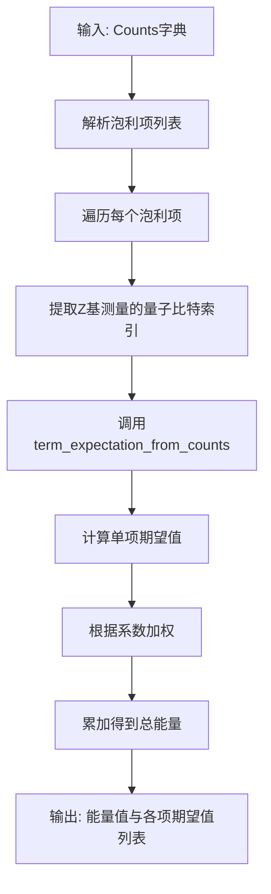
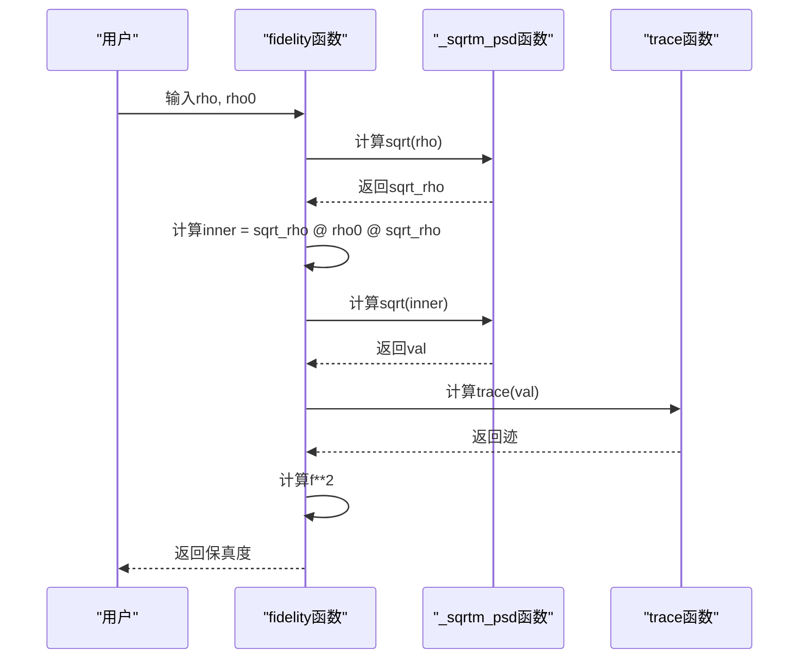

# 度量与分析

<cite>
**本文档中引用的文件**  
- [metrics.py](file://src/tyxonq/postprocessing/metrics.py)
- [counts_expval.py](file://src/tyxonq/postprocessing/counts_expval.py)
- [dynamics.py](file://src/tyxonq/libs/quantum_library/dynamics.py)
</cite>

## 目录
1. [引言](#引言)
2. [核心功能概述](#核心功能概述)
3. [期望值计算方法](#期望值计算方法)
4. [保真度与熵评估](#保真度与熵评估)
5. [高级物理量提取](#高级物理量提取)
6. [输入格式与后端兼容性](#输入格式与后端兼容性)
7. [典型应用场景](#典型应用场景)
8. [大规模系统优化策略](#大规模系统优化策略)
9. [结论](#结论)

## 引言
本技术文档详细阐述了TyxonQ框架中度量分析模块的实现机制，重点聚焦于从量子计算原始输出中提取关键物理量的方法。文档涵盖期望值计算、保真度评估、熵分析等核心功能，基于`metrics.py`和`counts_expval.py`两个核心文件进行深入解析。该模块为变分量子算法（如VQE、QAOA）提供了关键的后处理支持，确保从实验或模拟数据中高效、准确地提取物理信息。

## 核心功能概述

度量分析模块主要提供三大类功能：可观测量期望值计算、量子态比较与距离度量、以及复杂物理量（如熵、自由能）的推导。这些功能通过轻量级、无外部依赖的工具函数实现，适用于多种后端输出格式。

**Section sources**
- [metrics.py](file://src/tyxonq/postprocessing/metrics.py#L1-L30)
- [counts_expval.py](file://src/tyxonq/postprocessing/counts_expval.py#L1-L10)

## 期望值计算方法

### 基于计数数据的期望值计算
模块提供了从`Counts`字典（即测量结果的比特串计数）中计算可观测量期望值的核心方法。`term_expectation_from_counts`函数是基础构建块，用于计算形如⟨Z⊗idxs⟩的泡利-Z乘积算符的期望值。该函数假设电路已通过适当的基变换（如H门或S门）将X、Y测量转换为Z基测量。

`expval_pauli_sum`函数是核心聚合接口，能够计算任意泡利算符和的期望值（即能量）。它接受一个包含泡利项（可选系数）的列表，并利用`term_expectation_from_counts`逐项计算，最后根据系数加权求和得到总能量。

**Diagram sources**
- [counts_expval.py](file://src/tyxonq/postprocessing/counts_expval.py#L6-L111)

### 通用对角可观测量计算
`metrics.py`中的`expectation`函数提供了一个更通用的接口，用于计算任意对角可观测量的期望值。用户可以通过`z`参数指定哪些量子比特上进行Z测量，其余量子比特则视为恒等算符I。该函数内部将每个比特的测量算符（I或Z）表示为一个2维数组`[1.0, 1.0]`或`[1.0, -1.0]`，然后遍历所有测量结果，根据比特串计算每个结果的贡献值并加权平均。

**Section sources**
- [counts_expval.py](file://src/tyxonq/postprocessing/counts_expval.py#L6-L111)
- [metrics.py](file://src/tyxonq/postprocessing/metrics.py#L30-L53)

## 保真度与熵评估

### 量子态保真度
`fidelity`函数计算两个密度矩阵`rho`和`rho0`之间的保真度。其数学基础是迹距离的变体，通过计算`sqrt(sqrt(rho) * rho0 * sqrt(rho))`的迹的平方来实现。该函数内部使用`_sqrtm_psd`辅助函数来计算半正定矩阵的平方根，确保数值稳定性。

### 熵计算
模块支持冯·诺依曼熵和雷尼熵的计算。`entropy`函数首先对密度矩阵进行特征值分解，确保特征值非负并归一化，然后计算`-Σ λ_i * log(λ_i)`。`renyi_entropy`函数是其推广，计算`(1/(1-k)) * log(Σ λ_i^k)`，当k趋近于1时，结果收敛于冯·诺依曼熵。

**Diagram sources**
- [metrics.py](file://src/tyxonq/postprocessing/metrics.py#L100-L120)

## 高级物理量提取

### 自由能与吉布斯态
`free_energy`函数计算给定密度矩阵`rho`和哈密顿量`h`下的自由能，公式为`E - T*S`，其中`E`是能量期望值，`S`是熵，`T=1/beta`是温度。`gibbs_state`函数则用于生成给定哈密顿量和温度下的吉布斯热态，即`exp(-beta*H)/Z`。

### 纠缠度量
`log_negativity`和`entanglement_negativity`函数通过部分转置（`partial_transpose`）来计算纠缠负度。该方法首先对指定的子系统进行部分转置操作，然后计算转置后矩阵的负特征值之和的对数，是衡量纠缠的有效手段。

**Section sources**
- [metrics.py](file://src/tyxonq/postprocessing/metrics.py#L120-L250)

## 输入格式与后端兼容性

### 支持的输入格式
- **Counts字典**: `{bitstring: count}`，由量子设备或模拟器的采样结果生成。
- **Statevector**: 复数数组，表示纯态的量子态向量。
- **Density Matrix**: 复数方阵，表示混合态的密度矩阵。
- **Analytic Expectations**: 字典，如`{"Z0": 0.5, "Z1": -0.3}`，由状态向量模拟器在零噪声极限下直接提供。

### 后端兼容性
虽然度量函数本身不直接依赖特定数值后端，但它们与`src/tyxonq/numerics/backends/`目录下的后端（如NumPy、PyTorch）无缝集成。例如，`dynamics.py`中的`expectation`函数接受`backend`参数，允许在NumPy、CuPy或PyTorch张量上执行`⟨ψ|H|ψ⟩`的计算，实现了计算后端的灵活性。

**Section sources**
- [metrics.py](file://src/tyxonq/postprocessing/metrics.py#L1-L30)
- [counts_expval.py](file://src/tyxonq/postprocessing/counts_expval.py#L1-L114)
- [dynamics.py](file://src/tyxonq/libs/quantum_library/dynamics.py#L116-L125)

## 典型应用场景

### VQE与QAOA算法
在变分量子本征求解器（VQE）和量子近似优化算法（QAOA）中，`expval_pauli_sum`是核心组件。优化循环的每一步都调用此函数，将量子电路的测量结果（Counts）转换为当前参数下的哈密顿量期望值（能量），作为经典优化器的损失函数。

### 量子态层析与验证
`fidelity`和`trace_distance`函数可用于比较实验制备的量子态与目标理论态之间的相似度，是量子态层析和量子门验证的关键指标。

### 量子多体物理模拟
`mutual_information`和`log_negativity`等函数为研究量子多体系统中的纠缠结构提供了工具，可用于分析量子相变、热化过程等。

**Section sources**
- [counts_expval.py](file://src/tyxonq/postprocessing/counts_expval.py#L86-L111)
- [metrics.py](file://src/tyxonq/postprocessing/metrics.py#L100-L150)

## 大规模系统优化策略

### 批处理与向量化
对于需要计算大量泡利项期望值的场景（如哈密顿量分组测量），`expval_pauli_terms`函数支持一次性输入多个项，避免了重复遍历Counts字典的开销，实现了批处理优化。

### 内存管理
`reduced_density_matrix`函数在计算子系统约化密度矩阵时，通过`reshape`和`tensordot`操作高效地处理张量，避免了显式构造大维度的中间态，有效控制了内存占用。

### 分析路径优化
`expval_pauli_sum`函数区分了两种计算路径：当输入为Counts（有限采样）时，使用采样平均；当输入为`expectations`或`probabilities`（来自状态向量模拟器）时，使用解析计算路径`_expval_pauli_sum_analytic`，直接利用概率分布计算精确期望值，避免了采样噪声。

**Section sources**
- [counts_expval.py](file://src/tyxonq/postprocessing/counts_expval.py#L54-L83)
- [metrics.py](file://src/tyxonq/postprocessing/metrics.py#L200-L220)

## 结论
TyxonQ的度量分析模块提供了一套完整、高效且灵活的工具集，用于从量子计算结果中提取关键物理信息。其设计注重轻量化、通用性和数值稳定性，支持从基础期望值到高级纠缠度量的广泛分析需求。通过与不同后端的兼容和对大规模计算的优化，该模块为VQE、QAOA等变分算法以及量子多体物理研究提供了坚实的后处理基础。