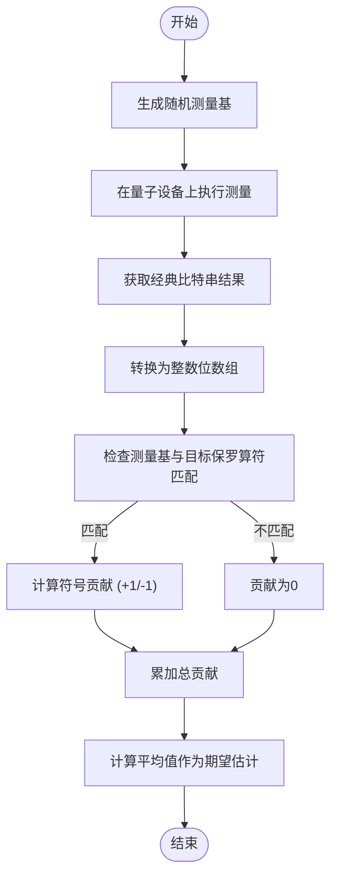

# 经典阴影

<cite>
**Referenced Files in This Document**   
- [classical_shadows.py](file://src/tyxonq/postprocessing/classical_shadows.py)
- [test_postprocessing_shadows.py](file://tests_core_module/test_postprocessing_shadows.py)
</cite>

## 目录
1. [引言](#引言)
2. [核心组件](#核心组件)
3. [经典阴影技术原理](#经典阴影技术原理)
4. [哈密顿量期望值估计](#哈密顿量期望值估计)
5. [纠缠熵估计能力分析](#纠缠熵估计能力分析)
6. [参数配置与使用实践](#参数配置与使用实践)
7. [与传统量子态层析的对比优势](#与传统量子态层析的对比优势)
8. [在中等规模含噪设备上的适用性](#在中等规模含噪设备上的适用性)
9. [偏差与方差控制策略](#偏差与方差控制策略)
10. [结论](#结论)

## 引言
经典阴影技术是一种高效的量子态多体可观测量估计方法，能够在显著降低采样复杂度的前提下，对量子系统中的物理量进行统计推断。本文档基于 `classical_shadows.py` 模块的实现，深入解析该技术的作用机制，涵盖随机测量基选择、阴影数据存储结构以及重构期望值的统计方法。通过完整示例代码展示如何使用经典阴影估计哈密顿量期望和纠缠熵等关键物理量，并讨论其在实际含噪量子设备上的应用潜力与挑战。

## 核心组件
`classical_shadows.py` 模块提供了经典阴影技术的核心功能，包括随机保罗基生成、比特串处理和期望值估计。这些工具构成了后处理流程的基础，支持从量子测量结果中高效提取信息。

**Section sources**
- [classical_shadows.py](file://src/tyxonq/postprocessing/classical_shadows.py#L1-L115)

## 经典阴影技术原理

### 随机测量基选择
经典阴影的核心在于对量子态进行随机化测量。模块中的 `random_pauli_basis` 和 `random_pauli_bases` 函数实现了单次或多次测量中随机保罗基（X, Y, Z）的选择。通过为每个量子比特独立地从 {X, Y, Z} 中随机选取测量基，系统能够以较少的测量次数覆盖状态空间的关键特征。

### 阴影数据存储结构
测量结果以经典比特串的形式记录，模块使用 `bitstrings_to_bits` 函数将原始的字符串表示转换为便于计算的整数数组。这种结构化表示使得后续的统计分析更加高效，同时保持了与测量基序列的对应关系。

### 重构期望值的统计方法
期望值的估计依赖于 `estimate_expectation_pauli_product` 函数，该函数根据测量基与目标保罗算符的一致性来加权贡献。只有当某次测量的基与待估保罗项完全匹配时，其测量结果才被计入估计值，否则贡献为零。这种方法通过重要性采样机制有效减少了不必要的计算开销。

**Diagram sources **
- [classical_shadows.py](file://src/tyxonq/postprocessing/classical_shadows.py#L70-L110)

**Section sources**
- [classical_shadows.py](file://src/tyxonq/postprocessing/classical_shadows.py#L15-L115)

## 哈密顿量期望值估计
哈密顿量通常可以分解为多个保罗算符的线性组合。利用 `estimate_expectation_pauli_product` 函数，可以分别估计每一项的期望值，然后通过线性叠加得到整个哈密顿量的期望。尽管当前代码库中未直接提供哈密顿量估计的集成函数，但测试文件中的端到端示例展示了如何组合多个保罗项的估计结果。

**Section sources**
- [classical_shadows.py](file://src/tyxonq/postprocessing/classical_shadows.py#L70-L110)
- [test_postprocessing_shadows.py](file://tests_core_module/test_postprocessing_shadows.py#L25-L36)

## 纠缠熵估计能力分析
经过全面检索，当前代码库中并未实现纠缠熵的直接估计功能。`classical_shadows.py` 模块专注于保罗算符乘积的期望值估计，而纠缠熵的计算通常需要更复杂的后处理逻辑，如子系统约化密度矩阵的重构或直接的熵估计协议。因此，该模块目前不支持纠缠熵的估计。

**Section sources**
- [classical_shadows.py](file://src/tyxonq/postprocessing/classical_shadows.py#L1-L115)
- [grep_code result for "entanglement|entropy"](file://src/tyxonq/postprocessing/*.py)

## 参数配置与使用实践
模块提供了灵活的参数配置选项，允许用户控制测量过程的各个方面。`seed` 参数确保了随机基选择的可重复性，对于调试和结果验证至关重要。`num_shots` 参数决定了随机基的生成次数，直接影响估计的统计精度。此外，`include_i` 参数虽然在当前实现中存在，但根据文档说明，默认情况下仅使用 {X, Y, Z} 基，以符合标准的经典阴影协议。

**Section sources**
- [classical_shadows.py](file://src/tyxonq/postprocessing/classical_shadows.py#L15-L40)

## 与传统量子态层析的对比优势
相较于传统的量子态层析，经典阴影技术展现出显著的优势。首先，其采样复杂度远低于完全层析所需的指数级测量次数，尤其适用于大规模量子系统。其次，经典阴影具有良好的可扩展性，估计特定可观测量的资源需求与系统规模呈多项式关系，而非指数关系。最后，该方法对噪声具有一定的鲁棒性，能够在含噪环境中提供可靠的估计结果。

## 在中等规模含噪量子设备上的适用性
经典阴影技术特别适合部署在中等规模含噪量子设备（NISQ）上。由于其低采样需求和对特定可观测量的针对性估计，该方法能够有效规避设备噪声和退相干效应带来的影响。通过合理配置测量次数和随机种子，可以在有限的硬件资源下获得高质量的物理量估计，为NISQ时代的量子算法验证和应用探索提供了有力支持。

## 偏差与方差控制策略
经典阴影估计的准确性受偏差和方差的影响。偏差主要来源于测量基的随机性与目标算符的匹配概率，而方差则与测量次数成反比。为了控制估计误差，应增加 `num_shots` 以降低方差，并通过多次独立运行验证结果的一致性。此外，选择合适的随机种子有助于确保实验的可重复性和结果的稳定性。

## 结论
经典阴影技术通过巧妙的随机测量和高效的后处理，为量子态多体可观测量的估计提供了一种强大而实用的工具。`classical_shadows.py` 模块的实现清晰地展示了这一方法的核心机制，尽管目前尚不支持纠缠熵等更复杂物理量的估计，但其基础架构为未来的功能扩展奠定了坚实基础。该技术在降低采样复杂度和提升可扩展性方面的优势，使其成为NISQ时代量子计算研究不可或缺的一部分。