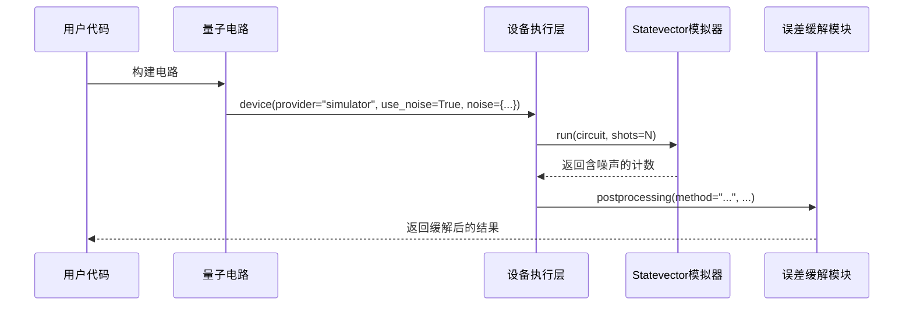

# 误差缓解

<cite>
**本文档中引用的文件**  
- [error_mitigation.py](file://src/tyxonq/postprocessing/error_mitigation.py)
- [channels.py](file://src/tyxonq/devices/simulators/noise/channels.py)
- [engine.py](file://src/tyxonq/devices/simulators/statevector/engine.py)
- [noise_controls_demo.py](file://examples/noise_controls_demo.py)
- [readout_mitigation.py](file://examples/readout_mitigation.py)
</cite>

## 目录
1. [引言](#引言)
2. [核心组件](#核心组件)
3. [误差缓解技术原理](#误差缓解技术原理)
4. [接口设计与调用流程](#接口设计与调用流程)
5. [与设备执行层的集成](#与设备执行层的集成)
6. [配置与应用示例](#配置与应用示例)
7. [性能分析与优化建议](#性能分析与优化建议)
8. [常见问题排查指南](#常见问题排查指南)
9. [结论](#结论)

## 引言
量子计算中的噪声是限制其实际应用的主要障碍之一。由于量子比特极易受到环境干扰，导致计算结果出现偏差，因此需要引入误差缓解技术来提升结果的准确性。本文档详细阐述了误差缓解模块的实现机制，重点介绍零噪声外推（ZNE）、动态解耦（DD）和随机编译（RC）等主流误差缓解方法的算法原理，并结合代码实现说明其接口设计与使用方式。此外，文档还提供了在不同噪声模型下配置误差缓解策略的具体示例，讨论了该模块如何与设备执行层集成以支持真实硬件或噪声模拟器的数据后处理，并分析了其计算开销、适用范围及精度提升效果。

## 核心组件
误差缓解模块主要由三个核心函数构成：`apply_zne`、`apply_dd` 和 `apply_rc`，分别对应零噪声外推、动态解耦和随机编译三种技术。这些函数均位于 `src/tyxonq/postprocessing/error_mitigation.py` 文件中，作为占位符实现，当前版本主要通过多次执行电路并取平均值的方式进行初步误差抑制。未来计划集成 Mitiq 等成熟误差缓解库以实现完整功能。

**Section sources**
- [error_mitigation.py](file://src/tyxonq/postprocessing/error_mitigation.py#L6-L75)

## 误差缓解技术原理
本节介绍当前模块中实现的三种误差缓解技术的基本原理。

### 零噪声外推（ZNE）
零噪声外推是一种通过在不同噪声水平下运行量子电路并外推至零噪声极限来估计理想结果的方法。其基本思想是人为放大噪声（例如通过门折叠技术），获取多个噪声级别的期望值，然后利用这些数据拟合一条曲线并外推至噪声为零的情况。尽管当前 `apply_zne` 函数尚未实现噪声缩放和外推逻辑，仅作为占位符返回多次执行的平均值，但其设计预留了 `scale_noise` 和 `factory` 参数以支持后续扩展。

### 动态解耦（DD）
动态解耦通过在量子电路中插入特定的脉冲序列（如 XY4、XY8 等）来抑制环境引起的退相干效应。这些脉冲序列能够有效“平均掉”低频噪声的影响。当前 `apply_dd` 函数并未实际修改电路结构以插入 DD 脉冲，而是简单地对多次执行的结果进行平均，作为未来实现的骨架。参数 `rule` 和 `rule_args` 为定义具体的 DD 序列及其参数提供了接口。

### 随机编译（RC）
随机编译通过将量子门分解为随机选择的等效门序列来将相干误差转化为非相干误差，从而降低误差的破坏性。这种方法特别适用于缓解由系统性控制误差引起的偏差。当前 `apply_rc` 函数同样未实现真正的电路变换，而是通过重复执行原始电路并平均结果来模拟其效果。`simplify` 参数为后续可能的电路优化步骤预留了空间。

**Section sources**
- [error_mitigation.py](file://src/tyxonq/postprocessing/error_mitigation.py#L6-L75)

## 接口设计与调用流程
误差缓解模块提供了简洁统一的接口设计，便于用户集成到现有的量子计算工作流中。

### 函数签名与参数说明
所有误差缓解函数均接受以下通用参数：
- `circuit`: 待执行的量子电路对象。
- `executor`: 执行电路的可调用对象，通常为设备运行接口。
- `num_to_average` / `num_trials`: 指定重复执行电路的次数，默认为 1。
- `iscount`: 布尔值，指示输出是否为计数字典（如测量结果），影响平均方式。

此外，各函数还包含特定于其技术的参数，如 `apply_zne` 的 `scale_noise` 和 `apply_dd` 的 `rule`。

### 调用流程
调用流程通常如下：
1. 构建量子电路。
2. 定义执行器（executor），通常通过设备接口绑定。
3. 调用相应的误差缓解函数，传入电路和执行器。
4. 获取并处理缓解后的结果。

尽管当前实现较为基础，但其接口设计已为更复杂的误差缓解流程奠定了基础。

**Section sources**
- [error_mitigation.py](file://src/tyxonq/postprocessing/error_mitigation.py#L6-L75)

## 与设备执行层的集成
误差缓解模块通过与设备执行层的紧密集成，支持从真实硬件或噪声模拟器获取原始计数数据并进行后处理。

### 噪声模拟器支持
`src/tyxonq/devices/simulators/statevector/engine.py` 中的 `StatevectorEngine` 类支持通过 `use_noise` 参数启用噪声模拟。当 `use_noise=True` 时，引擎会根据提供的噪声配置（如 `depolarizing`、`readout`）对状态向量或测量结果施加相应的噪声模型。例如，在 `depolarizing` 模型下，Z 期望值会被衰减因子 `z_atten` 调整。

### 原始数据采集
在 `shots > 0` 的情况下，`StatevectorEngine` 会根据概率分布对计算基进行采样，生成符合噪声特性的计数字典。这些原始计数可以作为误差缓解模块的输入，用于后续的后处理。

### 示例集成
`examples/readout_mitigation.py` 展示了如何通过 `.device()` 和 `.postprocessing()` 链式调用，在设备层注入读出噪声，并在后处理阶段应用读出误差缓解。这种设计模式同样适用于其他误差缓解技术。



**Diagram sources**
- [engine.py](file://src/tyxonq/devices/simulators/statevector/engine.py#L0-L265)
- [readout_mitigation.py](file://examples/readout_mitigation.py#L0-L133)

**Section sources**
- [engine.py](file://src/tyxonq/devices/simulators/statevector/engine.py#L0-L265)
- [readout_mitigation.py](file://examples/readout_mitigation.py#L0-L133)

## 配置与应用示例
本节提供在不同噪声模型下配置误差缓解策略的代码示例。

### 噪声模型配置
`examples/noise_controls_demo.py` 演示了如何全局启用和配置噪声。例如，可以通过 `tq.enable_noise(True, {"type": "depolarizing", "p": 0.05})` 启用去极化噪声，其中 `p` 为错误概率。

### 期望值重构
在 `apply_zne` 中，虽然尚未实现真正的外推，但可以通过设置 `num_to_average` 来多次执行电路并平均期望值，从而减少统计波动。例如：
```python
result = apply_zne(circuit, executor, num_to_average=10)
```

### 校准数据采集
对于读出误差缓解，校准数据（即每个量子比特的读出混淆矩阵）需要预先测量。`examples/readout_mitigation.py` 中展示了如何定义这些矩阵（如 `A0` 和 `A1`）并通过 `ReadoutMit.set_single_qubit_cals()` 进行配置。

**Section sources**
- [noise_controls_demo.py](file://examples/noise_controls_demo.py#L0-L46)
- [readout_mitigation.py](file://examples/readout_mitigation.py#L0-L133)

## 性能分析与优化建议
### 计算开销
当前误差缓解实现的主要开销来源于重复执行电路。`num_to_average` 或 `num_trials` 的增加会线性增长总执行时间。由于缺乏真正的误差缓解逻辑，当前版本的开销相对较低，但效果有限。

### 适用范围
- **ZNE**: 适用于可通过门折叠等方式有效缩放噪声的场景。
- **DD**: 适用于退相干时间较长、低频噪声主导的系统。
- **RC**: 适用于存在显著系统性控制误差的设备。

### 优化建议
1. **并行执行**: 对于支持并行任务提交的设备，应将多次执行任务并行化以减少总耗时。
2. **自适应采样**: 根据结果的统计方差动态调整 `num_to_average`，避免不必要的重复。
3. **集成成熟库**: 尽快集成 Mitiq 等经过验证的误差缓解库，以获得更显著的精度提升。

## 常见问题排查指南
- **问题**: 缓解后结果无明显改善。
  - **排查**: 检查 `num_to_average` 是否足够大；确认噪声模型是否正确配置；验证执行器是否正常工作。
- **问题**: 执行时间过长。
  - **排查**: 检查 `num_to_average` 是否过高；考虑是否可并行执行；评估是否有必要进行误差缓解。
- **问题**: 计数平均出现负值或非整数。
  - **排查**: 确保 `iscount=True` 时使用正确的平均逻辑（如 `apply_rc` 中的字典平均）；检查输入计数数据的有效性。

## 结论
当前的误差缓解模块为未来实现更高级的误差缓解技术提供了清晰的接口和架构基础。虽然现有实现仅为占位符，主要通过重复执行和平均来模拟误差抑制效果，但其设计充分考虑了与设备执行层的集成以及不同误差缓解技术的通用性。下一步应重点集成成熟的误差缓解算法（如 Mitiq 中的 ZNE 和 PEC），并优化计算效率，以真正发挥其在提升量子计算结果准确性方面的作用。