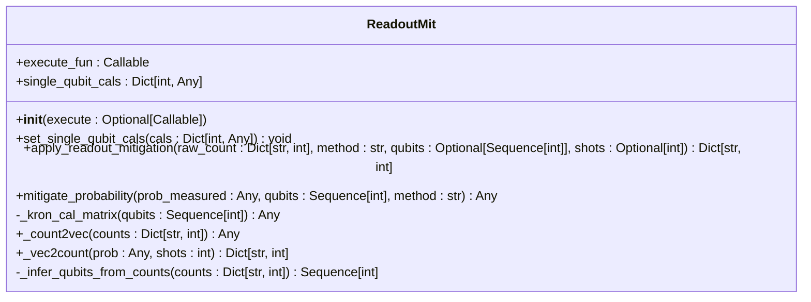
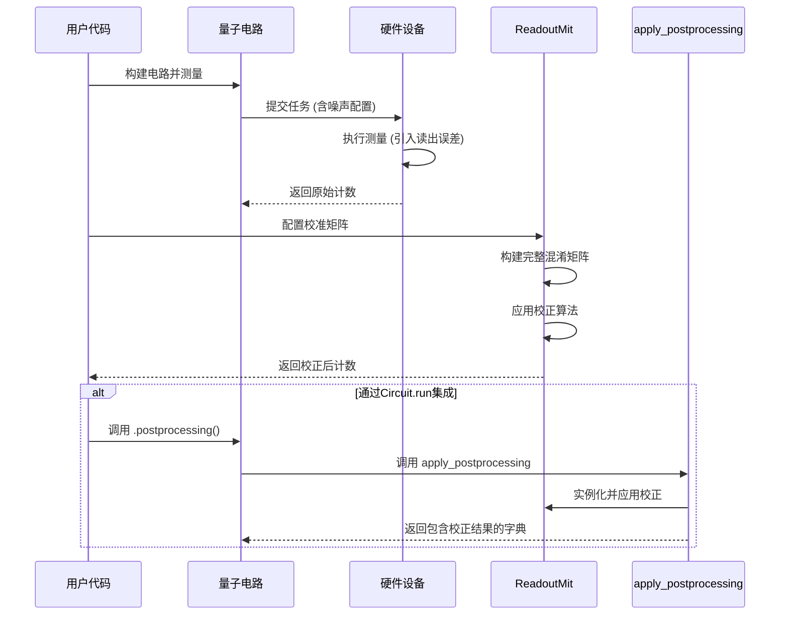

# 读出校正

<cite>
**Referenced Files in This Document**   
- [readout.py](file://src/tyxonq/postprocessing/readout.py)
- [__init__.py](file://src/tyxonq/postprocessing/__init__.py)
- [driver.py](file://src/tyxonq/devices/hardware/ibm/driver.py)
- [driver.py](file://src/tyxonq/devices/hardware/tyxonq/driver.py)
- [readout_mitigation.py](file://examples/readout_mitigation.py)
</cite>

## 目录
1. [引言](#引言)
2. [核心组件](#核心组件)
3. [读出校正流程](#读出校正流程)
4. [设备集成与云API支持](#设备集成与云api支持)
5. [数值稳定性与最佳实践](#数值稳定性与最佳实践)
6. [结论](#结论)

## 引言

量子计算中的测量过程不可避免地引入误差，其中读出误差（Readout Error）是主要噪声源之一。该误差源于量子比特在测量时被错误识别其状态（如将|0⟩误判为|1⟩）。读出校正（Readout Mitigation）是一种后处理技术，旨在通过建模和修正这些测量混淆来恢复接近真实的测量结果。

本说明文档聚焦于TyxonQ框架中`readout.py`模块的实现，详细阐述如何通过制备特征态获取测量混淆矩阵，并利用逆矩阵或最大似然法对计数数据进行校正。文档将介绍端到端的校正流程、支持的硬件设备、云API集成方式，并讨论实际应用中的数值稳定性问题与最佳实践。

## 核心组件

读出校正功能的核心是`ReadoutMit`类，它封装了从校准矩阵设置到误差修正的完整逻辑。



**Diagram sources**
- [readout.py](file://src/tyxonq/postprocessing/readout.py#L14-L136)

**Section sources**
- [readout.py](file://src/tyxonq/postprocessing/readout.py#L14-L136)

### ReadoutMit 类详解

`ReadoutMit`类是读出校正的主控制器，其关键方法和字段如下：

- **`set_single_qubit_cals`**: 该方法用于设置每个量子比特的2x2校准矩阵。矩阵的每一行代表一个真实状态（|0⟩或|1⟩）被测量为|0⟩或|1⟩的概率，因此是一个行随机矩阵。
- **`apply_readout_mitigation`**: 这是对外的主要接口。它接收原始的测量计数（`raw_count`），并根据指定的方法（`method`）返回校正后的计数。
- **`mitigate_probability`**: 此方法是校正的核心算法实现，支持两种模式：
  - **`inverse`**: 使用伪逆矩阵（通过`scipy.linalg.pinv`）直接求解线性方程 `A * p_true = p_measured`。
  - **`least_squares`**: 采用带约束的最小二乘法，在概率单纯形（所有概率非负且和为1）上优化，以获得物理上更合理的解。
- **`_kron_cal_matrix`**: 对于多量子比特系统，该方法通过克罗内克积（Kronecker product）将单量子比特的校准矩阵组合成完整的系统级混淆矩阵。
- **`_count2vec` 和 `_vec2count`**: 这两个静态方法负责在计数字典（如 `{"00": 500, "11": 500}`）和概率向量（如 `[0.5, 0.0, 0.0, 0.5]`）之间进行转换，是数据预处理和后处理的关键步骤。

## 读出校正流程

一个完整的读出校正流程包含校准、混淆矩阵构建和后处理应用三个阶段。



**Diagram sources**
- [readout.py](file://src/tyxonq/postprocessing/readout.py#L14-L136)
- [__init__.py](file://src/tyxonq/postprocessing/__init__.py#L15-L132)
- [readout_mitigation.py](file://examples/readout_mitigation.py#L1-L133)

**Section sources**
- [readout.py](file://src/tyxonq/postprocessing/readout.py#L14-L136)
- [__init__.py](file://src/tyxonq/postprocessing/__init__.py#L15-L132)
- [readout_mitigation.py](file://examples/readout_mitigation.py#L1-L133)

### 端到端校正示例

以下是一个典型的校正流程示例：

1.  **生成校准任务**：通过制备并测量所有计算基态（如 |00⟩, |01⟩, |10⟩, |11⟩）来运行校准任务。这些任务的测量结果直接用于拟合每个量子比特的校准矩阵 `A0`, `A1`。
2.  **拟合混淆矩阵**：根据校准任务的结果，计算出每个量子比特的2x2混淆矩阵。例如，`A0[0,0]` 表示当真实状态为|0⟩时，测量结果为|0⟩的概率。
3.  **应用后处理**：在获取主量子任务的原始计数后，使用`ReadoutMit`进行校正。

```python
# 示例代码片段 (来自 examples/readout_mitigation.py)
mit = ReadoutMit()
mit.set_single_qubit_cals({0: A0, 1: A1})  # 设置校准矩阵
corrected_counts = mit.apply_readout_mitigation(raw_counts, method="inverse")  # 应用校正
```

此外，该功能也深度集成到电路执行流程中，可以通过链式调用直接应用：

```python
run_results = (
    circuit
    .device(provider="simulator", device="statevector", noise={"type": "readout", "cals": cals})
    .postprocessing(method="readout_mitigation", cals=cals, mitigation="inverse")
    .run()
)
```

## 设备集成与云API支持

读出校正模块设计为与多种硬件设备和云API无缝集成。

### 支持的设备类型

- **IBM 硬件**: 通过 `src/tyxonq/devices/hardware/ibm/driver.py` 提供的驱动程序接口进行集成。该驱动目前为骨架实现，未来将通过Qiskit适配器连接到真实的IBM后端。
- **TyxonQ 硬件**: 通过 `src/tyxonq/devices/hardware/tyxonq/driver.py` 提供的驱动程序与TyxonQ自有硬件进行交互。该驱动使用HTTP请求与云API通信，提交任务并获取结果。

### 与云API的集成方式

`TyxonQTask`类封装了与云后端交互的异步任务模型。`submit_task`函数负责将量子电路和参数（包括噪声模型）提交到云端，而`get_task_details`函数则用于轮询任务状态并获取最终的测量结果（即原始计数）。读出校正作为后处理步骤，在获取原始计数后由`apply_postprocessing`函数调用`ReadoutMit`完成。

这种设计将硬件执行与后处理逻辑解耦，使得校正功能可以独立于具体的硬件提供商而工作。

**Section sources**
- [driver.py](file://src/tyxonq/devices/hardware/ibm/driver.py#L1-L40)
- [driver.py](file://src/tyxonq/devices/hardware/tyxonq/driver.py#L1-L193)

## 数值稳定性与最佳实践

在实际应用中，读出校正可能面临数值不稳定和小样本偏差等问题。

### 数值稳定性问题

- **矩阵求逆的病态性**：当校准矩阵接近奇异（例如，读出误差非常大）时，直接求逆可能导致数值不稳定，产生负概率或极不合理的校正结果。
- **小样本偏差**：当采样次数（shots）较少时，原始计数的统计波动会被校正算法放大，导致校正后的结果方差增大。

### 正则化处理技巧与最佳实践

1.  **优先使用最小二乘法**：相比于直接求逆，`method="least_squares"`通过约束优化能更好地保证结果的物理合理性（概率非负且归一化），推荐在大多数场景下使用。
2.  **确保高质量的校准数据**：校准任务应使用足够多的采样次数，以获得准确的混淆矩阵。不准确的校准矩阵会直接导致错误的校正。
3.  **结合其他噪声缓解技术**：读出校正可以与其他技术（如零噪声外推）结合使用，以获得更鲁棒的结果。
4.  **谨慎处理小样本数据**：对于采样次数极少的数据，校正可能弊大于利。应评估校正前后的结果，或考虑增加采样次数。
5.  **利用框架集成**：优先使用`.postprocessing()`链式调用，它能自动处理元数据（如shots数），并提供统一的错误处理和结果结构。

## 结论

Tyxonq框架中的读出校正模块提供了一套完整、灵活且易于集成的解决方案，用于减轻量子测量中的读出误差。通过`ReadoutMit`类，用户可以方便地应用逆矩阵或最大似然法进行数据校正。该模块不仅支持独立的数值计算路径，还深度集成到电路执行和云API工作流中，适用于IBM、TyxonQ等多种硬件平台。在使用时，应关注数值稳定性问题，并遵循最佳实践以获得可靠的校正结果。