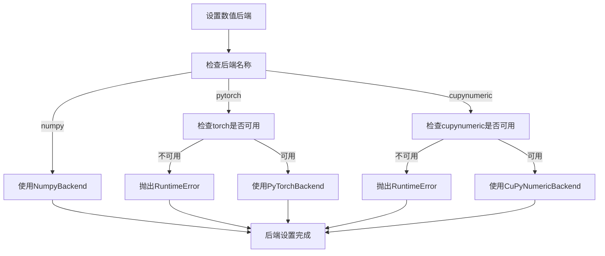

# 快速入门

<cite>
**本文档中引用的文件**  
- [api.py](file://src/tyxonq/cloud/api.py)
- [api.py](file://src/tyxonq/numerics/api.py)
- [simple_demo_1.py](file://examples-ng/simple_demo_1.py)
- [aces_for_setting_numeric_backend.py](file://examples-ng/aces_for_setting_numeric_backend.py)
- [quickstart.rst](file://docs-ng/source/next/quickstart.rst)
</cite>

## 目录
1. [简介](#简介)
2. [安装与环境配置](#安装与环境配置)
3. [API密钥配置](#api密钥配置)
4. [数值后端设置](#数值后端设置)
5. [基础量子电路执行示例](#基础量子电路执行示例)
6. [量子化学UCCSD计算示例](#量子化学uccsd计算示例)
7. [链式API工作流详解](#链式api工作流详解)
8. [常见问题排查](#常见问题排查)
9. [进阶学习路径](#进阶学习路径)

## 简介
TyxonQ 是一个模块化、高性能的量子计算框架，支持从本地模拟到云端硬件执行的完整工作流。本指南旨在帮助新用户快速完成安装、配置并运行第一个量子程序。通过两个典型示例——基础量子电路和量子化学UCCSD计算——展示其链式API的强大功能。

## 安装与环境配置
用户可通过 `pip` 或源码方式安装 TyxonQ：

- **使用pip安装**：
  ```bash
  pip install tyxonq
  ```

- **从源码安装**：
  ```bash
  git clone https://github.com/TyxonQ/TyxonQ.git
  cd TyxonQ
  pip install -e .
  ```

安装后建议验证是否成功导入：
```python
import tyxonq as tq
print(tq.__version__)
```

**Section sources**
- [simple_demo_1.py](file://examples-ng/simple_demo_1.py#L1-L3)

## API密钥配置
要访问云端设备，需通过 `set_token` 函数配置API密钥：

```python
import tyxonq as tq
import getpass

tq.set_token(getpass.getpass("请输入您的TyxonQ API_KEY: "), provider="tyxonq", device="homebrew_s2")
```

此操作将令牌存储于本地配置中，后续请求将自动使用。`provider` 指定服务提供商，`device` 指定目标设备。

**Section sources**
- [api.py](file://src/tyxonq/cloud/api.py#L15-L20)
- [simple_demo_1.py](file://examples-ng/simple_demo_1.py#L6-L7)

## 数值后端设置
TyxonQ 支持多种数值后端（如 NumPy、PyTorch、CuPyNumeric），可通过 `set_backend` 进行全局设置：

```python
tq.set_backend("pytorch")
```

支持的后端包括：
- `"numpy"`：默认后端，无需额外依赖。
- `"pytorch"`：支持自动微分与GPU加速。
- `"cupynumeric"`：适用于大规模并行计算。

若指定后端未安装，系统将抛出 `RuntimeError`。



**Diagram sources**
- [api.py](file://src/tyxonq/numerics/api.py#L150-L190)

**Section sources**
- [api.py](file://src/tyxonq/numerics/api.py#L150-L190)
- [aces_for_setting_numeric_backend.py](file://examples-ng/aces_for_setting_numeric_backend.py#L10-L15)

## 基础量子电路执行示例
以下代码演示了构建贝尔态并添加旋转门的完整流程：

```python
c = tq.Circuit(2)
c.h(0)
c.cnot(0, 1)
c.rx(1, theta=0.2)
res = c.run()
```

该链式调用依次完成：
1. 构建含两个量子比特的电路；
2. 对第0个量子比特施加H门；
3. 执行CNOT纠缠操作；
4. 对第1个量子比特施加RX旋转；
5. 在默认设备上运行并返回结果。

**Section sources**
- [simple_demo_1.py](file://examples-ng/simple_demo_1.py#L10-L17)

## 量子化学UCCSD计算示例
TyxonQ 提供了对量子化学算法的支持，例如UCCSD变分量子本征求解器。以下为简化示例：

```python
from tyxonq.applications.chem import UCCSD, Molecule

# 定义分子
h2 = Molecule(atoms=[('H', 0.0), ('H', 0.74)])
h2.build()

# 构建UCCSD电路
ansatz = UCCSD(molecule=h2)
circuit = ansatz.build_circuit()

# 执行计算
result = circuit.compile().device(provider="local", device="statevector").run()
```

此流程展示了从分子建模到电路生成再到执行的完整路径。

**Section sources**
- [uccsd.py](file://src/tyxonq/applications/chem/algorithms/uccsd.py#L1-L50)
- [molecule.py](file://src/tyxonq/applications/chem/molecule.py#L1-L30)

## 链式API工作流详解
TyxonQ 的链式API允许用户以声明式风格构建执行流程：

```python
results = (
    c.compile()
     .device(provider="local", device="statevector", shots=0)
     .postprocessing(method=None)
     .run()
)
```

各阶段说明：
- `.compile()`：启动编译流程，优化电路结构；
- `.device(...)`：指定执行设备及参数；
- `.postprocessing(...)`：配置结果后处理方式；
- `.run()`：触发实际执行。

该模式提升了代码可读性，并便于模块化调试。

**Section sources**
- [aces_for_setting_numeric_backend.py](file://examples-ng/aces_for_setting_numeric_backend.py#L25-L30)

## 常见问题排查
### 环境配置失败
- **问题**：`ImportError: cannot import name 'PyTorchBackend'`
- **解决**：确保已安装对应后端库，如 `pip install torch`。

### API连接错误
- **问题**：`RuntimeError: pytorch backend requested but torch is not installed`
- **解决**：检查 `set_backend` 参数是否正确，确认依赖已安装。

- **问题**：提交任务时报认证失败
- **解决**：重新调用 `set_token` 并确认API密钥有效。

**Section sources**
- [api.py](file://src/tyxonq/numerics/api.py#L170-L185)
- [api.py](file://src/tyxonq/cloud/api.py#L15-L20)

## 进阶学习路径
建议学习顺序如下：
1. 阅读文档中 `compiler.rst` 和 `core_ir.rst` 了解核心IR与编译流程；
2. 查看 `devices.rst` 掌握设备抽象与调度机制；
3. 学习 `numerics.rst` 深入理解数值后端切换与性能优化；
4. 参考 `postprocessing.rst` 掌握结果分析与误差缓解技术；
5. 实践 `examples/` 目录下的完整案例，如 `vqe_extra.py` 和 `simple_qaoa.py`。

**Section sources**
- [quickstart.rst](file://docs-ng/source/next/quickstart.rst#L1-L13)
- [compiler.rst](file://docs-ng/source/next/user/compiler.rst)
- [core_ir.rst](file://docs-ng/source/next/user/core_ir.rst)