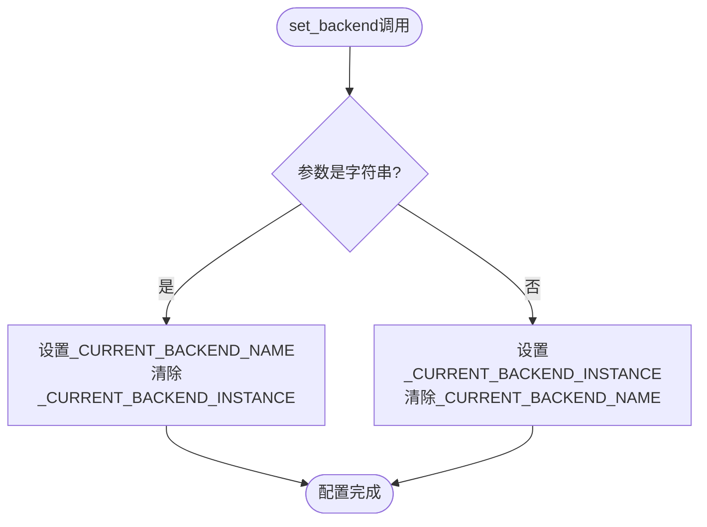
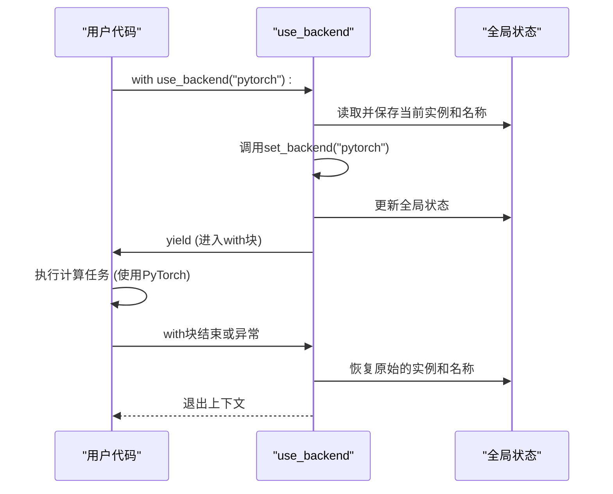
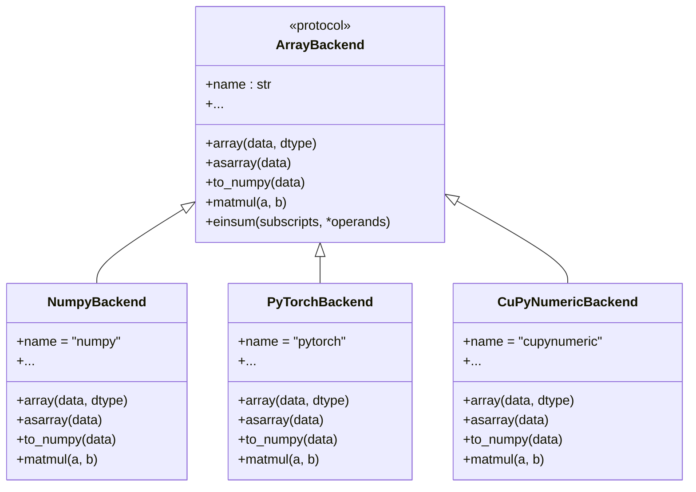

# 后端上下文管理

<cite>
**本文档引用的文件**  
- [context.py](file://src/tyxonq/numerics/context.py)
- [api.py](file://src/tyxonq/numerics/api.py)
- [numpy_backend.py](file://src/tyxonq/numerics/backends/numpy_backend.py)
- [pytorch_backend.py](file://src/tyxonq/numerics/backends/pytorch_backend.py)
- [cupynumeric_backend.py](file://src/tyxonq/numerics/backends/cupynumeric_backend.py)
</cite>

## 目录
1. [简介](#简介)
2. [核心组件](#核心组件)
3. [全局后端配置机制](#全局后端配置机制)
4. [上下文管理器工作原理](#上下文管理器工作原理)
5. [后端实现与协议](#后端实现与协议)
6. [使用示例](#使用示例)
7. [设计优势与最佳实践](#设计优势与最佳实践)

## 简介
本文档详细阐述了TyxonQ框架中数值计算后端的上下文管理机制。该机制通过全局配置与上下文管理器相结合的方式，实现了灵活、高效的后端管理策略。系统允许用户通过名称或实例设置全局默认后端，并提供`use_backend()`上下文管理器来在代码块中临时切换后端，从而在不影响全局状态的前提下执行特定任务。此设计避免了在API调用中显式传递后端参数的繁琐，同时保留了对计算环境进行细粒度控制的能力。

## 核心组件

后端上下文管理机制的核心由以下几个关键函数和变量构成，它们共同协作以实现后端的动态配置与切换。

**Section sources**
- [context.py](file://src/tyxonq/numerics/context.py#L17-L49)

## 全局后端配置机制

全局后端配置机制是整个系统的基础，它通过两个全局变量和一组函数来维护和操作当前的后端状态。

### 状态存储
系统使用两个模块级的全局变量来存储当前的后端配置：
- `_CURRENT_BACKEND_INSTANCE`: 存储当前配置的后端实例对象。当用户直接传入一个后端实例时，该变量被设置，而`_CURRENT_BACKEND_NAME`被置为`None`。
- `_CURRENT_BACKEND_NAME`: 存储当前配置的后端名称（字符串）。当用户通过名称（如"numpy"、"pytorch"）设置后端时，该变量被设置，而`_CURRENT_BACKEND_INSTANCE`被置为`None`。

这种设计实现了两种不同的配置模式：**实例模式**（直接绑定具体对象）和**名称模式**（延迟解析，便于动态加载）。

### 配置接口
系统提供了三个主要的接口函数来操作全局后端状态。

#### `set_backend(name_or_instance)`
该函数是设置全局后端的入口点。它接受一个参数，可以是后端的名称（字符串）或一个后端实例对象。
- **参数为字符串时**：将`_CURRENT_BACKEND_NAME`设置为该字符串，并将`_CURRENT_BACKEND_INSTANCE`置为`None`。这表示后续操作将根据此名称动态获取后端实例。
- **参数为对象时**：将`_CURRENT_BACKEND_INSTANCE`设置为该对象，并将`_CURRENT_BACKEND_NAME`置为`None`。这表示后续操作将直接使用此实例，绕过名称解析过程。



**Section sources**
- [context.py](file://src/tyxonq/numerics/context.py#L17-L29)
- [context.py](file://src/tyxonq/numerics/context.py#L13-L14)

#### `get_configured_backend_instance()`
该函数返回当前配置的后端实例。它直接返回`_CURRENT_BACKEND_INSTANCE`变量的值。如果当前是通过名称配置的，则此函数返回`None`，表示没有直接绑定的实例。

#### `get_configured_backend_name()`
该函数返回当前配置的后端名称。它直接返回`_CURRENT_BACKEND_NAME`变量的值。如果当前是通过实例配置的，则此函数返回`None`。

这两个`get`函数为其他模块（如`api.py`中的`get_backend`工厂函数）提供了查询当前配置状态的途径，是实现延迟解析和动态加载的关键。

**Section sources**
- [context.py](file://src/tyxonq/numerics/context.py#L32-L37)

## 上下文管理器工作原理

`use_backend()`函数是一个上下文管理器（Context Manager），它利用Python的`contextlib.contextmanager`装饰器，实现了在代码块执行期间临时修改全局后端，并在退出时自动恢复原状态的功能。

### 执行流程
1.  **保存状态**：在进入`with`语句块之前，`use_backend`首先保存当前的`_CURRENT_BACKEND_INSTANCE`和`_CURRENT_BACKEND_NAME`的值到局部变量`prev_inst`和`prev_name`中。
2.  **应用新配置**：调用`set_backend(name_or_instance)`函数，将全局后端设置为用户指定的新值。
3.  **执行代码块**：通过`yield`关键字，将控制权交给`with`语句块内的代码。此时，任何调用`get_backend()`的代码都将使用新设置的后端。
4.  **恢复状态**：无论`with`语句块内的代码是正常执行完毕还是抛出异常，`finally`块都会执行，将`_CURRENT_BACKEND_INSTANCE`和`_CURRENT_BACKEND_NAME`恢复为之前保存的原始值。

这种设计确保了后端切换的**原子性**和**安全性**。即使在代码块执行过程中发生错误，也能保证全局状态被正确恢复，不会对后续代码产生意外影响。



**Section sources**
- [context.py](file://src/tyxonq/numerics/context.py#L41-L49)

## 后端实现与协议

后端上下文管理机制与具体的后端实现紧密耦合。系统定义了一个`ArrayBackend`协议，并为NumPy、PyTorch和CuPyNumeric提供了具体的实现。

### 统一接口协议
`ArrayBackend`协议（在`api.py`中定义）规定了所有后端必须实现的一组方法和属性，包括数组创建、基本数学运算、线性代数、随机数生成等。这确保了无论使用哪个后端，上层API的调用方式都是一致的。

### 具体后端实现
系统在`src/tyxonq/numerics/backends/`目录下提供了三个主要的后端实现：
- **`NumpyBackend`**: 基于NumPy库，提供CPU上的标准数值计算。
- **`PyTorchBackend`**: 基于PyTorch库，支持GPU加速和自动微分。
- **`CuPyNumericBackend`**: 基于CuPyNumeric库，提供GPU/加速器上的高性能计算。

`get_backend()`工厂函数（在`api.py`中）负责根据名称创建相应的后端实例。它首先检查全局配置，如果存在，则优先使用全局配置的后端，从而实现了“全局默认”的语义。



**Diagram sources**
- [api.py](file://src/tyxonq/numerics/api.py#L15-L194)
- [numpy_backend.py](file://src/tyxonq/numerics/backends/numpy_backend.py#L7-L162)
- [pytorch_backend.py](file://src/tyxonq/numerics/backends/pytorch_backend.py#L12-L256)
- [cupynumeric_backend.py](file://src/tyxonq/numerics/backends/cupynumeric_backend.py#L12-L252)

**Section sources**
- [api.py](file://src/tyxonq/numerics/api.py#L159-L191)
- [numpy_backend.py](file://src/tyxonq/numerics/backends/numpy_backend.py)
- [pytorch_backend.py](file://src/tyxonq/numerics/backends/pytorch_backend.py)
- [cupynumeric_backend.py](file://src/tyxonq/numerics/backends/cupynumeric_backend.py)

## 使用示例

以下示例展示了如何利用该机制在不同计算任务中动态切换后端。

### 设置全局默认后端
```python
from tyxonq.numerics import set_backend, get_backend

# 通过名称设置全局后端为NumPy
set_backend("numpy")
backend = get_backend(None)  # 获取全局配置的后端
print(backend.name)  # 输出: numpy

# 或者通过实例设置全局后端为PyTorch
pytorch_backend = get_backend("pytorch")
set_backend(pytorch_backend)
```

### 在代码块中临时切换后端
```python
from tyxonq.numerics import use_backend, get_backend

# 全局后端是NumPy
print(get_backend(None).name)  # 输出: numpy

# 在此代码块中临时使用PyTorch
with use_backend("pytorch"):
    torch_backend = get_backend(None)
    print(torch_backend.name)  # 输出: pytorch
    # 在这里执行需要GPU加速的密集计算
    # ...

# 退出with块后，全局后端自动恢复为NumPy
print(get_backend(None).name)  # 输出: numpy
```

### 混合使用不同后端
```python
import numpy as np
from tyxonq.numerics import use_backend, get_backend

data = np.random.rand(1000, 1000)

# 使用NumPy进行初步数据处理
with use_backend("numpy"):
    processed_data = get_backend(None).matmul(data, data.T)

# 使用CuPyNumeric进行大规模矩阵运算
with use_backend("cupynumeric"):
    result = get_backend(None).svd(processed_data)

# 使用PyTorch进行需要自动微分的机器学习任务
with use_backend("pytorch"):
    # ... 执行基于PyTorch的计算
    pass
```

## 设计优势与最佳实践

该后端管理机制的设计具有以下显著优势：
1.  **简洁性**：避免了在每个API调用中传递后端参数，简化了代码。
2.  **灵活性**：支持全局默认和局部覆盖两种模式，满足不同场景的需求。
3.  **安全性**：上下文管理器确保了状态的自动恢复，防止了配置泄漏。
4.  **可扩展性**：通过统一的协议，可以轻松添加新的后端实现。

**最佳实践**：
- 在应用启动时，使用`set_backend()`设置一个合适的全局默认后端。
- 对于性能敏感或需要特定功能（如GPU、自动微分）的代码块，使用`use_backend()`上下文管理器进行临时切换。
- 避免在`use_backend`的`with`块内再次调用`set_backend()`，以免造成状态混乱。