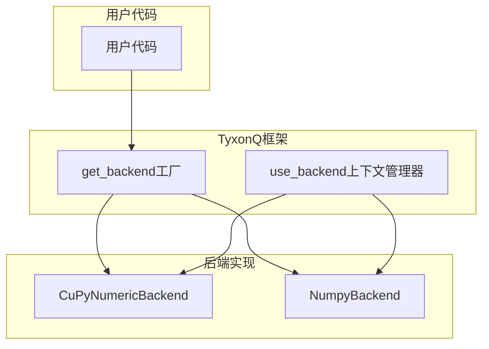
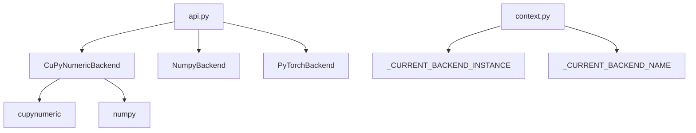

# CuPyNumeric后端

<cite>
**Referenced Files in This Document**   
- [cupynumeric_backend.py](file://src/tyxonq/numerics/backends/cupynumeric_backend.py)
- [numpy_backend.py](file://src/tyxonq/numerics/backends/numpy_backend.py)
- [api.py](file://src/tyxonq/numerics/api.py)
- [context.py](file://src/tyxonq/numerics/context.py)
</cite>

## 目录
1. [简介](#简介)
2. [核心组件](#核心组件)
3. [架构概述](#架构概述)
4. [详细组件分析](#详细组件分析)
5. [依赖分析](#依赖分析)
6. [性能考量](#性能考量)
7. [故障排除指南](#故障排除指南)

## 简介
CuPyNumeric后端是TyxonQ框架中的一个高性能数值计算模块，旨在通过利用cupynumeric库实现GPU加速的数组计算。该后端的设计目标是为大规模量子态模拟和高采样任务提供高效的计算能力。通过将计算密集型操作（如矩阵乘法和爱因斯坦求和）卸载到GPU上执行，CuPyNumeric后端显著提升了计算性能。然而，由于某些复杂线性代数运算（如SVD）在GPU上的实现尚不成熟，这些操作需要回退到NumPy主机内存中进行处理。此外，随机数生成依赖于NumPy的随机生成器，且不支持自动微分功能。本文档将详细介绍CuPyNumeric后端的设计、实现及其在实际应用中的性能优化策略。

## 核心组件
CuPyNumeric后端的核心组件包括`CuPyNumericBackend`类，该类实现了`ArrayBackend`协议，提供了统一的数组创建、基本算术运算和向量化辅助方法。`CuPyNumericBackend`类通过封装cupynumeric库的功能，实现了GPU加速的数组计算。此外，`NumpyBackend`类作为对比基准，提供了纯CPU实现的数值计算功能。`api.py`文件定义了`ArrayBackend`协议和`get_backend`工厂函数，用于根据名称或实例获取相应的后端。`context.py`文件提供了全局配置和上下文管理器，允许用户在运行时动态切换后端。

**Section sources**
- [cupynumeric_backend.py](file://src/tyxonq/numerics/backends/cupynumeric_backend.py#L12-L252)
- [numpy_backend.py](file://src/tyxonq/numerics/backends/numpy_backend.py#L7-L162)
- [api.py](file://src/tyxonq/numerics/api.py#L38-L194)
- [context.py](file://src/tyxonq/numerics/context.py#L1-L52)

## 架构概述
CuPyNumeric后端的架构设计遵循模块化原则，通过`ArrayBackend`协议定义了一组统一的接口，确保不同后端之间的互操作性。`CuPyNumericBackend`类实现了这些接口，并利用cupynumeric库提供的GPU加速功能。当用户调用`get_backend`函数时，系统会根据指定的名称或实例返回相应的后端对象。`context.py`文件中的`use_backend`上下文管理器允许用户在特定代码块内临时切换后端，从而实现灵活的计算资源管理。

**Diagram sources **
- [api.py](file://src/tyxonq/numerics/api.py#L158-L194)
- [context.py](file://src/tyxonq/numerics/context.py#L38-L52)

## 详细组件分析

### CuPyNumericBackend分析
`CuPyNumericBackend`类是CuPyNumeric后端的核心实现，它通过封装cupynumeric库的功能，提供了GPU加速的数组计算。该类实现了`ArrayBackend`协议中定义的所有方法，包括数组创建、基本算术运算、线性代数运算和随机数生成等。

#### 类图

```mermaid
classDiagram
class CuPyNumericBackend {
+string name
+bool available
+complex64 complex64
+complex128 complex128
+float32 float32
+float64 float64
+int32 int32
+int64 int64
+bool bool
+int int
+array(data, dtype) Any
+asarray(data) Any
+to_numpy(data) np.ndarray
+matmul(a, b) Any
+einsum(subscripts, *operands) Any
+reshape(a, shape) Any
+moveaxis(a, source, destination) Any
+sum(a, axis) Any
+mean(a, axis) Any
+abs(a) Any
+real(a) Any
+conj(a) Any
+diag(a) Any
+zeros(shape, dtype) Any
+ones(shape, dtype) Any
+zeros_like(a) Any
+ones_like(a) Any
+eye(n, dtype) Any
+kron(a, b) Any
+square(a) Any
+exp(a) Any
+sin(a) Any
+cos(a) Any
+sqrt(a) Any
+log(a) Any
+log2(a) Any
+svd(a, full_matrices) Tuple[Any, Any, Any]
+rng(seed) Any
+normal(rng, shape, dtype) Any
+choice(rng, a, size, p) Any
+bincount(x, minlength) Any
+nonzero(x) Any
+requires_grad(x, flag) Any
+detach(x) Any
+jit(fn) Any
+value_and_grad(fn, argnums) Any
}
class ArrayBackend {
<<protocol>>
+string name
+Any complex64
+Any complex128
+Any float32
+Any float64
+Any int32
+Any int64
+Any bool
+Any int
+array(data, dtype) Any
+asarray(data) Any
+to_numpy(data) np.ndarray
+matmul(a, b) Any
+einsum(subscripts, *operands) Any
+reshape(a, shape) Any
+moveaxis(a, source, destination) Any
+sum(a, axis) Any
+mean(a, axis) Any
+abs(a) Any
+real(a) Any
+conj(a) Any
+diag(a) Any
+zeros(shape, dtype) Any
+ones(shape, dtype) Any
+zeros_like(a) Any
+ones_like(a) Any
+eye(n, dtype) Any
+kron(a, b) Any
+square(a) Any
+exp(a) Any
+sin(a) Any
+cos(a) Any
+sqrt(a) Any
+log(a) Any
+log2(a) Any
+svd(a, full_matrices) Tuple[Any, Any, Any]
+rng(seed) Any
+normal(rng, shape, dtype) Any
+choice(rng, a, size, p) Any
+bincount(x, minlength) Any
+nonzero(x) Any
+requires_grad(x, flag) Any
+detach(x) Any
+jit(fn) Any
+value_and_grad(fn, argnums) Any
}
CuPyNumericBackend --|> ArrayBackend : "实现"
```

**Diagram sources **
- [cupynumeric_backend.py](file://src/tyxonq/numerics/backends/cupynumeric_backend.py#L12-L252)
- [api.py](file://src/tyxonq/numerics/api.py#L38-L157)

### 性能优化指南
在使用CuPyNumeric后端进行大规模量子态模拟和高采样任务时，以下几点性能优化建议可以帮助提升计算效率：

1. **内存管理**：由于GPU内存有限，应尽量减少不必要的数据传输。在进行大规模计算前，确保所有输入数据已加载到GPU内存中，并在计算完成后及时释放不再需要的内存。
2. **批处理**：对于重复的计算任务，尽可能使用批处理方式一次性提交多个任务，以减少GPU调度开销。
3. **避免频繁的主机-设备数据交换**：尽量在GPU上完成所有计算，避免频繁地将数据从GPU复制回主机内存。
4. **利用向量化操作**：充分利用cupynumeric库提供的向量化操作，如`einsum`和`matmul`，以提高计算效率。
5. **基准对比**：定期与NumPy后端进行基准对比，评估GPU加速的实际效果，并根据结果调整计算策略。

**Section sources**
- [cupynumeric_backend.py](file://src/tyxonq/numerics/backends/cupynumeric_backend.py#L45-L48)
- [cupynumeric_backend.py](file://src/tyxonq/numerics/backends/cupynumeric_backend.py#L50-L53)
- [cupynumeric_backend.py](file://src/tyxonq/numerics/backends/cupynumeric_backend.py#L164-L171)
- [cupynumeric_backend.py](file://src/tyxonq/numerics/backends/cupynumeric_backend.py#L173-L178)
- [cupynumeric_backend.py](file://src/tyxonq/numerics/backends/cupynumeric_backend.py#L205-L206)

## 依赖分析
CuPyNumeric后端依赖于cupynumeric库来实现GPU加速的数组计算。如果cupynumeric库不可用，则会抛出运行时错误。此外，`CuPyNumericBackend`类还依赖于NumPy库，用于处理某些不支持GPU加速的操作，如SVD分解和随机数生成。`api.py`文件中的`get_backend`函数依赖于`NumpyBackend`和`PyTorchBackend`类，以提供多后端支持。`context.py`文件中的`use_backend`上下文管理器依赖于全局变量`_CURRENT_BACKEND_INSTANCE`和`_CURRENT_BACKEND_NAME`来管理当前的后端配置。

**Diagram sources **
- [cupynumeric_backend.py](file://src/tyxonq/numerics/backends/cupynumeric_backend.py#L1-L252)
- [api.py](file://src/tyxonq/numerics/api.py#L1-L194)
- [context.py](file://src/tyxonq/numerics/context.py#L1-L52)

## 性能考量
CuPyNumeric后端在处理大规模量子态模拟和高采样任务时表现出色，尤其是在执行矩阵乘法和爱因斯坦求和等计算密集型操作时。然而，由于SVD等复杂线性代数运算需要回退到NumPy主机内存中进行处理，这可能会成为性能瓶颈。此外，随机数生成依赖于NumPy的随机生成器，这也可能导致额外的主机-设备数据交换开销。为了最大化性能，建议在设计计算流程时尽量减少对这些操作的依赖，并充分利用GPU的并行计算能力。

**Section sources**
- [cupynumeric_backend.py](file://src/tyxonq/numerics/backends/cupynumeric_backend.py#L164-L171)
- [cupynumeric_backend.py](file://src/tyxonq/numerics/backends/cupynumeric_backend.py#L173-L178)

## 故障排除指南
在使用CuPyNumeric后端时，可能会遇到以下常见问题：

1. **cupynumeric库不可用**：确保已正确安装cupynumeric库，并且其版本与TyxonQ框架兼容。
2. **GPU内存不足**：对于大规模计算任务，可能需要增加GPU内存或优化内存使用。
3. **性能未达预期**：检查是否存在频繁的主机-设备数据交换，以及是否充分利用了GPU的并行计算能力。
4. **SVD分解性能低下**：考虑使用近似算法或其他替代方案来减少对SVD分解的依赖。

**Section sources**
- [cupynumeric_backend.py](file://src/tyxonq/numerics/backends/cupynumeric_backend.py#L164-L171)
- [cupynumeric_backend.py](file://src/tyxonq/numerics/backends/cupynumeric_backend.py#L173-L178)