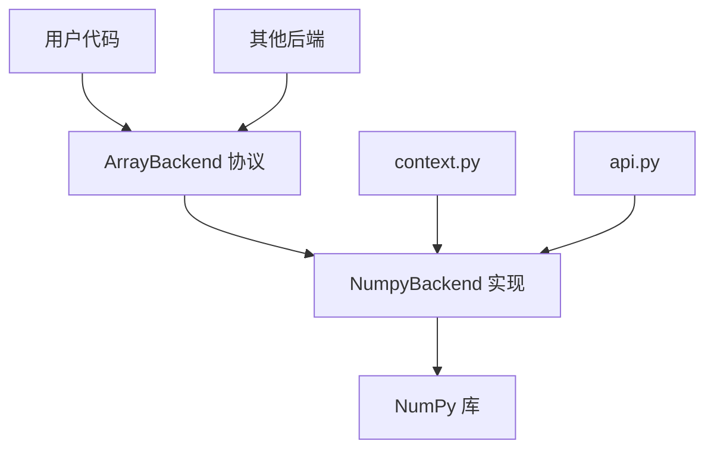
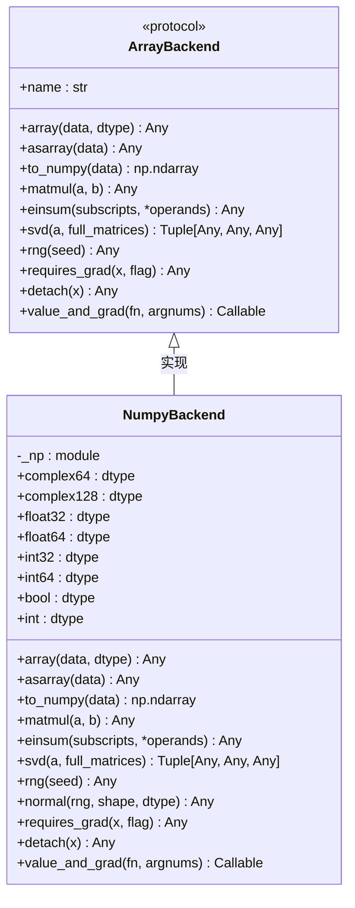
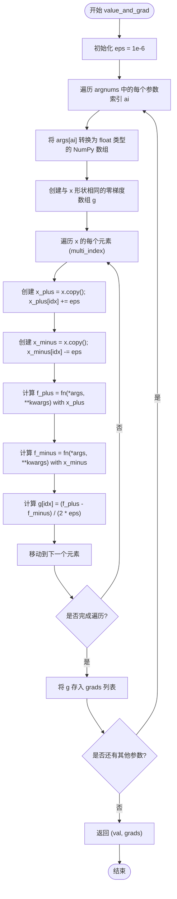
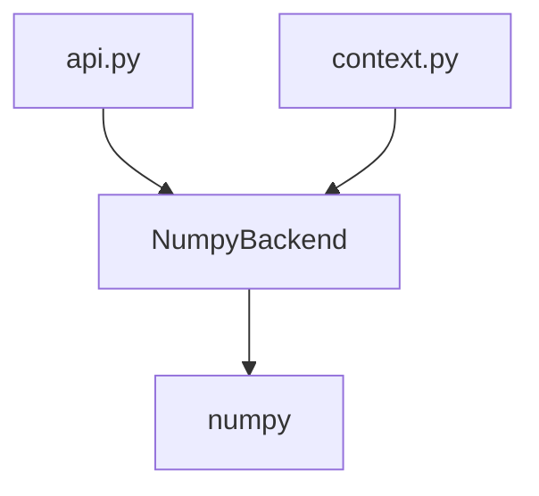

# NumPy后端

<cite>
**Referenced Files in This Document**   
- [numpy_backend.py](file://src/tyxonq/numerics/backends/numpy_backend.py)
- [api.py](file://src/tyxonq/numerics/api.py)
- [context.py](file://src/tyxonq/numerics/context.py)
</cite>

## 目录
1. [简介](#简介)
2. [核心组件](#核心组件)
3. [架构概述](#架构概述)
4. [详细组件分析](#详细组件分析)
5. [依赖分析](#依赖分析)
6. [性能考量](#性能考量)
7. [故障排除指南](#故障排除指南)
8. [结论](#结论)

## 简介
本文档详细阐述了TyxonQ框架中`NumpyBackend`类的实现机制，该类作为默认的CPU计算后端，实现了`ArrayBackend`协议。文档重点分析其如何通过封装NumPy原生数组操作来支持量子电路模拟中的核心数值计算，包括基础数学运算、线性代数操作和随机数生成。同时，深入探讨了其在自动微分支持上的局限性及回退方案，并为中小型量子电路模拟提供了使用建议。

## 核心组件

`NumpyBackend`是TyxonQ数值计算模块的核心实现之一，作为默认的CPU后端，它通过直接调用NumPy库来执行所有数组操作。该类严格遵循`ArrayBackend`协议，确保了与框架内其他后端（如PyTorch）的接口一致性。其主要职责是提供一个稳定、无需额外依赖的计算环境，特别适用于开发和调试阶段。

**Section sources**
- [numpy_backend.py](file://src/tyxonq/numerics/backends/numpy_backend.py#L7-L162)

## 架构概述

`NumpyBackend`的架构设计遵循了协议驱动的模式。`ArrayBackend`协议定义了所有后端必须实现的接口，而`NumpyBackend`作为其具体实现，将这些接口调用直接桥接到NumPy库的相应函数上。全局后端上下文（`context.py`）允许用户在运行时动态切换后端，而`api.py`中的工厂函数`get_backend`则负责根据配置或请求创建相应的后端实例。

**Diagram sources**
- [api.py](file://src/tyxonq/numerics/api.py#L18-L101)
- [numpy_backend.py](file://src/tyxonq/numerics/backends/numpy_backend.py#L7-L162)
- [context.py](file://src/tyxonq/numerics/context.py#L1-L52)

## 详细组件分析

### NumpyBackend 类分析

`NumpyBackend`类是`ArrayBackend`协议在NumPy上的具体实现。它通过将协议方法一一映射到NumPy函数，实现了与NumPy原生数组的无缝集成。

#### 基础数学与线性代数运算
该类实现了协议要求的核心运算方法，如`matmul`、`einsum`和`svd`。这些方法直接调用NumPy的底层实现，例如`NumpyBackend.matmul`调用`np.matmul`，`NumpyBackend.svd`调用`np.linalg.svd`。这种直接的封装方式保证了计算的准确性和稳定性，同时利用了NumPy经过高度优化的C语言底层库。

**Diagram sources**
- [api.py](file://src/tyxonq/numerics/api.py#L18-L101)
- [numpy_backend.py](file://src/tyxonq/numerics/backends/numpy_backend.py#L7-L162)

#### 随机数生成器封装
`NumpyBackend`通过`rng`方法封装了NumPy的随机数生成器。该方法返回一个`numpy.random.Generator`实例，用于生成符合特定分布的随机数，如`normal`方法生成正态分布的数组。这种封装为框架提供了统一的随机数接口。

#### 自动微分支持的局限性
`NumpyBackend`在自动微分方面存在固有局限。其`requires_grad`和`detach`方法是空实现，仅原样返回输入张量，因为NumPy本身不支持计算图和梯度追踪。

#### 基于有限差分的梯度计算
为了在不支持自动微分的后端上保持API的统一，`NumpyBackend`实现了`value_and_grad`方法。该方法不使用反向传播，而是采用**有限差分法**作为回退方案。它通过在每个参数上施加微小的扰动（`eps = 1e-6`），分别计算函数在`x+eps`和`x-eps`处的值，然后利用中心差分公式`(f(x+eps) - f(x-eps)) / (2*eps)`来近似梯度。虽然这种方法计算成本高且数值稳定性较差，但它确保了在纯NumPy环境下也能进行梯度计算。

**Diagram sources**
- [numpy_backend.py](file://src/tyxonq/numerics/backends/numpy_backend.py#L132-L162)

## 依赖分析

`NumpyBackend`的依赖关系清晰且直接。其主要依赖是`numpy`库，所有计算操作都通过`import numpy as np`进行。在框架内部，它被`api.py`中的`get_backend`工厂函数所依赖，用于在请求NumPy后端时创建实例。`context.py`模块通过全局状态管理当前的后端实例，`NumpyBackend`是其可能的值之一。

**Diagram sources**
- [numpy_backend.py](file://src/tyxonq/numerics/backends/numpy_backend.py#L1-L5)
- [api.py](file://src/tyxonq/numerics/api.py#L5-L7)
- [context.py](file://src/tyxonq/numerics/context.py#L1-L52)

## 性能考量

`NumpyBackend`作为纯CPU后端，其性能特点如下：
- **内存占用**：内存占用相对较低，因为它不维护计算图或额外的梯度缓冲区。然而，对于大型量子态（2^N维向量），内存消耗会随量子比特数N呈指数增长。
- **计算效率**：对于基础的线性代数运算，得益于NumPy的优化，计算效率较高。但`value_and_grad`方法的有限差分实现效率极低，其计算复杂度与参数数量成正比，不适合大规模优化任务。
- **适用场景**：最适合中小型量子电路（通常少于20个量子比特）的模拟、算法原型设计和调试。对于需要高效梯度计算的变分量子算法（VQE, QAOA），建议在开发验证后切换到支持自动微分的后端（如PyTorch）。

## 故障排除指南

- **问题**：`value_and_grad`计算结果不准确或出现数值不稳定。
  **解决方案**：这是有限差分法的固有缺陷。尝试调整`eps`值，但需注意过小的`eps`会加剧舍入误差，过大的`eps`会增加截断误差。对于精确的梯度计算，应考虑使用支持自动微分的后端。
- **问题**：内存不足（OOM）错误。
  **解决方案**：这是指数级态向量增长的直接结果。尝试减少模拟的量子比特数，或考虑使用更高效的模拟器（如矩阵积态MPS）。

**Section sources**
- [numpy_backend.py](file://src/tyxonq/numerics/backends/numpy_backend.py#L132-L162)

## 结论

`NumpyBackend`为TyxonQ提供了一个可靠、轻量级的默认CPU计算后端。它通过无缝集成NumPy，实现了`ArrayBackend`协议的核心功能，特别适合作为开发和调试的起点。尽管其在自动微分方面通过有限差分法提供了API兼容性，但性能和精度有限。用户应根据具体需求，在开发阶段使用`NumpyBackend`进行快速迭代，并在需要高效梯度计算时切换到更高级的后端。