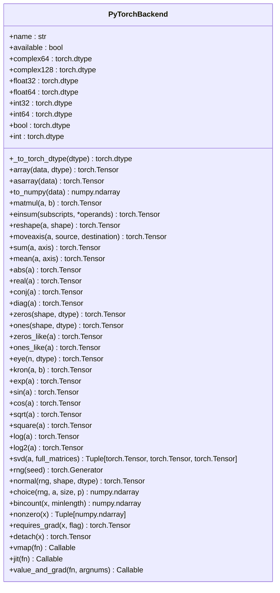
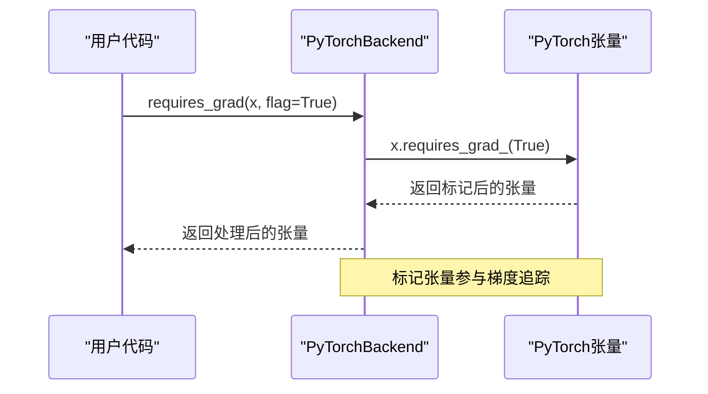
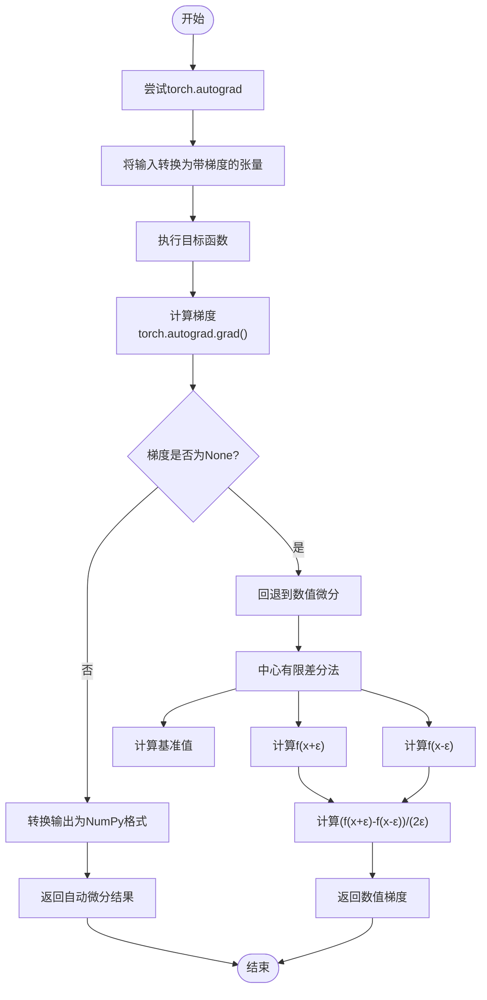
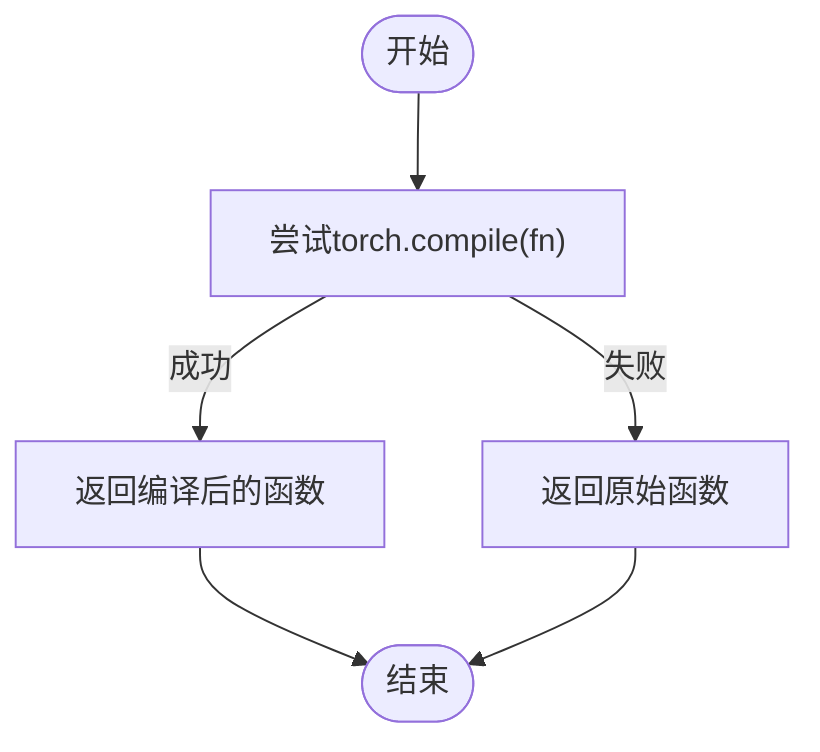
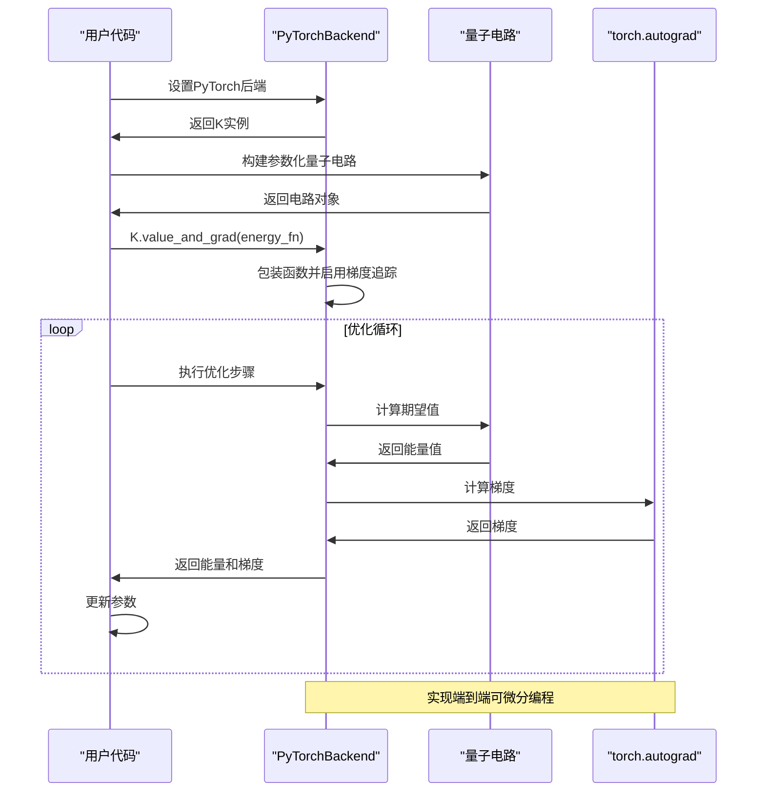
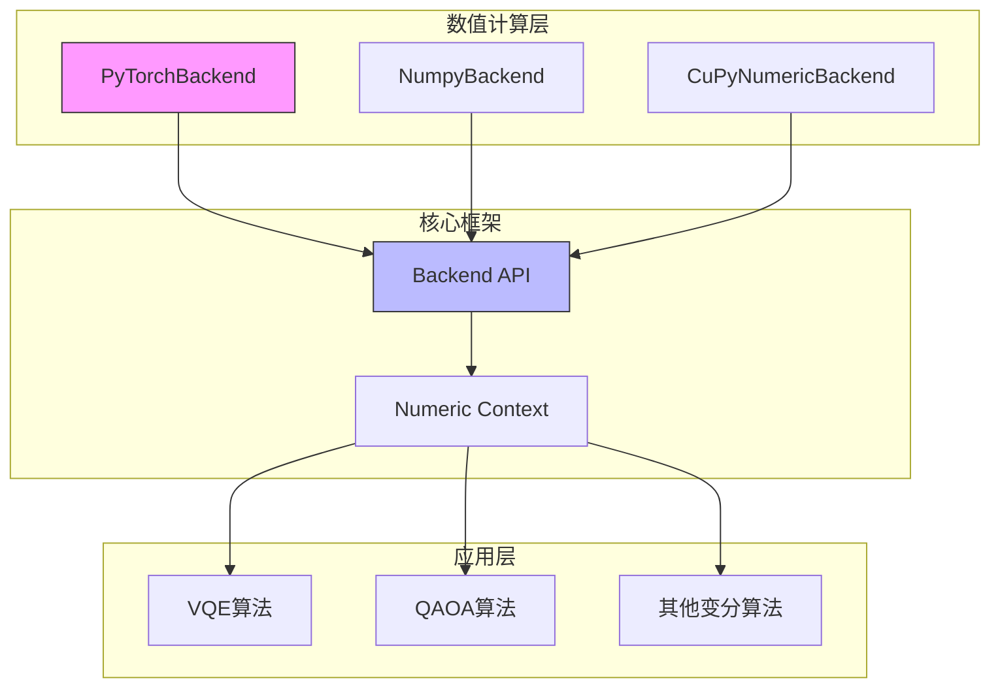

# PyTorch后端

<cite>
**Referenced Files in This Document**   
- [pytorch_backend.py](file://src/tyxonq/numerics/backends/pytorch_backend.py)
- [pytorch_scan_jit_acc.py](file://examples-ng/pytorch_scan_jit_acc.py)
</cite>

## 目录
1. [简介](#简介)
2. [核心功能分析](#核心功能分析)
3. [自动微分机制](#自动微分机制)
4. [GPU加速与JIT编译](#gpu加速与jit编译)
5. [变分量子算法应用示例](#变分量子算法应用示例)
6. [架构与依赖关系](#架构与依赖关系)

## 简介

PyTorch后端是TyxonQ框架中的一个关键数值计算后端，它通过`PyTorchBackend`类实现了`ArrayBackend`协议。该后端利用PyTorch张量的强大功能，为量子计算模拟提供了高效的数值运算支持。其核心优势在于原生支持自动微分、具备GPU加速潜力，并能通过JIT编译优化性能，特别适用于变分量子算法（如VQE、QAOA）的端到端可微分编程。

**Section sources**
- [pytorch_backend.py](file://src/tyxonq/numerics/backends/pytorch_backend.py#L12-L256)

## 核心功能分析

`PyTorchBackend`类封装了PyTorch的核心功能，提供了一套完整的数组操作接口。该类实现了包括数组创建、数学运算、线性代数操作在内的多种方法，所有操作均基于PyTorch张量实现。

**Diagram sources**
- [pytorch_backend.py](file://src/tyxonq/numerics/backends/pytorch_backend.py#L12-L256)

**Section sources**
- [pytorch_backend.py](file://src/tyxonq/numerics/backends/pytorch_backend.py#L12-L256)

## 自动微分机制

### requires_grad方法

`requires_grad`方法是PyTorch后端实现自动微分的基础。该方法通过调用PyTorch张量的`requires_grad_`方法，标记张量参与梯度追踪。当`flag`参数为`True`时，张量的计算历史将被记录，从而支持后续的梯度计算。

**Diagram sources**
- [pytorch_backend.py](file://src/tyxonq/numerics/backends/pytorch_backend.py#L171-L174)

### value_and_grad函数

`value_and_grad`函数是PyTorch后端自动微分的核心实现。它采用优先级策略：首先尝试使用`torch.autograd`进行高效梯度计算，若失败则自动回退到数值微分。

**Diagram sources**
- [pytorch_backend.py](file://src/tyxonq/numerics/backends/pytorch_backend.py#L199-L256)

**Section sources**
- [pytorch_backend.py](file://src/tyxonq/numerics/backends/pytorch_backend.py#L199-L256)

## GPU加速与JIT编译

### CPU/GPU间张量移动

`to_numpy`方法实现了张量在CPU/GPU间的移动。该方法通过`detach().cpu().numpy()`模式，先从计算图中分离张量，再将其移动到CPU，最后转换为NumPy数组。这种模式确保了梯度信息不会被意外保留，同时实现了跨设备的数据传输。

**Section sources**
- [pytorch_backend.py](file://src/tyxonq/numerics/backends/pytorch_backend.py#L158-L160)

### torch.compile的JIT编译支持

`jit`方法为PyTorch后端提供了JIT编译支持。该方法尝试使用`torch.compile`对函数进行编译优化，若编译失败则返回原始函数。这种设计既利用了PyTorch 2.0+的`torch.compile`特性来提升性能，又保持了向后兼容性。

**Diagram sources**
- [pytorch_backend.py](file://src/tyxonq/numerics/backends/pytorch_backend.py#L192-L197)

**Section sources**
- [pytorch_backend.py](file://src/tyxonq/numerics/backends/pytorch_backend.py#L192-L197)

## 变分量子算法应用示例

在变分量子算法（如VQE、QAOA）中，PyTorch后端支持端到端的可微分编程。以下示例展示了如何利用PyTorch后端进行量子电路优化：

**Diagram sources**
- [pytorch_scan_jit_acc.py](file://examples-ng/pytorch_scan_jit_acc.py#L10-L93)

**Section sources**
- [pytorch_scan_jit_acc.py](file://examples-ng/pytorch_scan_jit_acc.py#L10-L93)

## 架构与依赖关系

PyTorch后端的设计体现了模块化和可扩展性。它作为`ArrayBackend`协议的具体实现，与其他数值后端（如NumPy、CuPy）共同构成了TyxonQ的数值计算层。

**Diagram sources**
- [pytorch_backend.py](file://src/tyxonq/numerics/backends/pytorch_backend.py#L12-L256)
- [pytorch_scan_jit_acc.py](file://examples-ng/pytorch_scan_jit_acc.py#L10-L93)

**Section sources**
- [pytorch_backend.py](file://src/tyxonq/numerics/backends/pytorch_backend.py#L12-L256)
- [pytorch_scan_jit_acc.py](file://examples-ng/pytorch_scan_jit_acc.py#L10-L93)