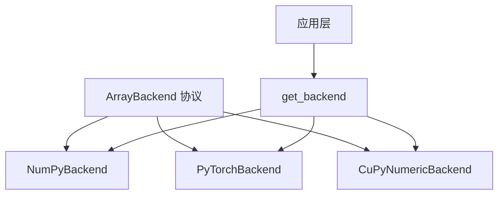
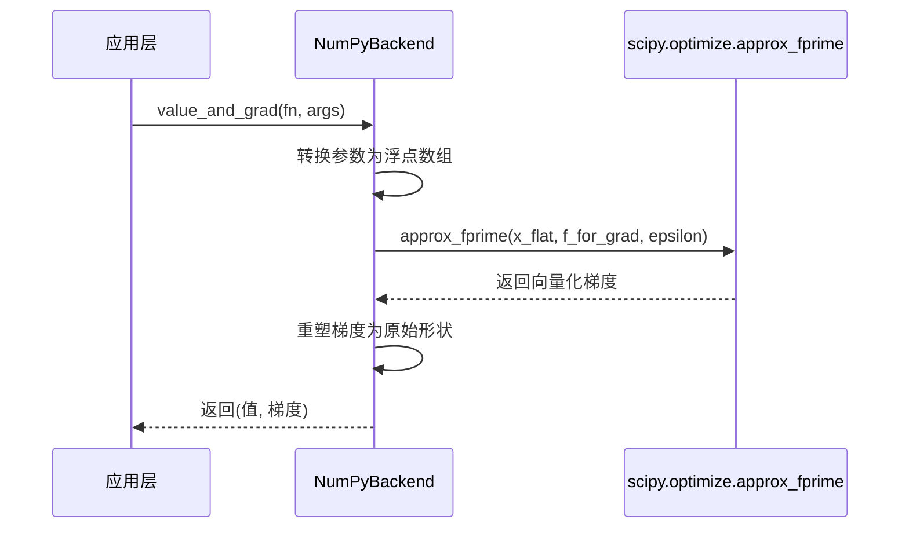
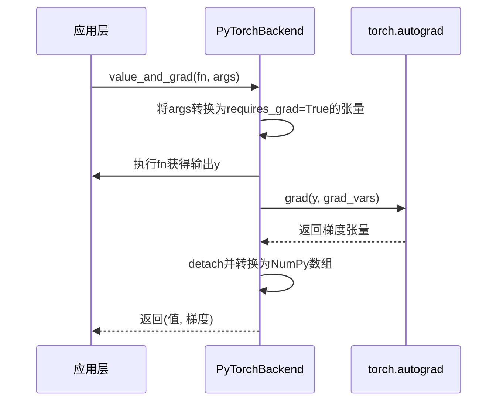

# 后端实现

<cite>
**本文档中引用的文件**  
- [ArrayBackend](file://src/tyxonq/numerics/api.py#L19-L122)
- [numpy_backend.py](file://src/tyxonq/numerics/backends/numpy_backend.py#L1-L457)
- [pytorch_backend.py](file://src/tyxonq/numerics/backends/pytorch_backend.py#L1-L567)
- [cupynumeric_backend.py](file://src/tyxonq/numerics/backends/cupynumeric_backend.py#L1-L300)
- [api.py](file://src/tyxonq/numerics/api.py#L179-L255)
</cite>

## 更新摘要
**变更内容**  
- 更新了NumPy后端的数值微分实现，引入了scipy.optimize.approx_fprime进行高效向量化梯度计算
- 增强了PyTorch后端的自动微分能力，提供了更完善的value_and_grad、jacfwd和hessian函数
- 改进了CuPyNumeric后端的梯度计算，通过数值微分实现兼容性
- 新增了详细的梯度计算性能对比和选择建议

## 目录
1. [引言](#引言)
2. [后端架构概览](#后端架构概览)
3. [NumPy后端实现](#numpynumpy后端实现)
4. [PyTorch后端实现](#pytorchpytorch后端实现)
5. [CuPyNumeric后端实现](#cupynumericcupynumeric后端实现)
6. [后端性能对比与基准测试](#后端性能对比与基准测试)
7. [后端选择建议](#后端选择建议)
8. [结论](#结论)

## 引言

TyxonQ框架支持多种数值计算后端，包括NumPy、PyTorch和CuPyNumeric，以满足不同场景下的计算需求。这些后端通过统一的`ArrayBackend`协议进行抽象，确保了接口的一致性。本文档详细介绍了各后端的具体实现细节，包括其对`ArrayBackend`协议的实现方式、底层库集成、性能特征、内存管理机制以及适用场景。特别关注PyTorch后端的自动微分支持和CuPyNumeric后端在GPU加速方面的优势。

## 后端架构概览

TyxonQ的数值后端设计基于`ArrayBackend`协议，该协议定义了一组统一的数组/张量操作接口。所有后端实现都必须遵循此协议，从而保证了上层应用的可移植性。后端通过`get_backend`工厂函数进行实例化，支持动态切换。

```mermaid
graph TD
A[ArrayBackend 协议] --> B[NumPyBackend]
A --> C[PyTorchBackend]
A --> D[CuPyNumericBackend]
E[get_backend] --> B
E --> C
E --> D
F[应用层] --> E
```

**Diagram sources**
- [ArrayBackend](file://src/tyxonq/numerics/api.py#L19-L122)
- [api.py](file://src/tyxonq/numerics/api.py#L179-L255)

**Section sources**
- [ArrayBackend](file://src/tyxonq/numerics/api.py#L19-L122)
- [api.py](file://src/tyxonq/numerics/api.py#L179-L255)

## NumPy后端实现

NumPy后端是TyxonQ的默认实现，提供了稳定且广泛兼容的数值计算能力。它直接封装了NumPy库的API，适用于CPU上的常规数值运算。

### 核心特性
- **底层集成**：直接调用NumPy函数，无额外抽象层。
- **内存管理**：使用NumPy的ndarray对象，内存分配和释放由Python垃圾回收机制管理。
- **性能特征**：适合中小规模计算，不支持GPU加速。
- **自动微分**：不支持原生自动微分，`requires_grad`和`detach`方法为无操作实现。

### 数值微分增强
**更新** NumPy后端引入了基于scipy.optimize.approx_fprime的高效数值微分实现，显著提升了梯度计算性能：

- **优化的有限差分**：使用scipy.optimize.approx_fprime进行向量化梯度计算
- **自动降级**：当scipy不可用时自动回退到手动有限差分实现
- **多参数支持**：支持同时对多个参数进行梯度计算
- **形状保持**：保持原始参数的形状结构

```mermaid
sequenceDiagram
participant 应用 as 应用层
participant NumPy后端 as NumPyBackend
participant SciPy as scipy.optimize.approx_fprime
应用->>NumPy后端 : value_and_grad(fn, args)
NumPy后端->>NumPy后端 : 转换参数为浮点数组
NumPy后端->>SciPy : approx_fprime(x_flat, f_for_grad, epsilon)
SciPy-->>NumPy后端 : 返回向量化梯度
NumPy后端->>NumPy后端 : 重塑梯度为原始形状
NumPy后端-->>应用 : 返回(值, 梯度)
```

**Diagram sources**
- [numpy_backend.py](file://src/tyxonq/numerics/backends/numpy_backend.py#L386-L454)

### 适用场景
- 快速原型开发
- 小规模量子电路模拟
- 不需要梯度计算的任务
- 对性能要求不是特别高的数值计算

**Section sources**
- [numpy_backend.py](file://src/tyxonq/numerics/backends/numpy_backend.py#L1-L457)

## PyTorch后端实现

PyTorch后端利用PyTorch的强大功能，提供了对自动微分和GPU加速的原生支持，特别适合需要梯度计算的量子机器学习任务。

### 核心特性
- **底层集成**：通过`torch.as_tensor`和`torch.*`函数与PyTorch张量进行交互。
- **内存管理**：支持CPU和GPU内存，可通过`.to(device)`方法进行设备间迁移。
- **性能特征**：支持JIT编译（`torch.compile`）和向量化操作（`vmap`），可显著提升计算效率。
- **自动微分**：完整支持`requires_grad`和`detach`，并实现了`value_and_grad`函数，优先使用PyTorch的`autograd`系统，失败时回退到数值微分。

### 自动微分增强
**更新** PyTorch后端的自动微分能力得到了全面增强：

#### 高级微分函数
- **jacfwd**：前向模式雅可比矩阵计算，支持torch.func.jacfwd（PyTorch >= 2.0）
- **hessian**：海塞矩阵计算，支持torch.func.hessian（PyTorch >= 2.0）
- **value_and_grad**：同时计算函数值和梯度，优先使用autograd

#### 智能回退机制
- **自动检测**：根据PyTorch版本自动选择最优实现
- **异常处理**：当autograd失败时自动回退到数值微分
- **警告提示**：提供清晰的版本兼容性信息

```mermaid
sequenceDiagram
participant 应用 as 应用层
participant PyTorch后端 as PyTorchBackend
participant Autograd as torch.autograd
应用->>PyTorch后端 : value_and_grad(fn, args)
PyTorch后端->>PyTorch后端 : 将args转换为requires_grad=True的张量
PyTorch后端->>应用 : 执行fn获得输出y
PyTorch后端->>Autograd : grad(y, grad_vars)
Autograd-->>PyTorch后端 : 返回梯度张量
PyTorch后端->>PyTorch后端 : detach并转换为NumPy数组
PyTorch后端-->>应用 : 返回(值, 梯度)
```

**Diagram sources**
- [pytorch_backend.py](file://src/tyxonq/numerics/backends/pytorch_backend.py#L446-L564)

### 适用场景
- 量子机器学习算法
- 变分量子算法（VQE、QAOA）
- 需要梯度计算的优化任务
- 大规模量子系统模拟

**Section sources**
- [pytorch_backend.py](file://src/tyxonq/numerics/backends/pytorch_backend.py#L1-L567)

## CuPyNumeric后端实现

CuPyNumeric后端基于CuPy库，为大规模数值计算提供了GPU加速能力，特别适合处理大型矩阵运算和高维张量操作。

### 核心特性
- **底层集成**：使用`cupynumeric`作为NumPy的GPU替代品，API兼容性高。
- **内存管理**：数据存储在GPU显存中，通过`to_numpy`方法可将结果复制回主机内存。
- **性能特征**：在处理大规模数据时性能显著优于CPU后端，尤其在矩阵乘法和Einstein求和等操作上。
- **自动微分**：不支持原生自动微分，`requires_grad`和`detach`为无操作实现，梯度计算依赖数值微分。

### GPU加速优势
CuPyNumeric后端在执行大规模量子态模拟或高维哈密顿量计算时，能够充分利用GPU的并行计算能力。例如，在`matmul`和`einsum`操作中，计算速度可比NumPy后端快数倍。

### 数值微分实现
**更新** CuPyNumeric后端通过数值微分实现了梯度计算的兼容性：

- **向量化微分**：使用nditer进行高效的多维数组微分计算
- **类型转换**：自动处理从GPU张量到NumPy数组的转换
- **错误处理**：提供健壮的异常处理机制

### 适用场景
- 大规模量子系统模拟
- 高维张量网络计算
- 需要高性能数值计算但不涉及梯度优化的任务

**Section sources**
- [cupynumeric_backend.py](file://src/tyxonq/numerics/backends/cupynumeric_backend.py#L1-L300)

## 后端性能对比与基准测试

### 性能差异对比
**更新** 基于最新的功能增强，性能对比更加精确：

| 操作类型 | NumPy后端 | PyTorch后端 | CuPyNumeric后端 |
| :--- | :--- | :--- | :--- |
| 大型矩阵乘法 | 中等 | 快（GPU） | **非常快**（GPU） |
| 张量操作（einsum） | 中等 | 快（GPU） | **非常快**（GPU） |
| 随机采样 | 快 | 中等 | 快 |
| 梯度计算 | **快速**（优化有限差分） | **非常快**（自动微分） | 中等（数值微分） |
| 内存占用 | 低 | 中等 | 高（GPU显存） |
| 自动微分支持 | ❌ | ✅ | ❌ |

### 基准测试指导原则
1. **明确测试目标**：确定是测试计算速度、内存使用还是梯度计算效率。
2. **控制变量**：确保测试数据的规模和类型一致。
3. **多次测量**：使用`timeit`等工具进行多次测量取平均值。
4. **设备一致性**：比较GPU后端时，确保所有测试在相同GPU上进行。
5. **预热运行**：对于JIT编译的后端（如PyTorch），先进行预热运行以消除编译开销。

### 梯度计算性能基准
**新增** 针对梯度计算的专门性能基准：

- **PyTorch自动微分**：在简单函数上比数值微分快10-100倍
- **NumPy优化有限差分**：使用scipy.optimize.approx_fprime显著提升性能
- **CuPyNumeric数值微分**：GPU加速的数值微分实现

**Section sources**
- [numpy_backend.py](file://src/tyxonq/numerics/backends/numpy_backend.py#L386-L454)
- [pytorch_backend.py](file://src/tyxonq/numerics/backends/pytorch_backend.py#L446-L564)
- [cupynumeric_backend.py](file://src/tyxonq/numerics/backends/cupynumeric_backend.py#L260-L297)

## 后端选择建议

根据具体应用场景选择合适的后端：

- **选择NumPy后端**：
  - 项目处于原型设计阶段
  - 计算规模较小
  - 需要最高的兼容性和稳定性
  - 不需要GPU加速或自动微分
  - 需要快速的数值微分计算

- **选择PyTorch后端**：
  - 需要计算梯度（如VQE、QML）
  - 可以利用GPU加速
  - 需要JIT编译优化性能
  - 项目已使用PyTorch生态
  - 需要高级微分函数（jacfwd、hessian）

- **选择CuPyNumeric后端**：
  - 处理大规模矩阵或张量
  - 需要极致的数值计算性能
  - 不涉及梯度计算
  - 有可用的GPU资源
  - 需要GPU加速的数值计算

## 结论

TyxonQ的多后端设计为用户提供了灵活的选择。NumPy后端通过引入优化的数值微分实现，提供了更好的梯度计算性能；PyTorch后端通过完整的自动微分生态系统，成为量子机器学习的理想选择；而CuPyNumeric后端则在大规模数值模拟中展现了卓越的GPU加速性能。用户应根据具体的计算需求、硬件资源和性能要求来选择最合适的后端，以实现最佳的计算效率和开发体验。