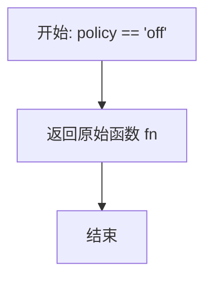
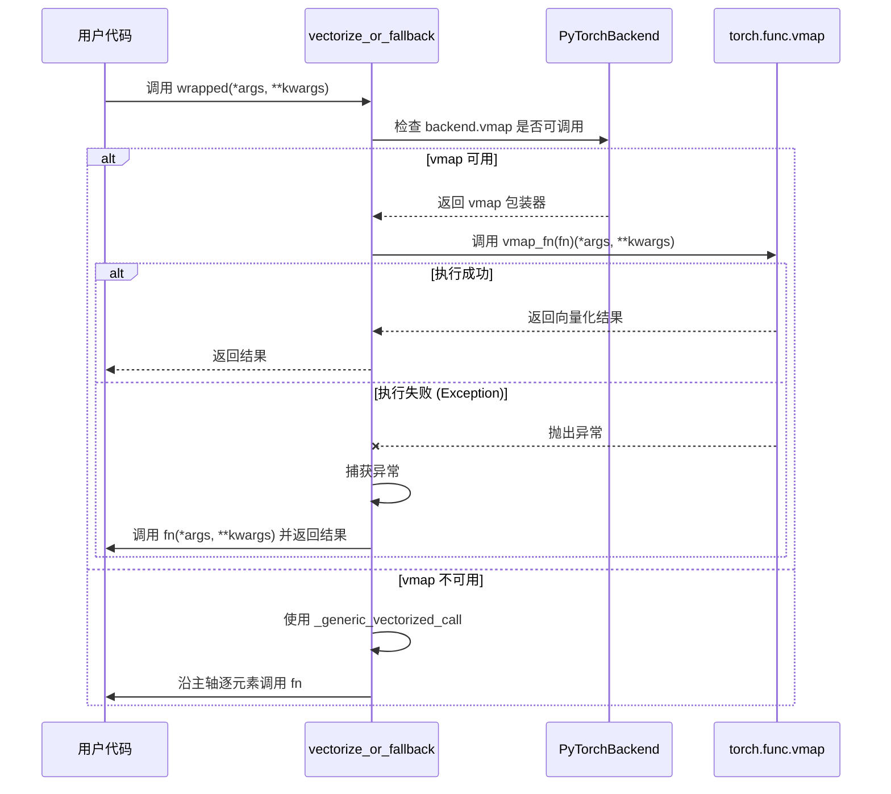

# 向量化支持

<cite>
**本文档中引用的文件**  
- [vectorize_or_fallback](file://src/tyxonq/numerics/api.py#L104-L156)
- [VectorizationPolicy](file://src/tyxonq/config.py#L39-L44)
- [ArrayBackend](file://src/tyxonq/numerics/api.py#L16-L194)
- [PyTorchBackend](file://src/tyxonq/numerics/backends/pytorch_backend.py#L12-L256)
- [NumpyBackend](file://src/tyxonq/numerics/backends/numpy_backend.py#L7-L162)
- [CuPyNumericBackend](file://src/tyxonq/numerics/backends/cupynumeric_backend.py#L12-L252)
- [test_numerics_api.py](file://tests_core_module/test_numerics_api.py#L1-L60)
</cite>

## 目录
1. [简介](#简介)
2. [核心设计：vectorize_or_fallback 函数](#核心设计vectorize_or_fallback-函数)
3. [向量化策略详解](#向量化策略详解)
4. [后端 vmap 支持与回退机制](#后端-vmap-支持与回退机制)
5. [通用轻量级向量化机制](#通用轻量级向量化机制)
6. [代码示例与性能优化](#代码示例与性能优化)
7. [enable_checks 参数的潜在用途](#enable_checks-参数的潜在用途)
8. [结论](#结论)

## 简介
本节档详细阐述 TyxonQ 框架中的向量化支持机制，重点分析 `vectorize_or_fallback` 函数的设计理念与行为逻辑。该机制旨在通过灵活的策略控制，优先利用后端提供的高效向量化执行（如 PyTorch 的 `vmap`），并在失败时安全回退到逐元素执行，从而在保证功能正确性的同时最大化性能。文档将深入探讨三种向量化策略（'auto', 'force', 'off'）的应用场景，并说明在后端不支持原生 `vmap` 时，如何通过通用的轻量级机制实现沿主轴的函数应用。

## 核心设计：vectorize_or_fallback 函数

`vectorize_or_fallback` 函数是 TyxonQ 向量化能力的核心，它根据指定的策略和后端能力，动态地为任意函数 `fn` 包装上最优的执行方式。其设计遵循“优先使用原生向量化，失败则安全降级”的原则。

该函数接收四个参数：
- `fn`：待包装的目标函数。
- `backend`：实现 `ArrayBackend` 协议的后端实例。
- `policy`：向量化策略，决定执行行为。
- `enable_checks`：预留参数，用于未来可能的安全性检查。

函数的返回值是一个可调用对象，该对象在调用时会根据当前策略和后端能力，选择最合适的执行路径。

**Section sources**
- [vectorize_or_fallback](file://src/tyxonq/numerics/api.py#L104-L156)

## 向量化策略详解

向量化策略由 `VectorizationPolicy` 类型定义，包含三种可选值：`'auto'`、`'force'` 和 `'off'`。每种策略对应不同的行为模式，适用于不同的使用场景。

### 'off' 策略
当策略设置为 `'off'` 时，`vectorize_or_fallback` 函数将直接返回原始函数 `fn`，完全禁用任何向量化尝试。此策略适用于：
- 调试阶段，需要确保函数以最基础的逐元素方式执行。
- 已知目标函数或其操作不支持向量化，强制使用原生 `vmap` 可能引发不可预知的错误。
- 性能分析，作为基准对比向量化前后的性能差异。



**Diagram sources**
- [vectorize_or_fallback](file://src/tyxonq/numerics/api.py#L104-L156)

### 'auto' 策略
`'auto'` 是默认策略，它实现了智能的向量化选择。其行为如下：
1.  **检查后端支持**：首先检查 `backend` 是否提供了可调用的 `vmap` 方法。
2.  **尝试原生向量化**：如果 `vmap` 可用，则返回一个包装函数，该函数会尝试使用 `backend.vmap(fn)` 进行向量化执行。
3.  **安全回退**：在向量化执行过程中，如果捕获到任何异常（Exception），则立即回退到对原始函数 `fn` 的逐元素调用。
4.  **通用向量化**：如果后端不提供 `vmap`，则启用通用的轻量级向量化机制，沿第一个参数的主轴进行元素级应用。

此策略在性能和鲁棒性之间取得了最佳平衡，推荐在大多数生产环境中使用。

### 'force' 策略
`'force'` 策略强制尝试使用后端的 `vmap` 功能。其行为与 `'auto'` 策略在 `vmap` 可用时相同：优先使用 `vmap`，失败则回退到原始函数。然而，`'force'` 策略的语义强调了对高性能向量化的强烈需求，即使在 `'auto'` 策略下可能因某些原因未启用，`'force'` 也会明确尝试。此策略适用于：
- 对性能要求极高的批处理任务，开发者确信后端和函数都支持向量化。
- 压力测试，验证系统在强制向量化条件下的稳定性和性能上限。

**Section sources**
- [vectorize_or_fallback](file://src/tyxonq/numerics/api.py#L104-L156)
- [VectorizationPolicy](file://src/tyxonq/config.py#L39-L44)

## 后端 vmap 支持与回退机制

`vectorize_or_fallback` 函数的首要选择是利用后端提供的原生 `vmap` 功能。这通过 `getattr(backend, "vmap", None)` 检查后端实例是否实现了 `vmap` 方法。

### PyTorch 后端的 vmap
以 `PyTorchBackend` 为例，其 `vmap` 方法是一个对 `torch.func.vmap` 的薄包装。它尝试导入并返回 `torch_vmap(fn)`，从而实现高效的、由 PyTorch JIT 优化的向量化执行。如果 `torch.func` 不可用（例如旧版本 PyTorch），则返回一个空的回退函数，这将导致 `vectorize_or_fallback` 转而使用通用向量化机制。



**Diagram sources**
- [vectorize_or_fallback](file://src/tyxonq/numerics/api.py#L104-L156)
- [PyTorchBackend.vmap](file://src/tyxonq/numerics/backends/pytorch_backend.py#L180-L189)

### 安全回退的重要性
在 `vmap` 执行中使用 `try...except Exception` 块是此设计的关键。它确保了即使向量化执行因数据类型不匹配、内存不足或后端内部错误而失败，程序也不会崩溃，而是优雅地降级到功能等价的逐元素执行模式。这种“尽力而为”的策略极大地增强了系统的健壮性。

**Section sources**
- [vectorize_or_fallback](file://src/tyxonq/numerics/api.py#L104-L156)
- [PyTorchBackend](file://src/tyxonq/numerics/backends/pytorch_backend.py#L12-L256)

## 通用轻量级向量化机制

当后端（如 `NumpyBackend` 或 `CuPyNumericBackend`）不提供 `vmap` 方法时，`vectorize_or_fallback` 会启用一个通用的轻量级向量化机制。该机制通过一个名为 `_generic_vectorized_call` 的内部函数实现。

其工作原理如下：
1.  **检查参数**：首先检查是否有位置参数传入。
2.  **获取首个参数**：获取第一个位置参数 `first`。
3.  **迭代应用**：尝试将 `first` 视为一个可迭代对象（如列表、数组），并使用列表推导式 `[fn(a, *args[1:], **kwargs) for a in first]` 对其每个元素 `a` 应用函数 `fn`。
4.  **异常处理**：如果对 `first` 进行迭代时抛出 `TypeError`（例如 `first` 是一个标量而非序列），则捕获该异常，并直接以原始参数调用 `fn(*args, **kwargs)`。

此机制虽然不如原生 `vmap` 高效（因为它本质上是 Python 层的循环），但它提供了一种简单、通用且无依赖的向量化方式，确保了 API 的一致性，使得用户代码无需关心底层后端是否支持高级向量化。

```mermaid
flowchart TD
Start["开始: 执行 _generic_vectorized_call"] --> CheckArgs["检查 args 是否为空"]
CheckArgs --> |否| GetFirst["获取 first = args[0]"]
CheckArgs --> |是| CallFn["调用 fn(*args, **kwargs)"]
GetFirst --> TryIter["尝试迭代 first"]
TryIter --> |成功| ListComp["执行 [fn(a, ...) for a in first]"]
TryIter --> |失败 (TypeError)| CallFn
ListComp --> ReturnList["返回结果列表"]
CallFn --> ReturnResult["返回 fn 的结果"]
ReturnList --> End["结束"]
ReturnResult --> End
```

**Diagram sources**
- [vectorize_or_fallback](file://src/tyxonq/numerics/api.py#L104-L156)

**Section sources**
- [vectorize_or_fallback](file://src/tyxonq/numerics/api.py#L104-L156)
- [NumpyBackend](file://src/tyxonq/numerics/backends/numpy_backend.py#L7-L162)

## 代码示例与性能优化

以下示例展示了如何在不同策略下使用 `vectorize_or_fallback` 来优化批处理任务。

### 示例 1：使用 'auto' 策略进行批处理平方运算
```python
from tyxonq.numerics import get_backend, vectorize_or_fallback

# 定义一个简单的函数
def square(x):
    return x * x

# 获取后端
backend = get_backend("pytorch")  # 或 "numpy"

# 使用 'auto' 策略包装函数
vectorized_square = vectorize_or_fallback(square, backend, policy="auto")

# 批量输入
inputs = [1, 2, 3, 4, 5]

# 执行向量化调用
results = vectorized_square(inputs)
# 当 backend 为 PyTorch 时，优先使用 torch.func.vmap
# 当 backend 为 Numpy 时，使用通用的列表推导式
```

### 性能优化场景
在变分量子算法（VQA）中，经常需要对一批参数集计算能量期望值或梯度。通过 `vectorize_or_fallback`，可以将单次计算函数向量化，从而一次性处理整个批次，显著减少 Python 解释器的开销和函数调用次数，尤其在 GPU 后端上能获得巨大的性能提升。

**Section sources**
- [vectorize_or_fallback](file://src/tyxonq/numerics/api.py#L104-L156)
- [test_numerics_api.py](file://tests_core_module/test_numerics_api.py#L49-L59)

## enable_checks 参数的潜在用途

`enable_checks` 是一个预留的布尔参数，当前版本中未被使用（`enable_checks: bool = True`）。其设计目的是为未来的扩展提供一个钩子。

潜在的用途包括：
- **输入验证**：在执行向量化之前，检查输入数组的形状、数据类型或内存布局是否适合向量化，避免在 `vmap` 中途失败。
- **性能预判**：根据输入数据的大小和维度，预估向量化执行的成本，如果批处理规模过小，可能直接选择逐元素执行以避免启动开销。
- **资源监控**：检查当前 GPU 内存或系统资源是否充足，以决定是否尝试资源密集型的向量化操作。
- **策略覆盖**：允许在运行时根据检查结果动态调整实际的向量化行为，例如在资源紧张时临时将 `'force'` 降级为 `'auto'`。

虽然目前未实现，但该参数的存在为框架的未来安全性和智能化奠定了基础。

## 结论
`vectorize_or_fallback` 函数是 TyxonQ 实现高效、健壮向量化的核心组件。它通过 `'auto'`、`'force'` 和 `'off'` 三种策略，为用户提供了灵活的控制能力。该函数优先尝试利用后端（如 PyTorch）提供的高性能 `vmap` 进行向量化执行，并在失败时无缝回退到原始函数，保证了程序的稳定性。对于不支持 `vmap` 的后端，它提供了一个通用的轻量级向量化机制，确保了 API 的一致性和可用性。这一设计使得开发者能够轻松地编写高性能的批处理代码，而无需深入处理底层后端的差异和复杂性，极大地提升了框架的易用性和性能潜力。