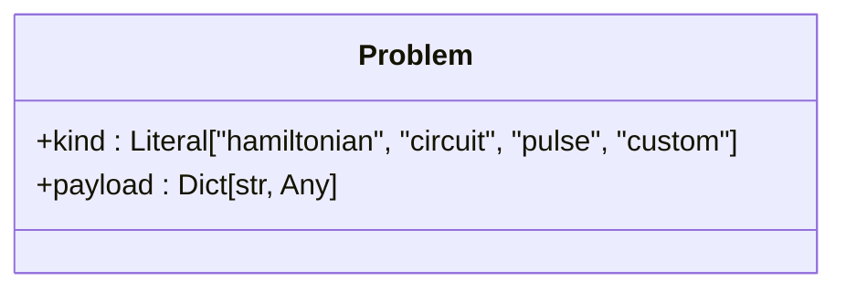
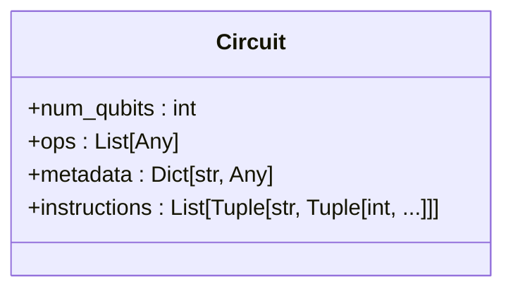
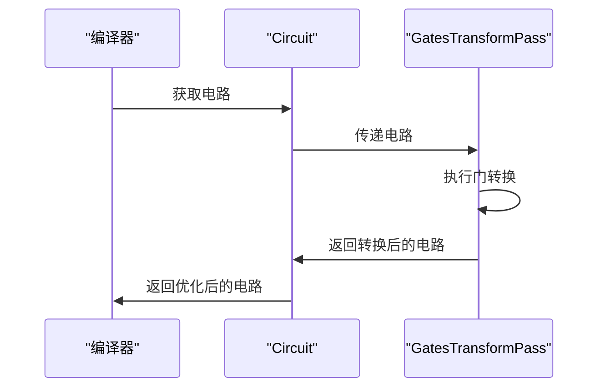
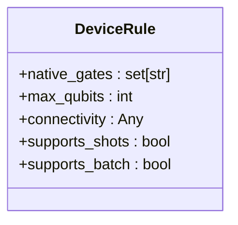

# 核心数据类型

<cite>
**本文档中引用的文件**  
- [types.py](file://src/tyxonq/core/types.py)
- [circuit.py](file://src/tyxonq/core/ir/circuit.py)
- [gates_transform.py](file://src/tyxonq/compiler/stages/rewrite/gates_transform.py)
- [driver.py](file://src/tyxonq/devices/hardware/ibm/driver.py)
- [base.py](file://src/tyxonq/devices/base.py)
</cite>

## 目录
1. [引言](#引言)
2. [核心数据类型定义](#核心数据类型定义)
3. [Problem 类型](#problem-类型)
4. [Circuit IR 中的数据结构](#circuit-ir-中的数据结构)
5. [编译器阶段中的类型使用](#编译器阶段中的类型使用)
6. [设备层中的类型交互](#设备层中的类型交互)
7. [类型安全性与可读性优势](#类型安全性与可读性优势)
8. [与 Python 原生类型的对比](#与-python-原生类型的对比)
9. [总结](#总结)

## 引言
TyxonQ 框架通过定义一系列核心数据类型，确保了量子电路、编译器和设备层之间的数据一致性与类型安全。这些自定义类型别名和数据结构不仅增强了代码的可读性，还为框架的模块化设计提供了坚实基础。本文档系统性地文档化这些核心数据类型，详细解释其在不同层次中的作用，并通过具体示例展示其实际应用。

## 核心数据类型定义
TyxonQ 框架的核心数据类型主要定义在 `src/tyxonq/core/types.py` 和 `src/tyxonq/core/ir/circuit.py` 文件中。这些类型包括 `Problem`、`Circuit`、`Hamiltonian` 等，它们构成了框架的基础数据模型。通过使用这些类型，TyxonQ 能够在量子电路的构建、编译和执行过程中保持数据的一致性和完整性。

**Section sources**
- [types.py](file://src/tyxonq/core/types.py#L6-L15)
- [circuit.py](file://src/tyxonq/core/ir/circuit.py#L48-L727)

## Problem 类型
`Problem` 类型是 TyxonQ 框架中用于封装领域问题的通用数据结构。它包含两个字段：`kind` 和 `payload`。`kind` 字段表示问题的类别，如 "hamiltonian"、"circuit" 等，而 `payload` 字段则包含描述问题的任意结构化数据。这种设计使得框架能够灵活地处理不同类型的量子计算问题。

**Diagram sources**
- [types.py](file://src/tyxonq/core/types.py#L6-L15)

## Circuit IR 中的数据结构
`Circuit` 类型是 TyxonQ 框架中的中间表示（IR），用于描述量子电路。它包含 `num_qubits`、`ops`、`metadata` 和 `instructions` 等属性。`num_qubits` 表示电路中的量子比特数，`ops` 是操作描述符的序列，`metadata` 存储电路的元数据，而 `instructions` 则包含测量、重置等指令。这些属性共同定义了量子电路的结构和行为。

**Diagram sources**
- [circuit.py](file://src/tyxonq/core/ir/circuit.py#L48-L727)

## 编译器阶段中的类型使用
在编译器阶段，TyxonQ 框架利用 `Circuit` 类型进行电路的优化和转换。例如，在 `gates_transform.py` 文件中，`GatesTransformPass` 类根据指定的基门集对电路中的门进行重写。这一过程依赖于 `Circuit` 类型的 `ops` 属性，确保了转换的正确性和一致性。

**Diagram sources**
- [gates_transform.py](file://src/tyxonq/compiler/stages/rewrite/gates_transform.py#L9-L49)

## 设备层中的类型交互
在设备层，TyxonQ 框架通过 `DeviceRule` 类型描述设备的能力。`DeviceRule` 包含 `native_gates`、`max_qubits`、`connectivity` 等字段，这些字段定义了设备支持的原生门、最大量子比特数和连接性。通过这些信息，框架能够生成适合特定设备的量子电路。

**Diagram sources**
- [base.py](file://src/tyxonq/devices/base.py#L41-L52)

## 类型安全性与可读性优势
TyxonQ 框架通过使用自定义类型别名和数据结构，显著提高了代码的类型安全性和可读性。例如，`Problem` 类型的 `kind` 字段使用 `Literal` 类型，确保了问题类别的合法性。此外，`Circuit` 类型的属性定义清晰，使得开发者能够快速理解电路的结构和行为。

## 与 Python 原生类型的对比
与 Python 原生类型相比，TyxonQ 框架的自定义类型提供了更强的类型检查和更好的代码可读性。例如，使用 `Literal` 类型可以避免运行时错误，而使用 `dataclass` 可以自动生成 `__init__` 和 `__repr__` 方法，减少了样板代码的编写。

## 总结
TyxonQ 框架通过定义和使用一系列核心数据类型，实现了量子电路、编译器和设备层之间的高效协作。这些类型不仅增强了代码的可读性和类型安全性，还为框架的模块化设计提供了坚实基础。通过本文档的详细解释，开发者能够更好地理解和使用这些核心数据类型，从而更高效地开发量子计算应用。