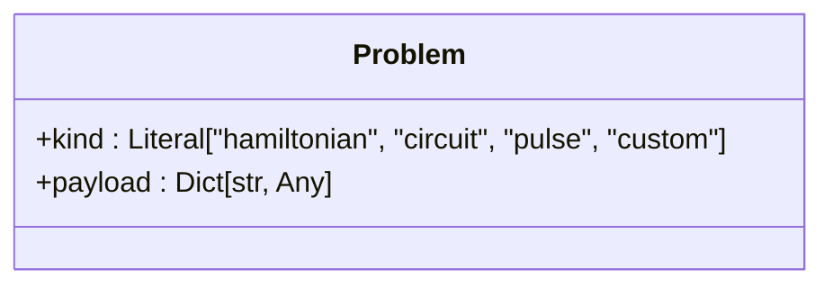
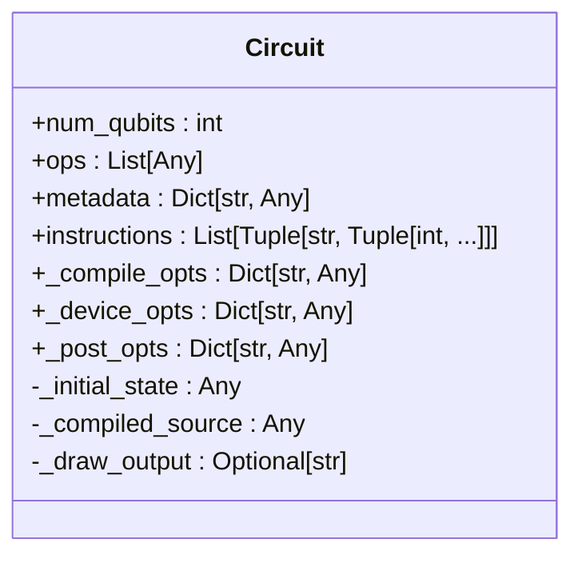
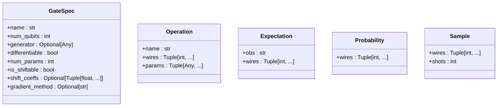
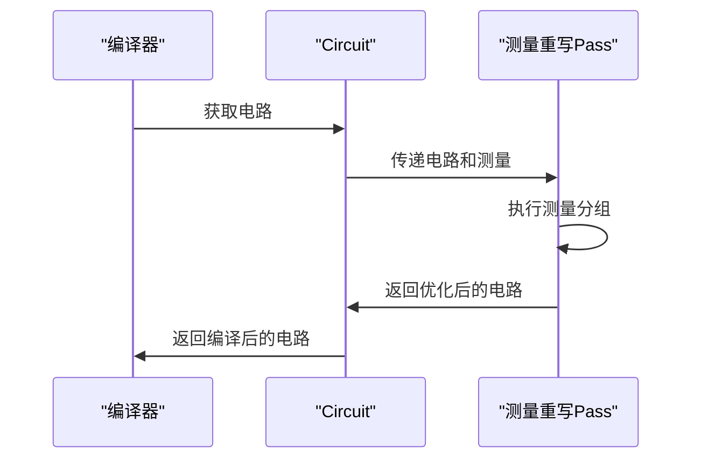

# 核心数据类型

<cite>
**本文引用的文件**  
- [types.py](file://src/tyxonq/core/types.py)
- [circuit.py](file://src/tyxonq/core/ir/circuit.py)
- [operations/__init__.py](file://src/tyxonq/core/operations/__init__.py)
- [measurements/__init__.py](file://src/tyxonq/core/measurements/__init__.py)
- [test_core_types.py](file://tests_core_module/test_core_types.py)
- [test_core_ir.py](file://tests_core_module/test_core_ir.py)
- [test_core_operations.py](file://tests_core_module/test_core_operations.py)
- [test_measurement.py](file://tests_core_module/test_measurement.py)
</cite>

## 更新摘要
**所做更改**
- 更新了Circuit IR结构以反映最新的API变更
- 增强了测量处理和数据结构的文档说明
- 添加了操作注册表和默认值的详细说明
- 更新了类型安全性与可读性优势部分
- 修正了与Python原生类型的对比分析

## 目录
1. [引言](#引言)
2. [核心数据类型定义](#核心数据类型定义)
3. [Problem 类型](#problem-类型)
4. [Circuit IR 中的数据结构](#circuit-ir-中的数据结构)
5. [操作与测量类型](#操作与测量类型)
6. [编译器阶段中的类型使用](#编译器阶段中的类型使用)
7. [设备层中的类型交互](#设备层中的类型交互)
8. [类型安全性与可读性优势](#类型安全性与可读性优势)
9. [与 Python 原生类型的对比](#与-python-原生类型的对比)
10. [总结](#总结)

## 引言
TyxonQ 框架通过定义一系列核心数据类型，确保了量子电路、编译器和设备层之间的数据一致性与类型安全。这些自定义类型别名和数据结构不仅增强了代码的可读性，还为框架的模块化设计提供了坚实基础。本文档系统性地文档化这些核心数据类型，详细解释其在不同层次中的作用，并通过具体示例展示其实际应用。

**更新** 根据最近的代码变更，本版本重点反映了核心模块测试的简化以及IR编辑、测量处理和操作默认值的相关API调整。

## 核心数据类型定义
TyxonQ 框架的核心数据类型主要定义在 `src/tyxonq/core/types.py`、`src/tyxonq/core/ir/circuit.py`、`src/tyxonq/core/operations/__init__.py` 和 `src/tyxonq/core/measurements/__init__.py` 文件中。这些类型包括 `Problem`、`Circuit`、`GateSpec`、`Operation`、`Expectation`、`Probability`、`Sample` 等，它们构成了框架的基础数据模型。通过使用这些类型，TyxonQ 能够在量子电路的构建、编译和执行过程中保持数据的一致性和完整性。

**Section sources**
- [types.py:6-16](file://src/tyxonq/core/types.py#L6-L16)
- [circuit.py:48-142](file://src/tyxonq/core/ir/circuit.py#L48-L142)
- [operations/__init__.py:10-39](file://src/tyxonq/core/operations/__init__.py#L10-L39)
- [measurements/__init__.py:7-27](file://src/tyxonq/core/measurements/__init__.py#L7-L27)

## Problem 类型
`Problem` 类型是 TyxonQ 框架中用于封装领域问题的通用数据结构。它包含两个字段：`kind` 和 `payload`。`kind` 字段表示问题的类别，如 "hamiltonian"、"circuit"、"pulse"、"custom" 等，而 `payload` 字段则包含描述问题的任意结构化数据。这种设计使得框架能够灵活地处理不同类型的量子计算问题。

```mermaid
classDiagram
class Problem {
+kind : Literal["hamiltonian", "circuit", "pulse", "custom"]
+payload : Dict[str, Any]
}
```

**图表来源**
- [types.py:6-16](file://src/tyxonq/core/types.py#L6-L16)

**Section sources**
- [types.py:6-16](file://src/tyxonq/core/types.py#L6-L16)
- [test_core_types.py:34-44](file://tests_core_module/test_core_types.py#L34-L44)

## Circuit IR 中的数据结构
`Circuit` 类型是 TyxonQ 框架中的中间表示（IR），用于描述量子电路。它包含 `num_qubits`、`ops`、`metadata` 和 `instructions` 等属性。`num_qubits` 表示电路中的量子比特数，`ops` 是操作描述符的序列，`metadata` 存储电路的元数据，而 `instructions` 则包含测量、重置等指令。这些属性共同定义了量子电路的结构和行为。

**更新** Circuit类现在支持更丰富的配置选项，包括初始状态支持、编译阶段默认值、设备阶段默认值和后处理默认值等。

```mermaid
classDiagram
class Circuit {
+num_qubits : int
+ops : List[Any]
+metadata : Dict[str, Any]
+instructions : List[Tuple[str, Tuple[int, ...]]]
+_compile_opts : Dict[str, Any]
+_device_opts : Dict[str, Any]
+_post_opts : Dict[str, Any]
-_initial_state : Any
-_compiled_source : Any
-_draw_output : Optional[str]
}
```

**图表来源**
- [circuit.py:48-142](file://src/tyxonq/core/ir/circuit.py#L48-L142)

**Section sources**
- [circuit.py:48-142](file://src/tyxonq/core/ir/circuit.py#L48-L142)
- [test_core_ir.py:9-29](file://tests_core_module/test_core_ir.py#L9-L29)

## 操作与测量类型
TyxonQ 框架定义了专门的操作和测量类型来增强类型安全性和代码可读性。

### 操作类型
`GateSpec` 描述了门/操作的元数据，包括名称、量子比特数、生成器信息、可微分性等。`Operation` 表示放置在特定量子比特上的操作引用。

### 测量类型
框架定义了三种测量类型：
- `Expectation`: 对给定量子比特上的可观测量进行期望值测量
- `Probability`: 在计算基上对量子比特进行概率测量
- `Sample`: 在给定量子比特上进行采样测量

```mermaid
classDiagram
class GateSpec {
+name : str
+num_qubits : int
+generator : Optional[Any]
+differentiable : bool
+num_params : int
+is_shiftable : bool
+shift_coeffs : Optional[Tuple[float, ...]]
+gradient_method : Optional[str]
}
class Operation {
+name : str
+wires : Tuple[int, ...]
+params : Tuple[Any, ...]
}
class Expectation {
+obs : str
+wires : Tuple[int, ...]
}
class Probability {
+wires : Tuple[int, ...]
}
class Sample {
+wires : Tuple[int, ...]
+shots : int
}
```

**图表来源**
- [operations/__init__.py:10-39](file://src/tyxonq/core/operations/__init__.py#L10-L39)
- [measurements/__init__.py:7-27](file://src/tyxonq/core/measurements/__init__.py#L7-L27)

**Section sources**
- [operations/__init__.py:10-87](file://src/tyxonq/core/operations/__init__.py#L10-L87)
- [measurements/__init__.py:7-30](file://src/tyxonq/core/measurements/__init__.py#L7-L30)
- [test_core_operations.py:19-37](file://tests_core_module/test_core_operations.py#L19-L37)
- [test_core_operations.py:124-131](file://tests_core_module/test_core_operations.py#L124-L131)

## 编译器阶段中的类型使用
在编译器阶段，TyxonQ 框架利用 `Circuit` 类型进行电路的优化和转换。框架支持多种编译器和后端，包括原生编译器、Qiskit编译器等。测量重写pass会对非重叠期望值进行分组，以提高测量效率。

**更新** 编译器现在支持更灵活的测量分组策略，能够自动识别可以并行执行的测量操作。

```mermaid
sequenceDiagram
participant Compiler as "编译器"
participant Circuit as "Circuit"
participant MeasurementPass as "测量重写Pass"
Compiler->>Circuit : 获取电路
Circuit->>MeasurementPass : 传递电路和测量
MeasurementPass->>MeasurementPass : 执行测量分组
MeasurementPass->>Circuit : 返回优化后的电路
Circuit->>Compiler : 返回编译后的电路
```

**图表来源**
- [test_measurement.py:14-37](file://tests_core_module/test_measurement.py#L14-L37)

**Section sources**
- [test_measurement.py:14-37](file://tests_core_module/test_measurement.py#L14-L37)

## 设备层中的类型交互
在设备层，TyxonQ 框架通过统一的接口与不同的设备和模拟器进行交互。框架支持状态向量模拟器、密度矩阵模拟器等多种后端，每种后端都有相应的设备规则和能力描述。

**Section sources**
- [test_measurement.py:40-62](file://tests_core_module/test_measurement.py#L40-L62)

## 类型安全性与可读性优势
TyxonQ 框架通过使用自定义类型别名和数据结构，显著提高了代码的类型安全性和可读性。例如，`Problem` 类型的 `kind` 字段使用 `Literal` 类型，确保了问题类别的合法性。此外，`Circuit` 类型的属性定义清晰，使得开发者能够快速理解电路的结构和行为。

**更新** 新的类型系统提供了更好的错误检测和更清晰的API语义，特别是在处理测量和操作时。

## 与 Python 原生类型的对比
与 Python 原生类型相比，TyxonQ 框架的自定义类型提供了更强的类型检查和更好的代码可读性。例如，使用 `Literal` 类型可以避免运行时错误，而使用 `dataclass` 可以自动生成 `__init__` 和 `__repr__` 方法，减少了样板代码的编写。

**更新** 框架的类型系统在保持Python灵活性的同时，提供了静态类型检查的优势，特别是在大型项目中能够有效减少bug。

## 总结
TyxonQ 框架通过定义和使用一系列核心数据类型，实现了量子电路、编译器和设备层之间的高效协作。这些类型不仅增强了代码的可读性和类型安全性，还为框架的模块化设计提供了坚实基础。通过本文档的详细解释，开发者能够更好地理解和使用这些核心数据类型，从而更高效地开发量子计算应用。

**更新** 随着框架的不断发展，核心数据类型将继续演进以支持更多的量子计算场景和优化需求。