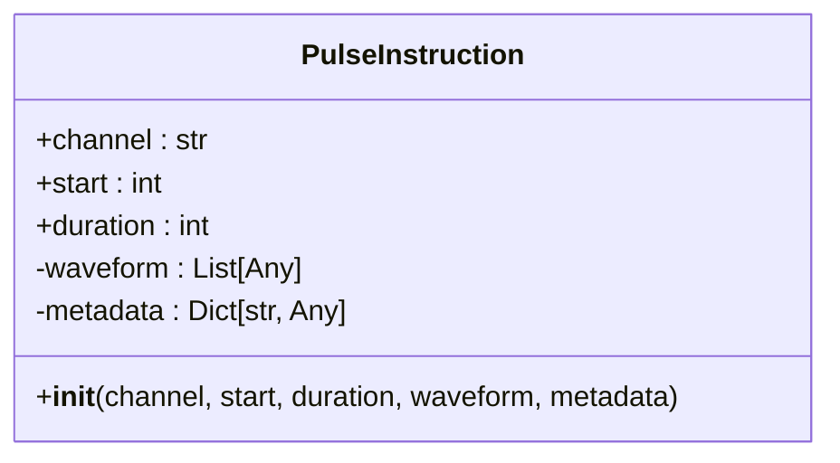
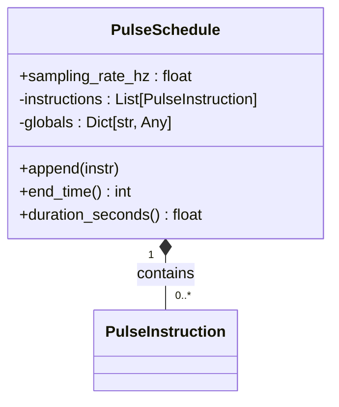
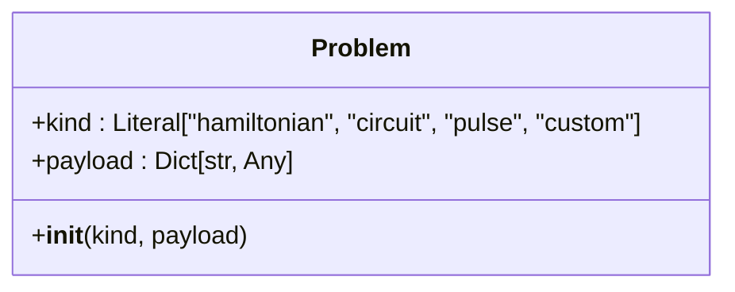
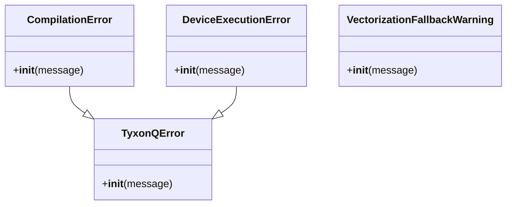

# 核心概念

<cite>
**本文档引用的文件**   
- [circuit.py](file://src/tyxonq/core/ir/circuit.py)
- [pulse.py](file://src/tyxonq/core/ir/pulse.py)
- [types.py](file://src/tyxonq/core/types.py)
- [errors.py](file://src/tyxonq/core/errors.py)
- [circuit_chain_demo.py](file://examples/circuit_chain_demo.py)
- [pulse_demo.py](file://examples/pulse_demo.py)
- [parameter_shift.py](file://examples/parameter_shift.py)
</cite>

## 目录
1. [引言](#引言)
2. [量子电路中间表示（IR）](#量子电路中间表示ir)
3. [脉冲级控制（Pulse）](#脉冲级控制pulse)
4. [核心数据类型](#核心数据类型)
5. [错误处理机制](#错误处理机制)
6. [Circuit类的构建与操作](#circuit类的构建与操作)
7. [代码示例与应用](#代码示例与应用)
8. [总结](#总结)

## 引言

TyxonQ框架旨在通过一个稳定、可预测的中间表示（IR）来弥合高级量子算法与底层硬件执行之间的鸿沟。本文档深入阐述框架的核心概念，包括量子电路（Circuit）的中间表示、脉冲级控制（Pulse）、核心数据类型和错误处理机制。我们将解释IR如何作为编译器、设备和后处理模块之间的稳定契约，确保代码路径贴近真实硬件执行。通过分析`Circuit`类的构建方式、量子门操作、测量指令以及其不可变性设计原则，为开发者提供一个清晰的概念模型，以理解框架的底层工作原理。

## 量子电路中间表示（IR）

TyxonQ框架的核心是其量子电路的中间表示（Intermediate Representation, IR），它被设计为一个轻量级、稳定且与后端无关的数据结构。这个IR是整个框架的“稳定契约”，它定义了编译器、设备和后处理模块之间交互的公共接口。

### IR的设计原则

IR的设计遵循了几个关键原则：
1.  **最小化（Minimal）**：IR只包含构建量子电路所必需的核心信息，如量子比特数量（`num_qubits`）和操作序列（`ops`）。这种最小化设计使其易于维护和演化。
2.  **通用性（Generic）**：`ops`字段的类型是开放的，允许后端或编译器以自己的方式解释操作（例如，作为元组、列表或IR节点对象）。这种通用性确保了IR的灵活性，使其能够适应不同的编译和执行需求。
3.  **结构化验证（Structural Validation）**：在`__post_init__`方法中，对`ops`和`instructions`进行了轻量级的结构验证，确保操作名称是字符串，量子比特索引在有效范围内。这保证了IR的结构完整性，防止了无效电路的创建。

### IR作为稳定契约

IR作为稳定契约，其作用体现在整个执行链中：
-   **编译器**：接收IR作为输入，根据目标（`compile_target`）和选项（`compile_options`）将其转换为特定格式（如QASM）或优化。
-   **设备层**：可以直接接收IR进行模拟，或接收由IR编译生成的原生源码（如QASM字符串）提交给真实硬件。
-   **后处理模块**：接收设备执行后的结果，并根据IR中可能包含的元数据（如测量分组信息）进行结果聚合和分析。

这种设计将框架的各个组件解耦，使得它们可以独立发展，只要它们都遵循IR的契约即可。

**Section sources**
- [circuit.py](file://src/tyxonq/core/ir/circuit.py#L48-L727)

## 脉冲级控制（Pulse）

除了高级的门级电路，TyxonQ还提供了对量子硬件进行脉冲级控制的能力，允许用户直接定义和操作微波脉冲信号，实现更精确的量子控制。

### Pulse IR的核心组件

脉冲级IR由两个核心类组成：`PulseInstruction`和`PulseSchedule`。

#### PulseInstruction（脉冲指令）

`PulseInstruction`类代表一个针对特定硬件通道的单个脉冲指令。其核心属性包括：
-   **channel**：硬件通道的标识符（如"d0"、"u1"），用于指定脉冲作用的物理线路。
-   **start** 和 **duration**：以采样周期（ticks）为单位的开始时间和持续时间，保持了与后端无关的时间单位。
-   **waveform**：脉冲的波形数据，通常是一个包含实数或复数振幅的样本列表。
-   **metadata**：任意的元数据字典，用于描述脉冲的形状、振幅、标准差等参数。



**Diagram sources**
- [pulse.py](file://src/tyxonq/core/ir/pulse.py#L7-L27)

#### PulseSchedule（脉冲调度）

`PulseSchedule`类代表一个包含多个定时脉冲指令的集合。它通过`instructions`列表来组织`PulseInstruction`，并包含一个`sampling_rate_hz`属性，用于将采样周期转换为秒。



**Diagram sources**
- [pulse.py](file://src/tyxonq/core/ir/pulse.py#L30-L66)

### 脉冲级IR的功能

脉冲级IR支持高级量子控制，例如：
-   **自定义波形**：用户可以定义`cosine_drag`、`flattop`、`gaussian`等复杂波形，用于抑制泄漏态跃迁或实现特定的量子态制备。
-   **参数化支持**：通过`Param`类，可以创建参数化的波形，便于进行参数扫描和优化。
-   **校准程序**：使用`DefcalBuilder`可以构建复杂的校准程序，将脉冲指令组织成可重用的量子门。

**Section sources**
- [pulse.py](file://src/tyxonq/core/ir/pulse.py#L7-L66)
- [pulse_demo.py](file://examples/pulse_demo.py#L0-L80)

## 核心数据类型

TyxonQ框架定义了几个核心数据类型，用于封装问题和数据。

### Problem（问题）

`Problem`类是一个领域问题的包装器，用于将输入传递给应用程序或编译器。它包含两个字段：
-   **kind**：问题的类别，如"hamiltonian"（哈密顿量）、"circuit"（电路）或"pulse"（脉冲）。
-   **payload**：描述问题的任意结构化数据。

这个类型为框架提供了一个统一的接口来处理不同类型的量子计算问题。



**Diagram sources**
- [types.py](file://src/tyxonq/core/types.py#L6-L15)

**Section sources**
- [types.py](file://src/tyxonq/core/types.py#L6-L15)

## 错误处理机制

TyxonQ框架定义了一个清晰的异常层次结构，用于处理不同阶段的错误。

### 异常层次结构

-   **TyxonQError**：所有TyxonQ异常的基类。
-   **CompilationError**：当编译过程失败或产生无效输出时抛出。
-   **DeviceExecutionError**：当设备执行失败（如超时、连接问题）时抛出。
-   **VectorizationFallbackWarning**：一个警告，表示向量化操作被禁用或回退到急切执行模式。

这种分层的错误处理机制使得用户可以精确地捕获和处理特定类型的错误，提高了程序的健壮性。



**Diagram sources**
- [errors.py](file://src/tyxonq/core/errors.py#L0-L16)

**Section sources**
- [errors.py](file://src/tyxonq/core/errors.py#L0-L16)

## Circuit类的构建与操作

`Circuit`类是TyxonQ框架中用于构建和操作量子电路的核心。

### 构建方式

`Circuit`类通过`__init__`方法进行初始化，需要指定量子比特数量`num_qubits`。它还接受一系列可选参数，用于配置编译、设备和后处理阶段的默认值，这使得电路对象可以携带完整的执行上下文。

**Section sources**
- [circuit.py](file://src/tyxonq/core/ir/circuit.py#L64-L128)

### 量子门操作

`Circuit`类提供了丰富的构建器风格（builder-style）方法来添加量子门操作。这些方法直接修改电路对象并返回`self`，支持链式调用。例如：
-   `h(q)`：在量子比特`q`上应用Hadamard门。
-   `cx(c, t)`：在控制量子比特`c`和目标量子比特`t`上应用CNOT门。
-   `rz(q, theta)`：在量子比特`q`上应用绕Z轴旋转`theta`角度的门。

这些方法将操作以元组的形式（如`("h", q)`）追加到`ops`列表中。

**Section sources**
- [circuit.py](file://src/tyxonq/core/ir/circuit.py#L576-L578)
- [circuit.py](file://src/tyxonq/core/ir/circuit.py#L597-L599)

### 测量指令

测量在TyxonQ中被分为两种：
1.  **操作（Operation）**：`measure_z(q)`是一个操作，它被添加到`ops`列表中，类似于一个量子门。
2.  **指令（Instruction）**：`add_measure(q)`是一个指令，它被添加到`instructions`列表中。`instructions`通常用于表示更高层次的语义，如测量的逻辑顺序。

这种区分允许框架在编译阶段进行更复杂的重写和优化。

**Section sources**
- [circuit.py](file://src/tyxonq/core/ir/circuit.py#L610-L612)
- [circuit.py](file://src/tyxonq/core/ir/circuit.py#L555-L559)

### 不可变性设计原则

虽然`Circuit`类的构建器方法是“就地”修改的，但许多其他操作（如`compose`、`remap_qubits`、`extended`）都遵循不可变性原则。它们返回一个全新的`Circuit`实例，而不是修改原对象。例如，`compose`方法将另一个电路的操作附加到当前电路上，并返回一个新电路。这种设计避免了意外的副作用，使得电路的组合和变换更加安全和可预测。

**Section sources**
- [circuit.py](file://src/tyxonq/core/ir/circuit.py#L235-L285)

## 代码示例与应用

### 电路构建与执行

以下代码展示了如何使用链式API构建和执行一个贝尔态电路：

```python
# [SPEC SYMBOL](file://examples/circuit_chain_demo.py#L100-L110)
result = (
    Circuit(2).h(0).cx(0, 1)  # 构建贝尔态电路
    .compile(compile_engine="qiskit")  # 编译
    .device(provider="simulator", device="statevector", shots=1024)  # 配置设备
    .postprocessing(method="none")  # 配置后处理
    .run()  # 执行
)
```

### 脉冲级控制

以下代码展示了如何定义一个参数化的脉冲校准程序：

```python
# [SPEC SYMBOL](file://examples/pulse_demo.py#L25-L35)
qc = Circuit(1)
qc.use_pulse()
param0 = Param("a")
builder = qc.calibrate("hello_world", [param0])
builder.new_frame("drive_frame", param0)
builder.play("drive_frame", waveforms.CosineDrag(param0, 0.2, 0.0, 0.0))
builder.build()
qc.add_calibration('hello_world', ['q[0]'])
```

### 参数化梯度计算

`parameter_shift.py`示例展示了如何利用框架的IR和执行能力来实现参数化梯度计算，这是变分量子算法（VQE）等应用的核心。

**Section sources**
- [circuit_chain_demo.py](file://examples/circuit_chain_demo.py#L0-L304)
- [pulse_demo.py](file://examples/pulse_demo.py#L0-L80)
- [parameter_shift.py](file://examples/parameter_shift.py#L0-L183)

## 总结

TyxonQ框架通过其精心设计的中间表示（IR）为核心，构建了一个强大而灵活的量子计算平台。`Circuit`类作为IR的载体，不仅封装了量子电路的结构，还集成了编译、设备和后处理的配置，形成了一个完整的执行契约。脉冲级IR为高级量子控制提供了直接的硬件接口。核心数据类型和清晰的错误处理机制进一步增强了框架的健壮性和可用性。开发者可以利用这些核心概念，构建出既贴近硬件执行又易于维护和测试的量子程序。