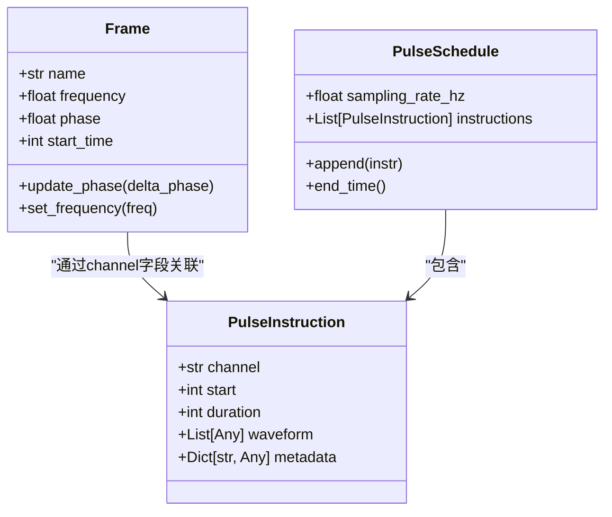
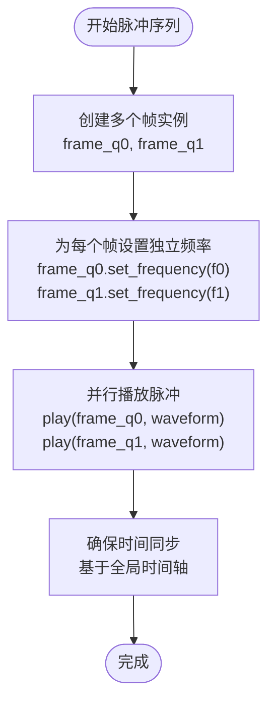
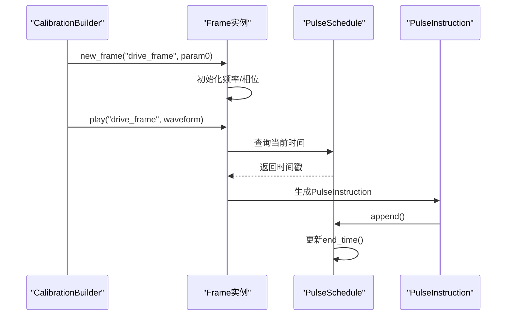

# 帧（Frame）管理与频率控制

<cite>
**本文档引用文件**  
- [pulse.py](file://src/tyxonq/core/ir/pulse.py)
- [circuit.py](file://src/tyxonq/core/ir/circuit.py)
- [pulse_demo.py](file://examples/pulse_demo.py)
</cite>

## 目录
1. [引言](#引言)
2. [帧的核心概念与作用](#帧的核心概念与作用)
3. [帧与PulseInstruction的通道关联](#帧与pulseinstruction的通道关联)
4. [TQASM 0.2中的帧定义与生命周期](#tqasm-02中的帧定义与生命周期)
5. [多通道同步与频率复用机制](#多通道同步与频率复用机制)
6. [相位累积与连续性保证](#相位累积与连续性保证)
7. [帧状态维护与全局时间轴同步](#帧状态维护与全局时间轴同步)
8. [示例分析：多量子比特并行操作](#示例分析多量子比特并行操作)
9. [总结](#总结)

## 引言
在脉冲级量子控制中，帧（Frame）是实现精确频率调谐、相位校正和多通道同步的关键抽象。帧封装了与特定硬件通道相关的频率、相位和时间参考，使得复杂的脉冲序列能够动态调整其行为。本文深入解析帧在TyxonQ框架中的实现机制，涵盖其在频率偏移、相位累积和多通道控制中的作用，并结合TQASM 0.2语法说明其定义、切换和生命周期管理。

## 帧的核心概念与作用
帧是脉冲控制中的逻辑实体，用于管理与特定硬件通道（如"drive_frame"）相关的频率和相位状态。其主要作用包括：

- **频率偏移控制**：帧允许在运行时动态调整载波频率，实现频率复用和串扰抑制。
- **相位累积管理**：帧维护相位状态，确保脉冲序列中相位的连续性和一致性。
- **多通道同步**：通过帧的协调，多个量子比特的脉冲操作可以在时间上精确对齐。

帧的定义和操作通过`Circuit`类的校准（calibrate）接口实现，允许用户创建和管理帧实例。

**Section sources**
- [circuit.py](file://src/tyxonq/core/ir/circuit.py#L779)
- [pulse_demo.py](file://examples/pulse_demo.py#L29-L46)

## 帧与PulseInstruction的通道关联
在脉冲指令（PulseInstruction）中，`channel`字段直接关联到一个帧实例。当执行`play`操作时，指定的帧决定了脉冲的实际频率和相位偏移。



**Diagram sources**
- [pulse.py](file://src/tyxonq/core/ir/pulse.py#L7-L63)
- [circuit.py](file://src/tyxonq/core/ir/circuit.py#L779)

**Section sources**
- [pulse.py](file://src/tyxonq/core/ir/pulse.py#L7-L63)

## TQASM 0.2中的帧定义与生命周期
在TQASM 0.2语法中，帧通过`frame`关键字定义，并使用`newframe`创建实例。帧的生命周期由其所属的`defcal`块管理。

```tqasm
defcal rabi_test a {
    frame drive_frame = newframe(a);
    play(drive_frame, cosine_drag($t, 0.2, 0.0, 0.0));
}
```

在Python API中，帧的创建和管理通过`calibrate`构建器完成：

```python
builder = qc.calibrate("hello_world", [param0])
builder.new_frame("drive_frame", param0)
builder.play("drive_frame", waveforms.CosineDrag(t, 0.2, 0.0, 0.0))
```

帧的生命周期从`new_frame`调用开始，到`build()`完成校准定义时结束。在此期间，可以对帧进行频率调谐和相位校正。

**Section sources**
- [pulse_demo.py](file://examples/pulse_demo.py#L24-L26)
- [pulse_demo.py](file://examples/pulse_demo.py#L35-L36)

## 多通道同步与频率复用机制
帧机制支持多量子比特并行操作中的频率复用和串扰抑制。通过为不同量子比特分配独立的帧，可以实现：

- **频率复用**：多个量子比特共享同一物理通道但使用不同频率的帧。
- **串扰抑制**：通过精确的频率偏移，避免相邻量子比特间的干扰。



**Diagram sources**
- [pulse_demo.py](file://examples/pulse_demo.py#L35-L36)

## 相位累积与连续性保证
帧维护相位状态，确保脉冲序列中相位的连续性。当连续播放多个脉冲时，后一个脉冲的初始相位继承自前一个脉冲的结束相位。

相位累积通过以下机制实现：
- 每个帧实例维护一个相位累加器
- `play`操作结束后自动更新相位状态
- 支持显式的相位重置或偏移操作

这种机制保证了复杂脉冲序列（如多脉冲Rabi振荡）中相位的一致性。

**Section sources**
- [pulse.py](file://src/tyxonq/core/ir/pulse.py#L7-L63)

## 帧状态维护与全局时间轴同步
帧状态的维护涉及频率、相位和时间参考的协调。`PulseSchedule`作为全局时间容器，为所有帧提供统一的时间基准。



**Diagram sources**
- [pulse.py](file://src/tyxonq/core/ir/pulse.py#L31-L63)
- [pulse_demo.py](file://examples/pulse_demo.py#L35-L36)

## 示例分析：多量子比特并行操作
以下示例展示如何使用帧实现两个量子比特的并行Rabi振荡：

```python
def gen_parallel_rabi_circuit(t0, t1):
    qc = Circuit(2)
    qc.use_pulse()
    
    # 为量子比特0创建帧
    builder0 = qc.calibrate("rabi_q0", [])
    frame0 = builder0.new_frame("drive_frame_q0", "q0")
    builder0.play(frame0, waveforms.CosineDrag(t0, 0.2, 0.0, 0.0))
    builder0.build()
    
    # 为量子比特1创建帧
    builder1 = qc.calibrate("rabi_q1", [])
    frame1 = builder1.new_frame("drive_frame_q1", "q1")
    builder1.play(frame1, waveforms.CosineDrag(t1, 0.2, 0.0, 0.0))
    builder1.build()
    
    # 添加调用
    qc.add_calibration('rabi_q0', ['q[0]'])
    qc.add_calibration('rabi_q1', ['q[1]'])
    
    return qc
```

该示例展示了：
- 独立的帧创建和管理
- 频率和相位的独立控制
- 时间上的并行执行

**Section sources**
- [pulse_demo.py](file://examples/pulse_demo.py#L29-L46)

## 总结
帧（Frame）是TyxonQ脉冲控制系统中的核心抽象，为频率调谐、相位校正和多通道同步提供了统一的管理机制。通过与`PulseInstruction`的`channel`字段关联，帧实现了动态频率控制和相位连续性保证。TQASM 0.2语法中的`frame`关键字和`newframe`操作符为帧的定义和生命周期管理提供了清晰的接口。开发者可以利用帧机制构建复杂的多量子比特并行操作，实现频率复用和串扰抑制，从而构建稳定可靠的脉冲序列。