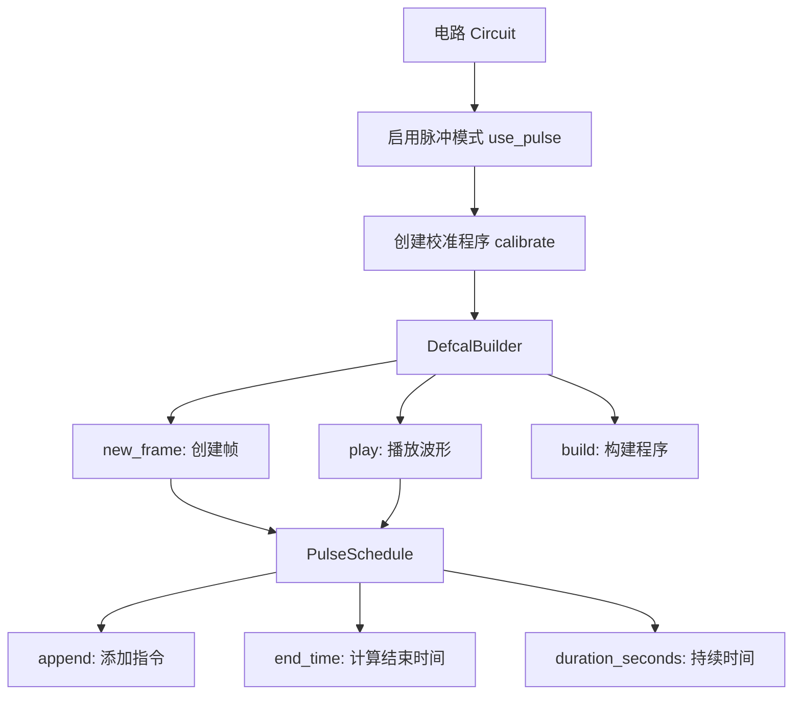

# 校准程序构建器（DefcalBuilder）

<cite>
**本文档引用的文件**  
- [pulse.py](file://src/tyxonq/core/ir/pulse.py)
- [pulse_demo.py](file://examples/pulse_demo.py)
- [pulse_demo_scan.py](file://examples/pulse_demo_scan.py)
- [pulse_support_cn.md](file://docs/pulse_support_cn.md)
</cite>

## 目录
1. [引言](#引言)
2. [核心组件与架构](#核心组件与架构)
3. [DefcalBuilder 实现原理](#defcalbuilder-实现原理)
4. [PulseSchedule 时间调度机制](#pulseschedule-时间调度机制)
5. [Rabi 振荡扫描校准程序示例](#rabi-振荡扫描校准程序示例)
6. [与编译器系统的集成](#与编译器系统的集成)
7. [自动化硬件校准流程中的作用](#自动化硬件校准流程中的作用)
8. [总结](#总结)

## 引言

校准程序构建器（DefcalBuilder）是 TyxonQ 框架中用于构建可复用脉冲级校准程序的核心工具。它通过 `new_frame` 和 `play` 等指令，允许用户在量子比特上定义精确的微波脉冲序列，广泛应用于单比特门校准、Rabi 振荡实验、DRAG 脉冲优化等场景。本文档全面介绍 DefcalBuilder 的实现原理与使用方法，结合 PulseSchedule 类的时间调度机制，展示如何构建参数化的校准程序，并说明其在自动化硬件校准中的关键作用。

## 核心组件与架构

TyxonQ 的脉冲控制体系由多个核心组件构成，包括波形定义、参数化支持、校准构建器和时间调度系统。这些组件协同工作，为用户提供完整的脉冲级控制能力。



**Diagram sources**  
- [pulse.py](file://src/tyxonq/core/ir/pulse.py#L31-L63)
- [pulse_demo.py](file://examples/pulse_demo.py#L1-L80)

## DefcalBuilder 实现原理

`DefcalBuilder` 是创建量子比特校准程序的核心接口。它通过链式调用方式构建参数化的脉冲序列，最终生成符合 TQASM 0.2 标准的可执行代码。

### 工作流程

1. **启用脉冲模式**：在电路对象上调用 `use_pulse()` 方法，切换至脉冲级控制模式。
2. **启动校准构建**：调用 `calibrate(name, params)` 方法，返回一个 `DefcalBuilder` 实例。
3. **定义帧（Frame）**：使用 `new_frame(frame_name, qubit_param)` 在指定量子比特上创建逻辑帧，用于承载波形信号。
4. **播放波形（Play）**：调用 `play(frame_name, waveform)` 将预定义的波形加载到指定帧上。
5. **构建程序**：调用 `build()` 完成校准程序的构建，生成底层的 `PulseSchedule` 对象。

### 参数化支持

所有波形均支持参数化输入，通过 `Param` 类创建动态参数，实现扫描实验和优化迭代。例如：

```python
param_t = Param("t")
builder.play("drive_frame", waveforms.CosineDrag(param_t, 0.2, 0.0, 0.0))
```

该机制使得同一校准程序可在不同参数下重复执行，极大提升了实验效率。

**Section sources**  
- [pulse_demo.py](file://examples/pulse_demo.py#L30-L50)
- [pulse_support_cn.md](file://docs/pulse_support_cn.md#L350-L376)

## PulseSchedule 时间调度机制

`PulseSchedule` 类是脉冲指令的时间调度核心，负责管理所有定时脉冲指令的时序编排。

### 核心字段

- **sampling_rate_hz**：采样频率（赫兹），用于时间单位转换。
- **instructions**：按时间顺序排列的脉冲指令列表。
- **globals**：全局参数字典，用于模板扩展或后端配置。

### 关键方法

#### `append(instr: PulseInstruction)`

将脉冲指令追加到调度序列中。指令包含以下信息：
- `channel`：硬件通道标识（如 "d0"）
- `start`：起始时间（采样周期）
- `duration`：持续时间（采样周期）
- `waveform`：波形数据（实数或复数数组）
- `metadata`：元数据（如波形类型、振幅等）

#### `end_time() -> int`

返回调度程序的结束时间（以采样周期为单位），计算方式为所有指令中 `start + duration` 的最大值。若调度为空，则返回 0。

#### `duration_seconds() -> float`

基于 `sampling_rate_hz` 将结束时间转换为秒级单位，公式为 `end_time / sampling_rate_hz`。

该机制确保了多指令之间的精确同步与时间对齐，是构建复杂脉冲序列的基础。

**Section sources**  
- [pulse.py](file://src/tyxonq/core/ir/pulse.py#L31-L63)

## Rabi 振荡扫描校准程序示例

以下示例展示如何使用 DefcalBuilder 构建一个完整的 Rabi 振荡扫描校准程序，包含参数化幅度扫描、帧创建、波形播放和测量同步。

### 完整实现

```python
from tyxonq import Circuit, Param, waveforms

def create_precise_rabi_circuit(t_duration, amplitude, frequency):
    """
    创建精确的 Rabi 振荡实验电路
    
    参数:
    - t_duration: 脉冲持续时间（采样周期）
    - amplitude: 正弦波振幅 (|amp| ≤ 2)
    - frequency: 正弦波频率 (采样周期的倒数)
    """
    qc = Circuit(1)
    qc.use_pulse()
    
    # 创建参数化波形
    param_t = Param("t")
    
    sine_wave = waveforms.Sine(
        duration=t_duration,      # 持续时间
        amp=amplitude,            # 振幅
        frequency=frequency,      # 频率
    )
    
    # 构建校准程序
    builder = qc.calibrate("precise_rabi", [param_t])
    builder.new_frame("drive_frame", param_t)
    builder.play("drive_frame", sine_wave)
    builder.build()
    
    # 调用校准程序
    qc.add_calibration('precise_rabi', ['q[0]'])
    
    return qc
```

### 参数扫描执行

```python
# 扫描不同频率和振幅
frequencies = [0.01, 0.02, 0.05, 0.1]
amplitudes = [0.5, 1.0, 1.5]

for freq in frequencies:
    for amp in amplitudes:
        qc = create_precise_rabi_circuit(
            t_duration=100,
            amplitude=amp,
            frequency=freq
        )
        print(f"Frequency: {freq}, Amplitude: {amp}")
        print(qc.to_tqasm())
        print("-" * 50)
```

该程序将生成一系列 TQASM 代码，用于在真实硬件上执行 Rabi 振荡扫描，从而确定最优驱动参数。

**Section sources**  
- [pulse_demo_scan.py](file://examples/pulse_demo_scan.py#L1-L48)

## 与编译器系统的集成

DefcalBuilder 与 TyxonQ 编译器系统深度集成，支持脉冲级校准程序的序列化与反序列化。

### TQASM 序列化

通过 `to_tqasm()` 方法，可将包含校准程序的电路转换为 TQASM 0.2 格式代码：

```tqasm
TQASM 0.2;
QREG q[1];

defcal precise_rabi a {
  frame drive_frame = newframe(a);
  play(drive_frame, sin(100, 1.5, 0.0, 0.1, 0.0));
}

precise_rabi q[0];
```

该格式可被后端硬件解析执行，实现跨平台兼容。

### 反序列化支持

编译器系统可解析 TQASM 代码，重建 `PulseSchedule` 和 `DefcalBuilder` 结构，便于程序的存储、传输与调试。

### 云 API 集成

通过 `tyxonq.cloud.apis` 模块，可直接提交脉冲电路至云端设备执行：

```python
task = apis.submit_task(
    circuit=qc,
    shots=1000,
    device="homebrew_s2",
    enable_qos_gate_decomposition=False,
    enable_qos_qubit_mapping=False,
)
result = task.results()
```

**Section sources**  
- [pulse_demo.py](file://examples/pulse_demo.py#L50-L80)

## 自动化硬件校准流程中的作用

DefcalBuilder 在自动化硬件校准流程中扮演关键角色：

1. **标准化校准程序**：通过 `defcal` 机制定义可复用的校准模板，避免重复编码。
2. **参数扫描与优化**：支持动态参数输入，便于执行 Rabi、Ramsey、T1/T2 等扫描实验。
3. **高精度时间控制**：基于 `PulseSchedule` 的精确时间调度，确保脉冲序列的时序准确性。
4. **闭环校准**：结合测量结果与优化算法（如梯度下降），自动调整波形参数，实现自适应校准。
5. **跨平台兼容**：通过 TQASM 标准化输出，支持多种量子硬件后端。

该能力显著提升了量子设备的校准效率与稳定性，是实现量子计算系统自动化运维的重要基础。

## 总结

DefcalBuilder 作为 TyxonQ 框架的核心组件，提供了强大而灵活的脉冲级控制能力。通过 `new_frame` 和 `play` 指令，用户可构建参数化的校准程序；结合 `PulseSchedule` 的时间调度机制，实现了精确的脉冲序列编排。其与编译器系统的深度集成，支持 TQASM 的序列化与反序列化，为自动化硬件校准流程提供了坚实基础。未来可进一步扩展支持多量子比特协同校准、实时反馈控制等高级功能。