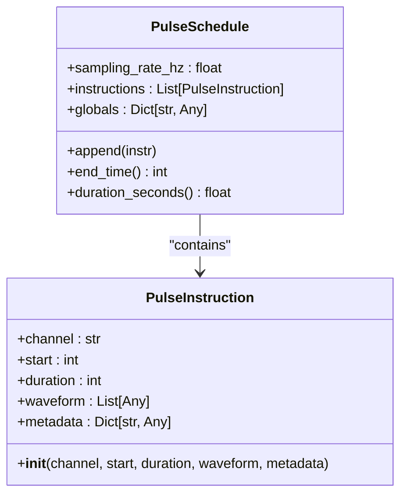
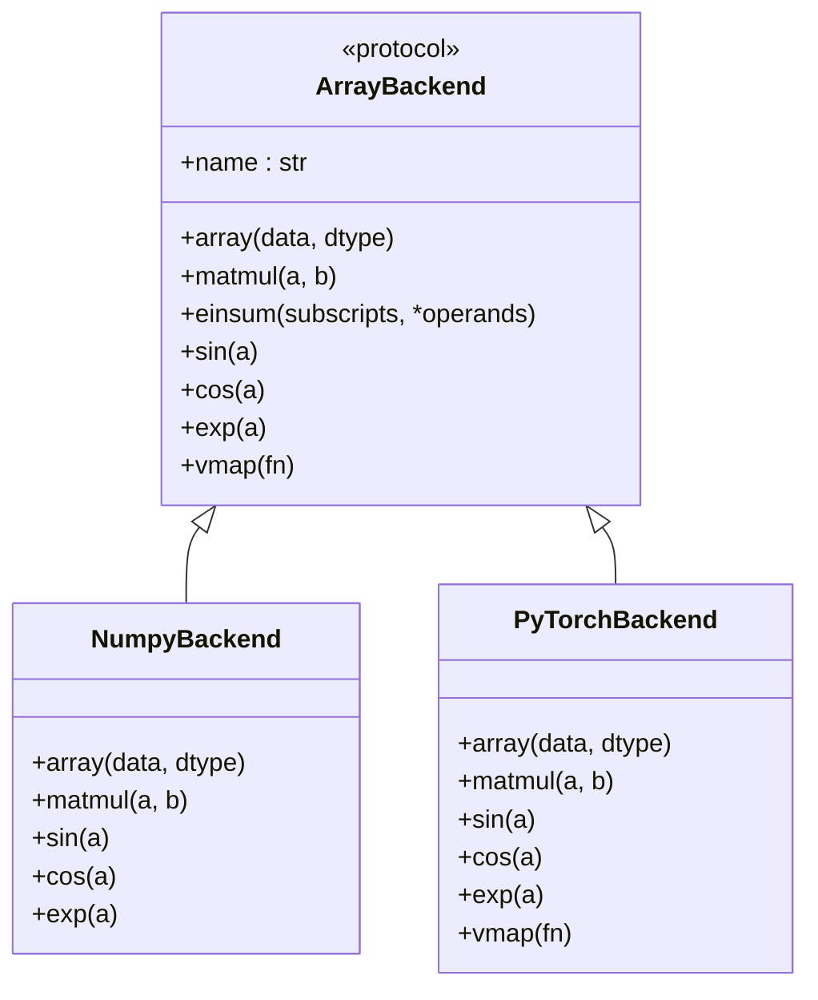

<cite>
**Referenced Files in This Document**   
- [waveforms.py](file://src/tyxonq/waveforms.py)
- [pulse.py](file://src/tyxonq/core/ir/pulse.py)
- [api.py](file://src/tyxonq/numerics/api.py)
- [numpy_backend.py](file://src/tyxonq/numerics/backends/numpy_backend.py)
- [pytorch_backend.py](file://src/tyxonq/numerics/backends/pytorch_backend.py)
</cite>

## 目录
1. [引言](#引言)
2. [脉冲波形类型与参数](#脉冲波形类型与参数)
3. [波形在脉冲指令中的集成](#波形在脉冲指令中的集成)
4. [数值后端与跨平台兼容性](#数值后端与跨平台兼容性)
5. [代码示例与应用场景](#代码示例与应用场景)
6. [结论](#结论)

## 引言
TyxonQ 是一个量子计算框架，支持多种脉冲波形的定义与生成，用于精确控制量子硬件。本文件详细说明了 `cosine_drag`、`flattop`、`gaussian`、`sine` 等核心脉冲波形类型，涵盖其数学表达式、物理意义、参数定义及约束条件。结合 `PulseInstruction` 和 `PulseSchedule` 类，阐述波形数据如何作为 `waveform` 字段嵌入脉冲指令中。同时，分析波形生成所依赖的 `numerics` 后端（如 NumPy 或 PyTorch）及其跨后端兼容性处理机制。

**Section sources**
- [waveforms.py](file://src/tyxonq/waveforms.py#L1-L97)
- [pulse.py](file://src/tyxonq/core/ir/pulse.py#L7-L63)

## 脉冲波形类型与参数
TyxonQ 通过 `src/tyxonq/waveforms.py` 文件中的数据类定义了多种脉冲波形。每种波形均以 `@dataclass` 实现，包含特定参数，并提供 `qasm_name()` 和 `to_args()` 方法以支持序列化和参数提取。

### Gaussian (高斯脉冲)
- **数学表达式**: \( f(t) = \text{amp} \cdot \exp\left(-\frac{(t - \text{duration}/2)^2}{2\sigma^2}\right) \)
- **物理意义**: 平滑的钟形脉冲，常用于减少频谱泄漏。
- **参数定义**:
  - `amp` (幅度): 脉冲峰值，类型为 `ParamType` (float 或 str)。
  - `duration` (持续时间): 脉冲总长度（以采样单位计），类型为 `int`。
  - `sigma` (标准差): 控制脉冲宽度，类型为 `ParamType`。
- **参数约束**: `sigma > 0`, `duration ≥ 0`。

### CosineDrag (余弦DRAG脉冲)
- **数学表达式**: 基于余弦函数的DRAG（Derivative Removal by Adiabatic Gate）脉冲，用于抑制能级泄漏。
- **物理意义**: 通过引入正交分量（I/Q）来抵消非谐性引起的泄漏，提高门保真度。
- **参数定义**:
  - `amp` (幅度): 脉冲峰值。
  - `duration` (持续时间): 脉冲总长度。
  - `phase` (相位): 控制余弦函数的相位偏移。
  - `alpha` (拖尾系数): DRAG修正项的强度。
- **参数约束**: `duration ≥ 0`。

### Flattop (平顶脉冲)
- **数学表达式**: 在 `width` 定义的区间内保持恒定幅度，边缘通过平滑过渡连接。
- **物理意义**: 用于需要恒定驱动强度的场景，如快速绝热门。
- **参数定义**:
  - `amp` (幅度): 平顶部分的恒定幅度。
  - `width` (宽度): 平顶部分的持续时间。
  - `duration` (持续时间): 脉冲总长度。
- **参数约束**: `width ≤ duration`, `duration ≥ 0`。

### Sine (正弦脉冲)
- **数学表达式**: \( f(t) = \text{amp} \cdot \sin(2\pi \cdot \text{frequency} \cdot t) \)
- **物理意义**: 基础振荡脉冲，用于模拟周期性驱动。
- **参数定义**:
  - `amp` (幅度): 振荡峰值。
  - `frequency` (频率): 振荡频率。
  - `duration` (持续时间): 脉冲总长度。
- **参数约束**: `frequency ≥ 0`, `duration ≥ 0`。

**Section sources**
- [waveforms.py](file://src/tyxonq/waveforms.py#L17-L24)
- [waveforms.py](file://src/tyxonq/waveforms.py#L78-L86)
- [waveforms.py](file://src/tyxonq/waveforms.py#L89-L96)
- [waveforms.py](file://src/tyxonq/waveforms.py#L58-L65)

## 波形在脉冲指令中的集成
脉冲波形通过 `PulseInstruction` 类集成到量子控制序列中。

### PulseInstruction 类
该类定义了单个脉冲指令，其核心字段包括：
- `channel`: 目标硬件通道（如 "d0"）。
- `start`: 脉冲开始时间（采样单位）。
- `duration`: 脉冲持续时间（采样单位）。
- `waveform`: 存储实际的复数或实数幅度样本列表。
- `metadata`: 存储波形形状、`amp`、`sigma` 等元数据。

波形数据（如由 `Gaussian` 类生成的样本数组）在实例化后被赋值给 `waveform` 字段。

### PulseSchedule 类
该类管理一个有序的脉冲指令集合，包含：
- `sampling_rate_hz`: 采样率（Hz），用于在样本单位和秒之间转换。
- `instructions`: `PulseInstruction` 对象的列表。
- `globals`: 全局参数。

通过 `append()` 方法将 `PulseInstruction` 添加到调度中，`end_time()` 和 `duration_seconds()` 方法用于计算调度的总时长。



**Diagram sources**
- [pulse.py](file://src/tyxonq/core/ir/pulse.py#L7-L27)
- [pulse.py](file://src/tyxonq/core/ir/pulse.py#L31-L63)

**Section sources**
- [pulse.py](file://src/tyxonq/core/ir/pulse.py#L7-L63)

## 数值后端与跨平台兼容性
波形生成依赖于 `numerics` 模块提供的统一数组后端接口。

### ArrayBackend 协议
`ArrayBackend` 协议定义了统一的数组操作接口，支持 `numpy`、`pytorch` 和 `cupynumeric` 后端。它提供了 `array`、`matmul`、`einsum`、`exp`、`sin`、`cos` 等方法，确保上层代码的后端无关性。

### 后端实现
- **NumpyBackend**: 基于 NumPy 实现，所有数学函数（如 `sin`、`cos`、`exp`）直接调用 `numpy` 模块。
- **PyTorchBackend**: 基于 PyTorch 实现，函数调用映射到 `torch` 模块（如 `torch.sin`、`torch.cos`）。

### 跨后端兼容性机制
1.  **后端工厂 (`get_backend`)**:
    - `get_backend(name)` 函数根据名称（'numpy', 'pytorch'）返回相应的后端实例。
    - 支持动态切换，并处理依赖缺失时的异常。

2.  **向量化兼容 (`vectorize_or_fallback`)**:
    - 该函数为函数提供向量化支持。
    - 优先使用后端的 `vmap`（如 PyTorch 的 `torch.func.vmap`）。
    - 若 `vmap` 不可用或执行失败，则回退到基于列表推导的逐元素执行，确保功能可用性。



**Diagram sources**
- [api.py](file://src/tyxonq/numerics/api.py#L20-L103)
- [numpy_backend.py](file://src/tyxonq/numerics/backends/numpy_backend.py#L1-L165)
- [pytorch_backend.py](file://src/tyxonq/numerics/backends/pytorch_backend.py#L1-L259)

**Section sources**
- [api.py](file://src/tyxonq/numerics/api.py#L1-L194)
- [numpy_backend.py](file://src/tyxonq/numerics/backends/numpy_backend.py#L1-L165)
- [pytorch_backend.py](file://src/tyxonq/numerics/backends/pytorch_backend.py#L1-L259)

## 代码示例与应用场景
### 生成高斯脉冲
```python
import tyxonq.numerics.api as tnp
from tyxonq.waveforms import Gaussian

# 配置后端
backend = tnp.get_backend("numpy") # 或 "pytorch"

# 定义波形参数
gaussian_shape = Gaussian(amp=0.5, duration=100, sigma=10)

# (伪代码) 使用后端函数生成样本
# t = backend.array(range(gaussian_shape.duration))
# waveform_samples = gaussian_shape.amp * backend.exp(-0.5 * ((t - gaussian_shape.duration/2) / gaussian_shape.sigma)**2)

# 创建脉冲指令
pulse_instr = PulseInstruction(
    channel="d0",
    start=0,
    duration=gaussian_shape.duration,
    waveform=waveform_samples, # 实际生成的样本
    metadata={"shape": "gaussian", "amp": gaussian_shape.amp, "sigma": gaussian_shape.sigma}
)
```

### 应用场景
- **DRAG脉冲 (CosineDrag)**: 在超导量子比特的单量子门校准中，使用 `CosineDrag` 脉冲可以有效抑制从 |1> 态到 |2> 态的泄漏，显著提升门操作的保真度。
- **平顶脉冲 (Flattop)**: 在实现快速绝热门（如 STIRAP）时，`Flattop` 脉冲能提供稳定的驱动强度，确保量子态的高效转移。

**Section sources**
- [waveforms.py](file://src/tyxonq/waveforms.py#L17-L24)
- [pulse.py](file://src/tyxonq/core/ir/pulse.py#L7-L27)
- [api.py](file://src/tyxonq/numerics/api.py#L159-L191)

## 结论
TyxonQ 提供了一套灵活且可扩展的脉冲波形系统。通过 `waveforms.py` 中的数据类定义了 `Gaussian`、`CosineDrag`、`Flattop` 和 `Sine` 等多种波形，其参数清晰且符合物理约束。这些波形通过 `PulseInstruction` 的 `waveform` 字段无缝集成到 `PulseSchedule` 调度中。框架的 `numerics` 模块通过 `ArrayBackend` 协议和 `get_backend` 工厂模式，实现了对 NumPy 和 PyTorch 等不同数值后端的兼容，`vectorize_or_fallback` 机制进一步保证了向量化操作的鲁棒性。这使得 TyxonQ 能够在不同计算环境中高效生成和应用复杂的量子控制脉冲。